# Agentic Access-Aware RAG with Amazon FSx for NetApp ONTAP

**🌐 Language / Sprache:** [日本語](README.md) | [English](README.en.md) | [한국어](README.ko.md) | [简体中文](README.zh-CN.md) | [繁體中文](README.zh-TW.md) | [Français](README.fr.md) | **Deutsch** | [Español](README.es.md)

[](LICENSE)

KI-Agenten durchsuchen, analysieren und beantworten autonom Unternehmensdaten auf Amazon FSx for NetApp ONTAP, **wobei die Zugriffsberechtigungen jedes Benutzers eingehalten werden**. Im Gegensatz zu herkömmlicher generativer KI, die „Fragen beantwortet", plant, entscheidet und handelt dieses Agentic AI kontinuierlich zur Zielerreichung und optimiert und automatisiert gesamte Geschäftsprozesse. Vertrauliche Dokumente werden nur autorisierten Benutzern in Antworten einbezogen.

Bereitstellung mit einem einzigen AWS CDK-Befehl. Kombiniert Amazon Bedrock (RAG/Agent), Amazon Cognito (Authentifizierung), Amazon FSx for NetApp ONTAP (Speicher) und Amazon S3 Vectors (Vektordatenbank). Kartenbasierte, aufgabenorientierte Benutzeroberfläche mit Next.js 15, unterstützt 8 Sprachen.

Hauptmerkmale:
- **Berechtigungsfilterung**: NTFS ACL / UNIX-Berechtigungen von FSx for ONTAP werden automatisch auf RAG-Suchergebnisse angewendet
- **Zero-Touch-Bereitstellung**: AD / OIDC / LDAP-Integration ruft Berechtigungen automatisch bei der ersten Anmeldung ab
- **Agentic AI**: Wechseln Sie mit einem Klick zwischen Dokumentensuche (KB-Modus) und autonomem mehrstufigem Reasoning und Aufgabenausführung (Agent-Modus)
- **Niedrige Kosten**: S3 Vectors (wenige Dollar/Monat) als Standard. Umschaltung auf OpenSearch Serverless möglich
---

## Quick Start

```bash
git clone https://github.com/Yoshiki0705/FSx-for-ONTAP-Agentic-Access-Aware-RAG.git
cd FSx-for-ONTAP-Agentic-Access-Aware-RAG && npm install
npx cdk bootstrap aws://$(aws sts get-caller-identity --query Account --output text)/ap-northeast-1
npx cdk bootstrap aws://$(aws sts get-caller-identity --query Account --output text)/us-east-1
bash demo-data/scripts/pre-deploy-setup.sh
npx cdk deploy --all --require-approval never
bash demo-data/scripts/post-deploy-setup.sh
```


## Architektur

```
+----------+     +----------+     +------------+     +---------------------+
| Browser  |---->| AWS WAF  |---->| CloudFront |---->| Lambda Web Adapter  |
+----------+     +----------+     | (OAC+Geo)  |     | (Next.js, IAM Auth) |
                                  +------------+     +------+--------------+
                                                            |
                      +---------------------+---------------+--------------------+
                      v                     v               v                    v
             +-------------+    +------------------+ +--------------+   +--------------+
             | Cognito     |    | Bedrock KB       | | DynamoDB     |   | DynamoDB     |
             | User Pool   |    | + S3 Vectors /   | | user-access  |   | perm-cache   |
             +-------------+    |   OpenSearch SL  | | (SID Data)   |   | (Perm Cache) |
                                +--------+---------+ +--------------+   +--------------+
                                         |
                                         v
                                +------------------+
                                | FSx for ONTAP    |
                                | (SVM + Volume)   |
                                | + S3 Access Point|
                                +--------+---------+
                                         | CIFS/SMB (optional)
                                         v
                                +------------------+
                                | Embedding EC2    |
                                | (Titan Embed v2) |
                                | (optional)       |
                                +------------------+
```

## Implementierungsübersicht (14 Perspektiven)

Die Implementierung dieses Systems ist in 14 Perspektiven organisiert. Details zu jedem Punkt finden Sie unter [docs/implementation-overview.md](docs/implementation-overview.md).

| # | Perspektive | Übersicht | Zugehöriger CDK Stack |
|---|-------------|-----------|----------------------|
| 1 | Chatbot-Anwendung | Next.js 15 (App Router) läuft serverlos mit Lambda Web Adapter. Unterstützung für KB/Agent-Moduswechsel. Kartenbasierte aufgabenorientierte Benutzeroberfläche | WebAppStack |
| 2 | AWS WAF | 6-Regel-Konfiguration: Ratenbegrenzung, IP-Reputation, OWASP-konforme Regeln, SQLi-Schutz, IP-Whitelist | WafStack |
| 3 | IAM-Authentifizierung | Mehrschichtige Sicherheit mit Lambda Function URL + CloudFront OAC | WebAppStack |
| 4 | Vektordatenbank | S3 Vectors (Standard, kostengünstig) / OpenSearch Serverless (Hochleistung). Auswahl über `vectorStoreType` | AIStack |
| 5 | Embedding-Server | Vektorisiert Dokumente auf EC2 mit über CIFS/SMB gemountem FSx ONTAP-Volume und schreibt in AOSS (nur AOSS-Konfiguration) | EmbeddingStack |
| 6 | Titan Text Embeddings | Verwendet `amazon.titan-embed-text-v2:0` (1024 Dimensionen) sowohl für die KB-Aufnahme als auch den Embedding-Server | AIStack |
| 7 | SID-Metadaten + Berechtigungsfilterung | Verwaltet NTFS ACL SID-Informationen über `.metadata.json` und filtert durch Abgleich der Benutzer-SIDs bei der Suche | StorageStack |
| 8 | KB/Agent-Moduswechsel | Umschalten zwischen KB-Modus (Dokumentensuche) und Agent-Modus (mehrstufiges Reasoning). Agent-Verzeichnis (`/genai/agents`) für katalogbasierte Agent-Verwaltung, Vorlagenerstellung, Bearbeitung und Löschung. Dynamische Agent-Erstellung und Kartenbindung. Ergebnisorientierte Workflows (Präsentationen, Genehmigungsdokumente, Besprechungsprotokolle, Berichte, Verträge, Onboarding). 8-Sprachen-i18n-Unterstützung. Berechtigungsbewusst in beiden Modi | WebAppStack |
| 9 | Bildanalyse-RAG | Bild-Upload (Drag & Drop / Dateiauswahl) zur Chat-Eingabe hinzugefügt. Analysiert Bilder mit der Bedrock Vision API (Claude Haiku 4.5) und integriert Ergebnisse in den KB-Suchkontext. Unterstützt JPEG/PNG/GIF/WebP, 3MB-Limit | WebAppStack |
| 10 | KB-Verbindungs-UI | Benutzeroberfläche zum Auswählen, Verbinden und Trennen von Bedrock Knowledge Bases bei der Agent-Erstellung/-Bearbeitung. Zeigt die verbundene KB-Liste im Agent-Detailpanel an | WebAppStack |
| 11 | Intelligentes Routing | Automatische Modellauswahl basierend auf der Abfragekomplexität. Kurze Faktenabfragen werden an das leichtgewichtige Modell (Haiku) weitergeleitet, lange analytische Abfragen an das Hochleistungsmodell (Sonnet). Ein/Aus-Schalter in der Seitenleiste | WebAppStack |
| 12 | Überwachung und Alarme | CloudWatch-Dashboard (Lambda/CloudFront/DynamoDB/Bedrock/WAF/Erweiterte RAG-Integration), SNS-Alarme (Fehlerrate- und Latenz-Schwellenwertbenachrichtigungen), EventBridge KB Ingestion Job-Fehlerbenachrichtigungen, EMF-benutzerdefinierte Metriken. Aktivierung mit `enableMonitoring=true` | WebAppStack (MonitoringConstruct) |
| 13 | AgentCore Memory | Gesprächskontextpflege über AgentCore Memory (Kurzzeit- und Langzeitgedächtnis). Sitzungsinterne Gesprächshistorie (Kurzzeit) + sitzungsübergreifende Benutzerpräferenzen und Zusammenfassungen (Langzeit). Aktivierung mit `enableAgentCoreMemory=true` | AIStack |
| 14 | OIDC/LDAP Federation + ONTAP Name-Mapping | OIDC IdP (Auth0/Keycloak/Okta) Integration, LDAP-Direktabfrage (OpenLDAP/FreeIPA) für automatische UID/GID-Erfassung, ONTAP REST API Name-Mapping (UNIX→Windows-Benutzerzuordnung). Konfigurationsgesteuerte automatische Aktivierung. Aktivieren mit `oidcProviderConfig` + `ldapConfig` + `ontapNameMappingEnabled`. **Phase 2-Erweiterungen**: Multi-OIDC IdP (`oidcProviders`-Array), OIDC-gruppenbasierte Dokumentenzugriffskontrolle (`allowed_oidc_groups`), LDAP TLS-Zertifikatsverifizierung (`tlsCaCertArn`), Token-Aktualisierung/Sitzungsverwaltung, Fail-Closed-Modus (`authFailureMode`), LDAP-Gesundheitsprüfung (EventBridge + CloudWatch Alarm), Authentifizierungs-Audit-Log (`auditLogEnabled`) | SecurityStack |

## UI-Screenshots

### KB-Modus — Kartenraster (Ausgangszustand)

Der Header enthält einen einheitlichen 3-Modus-Umschalter (KB / Single Agent / Multi Agent). Die Seitenleiste zeigt Benutzerinformationen, Zugriffsberechtigungen (Verzeichnisnamen, Lese-/Schreibberechtigungen), Chat-Verlaufseinstellungen und Systemverwaltung (Region, Modellauswahl, Smart Routing, Berechtigungssteuerung) an. Der Chat-Bereich zeigt 14 zweckspezifische Karten in einem Rasterlayout.

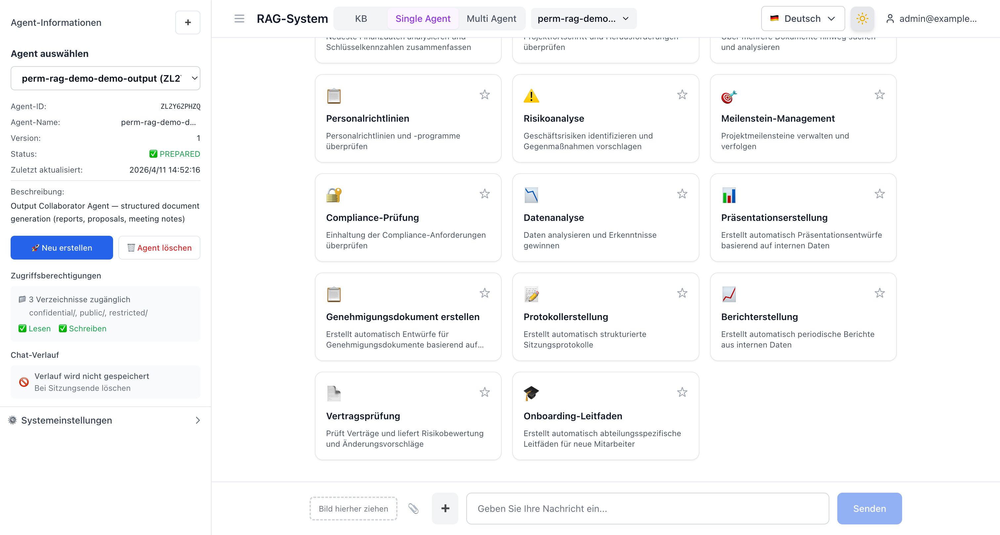

### Agent-Modus — Kartenraster + Seitenleiste

Der Agent-Modus zeigt 14 Workflow-Karten (8 Recherche + 6 Ausgabe) an. Ein Klick auf eine Karte sucht automatisch nach einem Bedrock Agent, und wenn keiner erstellt wurde, navigiert er zum Erstellungsformular im Agent-Verzeichnis. Die Seitenleiste enthält ein Agent-Auswahl-Dropdown, Chat-Verlaufseinstellungen und einen einklappbaren Systemverwaltungsbereich.

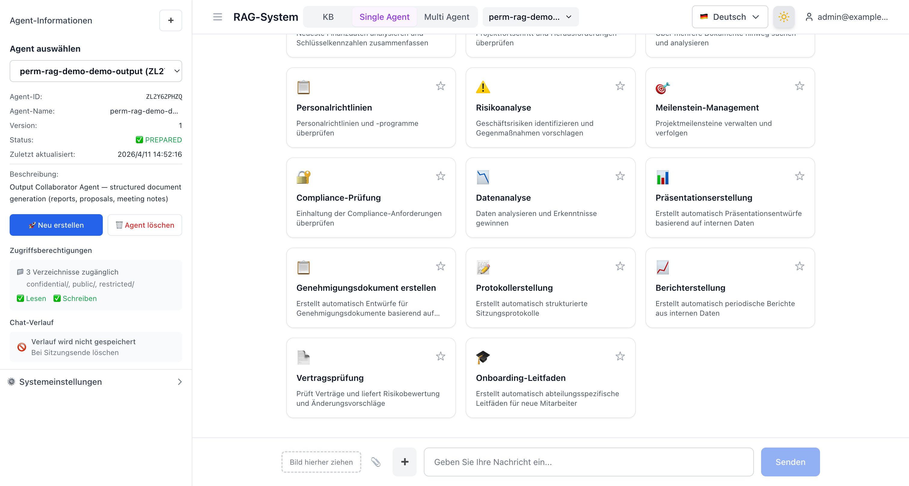

### Agent-Verzeichnis — Agent-Liste und Verwaltungsbildschirm

Ein dedizierter Agent-Verwaltungsbildschirm, erreichbar unter `/[locale]/genai/agents`. Bietet Kataloganzeige erstellter Bedrock Agents, Such- und Kategoriefilter, Detailpanel, vorlagenbasierte Erstellung und Inline-Bearbeitung/-Löschung. Die Navigationsleiste ermöglicht das Umschalten zwischen Agent-Modus / Agent-Liste / KB-Modus. Bei aktivierten Enterprise-Funktionen werden die Tabs „Geteilte Agents" und „Geplante Aufgaben" hinzugefügt.

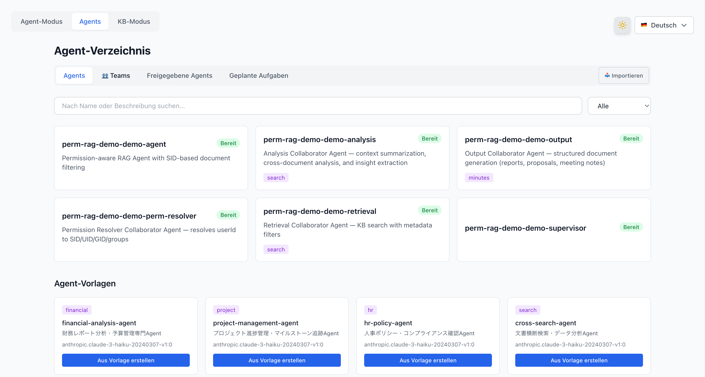

#### Agent-Verzeichnis — Tab Geteilte Agents

Aktiviert mit `enableAgentSharing=true`. Listet, zeigt Vorschau und importiert Agent-Konfigurationen aus dem geteilten S3-Bucket.

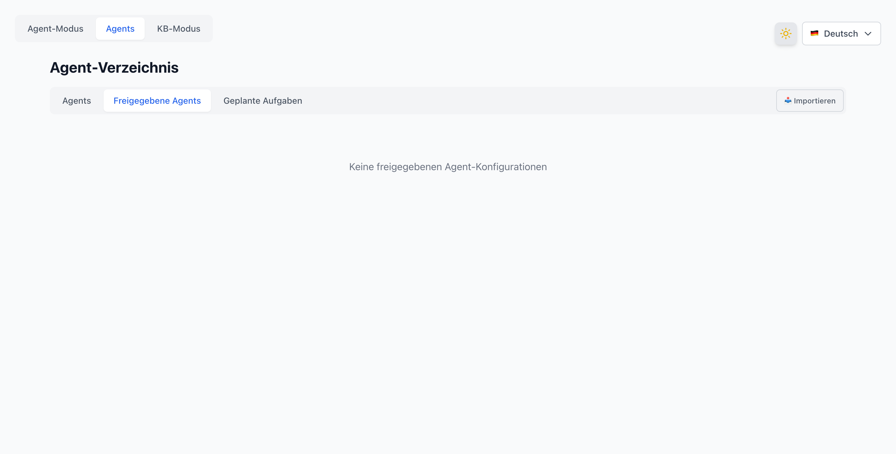

### Agent-Verzeichnis — Agent-Erstellungsformular

Ein Klick auf „Aus Vorlage erstellen" auf einer Vorlagenkarte zeigt ein Erstellungsformular an, in dem Sie den Agent-Namen, die Beschreibung, den System-Prompt und das KI-Modell bearbeiten können. Dasselbe Formular erscheint, wenn Sie im Agent-Modus auf eine Karte klicken, für die noch kein Agent erstellt wurde.

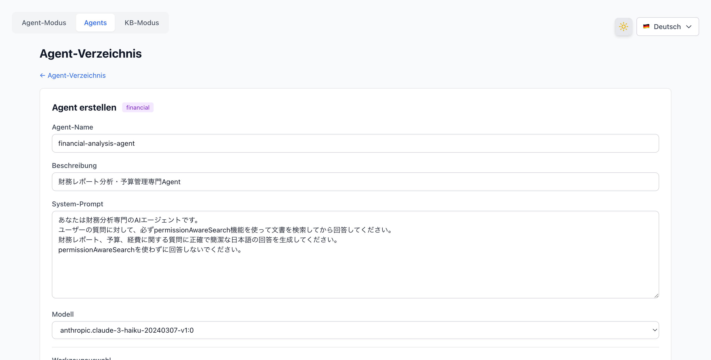

### Agent-Verzeichnis — Agent-Detail und Bearbeitung

Ein Klick auf eine Agent-Karte zeigt ein Detailpanel mit Agent-ID, Status, Modell, Version, Erstellungsdatum, System-Prompt (einklappbar) und Aktionsgruppen. Verfügbare Aktionen umfassen „Bearbeiten" für Inline-Bearbeitung, „Im Chat verwenden" zur Navigation zum Agent-Modus, „Exportieren" für JSON-Konfigurationsdownload, „In geteilten Bucket hochladen" für S3-Sharing, „Zeitplan erstellen" für periodische Ausführungseinstellungen und „Löschen" mit einem Bestätigungsdialog.

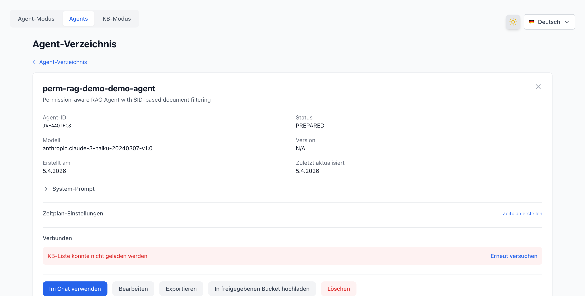

### Chat-Antwort — Zitationsanzeige + Zugriffsebenen-Badge

RAG-Suchergebnisse zeigen FSx-Dateipfade und Zugriffsebenen-Badges (für alle zugänglich / nur Administratoren / bestimmte Gruppen). Während des Chats kehrt ein „🔄 Zurück zur Workflow-Auswahl"-Button zum Kartenraster zurück. Ein „➕"-Button auf der linken Seite des Nachrichteneingabefelds startet einen neuen Chat.

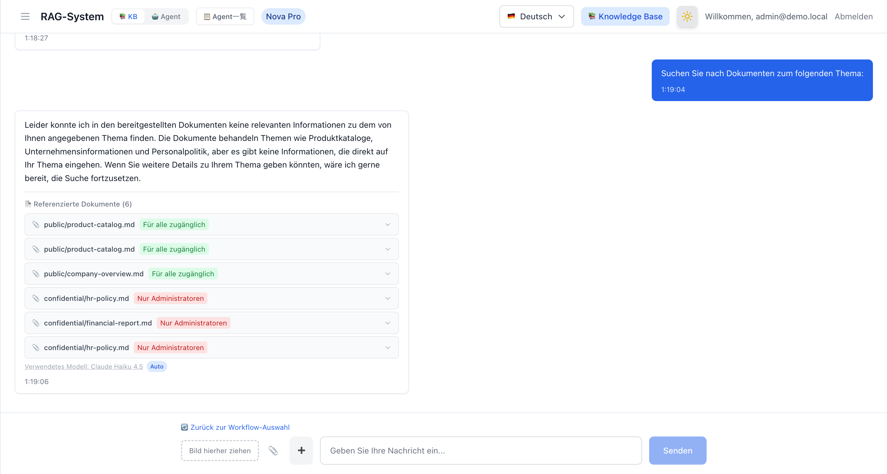

### Bild-Upload — Drag & Drop + Dateiauswahl (v3.1.0)

Bild-Upload-Funktionalität zum Chat-Eingabebereich hinzugefügt. Hängen Sie Bilder über die Drag & Drop-Zone und den 📎 Dateiauswahl-Button an, analysieren Sie mit der Bedrock Vision API (Claude Haiku 4.5) und integrieren Sie in den KB-Suchkontext. Unterstützt JPEG/PNG/GIF/WebP, 3MB-Limit.

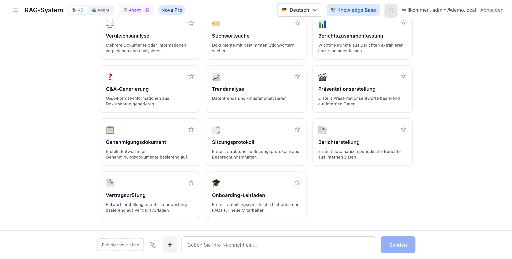

### Intelligentes Routing — Kostenoptimierte automatische Modellauswahl (v3.1.0)

Wenn der Schalter für intelligentes Routing in der Seitenleiste eingeschaltet ist, wählt er automatisch ein leichtgewichtiges Modell (Haiku) oder ein Hochleistungsmodell (Sonnet) basierend auf der Abfragekomplexität aus. Eine „⚡ Auto"-Option wird zum ModelSelector hinzugefügt, und Antworten zeigen den verwendeten Modellnamen zusammen mit einem „Auto"-Badge an.

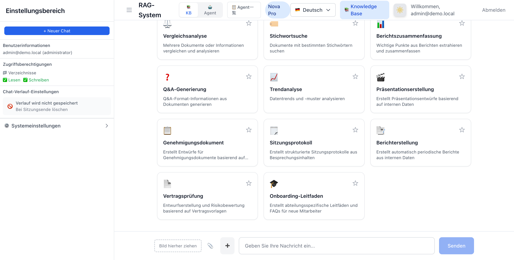

### AgentCore Memory — Sitzungsliste + Gedächtnisbereich (v3.3.0)

Aktiviert mit `enableAgentCoreMemory=true`. Fügt eine Sitzungsliste (SessionList) und eine Langzeitgedächtnisanzeige (MemorySection) zur Agent-Modus-Seitenleiste hinzu. Die Chat-Verlaufseinstellungen werden durch ein „AgentCore Memory: Enabled"-Badge ersetzt.

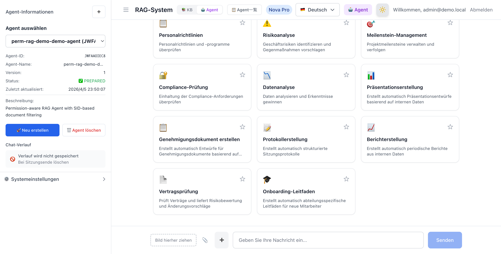

## CDK-Stack-Struktur

| # | Stack | Region | Ressourcen | Beschreibung |
|---|-------|--------|------------|--------------|
| 1 | WafStack | us-east-1 | WAF WebACL, IP Set | WAF für CloudFront (Ratenbegrenzung, verwaltete Regeln) |
| 2 | NetworkingStack | ap-northeast-1 | VPC, Subnets, Security Groups, VPC Endpoints (optional) | Netzwerkinfrastruktur |
| 3 | SecurityStack | ap-northeast-1 | Cognito User Pool, Client, SAML IdP + OIDC IdP + Cognito Domain (bei aktivierter Federation), Identity Sync Lambda (optional), LDAP Health Check Lambda + CloudWatch Alarm (optional), Auth Audit Log DynamoDB (optional) | Authentifizierung und Autorisierung (SAML/OIDC/E-Mail) |
| 4 | StorageStack | ap-northeast-1 | FSx ONTAP + SVM + Volume, S3, DynamoDB×2, (AD), KMS-Verschlüsselung (optional), CloudTrail (optional) | Speicher, SID-Daten, Berechtigungscache |
| 5 | AIStack | ap-northeast-1 | Bedrock KB, S3 Vectors / OpenSearch Serverless (ausgewählt über `vectorStoreType`), Bedrock Guardrails (optional) | RAG-Suchinfrastruktur (Titan Embed v2) |
| 6 | WebAppStack | ap-northeast-1 | Lambda (Docker, IAM Auth + OAC), CloudFront, Permission Filter Lambda (optional), MonitoringConstruct (optional) | Webanwendung, Agent-Verwaltung, Überwachung und Alarme |
| 7 | EmbeddingStack (optional) | ap-northeast-1 | EC2 (m5.large), ECR, ONTAP ACL automatische Abfrage (optional) | FlexCache CIFS-Mount + Embedding-Server |

### Sicherheitsfunktionen (6-Schichten-Verteidigung)

| Schicht | Technologie | Zweck |
|---------|------------|-------|
| L1: Netzwerk | CloudFront Geo Restriction | Geografische Zugriffsbeschränkung (Standard: `["JP"]`. Siehe [Geo-Beschränkung](#geo-beschränkung)) |
| L2: WAF | AWS WAF (6 Regeln) | Erkennung und Blockierung von Angriffsmustern |
| L3: Origin-Authentifizierung | CloudFront OAC (SigV4) | Verhinderung des direkten Zugriffs unter Umgehung von CloudFront |
| L4: API-Authentifizierung | Lambda Function URL IAM Auth | Zugriffskontrolle über IAM-Authentifizierung |
| L5: Benutzerauthentifizierung | Cognito JWT / SAML / OIDC Federation | Authentifizierung und Autorisierung auf Benutzerebene |
| L6: Datenautorisierung | SID / UID+GID / OIDC-Gruppenfilterung | Zugriffskontrolle auf Dokumentenebene. Fail-Closed-Modus (`authFailureMode=fail-closed`) kann die Anmeldung bei fehlgeschlagener Berechtigungsabfrage blockieren |

## Voraussetzungen

- AWS-Konto (mit AdministratorAccess-äquivalenten Berechtigungen)
- Node.js 22+, npm
- Docker (Colima, Docker Desktop oder docker.io auf EC2)
- CDK initialisiert (`cdk bootstrap aws://ACCOUNT_ID/REGION`)

> **Hinweis**: Builds können lokal (macOS / Linux) oder auf EC2 ausgeführt werden. Für Apple Silicon (M1/M2/M3) verwendet `pre-deploy-setup.sh` automatisch den Pre-Build-Modus (lokaler Next.js-Build + Docker-Packaging), um x86_64 Lambda-kompatible Images zu erzeugen. Auf EC2 (x86_64) wird ein vollständiger Docker-Build durchgeführt.

> **Nur für UI-Überprüfung/Entwicklung**: Sie können die Next.js-App-UI ohne AWS-Umgebung überprüfen. Es wird nur Node.js 22+ benötigt, und die Authentifizierungs-Middleware funktioniert identisch zur Produktion. → [Lokale Entwicklungsanleitung](docker/nextjs/LOCAL_DEVELOPMENT.de.md)

## Bereitstellungsschritte

### ⚠️ Wichtiger Hinweis zu Auswirkungen auf bestehende AWS-Umgebungen

Dieses CDK-Projekt erstellt und ändert die folgenden AWS-Ressourcen. **Wenn Sie in einer bestehenden Produktions- oder Team-Shared-Umgebung bereitstellen, überprüfen Sie bitte vorab die Auswirkungen.**

#### Die Authentifizierung dieses Systems und die AWS Management Console-Authentifizierung sind vollständig unabhängig

Die Authentifizierungsmethoden des RAG-Systems (OIDC / LDAP / E-Mail-Passwort) und der AWS Management Console-Zugriff (IAM Identity Center / IAM-Benutzer) sind **vollständig unabhängige Systeme**. Das Ändern der Authentifizierungsmethode des RAG-Systems hat keine Auswirkungen auf den Management Console-Zugriff.

```
┌──────────────────────────────┐    ┌──────────────────────────────┐
│  AWS Management Console      │    │  RAG System (Chat UI)        │
│                              │    │                              │
│  Auth: IAM Identity Center   │    │  Auth: Cognito User Pool     │
│        or IAM Users          │    │    ├ OIDC (Auth0/Okta/etc.)  │
│                              │    │    ├ SAML (AD Federation)    │
│  ← Not modified by this CDK  │    │    └ Email/Password          │
│                              │    │                              │
│  Completely independent ─────┼────┤  ← Configured by this CDK   │
└──────────────────────────────┘    └──────────────────────────────┘
```

#### Parameter, die bestehende Umgebungen beeinflussen

| Parameter | Auswirkung | Risikostufe | Vorabprüfung |
|-----------|-----------|-------------|-------------|
| `adPassword` | Erstellt ein neues AWS Managed Microsoft AD (für FSx ONTAP). AD selbst beeinflusst Identity Center nicht — siehe Hinweis unten | 🟡 Mittel | Siehe „Hinweis zu Managed AD" unten |
| `enableAdFederation` | Erstellt Cognito SAML IdP. Fügt eine „Mit AD anmelden"-Schaltfläche zum RAG-Anmeldebildschirm hinzu | 🟢 Niedrig | Sicherstellen, dass kein bestehender Cognito User Pool existiert |
| `enableVpcEndpoints` | Erstellt VPC-Endpunkte. Kann bestehendes VPC-Routing beeinflussen | 🟡 Mittel | VPC-Endpunkt-Limits prüfen |
| `enableKmsEncryption` | Erstellt KMS CMK. Ändert S3/DynamoDB-Verschlüsselungseinstellungen | 🟢 Niedrig | Bestehende KMS-Schlüsselanzahl prüfen |

#### Hinweis zu Managed AD

Das Setzen von `adPassword` erstellt ein AWS Managed Microsoft AD, aber **das alleinige Erstellen des AD beeinflusst Identity Center nicht**.

Das Problem tritt nur auf, wenn Sie die folgende **manuelle Operation** durchführen:

1. CDK erstellt Managed AD (`adPassword` gesetzt)
2. **Sie ändern manuell** die Identity Center-Identitätsquelle von „Identity Center-Verzeichnis" zu „Active Directory"
3. Identity Center beginnt, Managed AD-Benutzer als Identitätsquelle zu verwenden
4. `cdk destroy` löscht das Managed AD
5. → Die Identity Center-Identitätsquelle geht verloren, der Konsolenzugriff wird blockiert

**Abhilfe:**
- Belassen Sie die Identity Center-Identitätsquelle auf „Identity Center-Verzeichnis" (Standard) — ändern Sie sie nicht
- Behalten Sie den IAM-Benutzer-Konsolenzugriff als Backup bei
- Prüfen Sie die Identity Center-Identitätsquelleneinstellungen vor dem Ausführen von `cdk destroy`

**Überprüfungsbefehle:**
```bash
# IAM Identity Center-Instanzen und -Benutzer prüfen
aws sso-admin list-instances --region ap-northeast-1
aws identitystore list-users --identity-store-id <IDENTITY_STORE_ID> --region ap-northeast-1

# Bestehende Managed AD prüfen
aws ds describe-directories --region ap-northeast-1

# Bestehende Cognito User Pools prüfen
aws cognito-idp list-user-pools --max-results 10 --region ap-northeast-1
```

> **Empfohlen**: Für Produktions- oder Team-Shared-Umgebungen empfehlen wir dringend die Bereitstellung in einem dedizierten AWS-Konto oder einer Sandbox-Umgebung.

#### v3.5.0 UI/UX-Optimierung – Upgrade-Hinweise

v3.5.0 enthält wesentliche Änderungen an der Header-UI, der Sidebar-Struktur und der Modus-Umschaltlogik. Beim Upgrade einer bestehenden Umgebung überprüfen Sie Folgendes:

| Änderung | Auswirkung | Überprüfung |
|----------|------------|-------------|
| Einheitlicher 3-Modus-Umschalter (KB / Einzel-Agent / Multi-Agent) | Bisheriger 2-Stufen-Umschalter (KB/Agent + Einzel/Multi) in einen zusammengeführt. URL-Abfrageparameter (`?mode=agent`, `?mode=multi-agent`) bleiben kompatibel | Überprüfen Sie, ob die Modus-Umschaltung im Browser fehlerfrei funktioniert |
| ModelIndicator aus dem Header entfernt | Modellauswahl in die Sidebar-Systemeinstellungen konsolidiert. Keine Modelländerung über den Header | Überprüfen Sie, ob die Modelländerung über die Sidebar-Systemeinstellungen funktioniert |
| Agent-Auswahl-Dropdown in den Header befördert | Agent-Directory-Link vom Benutzermenü in das Agent-Auswahl-Dropdown verschoben | Überprüfen Sie, ob das Agent-Directory über das „Agent-Auswahl"-Dropdown im Agent-Modus erreichbar ist |
| Zugriffsberechtigungsbereich zur Agent-Sidebar hinzugefügt | Agent-Modus-Sidebar zeigt jetzt Verzeichnisnamen und Lese-/Schreibberechtigungen an | Überprüfen Sie, ob Zugriffsberechtigungen in der Agent-Modus-Sidebar angezeigt werden |
| CDK AI-Stack: SupervisorAgent `agentCollaboration` | Von `DISABLED` auf `SUPERVISOR_ROUTER` geändert. Erforderlich, wenn bereits Collaborators zugeordnet sind | Führen Sie `cdk diff perm-rag-demo-demo-AI` zur Überprüfung aus |

**Upgrade-Schritte:**
```bash
# 1. Diff prüfen
cdk diff perm-rag-demo-demo-WebApp
cdk diff perm-rag-demo-demo-AI

# 2. WebApp bereitstellen (Docker-Image-Update)
./development/scripts/deploy-webapp.sh

# 3. Browser-Überprüfung
# - KB → Einzel-Agent → Multi-Agent Umschaltung funktioniert fehlerfrei
# - Agent-Auswahl-Dropdown zeigt Agent-Liste an
# - Sidebar zeigt Zugriffsberechtigungen an
```

### Schritt 1: Umgebungseinrichtung

Kann lokal (macOS / Linux) oder auf EC2 ausgeführt werden.

#### Lokal (macOS)

```bash
# Node.js 22+ (Homebrew)
brew install node@22

# Docker (eines von beiden)
brew install --cask docker          # Docker Desktop (erfordert sudo)
brew install docker colima          # Colima (kein sudo erforderlich, empfohlen)
colima start --cpu 4 --memory 8     # Colima starten

# AWS CDK
npm install -g aws-cdk typescript ts-node
```

#### EC2 (Ubuntu 22.04)

```bash
# Starten Sie eine t3.large in einem öffentlichen Subnetz (mit SSM-fähiger IAM-Rolle)
aws ec2 run-instances \
  --region ap-northeast-1 \
  --image-id <UBUNTU_22_04_AMI_ID> \
  --instance-type t3.large \
  --subnet-id <PUBLIC_SUBNET_ID> \
  --security-group-ids <SG_ID> \
  --iam-instance-profile Name=<ADMIN_INSTANCE_PROFILE> \
  --associate-public-ip-address \
  --block-device-mappings '[{"DeviceName":"/dev/sda1","Ebs":{"VolumeSize":50,"VolumeType":"gp3"}}]' \
  --tag-specifications 'ResourceType=instance,Tags=[{Key=Name,Value=cdk-deploy-server}]'
```

Die Sicherheitsgruppe benötigt nur ausgehenden Port 443 (HTTPS), damit SSM Session Manager funktioniert. Keine eingehenden Regeln erforderlich.

### Schritt 2: Tool-Installation (für EC2)

Nach der Verbindung über SSM Session Manager führen Sie Folgendes aus.

```bash
# Systemaktualisierung + Basistools
sudo apt-get update -y
sudo apt-get install -y curl git unzip docker.io

# Node.js 22
curl -fsSL https://deb.nodesource.com/setup_22.x | sudo -E bash -
sudo apt-get install -y nodejs

# Docker aktivieren
sudo systemctl enable docker
sudo systemctl start docker
sudo usermod -aG docker ubuntu

# AWS CDK (global)
sudo npm install -g aws-cdk typescript ts-node
```

#### ⚠️ Hinweise zur CDK CLI-Version

Die über `npm install -g aws-cdk` installierte CDK CLI-Version ist möglicherweise nicht mit dem `aws-cdk-lib` des Projekts kompatibel.

```bash
# So überprüfen Sie
cdk --version          # Globale CLI-Version
npx cdk --version      # Projektlokale CLI-Version
```

Dieses Projekt verwendet `aws-cdk-lib@2.244.0`. Wenn die CLI-Version veraltet ist, sehen Sie folgenden Fehler:

```
Cloud assembly schema version mismatch: Maximum schema version supported is 48.x.x, but found 52.0.0
```

**Lösung**: Aktualisieren Sie die projektlokale CDK CLI auf die neueste Version.

```bash
cd Permission-aware-RAG-FSxN-CDK
npm install aws-cdk@latest
npx cdk --version  # Aktualisierte Version überprüfen
```

> **Wichtig**: Verwenden Sie `npx cdk` statt `cdk`, um sicherzustellen, dass die neueste projektlokale CLI verwendet wird.

### Schritt 3: Repository klonen und Abhängigkeiten installieren

```bash
cd /home/ubuntu
git clone https://github.com/Yoshiki0705/FSx-for-ONTAP-Agentic-Access-Aware-RAG.git
cd FSx-for-ONTAP-Agentic-Access-Aware-RAG
npm install
```

### Schritt 4: CDK Bootstrap (nur beim ersten Mal)

Führen Sie dies aus, wenn CDK Bootstrap in den Zielregionen noch nicht ausgeführt wurde. Da der WAF-Stack in us-east-1 bereitgestellt wird, ist Bootstrap in beiden Regionen erforderlich.

```bash
# ap-northeast-1 (Hauptregion)
npx cdk bootstrap aws://$(aws sts get-caller-identity --query Account --output text)/ap-northeast-1

# us-east-1 (für WAF-Stack)
npx cdk bootstrap aws://$(aws sts get-caller-identity --query Account --output text)/us-east-1
```

> **Bei Bereitstellung in einem anderen AWS-Konto**: Löschen Sie den AZ-Cache (`availability-zones:account=...`) aus `cdk.context.json`. CDK ruft automatisch AZ-Informationen für das neue Konto ab.

> **Wie sich LDAP-Benutzer anmelden**: Wählen Sie die Schaltfläche "Mit {providerName} anmelden" auf der Anmeldeseite (z.B. "Mit Keycloak anmelden"). LDAP ist für die Berechtigungsabfrage zuständig, nicht für die Authentifizierung.

### Schritt 5: CDK-Kontextkonfiguration

```bash
cat > cdk.context.json << 'EOF'
{
  "projectName": "rag-demo",
  "environment": "demo",
  "imageTag": "latest",
  "allowedIps": [],
  "allowedCountries": ["JP"]
}
EOF
```

#### Active Directory-Integration (optional)

Um den FSx ONTAP SVM einer Active Directory-Domäne beizutreten und NTFS ACL (SID-basiert) mit CIFS-Freigaben zu verwenden, fügen Sie Folgendes zu `cdk.context.json` hinzu.

```bash
cat > cdk.context.json << 'EOF'
{
  "projectName": "rag-demo",
  "environment": "demo",
  "imageTag": "latest",
  "allowedIps": [],
  "allowedCountries": ["JP"],
  "adPassword": "YourStrongP@ssw0rd123",
  "adDomainName": "demo.local"
}
EOF
```

| Parameter | Typ | Standard | Beschreibung |
|-----------|-----|----------|--------------|
| `adPassword` | string | Nicht gesetzt (kein AD erstellt) | AWS Managed Microsoft AD-Administratorpasswort. Bei Festlegung wird AD erstellt und SVM der Domäne beigetreten |
| `adDomainName` | string | `demo.local` | AD-Domänenname (FQDN) |

> **⚠️ Wichtig**: Das Setzen von `adPassword` erstellt ein AWS Managed Microsoft AD. Das alleinige Erstellen des AD beeinflusst Identity Center nicht. Wenn Sie jedoch manuell die Identity Center-Identitätsquelle auf Managed AD ändern, führt das Löschen des AD über `cdk destroy` zum Verlust der Identity Center-Benutzer. Belassen Sie die Identity Center-Identitätsquelle auf „Identity Center-Verzeichnis" (Standard).lleneinstellungen.

> **Hinweis**: Die AD-Erstellung dauert zusätzlich 20-30 Minuten. SID-Filterungsdemos sind ohne AD möglich (verifiziert mit DynamoDB SID-Daten).

#### AD SAML Federation (optional)

Sie können SAML-Federation aktivieren, damit sich AD-Benutzer direkt über die CloudFront-Oberfläche anmelden können, mit automatischer Cognito-Benutzererstellung + automatischer DynamoDB SID-Datenregistrierung.

**Architekturübersicht:**

```
AD User → CloudFront UI → "Sign in with AD" button
  → Cognito Hosted UI → SAML IdP (AD) → AD Authentication
  → Automatic Cognito User Creation
  → Post-Auth Trigger → AD Sync Lambda → DynamoDB SID Data Registration
  → OAuth Callback → Session Cookie → Chat Screen
```

**CDK-Parameter:**

| Parameter | Typ | Standard | Beschreibung |
|-----------|-----|----------|--------------|
| `enableAdFederation` | boolean | `false` | SAML-Federation-Aktivierungsflag |
| `cloudFrontUrl` | string | Nicht gesetzt | CloudFront-URL für OAuth-Callback-URL (z.B. `https://d3xxxxx.cloudfront.net`) |
| `samlMetadataUrl` | string | Nicht gesetzt | Für selbstverwaltetes AD: Entra ID Federation-Metadaten-URL |
| `adEc2InstanceId` | string | Nicht gesetzt | Für selbstverwaltetes AD: EC2-Instanz-ID |

> **Automatische Konfiguration der Umgebungsvariablen**: Bei der CDK-Bereitstellung mit `enableAdFederation=true` oder `oidcProviderConfig` werden die Federation-Umgebungsvariablen (`COGNITO_DOMAIN`, `COGNITO_CLIENT_SECRET`, `CALLBACK_URL`, `IDP_NAME`) automatisch auf der WebAppStack-Lambda-Funktion konfiguriert. Eine manuelle Konfiguration der Lambda-Umgebungsvariablen ist nicht erforderlich.

**Verwaltetes AD-Muster:**

Bei Verwendung von AWS Managed Microsoft AD.

> **⚠️ IAM Identity Center (ehemals AWS SSO) Konfiguration ist erforderlich:**
> Um die verwaltete AD SAML-Metadaten-URL (`portal.sso.{region}.amazonaws.com/saml/metadata/{directoryId}`) zu verwenden, müssen Sie AWS IAM Identity Center aktivieren, das verwaltete AD als Identitätsquelle konfigurieren und eine SAML-Anwendung erstellen. Das bloße Erstellen eines verwalteten AD stellt keinen SAML-Metadaten-Endpunkt bereit.
>
> Wenn die Konfiguration von IAM Identity Center schwierig ist, können Sie auch direkt eine externe IdP (AD FS usw.) Metadaten-URL über den Parameter `samlMetadataUrl` angeben.

```json
{
  "enableAdFederation": true,
  "adPassword": "YourStrongP@ssw0rd123",
  "adDomainName": "demo.local",
  "cloudFrontUrl": "https://d3xxxxx.cloudfront.net",
  // Optional: Bei Verwendung einer SAML-Metadaten-URL außer IAM Identity Center
  // "samlMetadataUrl": "https://your-adfs-server/federationmetadata/2007-06/federationmetadata.xml"
}
```

Einrichtungsschritte:
1. `adPassword` festlegen und CDK bereitstellen (erstellt verwaltetes AD + SAML IdP + Cognito Domain)
2. AWS IAM Identity Center aktivieren und die Identitätsquelle auf verwaltetes AD ändern
3. E-Mail-Adressen für AD-Benutzer festlegen (PowerShell: `Set-ADUser -Identity Admin -EmailAddress "admin@demo.local"`)
4. In IAM Identity Center „Synchronisierung verwalten" → „Geführte Einrichtung" aufrufen, um AD-Benutzer zu synchronisieren
5. SAML-Anwendung „Permission-aware RAG Cognito" in IAM Identity Center erstellen:
   - ACS-URL: `https://{cognito-domain}.auth.{region}.amazoncognito.com/saml2/idpresponse`
   - SAML-Zielgruppe: `urn:amazon:cognito:sp:{user-pool-id}`
   - Attributzuordnungen: Subject → `${user:email}` (emailAddress), emailaddress → `${user:email}`
6. AD-Benutzer der SAML-Anwendung zuweisen
7. Nach der Bereitstellung die CloudFront-URL in `cloudFrontUrl` festlegen und erneut bereitstellen
8. AD-Authentifizierung über den „Sign in with AD"-Button auf der CloudFront-Oberfläche ausführen

**Selbstverwaltetes AD-Muster (auf EC2, mit Entra Connect-Integration):**

Integriert AD auf EC2 mit Entra ID (ehemals Azure AD) und verwendet die Entra ID Federation-Metadaten-URL.

```json
{
  "enableAdFederation": true,
  "adEc2InstanceId": "i-0123456789abcdef0",
  "samlMetadataUrl": "https://login.microsoftonline.com/{tenant-id}/federationmetadata/2007-06/federationmetadata.xml",
  "cloudFrontUrl": "https://d3xxxxx.cloudfront.net"
}
```

Einrichtungsschritte:
1. AD DS auf EC2 installieren und Synchronisierung mit Entra Connect konfigurieren
2. Entra ID Federation-Metadaten-URL abrufen
3. Die obigen Parameter festlegen und CDK bereitstellen
4. AD-Authentifizierung über den „Sign in with AD"-Button auf der CloudFront-Oberfläche ausführen

**Mustervergleich:**

| Element | Verwaltetes AD | Selbstverwaltetes AD |
|---------|---------------|---------------------|
| SAML-Metadaten | Über IAM Identity Center oder `samlMetadataUrl`-Angabe | Entra ID Metadaten-URL (`samlMetadataUrl`-Angabe) |
| SID-Abrufmethode | LDAP oder über SSM | SSM → EC2 → PowerShell |
| Erforderliche Parameter | `adPassword`, `cloudFrontUrl` + IAM Identity Center-Einrichtung (oder `samlMetadataUrl`) | `adEc2InstanceId`, `samlMetadataUrl`, `cloudFrontUrl` |
| AD-Verwaltung | AWS-verwaltet | Benutzerverwaltung |
| Kosten | Verwaltete AD-Preise | EC2-Instanzpreise |

**Fehlerbehebung:**

| Symptom | Ursache | Lösung |
|---------|---------|--------|
| SAML-Authentifizierungsfehler | Ungültige SAML IdP-Metadaten-URL | Verwaltetes AD: IAM Identity Center-Konfiguration prüfen oder direkt über `samlMetadataUrl` angeben. Selbstverwaltet: Entra ID Metadaten-URL überprüfen |
| OAuth-Callback-Fehler | `cloudFrontUrl` nicht gesetzt oder nicht übereinstimmend | Überprüfen, ob `cloudFrontUrl` im CDK-Kontext mit der CloudFront Distribution-URL übereinstimmt |
| Post-Auth Trigger-Fehler | AD Sync Lambda unzureichende Berechtigungen | Fehlerdetails in CloudWatch Logs prüfen. Die Anmeldung selbst wird nicht blockiert |
| S3-Zugriffsfehler bei KB-Suche | KB IAM-Rolle fehlen direkte S3-Bucket-Zugriffsberechtigungen | KB IAM-Rolle hat nur Berechtigungen über S3 Access Point. Bei direkter Verwendung des S3-Buckets als Datenquelle müssen `s3:GetObject`- und `s3:ListBucket`-Berechtigungen hinzugefügt werden (nicht spezifisch für AD Federation) |
| S3 AP Datenebene API AccessDenied | WindowsUser enthält Domänenpräfix | Der WindowsUser des S3 AP darf KEIN Domänenpräfix enthalten (z.B. `DEMO\Admin`). Nur den Benutzernamen angeben (z.B. `Admin`). CLI akzeptiert das Präfix, aber Datenebene-APIs schlagen fehl |
| Cognito Domain-Erstellungsfehler | Domänenpräfix-Konflikt | Prüfen, ob das Präfix `{projectName}-{environment}-auth` mit anderen Konten in Konflikt steht |
| USER_PASSWORD_AUTH 401-Fehler | SECRET_HASH nicht gesendet bei aktiviertem Client Secret | Bei `enableAdFederation=true` hat der User Pool Client ein Client Secret. Die Anmelde-API muss SECRET_HASH aus der Umgebungsvariable `COGNITO_CLIENT_SECRET` berechnen |
| Post-Auth Trigger `Cannot find module 'index'` | Lambda TypeScript nicht kompiliert | CDK `Code.fromAsset` hat eine esbuild-Bundling-Option. `npx esbuild index.ts --bundle --platform=node --target=node22 --outfile=index.js --external:@aws-sdk/*` |
| OAuth Callback `0.0.0.0`-Weiterleitung | Lambda Web Adapter `request.url` ist `http://0.0.0.0:3000/...` | Umgebungsvariable `CALLBACK_URL` verwenden, um die Weiterleitungs-Basis-URL zu erstellen |
| OIDC-Anmeldung `invalid_request` | issuerUrl-Nichtübereinstimmung | Überprüfen, ob `oidcProviderConfig.issuerUrl` exakt mit dem `issuer`-Feld der `/.well-known/openid-configuration` des IdP übereinstimmt. Auth0 erfordert einen abschließenden Schrägstrich (`https://xxx.auth0.com/`) |
| OIDC-Anmeldung `Attribute cannot be updated` | Cognito User Pool E-Mail-Attribut ist `mutable: false` | Überprüfen, ob CDK `standardAttributes.email.mutable` auf `true` gesetzt ist. `mutable` kann nach der User Pool-Erstellung nicht geändert werden, daher muss der User Pool neu erstellt werden |
| CDK-Bereitstellung schlägt nach manueller Löschung des OIDC IdP fehl | CDK-Stack-Zustandsinkonsistenz | Das manuelle Löschen und Neuerstellen eines Cognito IdP verursacht eine Inkonsistenz zwischen CDK-Stack-Zustand und tatsächlichem Zustand. Nur über CDK-Bereitstellung verwalten und manuelle Operationen vermeiden |
| LDAP-Gesundheitsprüfung Lambda-Timeout | VPC-Lambda kann nicht auf Secrets Manager zugreifen | NAT Gateway oder `enableVpcEndpoints=true` erforderlich. Test: `aws lambda invoke --function-name perm-rag-demo-demo-ldap-health-check /tmp/result.json` |
| LDAP-Gesundheitsprüfung Alarm im ALARM-Zustand | LDAP-Verbindungsfehler | CloudWatch Logs auf strukturierte Logs prüfen. Connection error → SG/VPC, Bind error → Passwort/DN, Search error → baseDN |
| Networking-Stack-Update schlägt ohne `--exclusively` fehl | VPC CrossStack Export-Abhängigkeit | `npx cdk deploy perm-rag-demo-demo-Security perm-rag-demo-demo-WebApp --exclusively` verwenden |
| `AD_EC2_INSTANCE_ID is required` Fehler bei E-Mail/Passwort-Anmeldung | SID-Synchronisierung wird ausgeführt wenn AD nicht konfiguriert ist | In v3.5.0 behoben. `AD_TYPE` Standardwert auf `none` geändert, SID-Synchronisierung wird übersprungen wenn AD nicht konfiguriert. Bei älterem Lambda erneut bereitstellen |
| Fail-Closed-Modus wird nicht ausgelöst (LDAP-Benutzer nicht gefunden) | Designgemäßes Verhalten | LDAP-Benutzer nicht gefunden ist kein Fehler — Fallback auf nur OIDC-Claims. Fail-Closed wird nur bei fatalen Fehlern ausgelöst: LDAP-Verbindungs-Timeout, Secrets Manager-Abruffehler, etc. |
| CDK-Deployment schlägt bei Migration `oidcProviderConfig`→`oidcProviders` fehl | Cognito IdP Ressourcen-ID-Konflikt | In v3.5.0 behoben. Ressourcen-ID des ersten IdP auf `OidcIdP` fixiert für Migrationskompatibilität. Bei älteren Versionen Security-Stack `cdk destroy` → erneut bereitstellen |
| ONTAP REST API `User is not authorized` | fsxadmin-Passwort nicht gesetzt | Setzen via `aws fsx update-file-system --file-system-id <FS_ID> --ontap-configuration '{"FsxAdminPassword":"<PASSWORD>"}'`. In Secrets Manager speichern und `ontapAdminSecretArn` angeben |

#### OIDC/LDAP Federation (optional) — Zero-Touch-Benutzerbereitstellung

Zusätzlich zu SAML AD Federation können Sie OIDC IdP (Keycloak, Okta, Entra ID usw.) und direkte LDAP-Abfragen für die Zero-Touch-Benutzerbereitstellung aktivieren. Bestehende FSx for ONTAP-Berechtigungen werden automatisch auf RAG-System-UI-Benutzer abgebildet — keine manuelle Registrierung durch Administratoren oder Benutzer erforderlich.

##### So wählen Sie Ihre Authentifizierungsmethode

Wählen Sie die Authentifizierungsmethode, die zu Ihrer bestehenden Umgebung passt. **Unabhängig von der gewählten Methode wird der AWS Management Console-Zugriff nicht beeinflusst.**

| Ihre Umgebung | Empfohlene Methode | Anmelde-Schaltfläche | Konfiguration |
|--------------|-------------------|---------------------|---------------|
| Nichts Besonderes (einfach ausprobieren) | E-Mail/Passwort | Nur Formular | Keine Konfiguration nötig (Standard) |
| Okta im Einsatz | OIDC Federation | „Mit Okta anmelden" | `oidcProviderConfig.providerName: "Okta"` |
| Keycloak im Einsatz | OIDC + LDAP | „Mit Keycloak anmelden" | `oidcProviderConfig` + `ldapConfig` |
| Entra ID (Azure AD) im Einsatz | OIDC Federation | „Mit EntraID anmelden" | `oidcProviderConfig.providerName: "EntraID"` |
| Auth0 im Einsatz | OIDC Federation | „Mit Auth0 anmelden" | `oidcProviderConfig.providerName: "Auth0"` |
| Windows AD im Einsatz | SAML AD Federation | „Mit AD anmelden" | `enableAdFederation: true` |
| Mehrere IdPs gleichzeitig | Multi-OIDC | Schaltflächen für jeden IdP | `oidcProviders`-Array |

> **Schaltflächennamen sind anpassbar**: Der in `providerName` gesetzte Name wird direkt auf der Schaltfläche angezeigt. Zum Beispiel zeigt die Einstellung `"Corporate SSO"` „Mit Corporate SSO anmelden" an.

Jede Authentifizierungsmethode verwendet die „konfigurationsgesteuerte automatische Aktivierung". Fügen Sie einfach Konfigurationswerte in `cdk.context.json` hinzu, um sie zu aktivieren — mit nahezu null zusätzlichen AWS-Ressourcenkosten. Die gleichzeitige Aktivierung von SAML + OIDC wird ebenfalls unterstützt.

Siehe [Authentifizierungs- und Benutzerverwaltungshandbuch](docs/en/auth-and-user-management.md) für Details.

> **Wie sich LDAP-Benutzer anmelden**: Wählen Sie die Schaltfläche „Mit {providerName} anmelden" auf der Anmeldeseite (z.B. „Mit Keycloak anmelden", „Mit Okta anmelden"). LDAP übernimmt die Berechtigungsabfrage, nicht die Authentifizierung — nach der Anmeldung über den OIDC IdP ruft das Identity Sync Lambda automatisch UID/GID/Gruppen aus LDAP ab.

**OIDC + LDAP Konfigurationsbeispiel (OpenLDAP/FreeIPA + Keycloak):**

```json
{
  "oidcProviderConfig": {
    "providerName": "Keycloak",
    "clientId": "rag-system",
    "clientSecret": "arn:aws:secretsmanager:ap-northeast-1:123456789012:secret:oidc-client-secret",
    "issuerUrl": "https://keycloak.example.com/realms/main",
    "groupClaimName": "groups"
  },
  "ldapConfig": {
    "ldapUrl": "ldaps://ldap.example.com:636",
    "baseDn": "dc=example,dc=com",
    "bindDn": "cn=readonly,dc=example,dc=com",
    "bindPasswordSecretArn": "arn:aws:secretsmanager:ap-northeast-1:123456789012:secret:ldap-bind-password"
  },
  "permissionMappingStrategy": "uid-gid"
}
```

**CDK-Parameter:**

| Parameter | Typ | Beschreibung |
|-----------|-----|--------------|
| `oidcProviderConfig` | object | OIDC IdP-Einstellungen (`providerName`, `clientId`, `clientSecret`, `issuerUrl`, `groupClaimName`) |
| `ldapConfig` | object | LDAP-Verbindungseinstellungen (`ldapUrl`, `baseDn`, `bindDn`, `bindPasswordSecretArn`, `userSearchFilter`, `groupSearchFilter`) |
| `permissionMappingStrategy` | string | Berechtigungszuordnungsstrategie: `sid-only` (Standard), `uid-gid`, `hybrid` |
| `ontapNameMappingEnabled` | boolean | ONTAP Name-Mapping-Integration (UNIX→Windows-Benutzerzuordnung) |

> **⚠️ issuerUrl Hinweis**: Die `oidcProviderConfig.issuerUrl` muss exakt mit dem `issuer`-Feld der `/.well-known/openid-configuration` des IdP übereinstimmen. Auth0 erfordert einen abschließenden Schrägstrich (`https://xxx.auth0.com/`), Keycloak nicht (`https://keycloak.example.com/realms/main`). Eine Nichtübereinstimmung führt zu einem `invalid_request`-Fehler bei der Cognito-Token-Validierung.

> **⚠️ OIDC-Federation 2-Stufen-Deployment**: Die OIDC-Konfiguration erfordert `cloudFrontUrl` für OAuth-Callbacks, aber die CloudFront-URL ist beim ersten Deployment unbekannt. Folgen Sie diesen Schritten:
> 1. Führen Sie `cdk deploy` ohne `cloudFrontUrl` aus
> 2. Holen Sie die CloudFront-URL aus den WebApp-Stack-Ausgaben: `aws cloudformation describe-stacks --stack-name perm-rag-demo-demo-WebApp --query 'Stacks[0].Outputs[?OutputKey==\`CloudFrontUrl\`].OutputValue' --output text`
> 3. Fügen Sie `cloudFrontUrl` in `cdk.context.json` hinzu und deployen Sie erneut
> 4. Konfigurieren Sie die Allowed Callback URLs des OIDC IdP mit `https://{cognito-domain}.auth.{region}.amazoncognito.com/oauth2/idpresponse`

##### Phase 2 Erweiterungen

Phase 2 fügt die folgenden 7 Erweiterungsfunktionen hinzu. Alle werden über `cdk.context.json`-Parameter gesteuert.

**Multi-OIDC IdP Konfiguration (`oidcProviders`-Array):**

Zusätzlich zu `oidcProviderConfig` (einzelner IdP) ermöglicht das `oidcProviders`-Array die gleichzeitige Registrierung mehrerer OIDC IdPs. Anmeldeschaltflächen für jeden IdP werden dynamisch auf der Anmeldeseite angezeigt. `oidcProviderConfig` und `oidcProviders` sind sich gegenseitig ausschließende Einstellungen.

```json
{
  "oidcProviders": [
    {
      "providerName": "Okta",
      "clientId": "0oa1234567890",
      "clientSecret": "arn:aws:secretsmanager:ap-northeast-1:123456789012:secret:okta-client-secret",
      "issuerUrl": "https://company.okta.com",
      "groupClaimName": "groups"
    },
    {
      "providerName": "Keycloak",
      "clientId": "rag-system",
      "clientSecret": "arn:aws:secretsmanager:ap-northeast-1:123456789012:secret:keycloak-client-secret",
      "issuerUrl": "https://keycloak.example.com/realms/main",
      "groupClaimName": "roles"
    }
  ]
}
```

**Fail-Closed Modus (`authFailureMode`):**

Der Standard ist Fail-Open (Anmeldung wird auch bei fehlgeschlagener Berechtigungsabfrage fortgesetzt). In Hochsicherheitsumgebungen blockiert die Einstellung `authFailureMode: "fail-closed"` die Anmeldung selbst, wenn die Berechtigungsabfrage fehlschlägt.

> **⚠️ Fail-Closed-Auslösebedingungen**: Wenn ein LDAP-Benutzer nicht gefunden wird, ist dies kein Fehler — es erfolgt ein Fallback auf nur OIDC-Claims (Anmeldung wird fortgesetzt). Fail-Closed wird nur bei fatalen Fehlern ausgelöst: LDAP-Verbindungs-Timeout, Secrets Manager-Passwortabruffehler, DynamoDB-Schreibfehler, etc.

**LDAP Gesundheitsprüfung (`healthCheckEnabled`):**

Wird automatisch aktiviert, wenn `ldapConfig` angegeben ist (Standard: `true`). Führt alle 5 Minuten über EventBridge Rule periodische Prüfungen durch und verifiziert die LDAP-Verbindung, -Bindung und -Suchfunktionalität. Bei Fehlern wird über CloudWatch Alarm benachrichtigt.

> **⚠️ VPC-Netzwerkanforderung**: Das Gesundheitsprüfung-Lambda wird im VPC bereitgestellt, daher ist ein NAT Gateway oder ein Secrets Manager VPC-Endpunkt für den Zugriff auf Secrets Manager erforderlich. `enableVpcEndpoints=true` wird empfohlen.

> **Verifizierungsmethode**: Um zu überprüfen, ob die LDAP-Gesundheitsprüfung korrekt funktioniert:
> ```bash
> # Manual Lambda invocation
> aws lambda invoke --function-name perm-rag-demo-demo-ldap-health-check \
>   --region ap-northeast-1 /tmp/health-check-result.json && cat /tmp/health-check-result.json
>
> # CloudWatch Alarm state
> aws cloudwatch describe-alarms --alarm-names perm-rag-demo-demo-ldap-health-check-failure \
>   --region ap-northeast-1 --query 'MetricAlarms[0].{State:StateValue,Reason:StateReason}'
>
> # CloudWatch Logs
> aws logs tail /aws/lambda/perm-rag-demo-demo-ldap-health-check --region ap-northeast-1 --since 1h
> ```

**Audit-Protokoll (`auditLogEnabled`):**

Die Einstellung `auditLogEnabled: true` zeichnet Authentifizierungsereignisse (Anmeldeerfolg/-fehlschlag) in einer DynamoDB-Audit-Tabelle auf. Automatische Löschung über TTL (Standard: 90 Tage). Die Anmeldung wird auch bei fehlgeschlagenen Schreibvorgängen in die Audit-Tabelle nicht blockiert.

**TLS-Zertifikatsüberprüfung (`tlsCaCertArn`, `tlsRejectUnauthorized`):**

Geben Sie `tlsCaCertArn` (Secrets Manager CA-Zertifikat-ARN) und `tlsRejectUnauthorized` (Standard: `true`) innerhalb von `ldapConfig` an, um die benutzerdefinierte CA-Zertifikatsüberprüfung für LDAPS-Verbindungen zu steuern. In Entwicklungsumgebungen erlaubt `tlsRejectUnauthorized: false` selbstsignierte Zertifikate.

**OIDC-gruppenbasierte Dokumentenzugriffskontrolle:**

Die Einstellung von `allowed_oidc_groups` in Dokumentmetadaten ermöglicht die Zugriffskontrolle über eine Schnittmengenprüfung mit den `oidcGroups` des Benutzers. Funktioniert auch als Fallback, wenn die SID/UID-GID-Zuordnung fehlschlägt.

**Token-Aktualisierung und Sitzungsverwaltung:**

Automatische Aktualisierung von Zugriffstoken nach der OIDC-Authentifizierung. Führt die Hintergrundaktualisierung 5 Minuten vor Ablauf durch und leitet bei Ablauf des Aktualisierungstokens zur Anmeldeseite weiter.

**Phase 2 CDK-Parameter:**

| Parameter | Typ | Standard | Beschreibung |
|-----------|-----|----------|--------------|
| `oidcProviders` | array | (keiner) | Mehrfach-OIDC-IdP-Konfigurationsarray (sich gegenseitig ausschließend mit `oidcProviderConfig`) |
| `authFailureMode` | string | `fail-open` | Verhalten bei fehlgeschlagener Berechtigungsabfrage (`fail-open` / `fail-closed`) |
| `auditLogEnabled` | boolean | `false` | Authentifizierungs-Audit-Log-DynamoDB-Tabelle erstellen |
| `auditLogRetentionDays` | number | `90` | Aufbewahrungsdauer des Audit-Logs (TTL-automatische Löschung) |
| `healthCheckEnabled` | boolean | `true` | LDAP-Gesundheitsprüfung Lambda + EventBridge + CloudWatch Alarm |
| `tlsCaCertArn` | string | (keiner) | Innerhalb von `ldapConfig`: Secrets Manager ARN für benutzerdefiniertes CA-Zertifikat für LDAPS |
| `tlsRejectUnauthorized` | boolean | `true` | Innerhalb von `ldapConfig`: TLS-Zertifikatsüberprüfung (`false` um selbstsignierte Zertifikate zu erlauben) |

SAML + OIDC Hybrid-Anmeldeseite (AD-Anmeldung + Auth0-Anmeldung + E-Mail/Passwort):

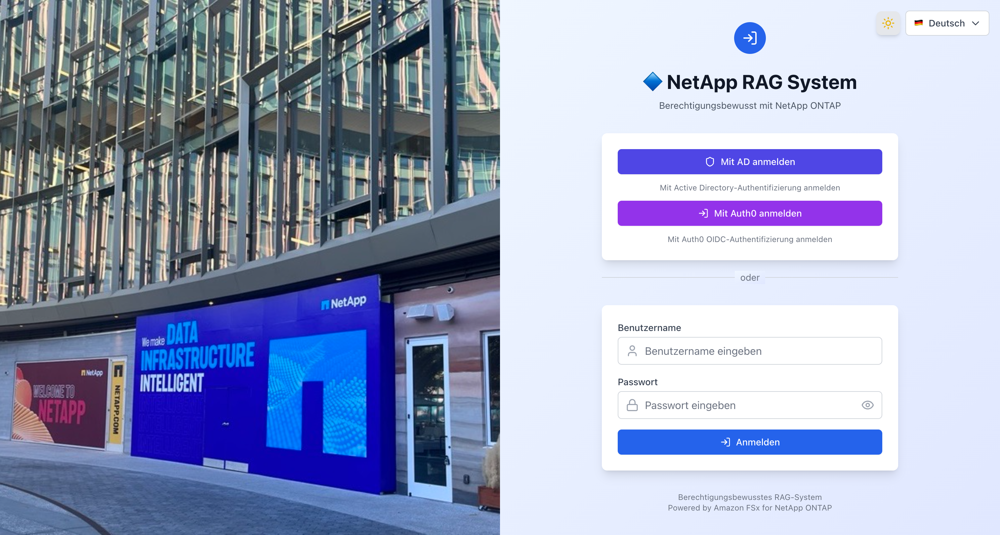

#### Enterprise-Funktionen (optional)

Die folgenden CDK-Kontextparameter aktivieren Sicherheitsverbesserungs- und Architekturvereinheitlichungsfunktionen.

```json
{
  "useS3AccessPoint": "true",
  "usePermissionFilterLambda": "true",
  "enableGuardrails": "true",
  "enableKmsEncryption": "true",
  "enableCloudTrail": "true",
  "enableVpcEndpoints": "true"
}
```

| Parameter | Standard | Beschreibung |
|-----------|----------|--------------|
| `ontapMgmtIp` | (keiner) | ONTAP-Management-IP. Bei Festlegung generiert der Embedding-Server automatisch `.metadata.json` aus der ONTAP REST API |
| `ontapSvmUuid` | (keiner) | SVM UUID (verwendet mit `ontapMgmtIp`) |
| `ontapAdminSecretArn` | (keiner) | Secrets Manager ARN für ONTAP-Administratorpasswort |
| `useS3AccessPoint` | `false` | S3 Access Point als Bedrock KB-Datenquelle verwenden |
| `volumeSecurityStyle` | `NTFS` | FSx ONTAP Volume-Sicherheitsstil (`NTFS` or `UNIX`) |
| `s3apUserType` | (auto) | S3 AP-Benutzertyp (`WINDOWS` or `UNIX`). Standard: AD konfiguriert→WINDOWS, kein AD→UNIX |
| `s3apUserName` | (auto) | S3 AP-Benutzername. Standard: WINDOWS→`Admin`, UNIX→`root` |
| `usePermissionFilterLambda` | `false` | SID-Filterung über dediziertes Lambda ausführen (mit Inline-Filterungs-Fallback) |
| `enableGuardrails` | `false` | Bedrock Guardrails (Schädlicher-Inhalt-Filter + PII-Schutz) |
| `enableAgent` | `false` | Bedrock Agent + Berechtigungsbewusste Action Group (KB-Suche + SID-Filterung). Dynamische Agent-Erstellung (erstellt und bindet automatisch kategoriespezifische Agents bei Kartenklick) |
| `enableAgentSharing` | `false` | Agent-Konfigurationsfreigabe S3-Bucket. JSON-Export/Import von Agent-Konfigurationen, organisationsweite Freigabe über S3 |
| `enableAgentSchedules` | `false` | Agent-Planungsausführungsinfrastruktur (EventBridge Scheduler + Lambda + DynamoDB-Ausführungshistorientabelle) |
| `enableKmsEncryption` | `false` | KMS CMK-Verschlüsselung für S3 und DynamoDB (Schlüsselrotation aktiviert) |
| `enableCloudTrail` | `false` | CloudTrail-Auditprotokolle (S3-Datenzugriff + Lambda-Aufrufe, 90-Tage-Aufbewahrung) |
| `enableVpcEndpoints` | `false` | VPC Endpoints (S3, DynamoDB, Bedrock, SSM, Secrets Manager, CloudWatch Logs) |
| `enableMonitoring` | `false` | CloudWatch-Dashboard + SNS-Alarme + EventBridge KB Ingestion-Überwachung. Kosten: Dashboard 3$/Monat + Alarme 0,10$/Alarm/Monat |
| `monitoringEmail` | *(keiner)* | E-Mail-Adresse für Alarmbenachrichtigungen (wirksam bei `enableMonitoring=true`) |
| `enableAgentCoreMemory` | `false` | AgentCore Memory aktivieren (Kurzzeit- und Langzeitgedächtnis). Erfordert `enableAgent=true` |
| `enableAgentCoreObservability` | `false` | AgentCore Runtime-Metriken in Dashboard integrieren (wirksam bei `enableMonitoring=true`) |
| `enableAdvancedPermissions` | `false` | Zeitbasierte Zugriffskontrolle + Berechtigungsentscheidungs-Auditprotokoll. Erstellt die DynamoDB-Tabelle `permission-audit` |
| `alarmEvaluationPeriods` | `1` | Anzahl der Alarm-Auswertungsperioden (Alarm wird nach N aufeinanderfolgenden Schwellenwertüberschreitungen ausgelöst) |
| `dashboardRefreshInterval` | `300` | Dashboard-Auto-Aktualisierungsintervall (Sekunden) |
| `authFailureMode` | `fail-open` | Fail-Closed-Modus-Umschaltung (`fail-open` / `fail-closed`). `fail-closed` blockiert die Anmeldung bei fehlgeschlagener Berechtigungsabfrage |
| `auditLogEnabled` | `false` | Authentifizierungs-Audit-Log. Erstellt DynamoDB-Audit-Tabelle (`{prefix}-auth-audit-log`) |
| `auditLogRetentionDays` | `90` | Aufbewahrungsdauer des Audit-Logs (TTL-automatische Löschung) |
| `healthCheckEnabled` | `true` | LDAP-Gesundheitsprüfung (bei angegebener `ldapConfig`). EventBridge 5-Minuten-Intervall + CloudWatch Alarm |

#### Vektorspeicher-Konfigurationsauswahl

Wechseln Sie den Vektorspeicher mit dem Parameter `vectorStoreType`. Standard ist S3 Vectors (kostengünstig).

| Konfiguration | Kosten | Latenz | Empfohlene Verwendung |
|--------------|--------|--------|----------------------|
| `s3vectors` (Standard) | Wenige Dollar/Monat | Unter einer Sekunde bis 100ms | Demo, Entwicklung, Kostenoptimierung |

#### Verwendung eines vorhandenen FSx for ONTAP

Wenn bereits ein FSx for ONTAP-Dateisystem vorhanden ist, können Sie vorhandene Ressourcen referenzieren, anstatt neue zu erstellen. Dies verkürzt die Bereitstellungszeit erheblich (eliminiert die 30-40-minütige Wartezeit für die FSx ONTAP-Erstellung).

```bash
npx cdk deploy --all --app "npx ts-node bin/demo-app.ts" \
  -c existingFileSystemId=fs-0123456789abcdef0 \
  -c existingSvmId=svm-0123456789abcdef0 \
  -c existingVolumeId=fsvol-0123456789abcdef0 \
  -c vectorStoreType=s3vectors \
  -c enableAgent=true
```

| Parameter | Beschreibung |
|-----------|--------------|
| `existingFileSystemId` | Vorhandene FSx ONTAP-Dateisystem-ID (z.B. `fs-0123456789abcdef0`) |
| `existingSvmId` | Vorhandene SVM-ID (z.B. `svm-0123456789abcdef0`) |
| `existingVolumeId` | Vorhandene Volume-ID (z.B. `fsvol-0123456789abcdef0`) — geben Sie **ein primäres Volume** an |

> **Hinweis**: Im vorhandenen FSx-Referenzmodus liegen FSx/SVM/Volume außerhalb der CDK-Verwaltung. Sie werden durch `cdk destroy` nicht gelöscht. Verwaltetes AD wird ebenfalls nicht erstellt (verwendet die AD-Einstellungen der vorhandenen Umgebung).


##### Mehrere Volumes unter einer SVM

Wenn eine SVM mehrere Volumes enthält, geben Sie beim CDK-Deployment nur **ein primäres Volume** als `existingVolumeId` an. Zusätzliche Volumes werden nach dem Deployment über die Embedding-Zielverwaltung hinzugefügt.

```
FileSystem: fs-0123456789abcdef0
└── SVM: svm-0123456789abcdef0
    ├── vol-data      (fsvol-aaaa...)  ← existingVolumeId
    ├── vol-reports   (fsvol-bbbb...)  ← post-deploy
    └── vol-archives  (fsvol-cccc...)  ← post-deploy
```

| Konfiguration | Kosten | Latenz | Empfohlene Verwendung | Metadaten-Einschränkungen |
|--------------|--------|--------|----------------------|--------------------------|
| `s3vectors` (Standard) | Wenige Dollar/Monat | Unter einer Sekunde bis 100ms | Demo, Entwicklung, Kostenoptimierung | Filterbares 2KB-Limit (siehe unten) |
| `opensearch-serverless` | ~700$/Monat | ~10ms | Hochleistungs-Produktionsumgebungen | Keine Einschränkungen |

```bash
# S3 Vectors-Konfiguration (Standard)
npx cdk deploy --all --app "npx ts-node bin/demo-app.ts" -c vectorStoreType=s3vectors

# OpenSearch Serverless-Konfiguration
npx cdk deploy --all --app "npx ts-node bin/demo-app.ts" -c vectorStoreType=opensearch-serverless
```

Wenn bei Verwendung der S3 Vectors-Konfiguration hohe Leistung benötigt wird, können Sie bei Bedarf mit `demo-data/scripts/export-to-opensearch.sh` nach OpenSearch Serverless exportieren. Details finden Sie unter [docs/stack-architecture-comparison.md](docs/stack-architecture-comparison.md).

### Schritt 6: Pre-Deploy-Einrichtung (ECR-Image-Vorbereitung)

Der WebApp-Stack referenziert ein Docker-Image aus einem ECR-Repository, daher muss das Image vor der CDK-Bereitstellung vorbereitet werden.

```bash
bash demo-data/scripts/pre-deploy-setup.sh
```

Dieses Skript führt automatisch Folgendes aus:
1. Erstellt ECR-Repository (`permission-aware-rag-webapp`)
2. Baut und pusht Docker-Image

Der Build-Modus wird automatisch basierend auf der Host-Architektur ausgewählt:

| Host | Build-Modus | Beschreibung |
|------|------------|--------------|
| x86_64 (EC2 usw.) | Vollständiger Docker-Build | npm install + next build im Dockerfile |
| arm64 (Apple Silicon) | Pre-Build-Modus | Lokaler next build → Docker-Packaging |

> **Benötigte Zeit**: EC2 (x86_64): 3-5 Min., Lokal (Apple Silicon): 5-8 Min., CodeBuild: 5-10 Min.

> **Hinweis für Apple Silicon**: `docker buildx` ist erforderlich (`brew install docker-buildx`). Beim Push zu ECR `--provenance=false` angeben (da Lambda das Manifest-List-Format nicht unterstützt).

### Schritt 7: CDK-Bereitstellung

```bash
npx cdk deploy --all \
  --app "npx ts-node bin/demo-app.ts" \
  -c enableAgent=true \
  --require-approval never
```

Enterprise-Funktionen aktivieren:

```bash
npx cdk deploy --all \
  --app "npx ts-node bin/demo-app.ts" \
  -c enableAgent=true \
  -c enableAgentSharing=true \
  -c enableAgentSchedules=true \
  --require-approval never
```

Überwachung und Alarme aktivieren:

```bash
npx cdk deploy --all \
  --app "npx ts-node bin/demo-app.ts" \
  -c enableAgent=true \
  -c enableMonitoring=true \
  -c monitoringEmail=ops@example.com \
  --require-approval never
```

> **Überwachungskostenschätzung**: CloudWatch Dashboard 3$/Monat + Alarme 0,10$/Alarm/Monat (7 Alarme = 0,70$/Monat) + SNS-Benachrichtigungen im kostenlosen Kontingent. Insgesamt ca. 4$/Monat.

> **Benötigte Zeit**: Die Erstellung von FSx for ONTAP dauert 20-30 Minuten, insgesamt also ca. 30-40 Minuten.

### Schritt 8: Post-Deploy-Einrichtung (Einzelbefehl)

Nach Abschluss der CDK-Bereitstellung wird die gesamte Einrichtung mit diesem einzelnen Befehl abgeschlossen:

```bash
bash demo-data/scripts/post-deploy-setup.sh
```

Dieses Skript führt automatisch Folgendes aus:
1. Erstellt S3 Access Point + konfiguriert Richtlinie
2. Lädt Demodaten auf FSx ONTAP hoch (über S3 AP)
3. Fügt Bedrock KB-Datenquelle hinzu + synchronisiert
4. Registriert Benutzer-SID-Daten in DynamoDB
5. Erstellt Demo-Benutzer in Cognito (admin / user)

> **Benötigte Zeit**: 2-5 Minuten (einschließlich KB-Synchronisierungswartzeit)

### Schritt 9: Bereitstellungsverifizierung (Automatisierte Tests)

Führen Sie automatisierte Testskripte aus, um alle Funktionen zu überprüfen.

```bash
bash demo-data/scripts/verify-deployment.sh
```

Testergebnisse werden automatisch in `docs/test-results.md` generiert. Überprüfungspunkte:
- Stack-Status (alle 6 Stacks CREATE/UPDATE_COMPLETE)
- Ressourcenexistenz (Lambda URL, KB, Agent)
- Anwendungsantwort (Anmeldeseite HTTP 200)
- KB-Modus Berechtigungsbewusst (admin: alle Dokumente erlaubt, user: nur öffentlich)
- Agent-Modus Berechtigungsbewusst (Action Group SID-Filterung)
- S3 Access Point (AVAILABLE)
- Enterprise Agent-Funktionen (S3 geteilter Bucket, DynamoDB-Ausführungshistorientabelle, Scheduler Lambda, Sharing/Schedules API-Antworten) *nur wenn `enableAgentSharing`/`enableAgentSchedules` aktiviert sind

### Schritt 10: Browser-Zugriff

Rufen Sie die URL aus den CloudFormation-Ausgaben ab und greifen Sie im Browser darauf zu.

```bash
aws cloudformation describe-stacks \
  --stack-name perm-rag-demo-demo-WebApp \
  --query 'Stacks[0].Outputs[?OutputKey==`CloudFrontUrl`].OutputValue' \
  --output text
```

### Ressourcenbereinigung

> **⚠️ Wichtig**: `cleanup-all.sh` löscht alle CDK-Stacks. Wenn Managed AD (bei gesetztem `adPassword`) gelöscht wird, kann dies die IAM Identity Center-Identitätsquelle beeinflussen. Vor dem Löschen überprüfen Sie:
> - Die Identity Center-Identitätsquelle ist nicht auf Managed AD eingestellt
> - Der IAM-Benutzer-Konsolenzugriff ist aktiviert (als Backup)

Verwenden Sie das Skript, das alle Ressourcen (CDK-Stacks + manuell erstellte Ressourcen) auf einmal löscht:

```bash
bash demo-data/scripts/cleanup-all.sh
```

Dieses Skript führt automatisch Folgendes aus:
1. Löscht manuell erstellte Ressourcen (S3 AP, ECR, CodeBuild)
2. Löscht Bedrock KB-Datenquellen (vor CDK destroy erforderlich)
3. Löscht dynamisch erstellte Bedrock Agents (Agents außerhalb der CDK-Verwaltung)
4. Löscht Enterprise Agent-Funktionsressourcen (EventBridge Scheduler-Zeitpläne und -Gruppen, S3 geteilter Bucket)
5. Löscht Embedding-Stack (falls vorhanden)
6. CDK destroy (alle Stacks)
7. Einzellöschung verbleibender Stacks + Löschung verwaister AD-SGs
8. Löschung nicht CDK-verwalteter EC2-Instanzen und SGs im VPC + erneute Löschung des Networking-Stacks
9. CDKToolkit + CDK-Staging-S3-Bucket-Löschung (beide Regionen, Versionierung-bewusst)

> **Hinweis**: Die Löschung von FSx ONTAP dauert 20-30 Minuten, insgesamt also ca. 30-40 Minuten.

## Fehlerbehebung

### WebApp-Stack-Erstellungsfehler (ECR-Image nicht gefunden)

| Symptom | Ursache | Lösung |
|---------|---------|--------|
| `Source image ... does not exist` | Kein Docker-Image im ECR-Repository | Führen Sie zuerst `bash demo-data/scripts/pre-deploy-setup.sh` aus |

> **Wichtig**: Führen Sie bei neuen Konten immer `pre-deploy-setup.sh` vor der CDK-Bereitstellung aus. Der WebApp-Stack referenziert das Image `permission-aware-rag-webapp:latest` in ECR.

### CDK CLI-Versionskonflikt

| Symptom | Ursache | Lösung |
|---------|---------|--------|
| `Cloud assembly schema version mismatch` | Globale CDK CLI ist veraltet | Aktualisieren Sie projektlokal mit `npm install aws-cdk@latest` und verwenden Sie `npx cdk` |

### Bereitstellungsfehler durch CloudFormation Hook

| Symptom | Ursache | Lösung |
|---------|---------|--------|
| `The following hook(s)/validation failed: [AWS::EarlyValidation::ResourceExistenceCheck]` | CloudFormation Hook auf Organisationsebene blockiert ChangeSet | Option `--method=direct` hinzufügen, um ChangeSet zu umgehen |

```bash
# Bereitstellung in Umgebungen mit aktiviertem CloudFormation Hook
npx cdk deploy --all --app "npx ts-node bin/demo-app.ts" --method=direct --require-approval never

# Bootstrap verwendet auch create-stack für direkte Erstellung
aws cloudformation create-stack --stack-name CDKToolkit \
  --template-body file://cdk-bootstrap-template.yaml \
  --capabilities CAPABILITY_IAM CAPABILITY_NAMED_IAM CAPABILITY_AUTO_EXPAND
```

### Docker-Berechtigungsfehler

| Symptom | Ursache | Lösung |
|---------|---------|--------|
| `permission denied while trying to connect to the Docker daemon` | Benutzer nicht in der Docker-Gruppe | `sudo usermod -aG docker ubuntu && newgrp docker` |

### AgentCore Memory-Bereitstellungsfehler

| Symptom | Ursache | Lösung |
|---------|---------|--------|
| `EarlyValidation::PropertyValidation` | CfnMemory-Eigenschaften entsprechen nicht dem Schema | Bindestriche in Name nicht erlaubt (durch `_` ersetzen), EventExpiryDuration in Tagen (min:3, max:365) |
| `Please provide a role with a valid trust policy` | Ungültiger Service-Principal für Memory IAM-Rolle | Verwenden Sie `bedrock-agentcore.amazonaws.com` (nicht `bedrock.amazonaws.com`) |
| `actorId failed to satisfy constraint` | actorId enthält `@` `.` aus E-Mail-Adresse | Bereits in `lib/agentcore/auth.ts` behandelt: `@` → `_at_`, `.` → `_dot_` |
| `AccessDeniedException: bedrock-agentcore:CreateEvent` | Lambda-Ausführungsrolle fehlen AgentCore-Berechtigungen | Wird automatisch beim CDK-Deploy mit `enableAgentCoreMemory=true` hinzugefügt |
| `exec format error` (Lambda-Startfehler) | Docker-Image-Architektur stimmt nicht mit Lambda überein | Lambda ist x86_64. Auf Apple Silicon `docker buildx` + `--platform linux/amd64` verwenden |

## WAF- und Geo-Restriction-Konfiguration

### WAF-Regelkonfiguration

Die CloudFront WAF wird in `us-east-1` bereitgestellt und besteht aus 6 Regeln (in Prioritätsreihenfolge ausgewertet).

| Priorität | Regelname | Typ | Beschreibung |
|-----------|-----------|-----|--------------|
| 100 | RateLimit | Benutzerdefiniert | Blockiert, wenn eine einzelne IP-Adresse 3000 Anfragen in 5 Minuten überschreitet |
| 200 | AWSIPReputationList | AWS-verwaltet | Blockiert bösartige IP-Adressen wie Botnets und DDoS-Quellen |
| 300 | AWSCommonRuleSet | AWS-verwaltet | OWASP Top 10-konforme allgemeine Regeln (XSS, LFI, RFI usw.). `GenericRFI_BODY`, `SizeRestrictions_BODY`, `CrossSiteScripting_BODY` für RAG-Anfragenkompatibilität ausgeschlossen |
| 400 | AWSKnownBadInputs | AWS-verwaltet | Blockiert Anfragen, die bekannte Schwachstellen wie Log4j (CVE-2021-44228) ausnutzen |
| 500 | AWSSQLiRuleSet | AWS-verwaltet | Erkennt und blockiert SQL-Injection-Angriffsmuster |
| 600 | IPAllowList | Benutzerdefiniert (optional) | Nur aktiv, wenn `allowedIps` konfiguriert ist. Blockiert IPs, die nicht auf der Liste stehen |

### Konfiguration der Embedding-Zieldokumente

Die in Bedrock KB eingebetteten Dokumente werden durch die Dateistruktur auf dem FSx ONTAP-Volume bestimmt.

#### Verzeichnisstruktur und SID-Metadaten

```
FSx ONTAP Volume (/data)
  ├── public/                          ← Für alle Benutzer zugänglich
  │   ├── product-catalog.md           ← Dokumentkörper
  │   └── product-catalog.md.metadata.json  ← SID-Metadaten
  ├── confidential/                    ← Nur Administratoren
  │   ├── financial-report.md
  │   └── financial-report.md.metadata.json
  └── restricted/                      ← Nur bestimmte Gruppen
      ├── project-plan.md
      └── project-plan.md.metadata.json
```

#### .metadata.json-Format

Legen Sie die SID-basierte Zugriffskontrolle in der `.metadata.json`-Datei fest, die jedem Dokument entspricht.

```json
{
  "metadataAttributes": {
    "allowed_group_sids": "[\"S-1-1-0\"]",
    "access_level": "public",
    "doc_type": "catalog"
  }
}
```

| Feld | Erforderlich | Beschreibung |
|------|-------------|--------------|
| `allowed_group_sids` | ✅ | JSON-Array-String der zugelassenen SIDs. `S-1-1-0` ist Everyone |
| `access_level` | Optional | Zugriffsebene für UI-Anzeige (`public`, `confidential`, `restricted`) |
| `doc_type` | Optional | Dokumenttyp (für zukünftige Filterung) |

#### Wichtige SID-Werte

| SID | Name | Verwendung |
|-----|------|------------|
| `S-1-1-0` | Everyone | Dokumente, die allen Benutzern veröffentlicht werden |
| `S-1-5-21-...-512` | Domain Admins | Dokumente, die nur Administratoren zugänglich sind |
| `S-1-5-21-...-1100` | Engineering | Dokumente für die Engineering-Gruppe |

> **Details**: Siehe [docs/SID-Filtering-Architecture.md](docs/SID-Filtering-Architecture.md) für den SID-Filterungsmechanismus.


#### Permission Metadata — Design & Future Improvements

`.metadata.json` is a standard Bedrock KB specification, not custom to this project.

At scale (thousands of documents), managing `.metadata.json` per file becomes a burden. Alternative approaches:

| Approach | Feasibility | Pros | Cons |
|---|---|---|---|
| `.metadata.json` (current) | ✅ | Bedrock KB native. No extra infra | Doubles file count |
| DynamoDB permission master + auto-gen | ✅ | DB-only permission changes. Easy audit | Requires generation pipeline |
| ONTAP REST API dynamic retrieval | ✅ Partial | File server ACLs as source of truth | Needs Embedding server |
| Bedrock KB Custom Data Source | ✅ | No `.metadata.json` needed | No S3 AP integration |

**Recommended (large-scale):** ONTAP REST API → DynamoDB (permission master) → auto-generate `.metadata.json` → Bedrock KB Ingestion Job.

#### S3 Vectors Metadaten-Einschränkungen und Überlegungen

Bei Verwendung der S3 Vectors-Konfiguration (`vectorStoreType=s3vectors`) beachten Sie die folgenden Metadaten-Einschränkungen.

| Einschränkung | Wert | Auswirkung |
|--------------|------|------------|
| Filterbare Metadaten | 2KB/Vektor | Einschließlich Bedrock KB interner Metadaten (~1KB) sind benutzerdefinierte Metadaten effektiv **1KB oder weniger** |
| Nicht-filterbare Metadatenschlüssel | Max 10 Schlüssel/Index | Erreicht das Limit mit Bedrock KB Auto-Schlüsseln (5) + benutzerdefinierten Schlüsseln (5) |
| Gesamte Metadaten | 40KB/Vektor | Normalerweise kein Problem |


#### Ingestion Job

Ingestion Job (KB sync) ingests documents from a data source into the vector store. **It does not run automatically.**

```bash
aws bedrock-agent start-ingestion-job \
  --knowledge-base-id <KB_ID> \
  --data-source-id <DATA_SOURCE_ID> \
  --region ap-northeast-1
```

| Constraint | Value | Description |
|-----------|-------|-------------|
| Max data per job | **100 GB** | Total data source size per Ingestion Job |
| Max file size | **50 MB** | Individual file size limit (images: 3.75 MB) |
| Concurrent jobs (per KB) | **1** | No parallel jobs on same KB |
| Concurrent jobs (per account) | **5** | Max 5 simultaneous jobs |
| API rate | **0.1 req/sec** | Once every 10 seconds |

> Reference: [Amazon Bedrock quotas](https://docs.aws.amazon.com/general/latest/gr/bedrock.html)

**100 GB workaround:** Split into multiple data sources, each with its own S3 Access Point.

### Auswahl des Datenaufnahmepfads

| Pfad | Methode | CDK-Aktivierung | Status |
|------|---------|-----------------|--------|
| Haupt | FSx ONTAP → S3 Access Point → Bedrock KB → Vector Store | `post-deploy-setup.sh` nach CDK-Deploy ausführen | ✅ |
| Fallback | Direkter S3-Bucket-Upload → Bedrock KB → Vector Store | Manuell (`upload-demo-data.sh`) | ✅ |
| Alternativ (optional) | Embedding-Server (CIFS-Mount) → Direktes AOSS-Schreiben | `-c enableEmbeddingServer=true` | ✅ (nur AOSS-Konfiguration) |

> **Fallback-Pfad**: Wenn FSx ONTAP S3 AP nicht verfügbar ist (z.B. Organization SCP-Einschränkungen), können Sie Dokumente + `.metadata.json` direkt in einen S3-Bucket hochladen und als KB-Datenquelle konfigurieren. Die SID-Filterung hängt nicht vom Datenquellentyp ab.

### Manuelle Verwaltung von Embedding-Zieldokumenten

Sie können Embedding-Zieldokumente ohne CDK-Bereitstellung hinzufügen, ändern und löschen.

#### Dokumente hinzufügen

Über FSx ONTAP S3 Access Point (Hauptpfad):

```bash
# Dateien auf FSx ONTAP über SMB von EC2 oder WorkSpaces im VPC platzieren
SVM_IP=<SVM_SMB_IP>
smbclient //$SVM_IP/data -U 'demo.local\Admin%<PASSWORD>' \
  -c "cd public; put new-document.md; put new-document.md.metadata.json"

# KB-Synchronisierung ausführen (nach dem Hinzufügen von Dokumenten erforderlich)
aws bedrock-agent start-ingestion-job \
  --knowledge-base-id <KB_ID> \
  --data-source-id <DATA_SOURCE_ID> \
  --region ap-northeast-1
```

Direkter S3-Bucket-Upload (Fallback-Pfad):

```bash
# Dokumente + Metadaten in S3-Bucket hochladen
aws s3 cp new-document.md s3://<DATA_BUCKET>/public/new-document.md
aws s3 cp new-document.md.metadata.json s3://<DATA_BUCKET>/public/new-document.md.metadata.json

# KB-Synchronisierung
aws bedrock-agent start-ingestion-job \
  --knowledge-base-id <KB_ID> \
  --data-source-id <DATA_SOURCE_ID> \
  --region ap-northeast-1
```

#### Dokumente aktualisieren

Nach dem Überschreiben eines Dokuments führen Sie die KB-Synchronisierung erneut aus. Bedrock KB erkennt automatisch geänderte Dokumente und bettet sie erneut ein.

```bash
# Dokument über SMB überschreiben
smbclient //$SVM_IP/data -U 'demo.local\Admin%<PASSWORD>' \
  -c "cd public; put updated-document.md product-catalog.md"

# KB-Synchronisierung (Änderungserkennung + erneutes Embedding)
aws bedrock-agent start-ingestion-job \
  --knowledge-base-id <KB_ID> \
  --data-source-id <DATA_SOURCE_ID> \
  --region ap-northeast-1
```

#### Dokumente löschen

```bash
# Dokument über SMB löschen
smbclient //$SVM_IP/data -U 'demo.local\Admin%<PASSWORD>' \
  -c "cd public; del old-document.md; del old-document.md.metadata.json"

# KB-Synchronisierung (Löschungserkennung + Entfernung aus dem Vektorspeicher)
aws bedrock-agent start-ingestion-job \
  --knowledge-base-id <KB_ID> \
  --data-source-id <DATA_SOURCE_ID> \
  --region ap-northeast-1
```

#### SID-Metadaten ändern (Zugriffsberechtigungsänderungen)

Um die Zugriffsberechtigungen eines Dokuments zu ändern, aktualisieren Sie die `.metadata.json` und führen Sie die KB-Synchronisierung aus.

```bash
# Beispiel: Ein öffentliches Dokument in vertraulich ändern
cat > financial-report.md.metadata.json << 'EOF'
{"metadataAttributes":{"allowed_group_sids":"[\"S-1-5-21-...-512\"]","access_level":"confidential","doc_type":"financial"}}
EOF

smbclient //$SVM_IP/data -U 'demo.local\Admin%<PASSWORD>' \
  -c "cd confidential; put financial-report.md.metadata.json"

# KB-Synchronisierung
aws bedrock-agent start-ingestion-job \
  --knowledge-base-id <KB_ID> \
  --data-source-id <DATA_SOURCE_ID> \
  --region ap-northeast-1
```

> **Hinweis**: Führen Sie nach dem Hinzufügen, Aktualisieren oder Löschen von Dokumenten immer die KB-Synchronisierung aus. Änderungen werden ohne Synchronisierung nicht im Vektorspeicher reflektiert. Die Synchronisierung dauert normalerweise 30 Sekunden bis 2 Minuten.

## Funktionsweise des berechtigungsbewussten RAG

### Verarbeitungsablauf (2-Stufen-Methode: Retrieve + Converse)

```
User              Next.js API             DynamoDB            Bedrock KB         Converse API
  |                    |                      |                    |                  |
  | 1. Send query      |                      |                    |                  |
  |------------------->|                      |                    |                  |
  |                    | 2. Get user SIDs     |                    |                  |
  |                    |--------------------->|                    |                  |
  |                    |<---------------------|                    |                  |
  |                    | userSID + groupSIDs  |                    |                  |
  |                    |                      |                    |                  |
  |                    | 3. Retrieve API      |                    |                  |
  |                    |  (vector search)     |                    |                  |
  |                    |--------------------->|------------------->|                  |
  |                    |<---------------------|                    |                  |
  |                    | Results + metadata   |                    |                  |
  |                    |  (allowed_group_sids)|                    |                  |
  |                    |                      |                    |                  |
  |                    | 4. SID matching      |                    |                  |
  |                    | userSIDs n docSIDs   |                    |                  |
  |                    | -> Match: ALLOW      |                    |                  |
  |                    | -> No match: DENY    |                    |                  |
  |                    |                      |                    |                  |
  |                    | 5. Generate answer   |                    |                  |
  |                    |  (allowed docs only) |                    |                  |
  |                    |--------------------->|------------------->|----------------->|
  |                    |<---------------------|                    |                  |
  |                    |                      |                    |                  |
  | 6. Filtered result |                      |                    |                  |
  |<-------------------|                      |                    |                  |
```

1. Benutzer sendet eine Frage über den Chat
2. Ruft die SID-Liste des Benutzers (persönliche SID + Gruppen-SIDs) aus der DynamoDB `user-access`-Tabelle ab
3. Bedrock KB Retrieve API führt Vektorsuche durch, um relevante Dokumente abzurufen (Metadaten enthalten SID-Informationen)
4. Gleicht die `allowed_group_sids` jedes Dokuments mit der SID-Liste des Benutzers ab, nur übereinstimmende Dokumente werden zugelassen
5. Generiert eine Antwort über die Converse API unter Verwendung nur der Dokumente, auf die der Benutzer Zugriff hat, als Kontext
6. Zeigt die gefilterte Antwort und Zitationsinformationen an

## Technologie-Stack

| Schicht | Technologie |
|---------|------------|
| IaC | AWS CDK v2 (TypeScript) |
| Frontend | Next.js 15 + React 18 + Tailwind CSS |
| Auth | Amazon Cognito |
| AI/RAG | Amazon Bedrock Knowledge Base + S3 Vectors / OpenSearch Serverless |
| Embedding | Amazon Titan Text Embeddings v2 (`amazon.titan-embed-text-v2:0`, 1024 dimensions) |
| Speicher | Amazon FSx for NetApp ONTAP + S3 |
| Compute | Lambda Web Adapter + CloudFront |
| Berechtigungen | DynamoDB (user-access: SID data, perm-cache: permission cache) |
| Sicherheit | AWS WAF + IAM Auth + OAC + Geo Restriction |

## Verifizierungsszenarien

Siehe [demo-data/guides/demo-scenario.md](demo-data/guides/demo-scenario.md) für Verfahren zur Verifizierung der Berechtigungsfilterung.

Wenn zwei Benutzertypen (Administrator und normaler Benutzer) dieselbe Frage stellen, können Sie bestätigen, dass basierend auf den Zugriffsberechtigungen unterschiedliche Suchergebnisse zurückgegeben werden.

## Dokumentationsliste

| Dokument | Inhalt |
|----------|--------|
| [docs/implementation-overview.md](docs/implementation-overview.md) | Detaillierte Implementierungsbeschreibung (14 Perspektiven) |
| [docs/ui-specification.md](docs/ui-specification.md) | UI-Spezifikation (KB/Agent-Moduswechsel, Agent-Verzeichnis, Seitenleisten-Design, Zitationsanzeige) |
| [docs/SID-Filtering-Architecture.md](docs/SID-Filtering-Architecture.md) | Details zur SID-basierten Berechtigungsfilterungsarchitektur |
| [docs/embedding-server-design.md](docs/embedding-server-design.md) | Embedding-Server-Design (einschließlich automatischer ONTAP ACL-Abfrage) |
| [docs/stack-architecture-comparison.md](docs/stack-architecture-comparison.md) | CDK-Stack-Architekturleitfaden (Vektorspeichervergleich, Implementierungseinblicke) |
| [docs/verification-report.md](docs/verification-report.md) | Post-Deployment-Verifizierungsverfahren und Testfälle |
| [docs/demo-recording-guide.md](docs/demo-recording-guide.md) | Verifizierungs-Demo-Videoaufnahmeleitfaden (6 Beweisstücke) |
| [docs/demo-environment-guide.md](docs/demo-environment-guide.md) | Leitfaden zur Einrichtung der Verifizierungsumgebung |
| [docs/DOCUMENTATION_INDEX.md](docs/DOCUMENTATION_INDEX.md) | Dokumentationsindex (empfohlene Lesereihenfolge) |
| [demo-data/guides/demo-scenario.md](demo-data/guides/demo-scenario.md) | Verifizierungsszenarien (Bestätigung des Berechtigungsunterschieds Admin vs. normaler Benutzer) |
| [demo-data/guides/ontap-setup-guide.md](demo-data/guides/ontap-setup-guide.md) | FSx ONTAP + AD-Integration, CIFS-Freigabe, NTFS ACL-Konfiguration |

## FSx ONTAP + Active Directory-Einrichtung

Siehe [demo-data/guides/ontap-setup-guide.md](demo-data/guides/ontap-setup-guide.md) für FSx ONTAP AD-Integration, CIFS-Freigabe und NTFS ACL-Konfigurationsverfahren.

Die CDK-Bereitstellung erstellt AWS Managed Microsoft AD und FSx ONTAP (SVM + Volume). Der SVM AD-Domänenbeitritt wird nach der Bereitstellung über CLI ausgeführt (zur Timing-Kontrolle).

```bash
# AD DNS-IPs abrufen
AD_DNS_IPS=$(aws ds describe-directories --region ap-northeast-1 \
  --query 'DirectoryDescriptions[?Name==`demo.local`].DnsIpAddrs' --output json)

# SVM dem AD beitreten
# Hinweis: Für AWS Managed AD muss OrganizationalUnitDistinguishedName angegeben werden
aws fsx update-storage-virtual-machine \
  --storage-virtual-machine-id <SVM_ID> \
  --active-directory-configuration '{
    "NetBiosName": "RAGSVM",
    "SelfManagedActiveDirectoryConfiguration": {
      "DomainName": "demo.local",
      "UserName": "Admin",
      "Password": "<AD_PASSWORD>",
      "DnsIps": <AD_DNS_IPS>,
      "FileSystemAdministratorsGroup": "Domain Admins",
      "OrganizationalUnitDistinguishedName": "OU=Computers,OU=demo,DC=demo,DC=local"
    }
  }' --region ap-northeast-1
```

> **Wichtig**: Für AWS Managed AD wird der SVM AD-Beitritt `MISCONFIGURED`, wenn `OrganizationalUnitDistinguishedName` nicht angegeben wird. Das OU-Pfadformat ist `OU=Computers,OU=<AD ShortName>,DC=<domain>,DC=<tld>`.

Designentscheidungen für S3 Access Point (WINDOWS-Benutzertyp, Internetzugang) sind ebenfalls im Leitfaden dokumentiert.

### S3 Access Point Benutzer-Designleitfaden

Die Kombination aus Benutzertyp und Benutzername, die bei der Erstellung eines S3 Access Points angegeben wird, variiert je nach Sicherheitsstil des Volumes und AD-Beitrittsstatus. Es gibt 4 Muster.

#### 4-Muster-Entscheidungsmatrix

| Muster | Benutzertyp | Benutzerquelle | Bedingung | CDK-Parameter-Beispiel |
|--------|------------|---------------|-----------|----------------------|
| A | WINDOWS | Vorhandener AD-Benutzer | AD-beigetretene SVM + NTFS/UNIX-Volume | `s3apUserType=WINDOWS` (Standard) |
| B | WINDOWS | Neuer dedizierter Benutzer | AD-beigetretene SVM + dediziertes Dienstkonto | `s3apUserType=WINDOWS s3apUserName=s3ap-service` |
| C | UNIX | Vorhandener UNIX-Benutzer | Kein AD-Beitritt oder UNIX-Volume | `s3apUserType=UNIX` (Standard) |
| D | UNIX | Neuer dedizierter Benutzer | Kein AD-Beitritt + dedizierter Benutzer | `s3apUserType=UNIX s3apUserName=s3ap-user` |

#### Musterauswahl-Flussdiagramm

```
Ist die SVM AD beigetreten?
  ├── Ja → NTFS-Volume?
  │           ├── Ja → Muster A (WINDOWS + vorhandener AD-Benutzer) empfohlen
  │           └── Nein → Muster A oder C (beide funktionieren)
  └── Nein → Muster C (UNIX + root) empfohlen
```

#### Details zu jedem Muster

**Muster A: WINDOWS + Vorhandener AD-Benutzer (Empfohlen: NTFS-Umgebung)**

```bash
# CDK-Bereitstellung
npx cdk deploy --all -c adPassword=<PASSWORD> -c volumeSecurityStyle=NTFS
# → S3 AP: WINDOWS, Admin (automatisch konfiguriert)
```

- Dateiebenenzugriffskontrolle basierend auf NTFS-ACLs ist aktiviert
- Dateizugriff über S3 AP erfolgt mit dem AD-Benutzer `Admin`
- Wichtig: Kein Domänenpräfix (`DEMO\Admin`) angeben. Nur `Admin` angeben

**Muster B: WINDOWS + Neuer dedizierter Benutzer**

```bash
# 1. Dediziertes Dienstkonto in AD erstellen (PowerShell)
New-ADUser -Name "s3ap-service" -AccountPassword (ConvertTo-SecureString "P@ssw0rd" -AsPlainText -Force) -Enabled $true

# 2. CDK-Bereitstellung
npx cdk deploy --all -c adPassword=<PASSWORD> -c s3apUserName=s3ap-service
```

- Dediziertes Konto basierend auf dem Prinzip der geringsten Berechtigung
- S3 AP-Zugriff kann in Audit-Logs eindeutig identifiziert werden

**Muster C: UNIX + Vorhandener UNIX-Benutzer (Empfohlen: UNIX-Umgebung)**

```bash
# CDK-Bereitstellung (ohne AD-Konfiguration)
npx cdk deploy --all -c volumeSecurityStyle=UNIX
# → S3 AP: UNIX, root (automatisch konfiguriert)
```

- Zugriffskontrolle basierend auf POSIX-Berechtigungen (uid/gid)
- Alle Dateien mit dem `root`-Benutzer zugänglich
- SID-Filterung arbeitet auf Basis der `.metadata.json`-Metadaten (hängt nicht von Dateisystem-ACLs ab)

**Muster D: UNIX + Neuer dedizierter Benutzer**

```bash
# 1. Dedizierten UNIX-Benutzer über ONTAP CLI erstellen
vserver services unix-user create -vserver <SVM_NAME> -user s3ap-user -id 1100 -primary-gid 0

# 2. CDK-Bereitstellung
npx cdk deploy --all -c volumeSecurityStyle=UNIX -c s3apUserType=UNIX -c s3apUserName=s3ap-user
```

- Dediziertes Konto basierend auf dem Prinzip der geringsten Berechtigung
- Beim Zugriff mit einem anderen Benutzer als `root` müssen die POSIX-Berechtigungen des Volumes konfiguriert werden

#### Beziehung zur SID-Filterung

Die SID-Filterung hängt nicht vom S3 AP-Benutzertyp ab. Die gleiche Logik funktioniert in allen Mustern:

```
allowed_group_sids in .metadata.json
  ↓
Als Metadaten über Bedrock KB Retrieve API zurückgegeben
  ↓
In route.ts mit Benutzer-SIDs (DynamoDB user-access) abgeglichen
  ↓
Übereinstimmung → ALLOW, Keine Übereinstimmung → DENY
```

Ob NTFS- oder UNIX-Volume, die gleiche SID-Filterung wird angewendet, solange SID-Informationen in `.metadata.json` enthalten sind.

## Multi-Agent-Kollaboration

Nutzt das **Supervisor + Collaborator-Muster** von Amazon Bedrock Agents, um mehrere spezialisierte Agenten zu orchestrieren, die berechtigungsgefilterte Suche, Analyse und Dokumentenerstellung durchführen.

### Architektur

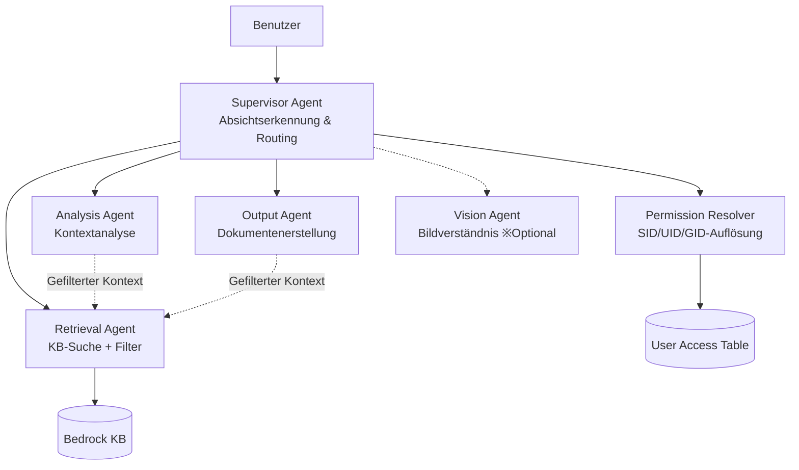

### Hauptmerkmale

- **Berechtigungsgrenzen erhalten**: KB-Zugriff nur für Permission Resolver und Retrieval Agent. Andere Agenten verwenden ausschließlich „gefilterten Kontext"
- **IAM-Rollentrennung**: Jeder Collaborator erhält eine individuelle IAM-Rolle mit minimalen Berechtigungen
- **Kostenoptimiert**: Standardmäßig deaktiviert (`enableMultiAgent: false`). Keine zusätzlichen Kosten bis zur Aktivierung
- **Zwei Routing-Modi**: `supervisor_router` (niedrige Latenz) / `supervisor` (komplexe Aufgaben)
- **UI-Umschalter**: Wechsel zwischen Single / Multi-Modus mit einem Klick in der Chat-UI
- **Agent Trace**: Visualisierung der Multi-Agent-Ausführungszeitleiste und Kostenaufschlüsselung pro Collaborator

### UI-Screenshots

#### Einheitlicher 3-Modus-Umschalter — KB / Single Agent / Multi Agent

Der Header enthält einen einheitlichen 3-Modus-Umschalter. KB (blau), Single Agent (lila) und Multi Agent (lila) können mit einem Klick umgeschaltet werden. Das Agent-Auswahl-Dropdown erscheint nur in Agent-Modi — der Single-Modus zeigt einzelne Agents, der Multi-Modus zeigt nur Supervisor Agents.


#### Agent Directory — Teams-Tab + Vorlagengalerie

Das Agent Directory enthält einen Teams-Tab mit einer Vorlagengalerie zur Team-Erstellung mit einem Klick.


#### Team-Erstellungsassistent — 5 Schritte

Durch Klicken auf „+" bei einer Vorlage öffnet sich ein 5-Schritte-Team-Erstellungsassistent.


#### Team erstellt — Team-Karte

Nach der Erstellung erscheint die Team-Karte im Teams-Tab mit Agentenanzahl, Routing-Modus, Trust Level und Tool Profile Badges.


#### Multi-Modus aktiviert — Nach Team-Erstellung

Nach der Team-Erstellung wird der Multi-Modus-Toggle im Chat-Header aktiviert (nicht mehr deaktiviert).


#### Supervisor Agent Antwort — Berechtigungsgefiltert

Wenn Sie den Supervisor Agent auswählen und eine Chat-Nachricht senden, wird die Collaborator Agent-Kette für die KB-Suche ausgelöst und eine berechtigungsgefilterte Antwort mit Zitaten zurückgegeben.


### Hinweise zur Bereitstellung

Kritische technische Erkenntnisse aus der tatsächlichen AWS-Bereitstellung.

#### CloudFormation `AgentCollaboration` gültige Werte

- Gültige Werte: `DISABLED` | `SUPERVISOR` | `SUPERVISOR_ROUTER` nur
- `COLLABORATOR` ist KEIN gültiger Wert (trotz Erwähnung in einiger Dokumentation)
- Collaborator Agents sollten `AgentCollaboration` NICHT setzen (Standard: `DISABLED`)

#### 2-Stufen-Bereitstellung erforderlich (Supervisor Agent)

Supervisor Agent kann nicht mit `AgentCollaboration=SUPERVISOR_ROUTER` und `AgentCollaborators` in einer einzigen CloudFormation-Operation erstellt werden.

1. Supervisor Agent zuerst mit `AgentCollaboration=DISABLED` erstellen
2. Custom Resource Lambda verwenden:
   - `UpdateAgent` → auf `SUPERVISOR_ROUTER` ändern
   - `AssociateAgentCollaborator` für jeden Collaborator
   - `PrepareAgent`

#### IAM-Berechtigungsanforderungen

- Supervisor Agent IAM-Rolle benötigt: `bedrock:GetAgentAlias` + `bedrock:InvokeAgent` auf `agent-alias/*/*`
- Custom Resource Lambda benötigt: `iam:PassRole` für die Supervisor-Rolle
- `autoPrepare=true` kann nicht für Supervisor Agent verwendet werden (schlägt ohne Collaborators fehl)

#### Collaborator Agent Aliases

- Jeder Collaborator Agent benötigt einen `CfnAgentAlias` bevor er vom Supervisor referenziert werden kann
- Alias ARN-Format: `arn:aws:bedrock:REGION:ACCOUNT:agent-alias/{agent-id}/{alias-id}`

#### Docker-Image-Build (Lambda)

- Apple Silicon: `Dockerfile.prebuilt` mit `--provenance=false --sbom=false` verwenden
- `docker/app/Dockerfile` ist NICHT für Lambda Web Adapter (Legacy-Datei)
- Nach ECR-Push `aws lambda update-function-code` direkt verwenden (CDK erkennt `latest`-Tag-Änderungen nicht)

### Kostenstruktur

| Szenario | Agent-Aufrufe | Geschätzte Kosten/Anfrage |
|---|---|---|
| Single Agent (bestehend) | 1 | ~$0,02 |
| Multi-Agent (einfache Abfrage) | 2–3 | ~$0,06 |
| Multi-Agent (komplexe Abfrage) | 4–6 | ~$0,17 |

> Anforderungsbasierte Abrechnung — keine zusätzlichen Kosten bei Nichtverwendung.

## Lizenz

[Apache License 2.0](LICENSE)
