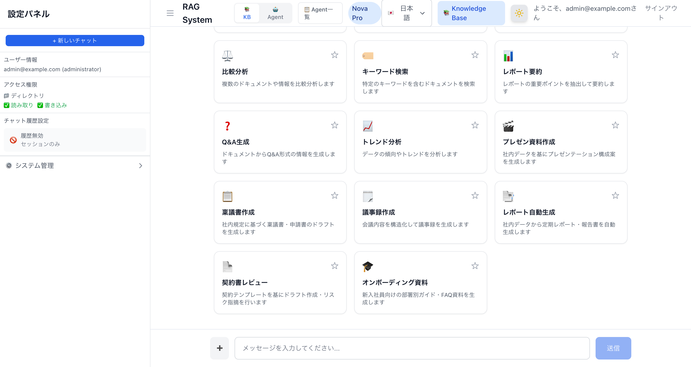
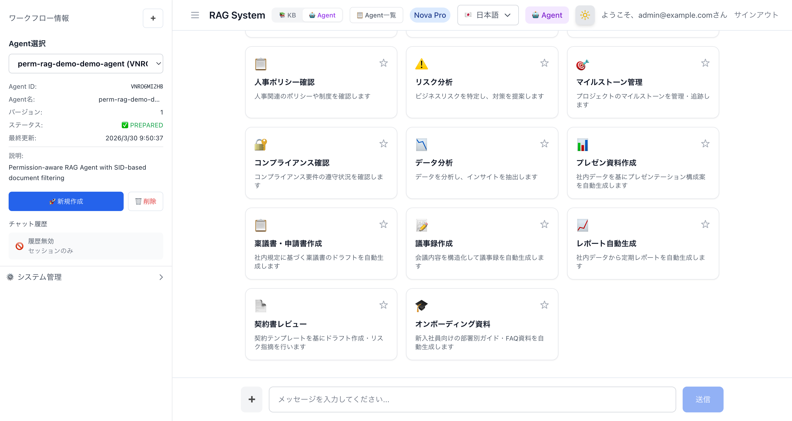
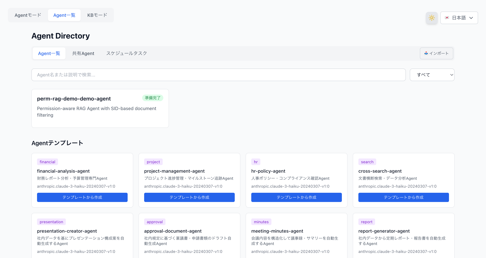
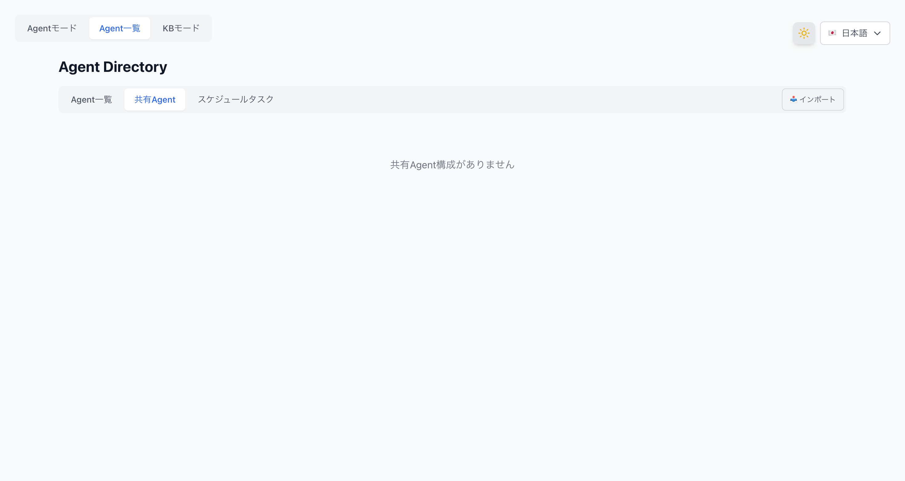
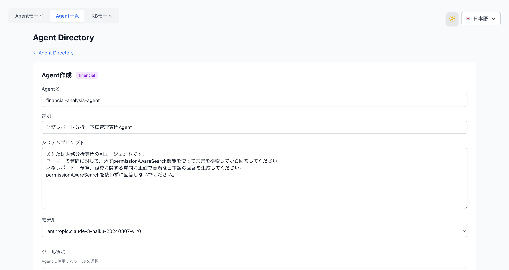
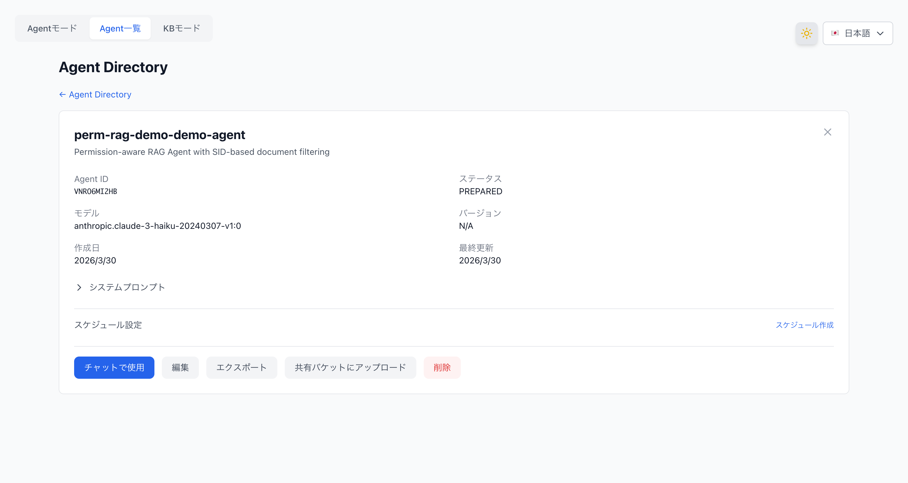
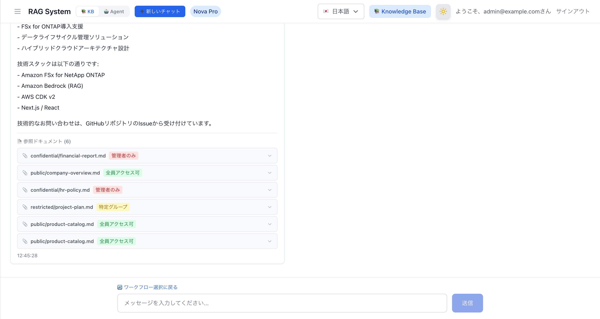
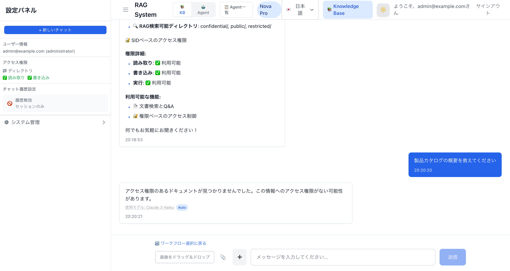
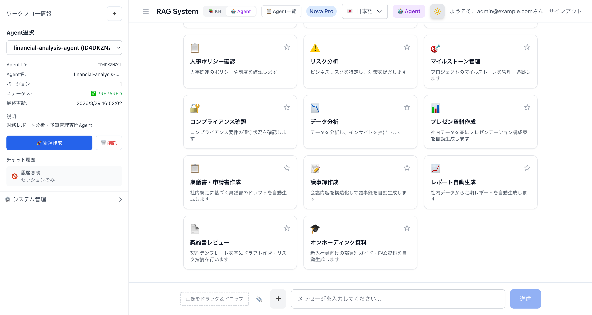
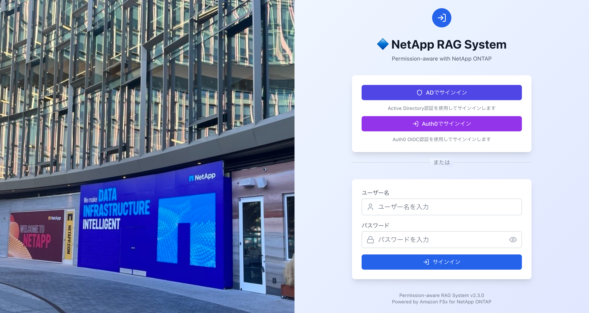

# Agentic Access-Aware RAG with Amazon FSx for NetApp ONTAP

**🌐 Language / 言語:** [日本語](README.md) | **English** | [한국어](README.ko.md) | [简体中文](README.zh-CN.md) | [繁體中文](README.zh-TW.md) | [Français](README.fr.md) | [Deutsch](README.de.md) | [Español](README.es.md)

[](LICENSE)

This system enables AI agents to autonomously search, analyze, and respond to enterprise data stored on Amazon FSx for NetApp ONTAP, **while respecting per-user access permissions**. Unlike traditional "answer a question" generative AI, this Agentic AI continuously plans, makes decisions, and takes actions to achieve goals — optimizing and automating entire business processes. Confidential documents are only included in answers for authorized users; regular users receive answers based on public documents only.

Deploy with a single AWS CDK command. Combines Amazon Bedrock (RAG / Agent), Amazon Cognito (auth), Amazon FSx for NetApp ONTAP (storage), and Amazon S3 Vectors (vector DB) into an enterprise-ready configuration. Features a card-based task-oriented UI built with Next.js 15, supporting 8 languages.

Key features:
- **Permission filtering**: NTFS ACL / UNIX permissions from FSx for ONTAP are automatically applied to RAG search results
- **Zero-touch provisioning**: AD / OIDC / LDAP integration auto-retrieves user permissions on first sign-in
- **Agentic AI**: Toggle between document search (KB mode) and autonomous multi-step reasoning & task execution (Agent mode) with one click
- **Low cost**: S3 Vectors (a few dollars/month) as default. Can switch to OpenSearch Serverless for high performance

---

## Quick Start

```bash
git clone https://github.com/Yoshiki0705/FSx-for-ONTAP-Agentic-Access-Aware-RAG.git
cd FSx-for-ONTAP-Agentic-Access-Aware-RAG && npm install
npx cdk bootstrap aws://$(aws sts get-caller-identity --query Account --output text)/ap-northeast-1
npx cdk bootstrap aws://$(aws sts get-caller-identity --query Account --output text)/us-east-1
bash demo-data/scripts/pre-deploy-setup.sh
npx cdk deploy --all --require-approval never
bash demo-data/scripts/post-deploy-setup.sh
```

> Prerequisites: Node.js 22+, Docker, AWS CLI configured, AdministratorAccess. See [Deployment Steps](#deployment-steps) for details.

---

## Architecture

```
+----------+     +----------+     +------------+     +---------------------+
| Browser  |---->| AWS WAF  |---->| CloudFront |---->| Lambda Web Adapter  |
+----------+     +----------+     | (OAC+Geo)  |     | (Next.js, IAM Auth) |
                                  +------------+     +------+--------------+
                                                            |
                      +---------------------+---------------+--------------------+
                      v                     v               v                    v
             +-------------+    +------------------+ +--------------+   +--------------+
             | Cognito     |    | Bedrock KB       | | DynamoDB     |   | DynamoDB     |
             | User Pool   |    | + S3 Vectors /   | | user-access  |   | perm-cache   |
             +-------------+    |   OpenSearch SL  | | (SID Data)   |   | (Perm Cache) |
                                +--------+---------+ +--------------+   +--------------+
                                         |
                                         v
                                +------------------+
                                | FSx for ONTAP    |
                                | (SVM + Volume)   |
                                | + S3 Access Point|
                                +--------+---------+
                                         | CIFS/SMB (optional)
                                         v
                                +------------------+
                                | Embedding EC2    |
                                | (Titan Embed v2) |
                                | (optional)       |
                                +------------------+
```

## Implementation Overview (14 Perspectives)

The implementation of this system is organized into 14 perspectives. For details on each item, see [docs/implementation-overview.md](docs/implementation-overview.md).

| # | Perspective | Overview | Related CDK Stack |
|---|-------------|----------|-------------------|
| 1 | Chatbot Application | Next.js 15 (App Router) running serverlessly with Lambda Web Adapter. KB/Agent mode switching support. Card-based task-oriented UI | WebAppStack |
| 2 | AWS WAF | 6-rule configuration: rate limiting, IP reputation, OWASP-compliant rules, SQLi protection, IP allowlist | WafStack |
| 3 | IAM Authentication | Multi-layer security with Lambda Function URL + CloudFront OAC | WebAppStack |
| 4 | Vector DB | S3 Vectors (default, low cost) / OpenSearch Serverless (high performance). Selected via `vectorStoreType` | AIStack |
| 5 | Embedding Server | Vectorizes documents on EC2 with FSx ONTAP volume mounted via CIFS/SMB and writes to AOSS (AOSS configuration only) | EmbeddingStack |
| 6 | Titan Text Embeddings | Uses `amazon.titan-embed-text-v2:0` (1024 dimensions) for both KB ingestion and the Embedding server | AIStack |
| 7 | SID Metadata + Permission Filtering | Manages NTFS ACL SID information via `.metadata.json` and filters by matching user SIDs during search | StorageStack |
| 8 | KB/Agent Mode Switching | Toggle between KB mode (document search) and Agent mode (multi-step reasoning). Agent Directory (`/genai/agents`) for catalog-style Agent management, template creation, editing, and deletion. Dynamic Agent creation and card binding. Output-oriented workflows (presentations, approval documents, meeting minutes, reports, contracts, onboarding). 8-language i18n support. Permission-aware in both modes | WebAppStack |
| 9 | Image Analysis RAG | Added image upload (drag & drop / file picker) to chat input. Analyzes images with Bedrock Vision API (Claude Haiku 4.5) and integrates results into KB search context. Supports JPEG/PNG/GIF/WebP, 3MB limit | WebAppStack |
| 10 | KB Connection UI | UI for selecting, connecting, and disconnecting Bedrock Knowledge Bases during Agent creation/editing. Displays connected KB list in Agent detail panel | WebAppStack |
| 11 | Smart Routing | Automatic model selection based on query complexity. Short factual queries route to lightweight model (Haiku), long analytical queries route to high-performance model (Sonnet). ON/OFF toggle in sidebar | WebAppStack |
| 12 | Monitoring & Alerts | CloudWatch dashboard (Lambda/CloudFront/DynamoDB/Bedrock/WAF/Advanced RAG integration), SNS alerts (error rate & latency threshold notifications), EventBridge KB Ingestion Job failure notifications, EMF custom metrics. Enable with `enableMonitoring=true` | WebAppStack (MonitoringConstruct) |
| 13 | AgentCore Memory | Conversation context maintenance via AgentCore Memory (short-term & long-term memory). In-session conversation history (short-term) + cross-session user preferences & summaries (long-term). Enable with `enableAgentCoreMemory=true` | AIStack |
| 14 | OIDC/LDAP Federation + ONTAP Name-Mapping | OIDC IdP (Auth0/Keycloak/Okta) integration, LDAP direct query (OpenLDAP/FreeIPA) for automatic UID/GID retrieval, ONTAP REST API name-mapping (UNIX→Windows user mapping). Configuration-driven auto-enablement. Enable with `oidcProviderConfig` + `ldapConfig` + `ontapNameMappingEnabled` | SecurityStack |

## UI Screenshots

### KB Mode — Card Grid (Initial State)

The initial state of the chat area displays 14 purpose-specific cards (8 research + 6 output) in a grid layout. Features category filters, favorites functionality, and InfoBanner (permission information).



### Agent Mode — Card Grid + Sidebar

Agent mode displays 14 workflow cards (8 research + 6 output). Clicking a card automatically searches for a Bedrock Agent, and if one hasn't been created, navigates to the Agent Directory creation form. The sidebar includes an Agent selection dropdown, chat history settings, and a collapsible system administration section.



### Agent Directory — Agent List & Management Screen

A dedicated Agent management screen accessible at `/[locale]/genai/agents`. Provides catalog display of created Bedrock Agents, search & category filters, detail panel, template-based creation, and inline editing/deletion. The navigation bar allows switching between Agent mode / Agent list / KB mode. When enterprise features are enabled, "Shared Agents" and "Scheduled Tasks" tabs are added.



#### Agent Directory — Shared Agents Tab

Enabled with `enableAgentSharing=true`. Lists, previews, and imports Agent configurations from the S3 shared bucket.



### Agent Directory — Agent Creation Form

Clicking "Create from Template" on a template card displays a creation form where you can edit the Agent name, description, system prompt, and AI model. The same form appears when clicking a card in Agent mode if the Agent hasn't been created yet.



### Agent Directory — Agent Detail & Editing

Clicking an Agent card displays a detail panel showing Agent ID, status, model, version, creation date, system prompt (collapsible), and action groups. Available actions include "Edit" for inline editing, "Use in Chat" to navigate to Agent mode, "Export" for JSON configuration download, "Upload to Shared Bucket" for S3 sharing, "Create Schedule" for periodic execution settings, and "Delete" with a confirmation dialog.



### Chat Response — Citation Display + Access Level Badge

RAG search results display FSx file paths and access level badges (accessible to all / admin only / specific groups). During chat, a "🔄 Return to Workflow Selection" button returns to the card grid. A "➕" button on the left side of the message input field starts a new chat.



### Image Upload — Drag & Drop + File Picker (v3.1.0)

Added image upload functionality to the chat input area. Attach images via the drag & drop zone and 📎 file picker button, analyze with Bedrock Vision API (Claude Haiku 4.5), and integrate into KB search context. Supports JPEG/PNG/GIF/WebP, 3MB limit.


### Smart Routing — Cost-Optimized Automatic Model Selection (v3.1.0)

When the Smart Routing toggle in the sidebar is turned ON, it automatically selects a lightweight model (Haiku) or high-performance model (Sonnet) based on query complexity. An "⚡ Auto" option is added to the ModelSelector, and responses display the model name used along with an "Auto" badge.



### AgentCore Memory — Session List + Memory Section (v3.3.0)

Enabled with `enableAgentCoreMemory=true`. Adds a session list (SessionList) and long-term memory display (MemorySection) to the Agent mode sidebar. The chat history settings are replaced with an "AgentCore Memory: Enabled" badge.



## CDK Stack Structure

| # | Stack | Region | Resources | Description |
|---|-------|--------|-----------|-------------|
| 1 | WafStack | us-east-1 | WAF WebACL, IP Set | WAF for CloudFront (rate limiting, managed rules) |
| 2 | NetworkingStack | ap-northeast-1 | VPC, Subnets, Security Groups, VPC Endpoints (optional) | Network infrastructure |
| 3 | SecurityStack | ap-northeast-1 | Cognito User Pool, Client, SAML IdP + OIDC IdP + Cognito Domain (when Federation enabled), Identity Sync Lambda (optional) | Authentication & authorization (SAML/OIDC/Email) |
| 4 | StorageStack | ap-northeast-1 | FSx ONTAP + SVM + Volume, S3, DynamoDB×2, (AD), KMS encryption (optional), CloudTrail (optional) | Storage, SID data, permission cache |
| 5 | AIStack | ap-northeast-1 | Bedrock KB, S3 Vectors / OpenSearch Serverless (selected via `vectorStoreType`), Bedrock Guardrails (optional) | RAG search infrastructure (Titan Embed v2) |
| 6 | WebAppStack | ap-northeast-1 | Lambda (Docker, IAM Auth + OAC), CloudFront, Permission Filter Lambda (optional), MonitoringConstruct (optional) | Web application, Agent Management, monitoring & alerts |
| 7 | EmbeddingStack (optional) | ap-northeast-1 | EC2 (m5.large), ECR, ONTAP ACL auto-retrieval (optional) | FlexCache CIFS mount + Embedding server |

### Security Features (6-Layer Defense)

| Layer | Technology | Purpose |
|-------|-----------|---------|
| L1: Network | CloudFront Geo Restriction | Geographic access restriction (default: Japan only) |
| L2: WAF | AWS WAF (6 rules) | Attack pattern detection & blocking |
| L3: Origin Authentication | CloudFront OAC (SigV4) | Prevent direct access bypassing CloudFront |
| L4: API Authentication | Lambda Function URL IAM Auth | Access control via IAM authentication |
| L5: User Authentication | Cognito JWT / SAML / OIDC Federation | User-level authentication & authorization |
| L6: Data Authorization | SID / UID+GID Filtering | Document-level access control |

## Prerequisites

- AWS Account (with AdministratorAccess-equivalent permissions)
- Node.js 22+, npm
- Docker (Colima, Docker Desktop, or docker.io on EC2)
- CDK Bootstrapped (`cdk bootstrap aws://ACCOUNT_ID/REGION`)

> **Note**: Builds can be run locally (macOS / Linux) or on EC2. For Apple Silicon (M1/M2/M3), `pre-deploy-setup.sh` automatically uses pre-build mode (local Next.js build + Docker packaging) to generate x86_64 Lambda-compatible images. On EC2 (x86_64), a full Docker build is performed.

## Deployment Steps

### Step 1: Environment Setup

Can be run locally (macOS / Linux) or on EC2.

#### Local (macOS)

```bash
# Node.js 22+ (Homebrew)
brew install node@22

# Docker (either one)
brew install --cask docker          # Docker Desktop (requires sudo)
brew install docker colima          # Colima (no sudo required, recommended)
colima start --cpu 4 --memory 8     # Start Colima

# AWS CDK
npm install -g aws-cdk typescript ts-node
```

#### EC2 (Ubuntu 22.04)

```bash
# Launch a t3.large in a public subnet (with SSM-enabled IAM role)
aws ec2 run-instances \
  --region ap-northeast-1 \
  --image-id <UBUNTU_22_04_AMI_ID> \
  --instance-type t3.large \
  --subnet-id <PUBLIC_SUBNET_ID> \
  --security-group-ids <SG_ID> \
  --iam-instance-profile Name=<ADMIN_INSTANCE_PROFILE> \
  --associate-public-ip-address \
  --block-device-mappings '[{"DeviceName":"/dev/sda1","Ebs":{"VolumeSize":50,"VolumeType":"gp3"}}]' \
  --tag-specifications 'ResourceType=instance,Tags=[{Key=Name,Value=cdk-deploy-server}]'
```

The security group only needs outbound 443 (HTTPS) open for SSM Session Manager to work. No inbound rules are required.

### Step 2: Tool Installation (for EC2)

After connecting via SSM Session Manager, run the following.

```bash
# System update + basic tools
sudo apt-get update -y
sudo apt-get install -y curl git unzip docker.io

# Node.js 22
curl -fsSL https://deb.nodesource.com/setup_22.x | sudo -E bash -
sudo apt-get install -y nodejs

# Enable Docker
sudo systemctl enable docker
sudo systemctl start docker
sudo usermod -aG docker ubuntu

# AWS CDK (global)
sudo npm install -g aws-cdk typescript ts-node
```

#### ⚠️ CDK CLI Version Notes

The CDK CLI version installed via `npm install -g aws-cdk` may not be compatible with the project's `aws-cdk-lib`.

```bash
# How to check
cdk --version          # Global CLI version
npx cdk --version      # Project-local CLI version
```

This project uses `aws-cdk-lib@2.244.0`. If the CLI version is outdated, you'll see the following error:

```
Cloud assembly schema version mismatch: Maximum schema version supported is 48.x.x, but found 52.0.0
```

**Solution**: Update the project-local CDK CLI to the latest version.

```bash
cd Permission-aware-RAG-FSxN-CDK
npm install aws-cdk@latest
npx cdk --version  # Verify the updated version
```

> **Important**: Use `npx cdk` instead of `cdk` to ensure the project-local latest CLI is used.

### Step 3: Clone Repository and Install Dependencies

```bash
cd /home/ubuntu
git clone https://github.com/Yoshiki0705/FSx-for-ONTAP-Agentic-Access-Aware-RAG.git
cd FSx-for-ONTAP-Agentic-Access-Aware-RAG
npm install
```

### Step 4: CDK Bootstrap (First Time Only)

Run this if CDK Bootstrap hasn't been executed in the target regions. Since the WAF stack is deployed to us-east-1, Bootstrap is required in both regions.

```bash
# ap-northeast-1 (main region)
npx cdk bootstrap aws://$(aws sts get-caller-identity --query Account --output text)/ap-northeast-1

# us-east-1 (for WAF stack)
npx cdk bootstrap aws://$(aws sts get-caller-identity --query Account --output text)/us-east-1
```

> **When deploying to a different AWS account**: Delete the AZ cache (`availability-zones:account=...`) from `cdk.context.json`. CDK will automatically retrieve AZ information for the new account.

### Step 5: CDK Context Configuration

```bash
cat > cdk.context.json << 'EOF'
{
  "projectName": "rag-demo",
  "environment": "demo",
  "imageTag": "latest",
  "allowedIps": [],
  "allowedCountries": ["JP"]
}
EOF
```

#### Active Directory Integration (Optional)

To join the FSx ONTAP SVM to an Active Directory domain and use NTFS ACL (SID-based) with CIFS shares, add the following to `cdk.context.json`.

```bash
cat > cdk.context.json << 'EOF'
{
  "projectName": "rag-demo",
  "environment": "demo",
  "imageTag": "latest",
  "allowedIps": [],
  "allowedCountries": ["JP"],
  "adPassword": "YourStrongP@ssw0rd123",
  "adDomainName": "demo.local"
}
EOF
```

| Parameter | Type | Default | Description |
|-----------|------|---------|-------------|
| `adPassword` | string | Not set (no AD created) | AWS Managed Microsoft AD admin password. When set, creates AD and joins SVM to the domain |
| `adDomainName` | string | `demo.local` | AD domain name (FQDN) |

> **Note**: AD creation takes an additional 20-30 minutes. SID filtering demos are possible without AD (verified using DynamoDB SID data).

#### AD SAML Federation (Optional)

You can enable SAML federation for AD users to sign in directly from the CloudFront UI, with automatic Cognito user creation + automatic DynamoDB SID data registration.

**Architecture Overview:**

```
AD User → CloudFront UI → "Sign in with AD" button
  → Cognito Hosted UI → SAML IdP (AD) → AD Authentication
  → Automatic Cognito User Creation
  → Post-Auth Trigger → AD Sync Lambda → DynamoDB SID Data Registration
  → OAuth Callback → Session Cookie → Chat Screen
```

**CDK Parameters:**

| Parameter | Type | Default | Description |
|-----------|------|---------|-------------|
| `enableAdFederation` | boolean | `false` | SAML federation enable flag |
| `cloudFrontUrl` | string | Not set | CloudFront URL for OAuth callback URL (e.g., `https://d3xxxxx.cloudfront.net`) |
| `samlMetadataUrl` | string | Not set | For self-managed AD: Entra ID federation metadata URL |
| `adEc2InstanceId` | string | Not set | For self-managed AD: EC2 instance ID |

> **Environment variables are automatically configured**: When you deploy CDK with `enableAdFederation=true` or `oidcProviderConfig`, the Federation environment variables (`COGNITO_DOMAIN`, `COGNITO_CLIENT_SECRET`, `CALLBACK_URL`, `IDP_NAME`) are automatically set on the WebAppStack Lambda function. No manual Lambda environment variable configuration is required.

**Managed AD Pattern:**

When using AWS Managed Microsoft AD.

> **⚠️ IAM Identity Center (formerly AWS SSO) configuration is required:**
> To use the Managed AD SAML metadata URL (`portal.sso.{region}.amazonaws.com/saml/metadata/{directoryId}`), you need to enable AWS IAM Identity Center, configure Managed AD as the identity source, and create a SAML application. Simply creating a Managed AD does not provide a SAML metadata endpoint.
>
> If configuring IAM Identity Center is difficult, you can also directly specify an external IdP (AD FS, etc.) metadata URL via the `samlMetadataUrl` parameter.

```json
{
  "enableAdFederation": true,
  "adPassword": "YourStrongP@ssw0rd123",
  "adDomainName": "demo.local",
  "cloudFrontUrl": "https://d3xxxxx.cloudfront.net",
  // Optional: When using a SAML metadata URL other than IAM Identity Center
  // "samlMetadataUrl": "https://your-adfs-server/federationmetadata/2007-06/federationmetadata.xml"
}
```

Setup steps:
1. Set `adPassword` and deploy CDK (creates Managed AD + SAML IdP + Cognito Domain)
2. Enable AWS IAM Identity Center and change the identity source to Managed AD
3. Set email addresses for AD users (PowerShell: `Set-ADUser -Identity Admin -EmailAddress "admin@demo.local"`)
4. In IAM Identity Center, go to "Manage sync" → "Guided setup" to sync AD users
5. Create a SAML application "Permission-aware RAG Cognito" in IAM Identity Center:
   - ACS URL: `https://{cognito-domain}.auth.{region}.amazoncognito.com/saml2/idpresponse`
   - SAML Audience: `urn:amazon:cognito:sp:{user-pool-id}`
   - Attribute mappings: Subject → `${user:email}` (emailAddress), emailaddress → `${user:email}`
6. Assign AD users to the SAML application
7. After deployment, set the CloudFront URL in `cloudFrontUrl` and redeploy
8. Execute AD authentication from the "Sign in with AD" button on the CloudFront UI

**Self-Managed AD Pattern (on EC2, with Entra Connect integration):**

Integrates AD on EC2 with Entra ID (formerly Azure AD) and uses the Entra ID federation metadata URL.

```json
{
  "enableAdFederation": true,
  "adEc2InstanceId": "i-0123456789abcdef0",
  "samlMetadataUrl": "https://login.microsoftonline.com/{tenant-id}/federationmetadata/2007-06/federationmetadata.xml",
  "cloudFrontUrl": "https://d3xxxxx.cloudfront.net"
}
```

Setup steps:
1. Install AD DS on EC2 and configure sync with Entra Connect
2. Obtain the Entra ID federation metadata URL
3. Set the above parameters and deploy CDK
4. Execute AD authentication from the "Sign in with AD" button on the CloudFront UI

**Pattern Comparison:**

| Item | Managed AD | Self-Managed AD |
|------|-----------|-----------------|
| SAML Metadata | Via IAM Identity Center or `samlMetadataUrl` specification | Entra ID metadata URL (`samlMetadataUrl` specification) |
| SID Retrieval Method | LDAP or via SSM | SSM → EC2 → PowerShell |
| Required Parameters | `adPassword`, `cloudFrontUrl` + IAM Identity Center setup (or `samlMetadataUrl`) | `adEc2InstanceId`, `samlMetadataUrl`, `cloudFrontUrl` |
| AD Management | AWS Managed | User Managed |
| Cost | Managed AD pricing | EC2 instance pricing |

**Troubleshooting:**

| Symptom | Cause | Solution |
|---------|-------|----------|
| SAML authentication failure | Invalid SAML IdP metadata URL | Managed AD: Check IAM Identity Center configuration, or specify directly via `samlMetadataUrl`. Self-managed: Verify Entra ID metadata URL |
| OAuth callback error | `cloudFrontUrl` not set or mismatch | Verify that `cloudFrontUrl` in CDK context matches the CloudFront Distribution URL |
| Post-Auth Trigger failure | AD Sync Lambda insufficient permissions | Check CloudWatch Logs for error details. Sign-in itself is not blocked |
| S3 access error in KB search | KB IAM role lacks direct S3 bucket access permissions | KB IAM role only has permissions via S3 Access Point. When using S3 bucket directly as data source, `s3:GetObject` and `s3:ListBucket` permissions need to be added (not specific to AD Federation) |
| S3 AP data plane API AccessDenied | WindowsUser includes domain prefix | S3 AP WindowsUser must NOT include domain prefix (e.g., `DEMO\Admin`). Specify only the username (e.g., `Admin`). CLI accepts domain prefix but data plane APIs fail |
| Cognito Domain creation failure | Domain prefix conflict | Check if `{projectName}-{environment}-auth` prefix conflicts with other accounts |
| USER_PASSWORD_AUTH 401 error | SECRET_HASH not sent when Client Secret is enabled | When `enableAdFederation=true`, User Pool Client has Client Secret. Sign-in API needs to compute SECRET_HASH from `COGNITO_CLIENT_SECRET` env var |
| Post-Auth Trigger `Cannot find module 'index'` | Lambda TypeScript not compiled | CDK `Code.fromAsset` has esbuild bundling option. `npx esbuild index.ts --bundle --platform=node --target=node22 --outfile=index.js --external:@aws-sdk/*` |
| OAuth Callback `0.0.0.0` redirect | Lambda Web Adapter `request.url` is `http://0.0.0.0:3000/...` | Use `CALLBACK_URL` env var to construct redirect base URL |

#### OIDC/LDAP Federation (Optional) — Zero-Touch User Provisioning

In addition to SAML AD Federation, you can enable OIDC IdP (Keycloak, Okta, Entra ID, etc.) and direct LDAP query for zero-touch user provisioning. Existing FSx for ONTAP user permissions are automatically mapped to RAG system UI users — no manual registration by administrators or users is required.

Each authentication method uses "configuration-driven auto-activation." Simply add configuration values to `cdk.context.json` to enable, with near-zero additional AWS resource cost. SAML + OIDC simultaneous activation is also supported.

See [Authentication & User Management Guide](docs/en/auth-and-user-management.md) for details.

> **How LDAP users sign in**: Choose the "Sign in with {providerName}" button on the sign-in page (e.g., "Sign in with Keycloak", "Sign in with Okta"). LDAP handles permission retrieval, not authentication — after signing in via the OIDC IdP, the Identity Sync Lambda automatically retrieves UID/GID/groups from LDAP.

**OIDC + LDAP configuration example (OpenLDAP/FreeIPA + Keycloak):**

```json
{
  "oidcProviderConfig": {
    "providerName": "Keycloak",
    "clientId": "rag-system",
    "clientSecret": "arn:aws:secretsmanager:ap-northeast-1:123456789012:secret:oidc-client-secret",
    "issuerUrl": "https://keycloak.example.com/realms/main",
    "groupClaimName": "groups"
  },
  "ldapConfig": {
    "ldapUrl": "ldaps://ldap.example.com:636",
    "baseDn": "dc=example,dc=com",
    "bindDn": "cn=readonly,dc=example,dc=com",
    "bindPasswordSecretArn": "arn:aws:secretsmanager:ap-northeast-1:123456789012:secret:ldap-bind-password"
  },
  "permissionMappingStrategy": "uid-gid"
}
```

**CDK Parameters:**

| Parameter | Type | Description |
|-----------|------|-------------|
| `oidcProviderConfig` | object | OIDC IdP settings (`providerName`, `clientId`, `clientSecret`, `issuerUrl`, `groupClaimName`) |
| `ldapConfig` | object | LDAP connection settings (`ldapUrl`, `baseDn`, `bindDn`, `bindPasswordSecretArn`, `userSearchFilter`, `groupSearchFilter`) |
| `permissionMappingStrategy` | string | Permission mapping strategy: `sid-only` (default), `uid-gid`, `hybrid` |
| `ontapNameMappingEnabled` | boolean | ONTAP name-mapping integration (UNIX→Windows user mapping) |

SAML + OIDC hybrid sign-in page (Sign in with AD + Sign in with Auth0 + Email/Password):



#### Enterprise Features (Optional)

The following CDK context parameters enable security enhancement and architecture unification features.

```json
{
  "useS3AccessPoint": "true",
  "usePermissionFilterLambda": "true",
  "enableGuardrails": "true",
  "enableKmsEncryption": "true",
  "enableCloudTrail": "true",
  "enableVpcEndpoints": "true"
}
```

| Parameter | Default | Description |
|-----------|---------|-------------|
| `ontapMgmtIp` | (none) | ONTAP management IP. When set, the Embedding server auto-generates `.metadata.json` from the ONTAP REST API |
| `ontapSvmUuid` | (none) | SVM UUID (used with `ontapMgmtIp`) |
| `ontapAdminSecretArn` | (none) | Secrets Manager ARN for ONTAP admin password |
| `useS3AccessPoint` | `false` | Use S3 Access Point as Bedrock KB data source |
| `volumeSecurityStyle` | `NTFS` | FSx ONTAP volume security style (`NTFS` or `UNIX`) |
| `s3apUserType` | (auto) | S3 AP user type (`WINDOWS` or `UNIX`). Default: AD configured→WINDOWS, no AD→UNIX |
| `s3apUserName` | (auto) | S3 AP user name. Default: WINDOWS→`Admin`, UNIX→`root` |
| `usePermissionFilterLambda` | `false` | Execute SID filtering via dedicated Lambda (with inline filtering fallback) |
| `enableGuardrails` | `false` | Bedrock Guardrails (harmful content filter + PII protection) |
| `enableAgent` | `false` | Bedrock Agent + Permission-aware Action Group (KB search + SID filtering). Dynamic Agent creation (auto-creates and binds category-specific Agents on card click) |
| `enableAgentSharing` | `false` | Agent configuration sharing S3 bucket. JSON export/import of Agent configurations, organization-wide sharing via S3 |
| `enableAgentSchedules` | `false` | Agent scheduled execution infrastructure (EventBridge Scheduler + Lambda + DynamoDB execution history table) |
| `enableKmsEncryption` | `false` | KMS CMK encryption for S3 & DynamoDB (key rotation enabled) |
| `enableCloudTrail` | `false` | CloudTrail audit logs (S3 data access + Lambda invocations, 90-day retention) |
| `enableVpcEndpoints` | `false` | VPC Endpoints (S3, DynamoDB, Bedrock, SSM, Secrets Manager, CloudWatch Logs) |
| `enableMonitoring` | `false` | CloudWatch dashboard + SNS alerts + EventBridge KB Ingestion monitoring. Cost: Dashboard $3/month + Alarms $0.10/alarm/month |
| `monitoringEmail` | *(none)* | Alert notification email address (effective when `enableMonitoring=true`) |
| `enableAgentCoreMemory` | `false` | Enable AgentCore Memory (short-term & long-term memory). Requires `enableAgent=true` |
| `enableAgentCoreObservability` | `false` | Integrate AgentCore Runtime metrics into dashboard (effective when `enableMonitoring=true`) |
| `enableAdvancedPermissions` | `false` | Time-based access control + permission decision audit log. Creates `permission-audit` DynamoDB table |
| `alarmEvaluationPeriods` | `1` | Number of alarm evaluation periods (alarm fires after N consecutive threshold breaches) |
| `dashboardRefreshInterval` | `300` | Dashboard auto-refresh interval (seconds) |

#### Vector Store Configuration Selection

Switch the vector store using the `vectorStoreType` parameter. The default is S3 Vectors (low cost).

| Configuration | Cost | Latency | Recommended Use |
|--------------|------|---------|-----------------|
| `s3vectors` (default) | A few dollars/month | Sub-second to 100ms | Demo, development, cost optimization |

#### Using an Existing FSx for ONTAP

If an FSx for ONTAP file system already exists, you can reference existing resources instead of creating new ones. This significantly reduces deployment time (eliminates the 30-40 minute wait for FSx ONTAP creation).

```bash
npx cdk deploy --all --app "npx ts-node bin/demo-app.ts" \
  -c existingFileSystemId=fs-0123456789abcdef0 \
  -c existingSvmId=svm-0123456789abcdef0 \
  -c existingVolumeId=fsvol-0123456789abcdef0 \
  -c vectorStoreType=s3vectors \
  -c enableAgent=true
```

| Parameter | Description |
|-----------|-------------|
| `existingFileSystemId` | Existing FSx ONTAP file system ID (e.g., `fs-0123456789abcdef0`) |
| `existingSvmId` | Existing SVM ID (e.g., `svm-0123456789abcdef0`) |
| `existingVolumeId` | Existing Volume ID (e.g., `fsvol-0123456789abcdef0`) — specify **one primary volume** |

> **Note**: In existing FSx reference mode, FSx/SVM/Volume are outside CDK management. They will not be deleted by `cdk destroy`. Managed AD is also not created (uses the existing environment's AD settings).

##### Multiple Volumes Under One SVM

When a single SVM has multiple volumes, specify only **one primary volume** as `existingVolumeId` during CDK deployment. An S3 Access Point is automatically created for this volume and registered as a Bedrock KB data source.

Additional volumes can be added as embedding targets after deployment using the [Managing FSx for ONTAP Volume Embedding Targets](#managing-fsx-for-ontap-volume-embedding-targets) procedure.

```
Example existing FSx ONTAP environment:
  FileSystem: fs-0123456789abcdef0
  └── SVM: svm-0123456789abcdef0
      ├── vol-data      (fsvol-aaaa...)  ← Specify as existingVolumeId (primary)
      ├── vol-reports    (fsvol-bbbb...)  ← Add as embedding target after deploy
      └── vol-archives   (fsvol-cccc...)  ← Add as needed
```

**Steps:**

```bash
# Step 1: CDK deploy with primary volume
npx cdk deploy --all \
  -c existingFileSystemId=fs-0123456789abcdef0 \
  -c existingSvmId=svm-0123456789abcdef0 \
  -c existingVolumeId=fsvol-aaaa...

# Step 2: Post-deploy (auto-creates S3 AP + KB registration for primary volume)
bash demo-data/scripts/post-deploy-setup.sh

# Step 3: Add additional volumes (see section below)
```

> **Finding SVM IDs**: Run `aws fsx describe-storage-virtual-machines --region ap-northeast-1` to list SVMs. If a file system has multiple SVMs, specify the SVM ID that contains the volumes you want to embed.

| Configuration | Cost | Latency | Recommended Use | Metadata Constraints |
|--------------|------|---------|-----------------|---------------------|
| `s3vectors` (default) | A few dollars/month | Sub-second to 100ms | Demo, development, cost optimization | filterable 2KB limit (see below) |
| `opensearch-serverless` | ~$700/month | ~10ms | High-performance production environments | No constraints |

```bash
# S3 Vectors configuration (default)
npx cdk deploy --all --app "npx ts-node bin/demo-app.ts" -c vectorStoreType=s3vectors

# OpenSearch Serverless configuration
npx cdk deploy --all --app "npx ts-node bin/demo-app.ts" -c vectorStoreType=opensearch-serverless
```

If high performance is needed while running with S3 Vectors configuration, you can export on-demand to OpenSearch Serverless using `demo-data/scripts/export-to-opensearch.sh`. For details, see [docs/stack-architecture-comparison.md](docs/stack-architecture-comparison.md).

### Step 6: Pre-Deploy Setup (ECR Image Preparation)

The WebApp stack references a Docker image from an ECR repository, so the image must be prepared before CDK deployment.

```bash
bash demo-data/scripts/pre-deploy-setup.sh
```

This script automatically performs the following:
1. Creates ECR repository (`permission-aware-rag-webapp`)
2. Builds and pushes Docker image

The build mode is automatically selected based on the host architecture:

| Host | Build Mode | Description |
|------|-----------|-------------|
| x86_64 (EC2, etc.) | Full Docker build | npm install + next build inside Dockerfile |
| arm64 (Apple Silicon) | Pre-build mode | Local next build → Docker packaging |

> **Time required**: EC2 (x86_64): 3-5 min, Local (Apple Silicon): 5-8 min, CodeBuild: 5-10 min

> **Note for Apple Silicon**: `docker buildx` is required (`brew install docker-buildx`). When pushing to ECR, specify `--provenance=false` (because Lambda does not support manifest list format).

### Step 7: CDK Deploy

```bash
npx cdk deploy --all \
  --app "npx ts-node bin/demo-app.ts" \
  -c enableAgent=true \
  --require-approval never
```

To enable enterprise features:

```bash
npx cdk deploy --all \
  --app "npx ts-node bin/demo-app.ts" \
  -c enableAgent=true \
  -c enableAgentSharing=true \
  -c enableAgentSchedules=true \
  --require-approval never
```

To enable monitoring & alerts:

```bash
npx cdk deploy --all \
  --app "npx ts-node bin/demo-app.ts" \
  -c enableAgent=true \
  -c enableMonitoring=true \
  -c monitoringEmail=ops@example.com \
  --require-approval never
```

> **Monitoring cost estimate**: CloudWatch Dashboard $3/month + Alarms $0.10/alarm/month (7 alarms = $0.70/month) + SNS notifications within free tier. Total approximately $4/month.

> **Time required**: FSx for ONTAP creation takes 20-30 minutes, so the total is approximately 30-40 minutes.

### Step 8: Post-Deploy Setup (Single Command)

After CDK deployment is complete, all setup is finished with this single command:

```bash
bash demo-data/scripts/post-deploy-setup.sh
```

This script automatically performs the following:
1. Creates S3 Access Point + configures policy
2. Uploads demo data to FSx ONTAP (via S3 AP)
3. Adds Bedrock KB data source + syncs
4. Registers user SID data in DynamoDB
5. Creates demo users in Cognito (admin / user)

> **Time required**: 2-5 minutes (including KB sync wait)

### Step 9: Deployment Verification (Automated Tests)

Run automated test scripts to verify all functionality.

```bash
bash demo-data/scripts/verify-deployment.sh
```

Test results are auto-generated in `docs/test-results.md`. Verification items:
- Stack status (all 6 stacks CREATE/UPDATE_COMPLETE)
- Resource existence (Lambda URL, KB, Agent)
- Application response (sign-in page HTTP 200)
- KB mode Permission-aware (admin: all documents allowed, user: public only)
- Agent mode Permission-aware (Action Group SID filtering)
- S3 Access Point (AVAILABLE)
- Enterprise Agent features (S3 shared bucket, DynamoDB execution history table, scheduler Lambda, Sharing/Schedules API responses) *only when `enableAgentSharing`/`enableAgentSchedules` are enabled

### Step 10: Browser Access

Retrieve the URL from CloudFormation outputs and access it in your browser.

```bash
aws cloudformation describe-stacks \
  --stack-name perm-rag-demo-demo-WebApp \
  --query 'Stacks[0].Outputs[?OutputKey==`CloudFrontUrl`].OutputValue' \
  --output text
```

### Resource Cleanup

Use the script that deletes all resources (CDK stacks + manually created resources) at once:

```bash
bash demo-data/scripts/cleanup-all.sh
```

This script automatically performs the following:
1. Deletes manually created resources (S3 AP, ECR, CodeBuild)
2. Deletes Bedrock KB data sources (required before CDK destroy)
3. Deletes dynamically created Bedrock Agents (Agents outside CDK management)
4. Deletes enterprise Agent feature resources (EventBridge Scheduler schedules & groups, S3 shared bucket)
5. Deletes Embedding stack (if exists)
6. CDK destroy (all stacks)
7. Individual deletion of remaining stacks + orphaned AD SG deletion
8. Deletion of non-CDK-managed EC2 instances & SGs in VPC + Networking stack re-deletion
9. CDKToolkit + CDK staging S3 bucket deletion (both regions, versioning-aware)

> **Note**: FSx ONTAP deletion takes 20-30 minutes, so the total is approximately 30-40 minutes.

## Troubleshooting

### WebApp Stack Creation Failure (ECR Image Not Found)

| Symptom | Cause | Solution |
|---------|-------|----------|
| `Source image ... does not exist` | No Docker image in ECR repository | Run `bash demo-data/scripts/pre-deploy-setup.sh` first |

> **Important**: For new accounts, always run `pre-deploy-setup.sh` before CDK deployment. The WebApp stack references the `permission-aware-rag-webapp:latest` image in ECR.

### CDK CLI Version Mismatch

| Symptom | Cause | Solution |
|---------|-------|----------|
| `Cloud assembly schema version mismatch` | Global CDK CLI is outdated | Update project-local with `npm install aws-cdk@latest` and use `npx cdk` |

### Deployment Failure Due to CloudFormation Hook

| Symptom | Cause | Solution |
|---------|-------|----------|
| `The following hook(s)/validation failed: [AWS::EarlyValidation::ResourceExistenceCheck]` | Organization-level CloudFormation Hook blocking ChangeSet | Add `--method=direct` option to bypass ChangeSet |

```bash
# Deploying in environments with CloudFormation Hook enabled
npx cdk deploy --all --app "npx ts-node bin/demo-app.ts" --method=direct --require-approval never

# Bootstrap also uses create-stack for direct creation
aws cloudformation create-stack --stack-name CDKToolkit \
  --template-body file://cdk-bootstrap-template.yaml \
  --capabilities CAPABILITY_IAM CAPABILITY_NAMED_IAM CAPABILITY_AUTO_EXPAND
```

### Docker Permission Error

| Symptom | Cause | Solution |
|---------|-------|----------|
| `permission denied while trying to connect to the Docker daemon` | User not in docker group | `sudo usermod -aG docker ubuntu && newgrp docker` |

### AgentCore Memory Deployment Failure

| Symptom | Cause | Solution |
|---------|-------|----------|
| `EarlyValidation::PropertyValidation` | CfnMemory properties don't conform to schema | Hyphens not allowed in Name (replace with `_`), EventExpiryDuration is in days (min:3, max:365) |
| `Please provide a role with a valid trust policy` | Invalid service principal for Memory IAM role | Use `bedrock-agentcore.amazonaws.com` (not `bedrock.amazonaws.com`) |
| `actorId failed to satisfy constraint` | actorId contains `@` `.` from email address | Already handled in `lib/agentcore/auth.ts`: `@` → `_at_`, `.` → `_dot_` |
| `AccessDeniedException: bedrock-agentcore:CreateEvent` | Lambda execution role lacks AgentCore permissions | Automatically added when deploying CDK with `enableAgentCoreMemory=true` |
| `exec format error` (Lambda startup failure) | Docker image architecture mismatch with Lambda | Lambda is x86_64. On Apple Silicon, use `docker buildx` + `--platform linux/amd64` |

### SSM Session Manager Connection Failure

| Symptom | Cause | Solution |
|---------|-------|----------|
| Instance not shown in SSM | IAM role not configured or outbound 443 blocked | Check IAM instance profile and SG outbound rules |

### Deletion Order Issues During `cdk destroy`

The following issues may occur in order when deleting the environment.

#### Known Issue: Storage Stack UPDATE_ROLLBACK_COMPLETE

After CDK template changes (such as S3 AP custom resource property changes), running `cdk deploy --all` may cause the Storage stack to enter UPDATE_ROLLBACK_COMPLETE.

- **Impact**: `cdk deploy --all` fails. Resources themselves function normally
- **Workaround**: Update individual stacks with `npx cdk deploy <STACK> --exclusively`
- **Root fix**: Clean deploy after full deletion with `cdk destroy`

#### Issue 1: AI Stack Cannot Be Deleted While Embedding Stack Remains

If deployed with `enableEmbeddingServer=true`, `cdk destroy --all` won't recognize the Embedding stack (because it depends on CDK context).

```bash
# Manually delete the Embedding stack first
aws cloudformation delete-stack --stack-name perm-rag-demo-demo-Embedding --region ap-northeast-1
aws cloudformation wait stack-delete-complete --stack-name perm-rag-demo-demo-Embedding --region ap-northeast-1

# Then run cdk destroy
npx cdk destroy --all --app "npx ts-node bin/demo-app.ts" --force
```

#### Issue 2: Deletion Fails When Data Sources Remain in Bedrock KB

KB cannot be deleted when data sources are attached. If AI stack deletion results in `DELETE_FAILED`:

```bash
# Delete data sources first
KB_ID=$(aws cloudformation describe-stacks --stack-name perm-rag-demo-demo-AI --region ap-northeast-1 \
  --query 'Stacks[0].Outputs[?OutputKey==`KnowledgeBaseId`].OutputValue' --output text)
DS_IDS=$(aws bedrock-agent list-data-sources --knowledge-base-id $KB_ID --region ap-northeast-1 \
  --query 'dataSourceSummaries[].dataSourceId' --output text)
for DS_ID in $DS_IDS; do
  aws bedrock-agent delete-data-source --knowledge-base-id $KB_ID --data-source-id $DS_ID --region ap-northeast-1
done
sleep 10

# Retry AI stack deletion
aws cloudformation delete-stack --stack-name perm-rag-demo-demo-AI --region ap-northeast-1
```

#### Issue 3: FSx Volume Deletion Fails When S3 Access Point Is Attached

The Storage stack's FSx ONTAP volume cannot be deleted when an S3 AP is attached:

```bash
# Detach and delete S3 AP
aws fsx detach-and-delete-s3-access-point --name perm-rag-demo-s3ap --region ap-northeast-1
sleep 30

# Retry Storage stack deletion
aws cloudformation delete-stack --stack-name perm-rag-demo-demo-Storage --region ap-northeast-1
```

#### Issue 4: Orphaned AD Controller SG Blocks VPC Deletion

When using Managed AD, the AD Controller SG may remain after AD deletion:

```bash
# Identify orphaned SG
VPC_ID=$(aws cloudformation describe-stacks --stack-name perm-rag-demo-demo-Networking --region ap-northeast-1 \
  --query 'Stacks[0].Outputs[?OutputKey==`VpcId`].OutputValue' --output text)
aws ec2 describe-security-groups --filters "Name=vpc-id,Values=$VPC_ID" "Name=group-name,Values=d-*_controllers" \
  --region ap-northeast-1 --query 'SecurityGroups[].GroupId' --output text

# Delete SG
aws ec2 delete-security-group --group-id <SG_ID> --region ap-northeast-1

# Retry Networking stack deletion
aws cloudformation delete-stack --stack-name perm-rag-demo-demo-Networking --region ap-northeast-1
```

#### Issue 5: Networking Stack Deletion Fails When EC2 Instances Remain in VPC Subnets

If non-CDK-managed EC2 instances (such as Docker build EC2) remain in VPC subnets, `cdk destroy` will cause the Networking stack to enter `DELETE_FAILED`.

| Symptom | Cause | Solution |
|---------|-------|----------|
| `The subnet 'subnet-xxx' has dependencies and cannot be deleted` | Non-CDK-managed EC2 exists in subnet | Terminate EC2 → Delete SG → Delete key pair → Retry stack deletion |

```bash
# Identify EC2 instances in VPC
VPC_ID="vpc-xxx"
aws ec2 describe-instances --filters "Name=vpc-id,Values=$VPC_ID" "Name=instance-state-name,Values=running,stopped" \
  --query 'Reservations[].Instances[].{Id:InstanceId,Name:Tags[?Key==`Name`].Value|[0]}' --output table

# Terminate EC2
aws ec2 terminate-instances --instance-ids <INSTANCE_ID>
aws ec2 wait instance-terminated --instance-ids <INSTANCE_ID>

# Delete remaining SGs
aws ec2 describe-security-groups --filters "Name=vpc-id,Values=$VPC_ID" \
  --query 'SecurityGroups[?GroupName!=`default`].{Id:GroupId,Name:GroupName}' --output table
aws ec2 delete-security-group --group-id <SG_ID>

# Delete key pair (if no longer needed)
aws ec2 delete-key-pair --key-name <KEY_NAME>

# Retry Networking stack deletion
aws cloudformation delete-stack --stack-name perm-rag-demo-demo-Networking
aws cloudformation wait stack-delete-complete --stack-name perm-rag-demo-demo-Networking
```

#### Issue 6: CDK Staging S3 Bucket Deletion Fails Due to Versioning

The S3 staging bucket (`cdk-hnb659fds-assets-*`) created by CDK Bootstrap has versioning enabled. `aws s3 rb --force` leaves object versions and DeleteMarkers, causing bucket deletion to fail.

```bash
# Delete all versions and DeleteMarkers before deleting the bucket
BUCKET="cdk-hnb659fds-assets-ACCOUNT_ID-REGION"

# Delete object versions
aws s3api list-object-versions --bucket "$BUCKET" \
  --query '{Objects: Versions[].{Key:Key,VersionId:VersionId}}' --output json | \
  aws s3api delete-objects --bucket "$BUCKET" --delete file:///dev/stdin

# Delete DeleteMarkers
aws s3api list-object-versions --bucket "$BUCKET" \
  --query '{Objects: DeleteMarkers[].{Key:Key,VersionId:VersionId}}' --output json | \
  aws s3api delete-objects --bucket "$BUCKET" --delete file:///dev/stdin

# Delete bucket
aws s3api delete-bucket --bucket "$BUCKET"
```

#### Issue 5: Build EC2 Blocks Subnet Deletion

If build EC2 instances remain in the VPC, Networking stack subnet deletion will fail:

```bash
# Terminate build EC2
aws ec2 describe-instances --filters "Name=instance-state-name,Values=running" \
  --query 'Reservations[].Instances[?Tags[?Key==`Name` && contains(Value, `build`)]].InstanceId' \
  --output text --region ap-northeast-1
aws ec2 terminate-instances --instance-ids <INSTANCE_ID> --region ap-northeast-1

# Wait 60 seconds then retry Networking stack deletion
sleep 60
aws cloudformation delete-stack --stack-name <PREFIX>-Networking --regio
```

#### Issue 6: cdk destroy with Existing FSx Reference Mode

When deployed with `existingFileSystemId` specified, `cdk destroy` will not delete FSx/SVM/Volume (outside CDK management). S3 Vectors vector buckets and indexes are deleted normally.

#### Recommended: Complete Cleanup Script

The complete deletion procedure to avoid the above issues is automated in `demo-data/scripts/cleanup-all.sh`:

```bash
bash demo-data/scripts/cleanup-all.sh
```

This script executes the following in order:
1. Deletes manually created resources (S3 AP, ECR, CodeBuild, CodeBuild S3 bucket)
2. Deletes Bedrock KB data sources (required before CDK destroy)
3. Deletes dynamically created Bedrock Agents (Agents outside CDK management)
4. Deletes enterprise Agent feature resources (EventBridge Scheduler schedules & groups, S3 shared bucket)
5. Deletes Embedding stack (if exists)
6. CDK destroy (all stacks)
7. Individual deletion of remaining stacks + orphaned AD SG deletion
8. Deletion of non-CDK-managed EC2 instances & SGs in VPC + Networking stack re-deletion
9. CDKToolkit + CDK staging S3 bucket deletion (both regions, versioning-aware)

## WAF & Geo Restriction Configuration

### WAF Rule Configuration

The CloudFront WAF is deployed to `us-east-1` and consists of 6 rules (evaluated in priority order).

| Priority | Rule Name | Type | Description |
|----------|-----------|------|-------------|
| 100 | RateLimit | Custom | Blocks when a single IP address exceeds 3000 requests in 5 minutes |
| 200 | AWSIPReputationList | AWS Managed | Blocks malicious IP addresses such as botnets and DDoS sources |
| 300 | AWSCommonRuleSet | AWS Managed | OWASP Top 10 compliant general rules (XSS, LFI, RFI, etc.). `GenericRFI_BODY`, `SizeRestrictions_BODY`, `CrossSiteScripting_BODY` excluded for RAG request compatibility |
| 400 | AWSKnownBadInputs | AWS Managed | Blocks requests exploiting known vulnerabilities such as Log4j (CVE-2021-44228) |
| 500 | AWSSQLiRuleSet | AWS Managed | Detects and blocks SQL injection attack patterns |
| 600 | IPAllowList | Custom (optional) | Only active when `allowedIps` is configured. Blocks IPs not on the list |

### Geo Restriction

Applies geographic access restrictions at the CloudFront level. This is a separate layer of protection from WAF.

- Default: Japan (`JP`) only
- Implemented via CloudFront's `GeoRestriction.allowlist`
- Access from non-allowed countries returns `403 Forbidden`

### Configuration

Modify the following values in `cdk.context.json`.

```json
{
  "allowedIps": ["203.0.113.0/24", "198.51.100.1/32"],
  "allowedCountries": ["JP", "US"]
}
```

| Parameter | Type | Default | Description |
|-----------|------|---------|-------------|
| `allowedIps` | string[] | `[]` (no restriction) | CIDR list of allowed IP addresses. When empty, the IP filter rule itself is not created |
| `allowedCountries` | string[] | `["JP"]` | Country codes allowed by CloudFront Geo restriction (ISO 3166-1 alpha-2) |

### Customization Examples

To change rate limit thresholds or add/exclude rules, directly edit `lib/stacks/demo/demo-waf-stack.ts`.

```typescript
// To change rate limit to 1000 req/5min
rateBasedStatement: { limit: 1000, aggregateKeyType: 'IP' },

// To change Common Rule Set exclusion rules
excludedRules: [
  { name: 'GenericRFI_BODY' },
  { name: 'SizeRestrictions_BODY' },
  // Remove this line to remove CrossSiteScripting_BODY from exclusion list (enable it)
],
```

After changes, apply with `npx cdk deploy --all --app "npx ts-node bin/demo-app.ts"`. Since the WAF stack is deployed to `us-east-1`, cross-region deployment is performed automatically.

## Embedding Server (Optional)

An EC2 server that mounts a FlexCache Cache volume via CIFS and performs Embedding. Used as an alternative path when FSx ONTAP S3 Access Point is not available (not supported for FlexCache Cache volumes as of March 2026).

### Data Ingestion Path

This system uses a single-path architecture: FSx ONTAP → S3 Access Point → Bedrock KB. Bedrock KB manages all document retrieval, chunking, vectorization, and storage.

```
FSx ONTAP Volume (/data)
  ├── public/company-overview.md
  ├── public/company-overview.md.metadata.json
  ├── confidential/financial-report.md
  ├── confidential/financial-report.md.metadata.json
  └── ...
      │ S3 Access Point
      ▼
  Bedrock KB Data Source (S3 AP alias)
      │ Ingestion Job (chunking + vectorization with Titan Embed v2)
      ▼
  Vector Store (selected via vectorStoreType)
    ├── S3 Vectors (default: low cost, sub-second latency)
    └── OpenSearch Serverless (high performance, ~$700/month)
```

Processing performed by Bedrock KB Ingestion Job:
1. Reads documents and `.metadata.json` from FSx ONTAP via S3 Access Point
2. Chunks documents
3. Vectorizes with Amazon Titan Embed Text v2 (1024 dimensions)
4. Stores vectors + metadata (including `allowed_group_sids`) in the vector store

> **Ingestion Job quotas and design considerations**: Constraints include 100GB/50MB per file per job, no parallel sync to the same KB, StartIngestionJob API rate of 0.1 req/sec (once every 10 seconds), etc. For details including periodic sync scheduling methods, see [docs/stack-architecture-comparison.md](docs/stack-architecture-comparison.md#bedrock-kb-ingestion-job--クォータと設計考慮点).

Search flow:
```
App → Bedrock KB Retrieve API → Vector Store (vector search)
  → Search results + metadata (allowed_group_sids) returned
  → App-side SID filtering → Converse API (response generation)
```

### Embedding Target Document Configuration

Documents embedded in Bedrock KB are determined by the file structure on the FSx ONTAP volume.

#### Directory Structure and SID Metadata

```
FSx ONTAP Volume (/data)
  ├── public/                          ← Accessible to all users
  │   ├── product-catalog.md           ← Document body
  │   └── product-catalog.md.metadata.json  ← SID metadata
  ├── confidential/                    ← Admin only
  │   ├── financial-report.md
  │   └── financial-report.md.metadata.json
  └── restricted/                      ← Specific groups only
      ├── project-plan.md
      └── project-plan.md.metadata.json
```

#### .metadata.json Format

Set SID-based access control in the `.metadata.json` file corresponding to each document.

```json
{
  "metadataAttributes": {
    "allowed_group_sids": "[\"S-1-1-0\"]",
    "access_level": "public",
    "doc_type": "catalog"
  }
}
```

| Field | Required | Description |
|-------|----------|-------------|
| `allowed_group_sids` | ✅ | JSON array string of SIDs allowed access. `S-1-1-0` is Everyone |
| `access_level` | Optional | Access level for UI display (`public`, `confidential`, `restricted`) |
| `doc_type` | Optional | Document type (for future filtering) |

#### Key SID Values

| SID | Name | Usage |
|-----|------|-------|
| `S-1-1-0` | Everyone | Documents published to all users |
| `S-1-5-21-...-512` | Domain Admins | Documents accessible only to administrators |
| `S-1-5-21-...-1100` | Engineering | Documents for the engineering group |

> **Details**: See [docs/SID-Filtering-Architecture.md](docs/SID-Filtering-Architecture.md) for the SID filtering mechanism.

#### S3 Vectors Metadata Constraints and Considerations

When using S3 Vectors configuration (`vectorStoreType=s3vectors`), note the following metadata constraints.

| Constraint | Value | Impact |
|-----------|-------|--------|
| Filterable metadata | 2KB/vector | Including Bedrock KB internal metadata (~1KB), custom metadata is effectively **1KB or less** |
| Non-filterable metadata keys | Max 10 keys/index | Reaches limit with Bedrock KB auto keys (5) + custom keys (5) |
| Total metadata | 40KB/vector | Usually not an issue |

The following mitigations are implemented in CDK code:
- Bedrock KB auto-assigned metadata keys (`x-amz-bedrock-kb-chunk-id`, etc., 5 keys) are set as `nonFilterableMetadataKeys`
- All custom metadata including `allowed_group_sids` is also set as non-filterable
- SID filtering is achieved via Bedrock KB Retrieve API metadata return + app-side matching (S3 Vectors QueryVectors filter is not used)

Notes when adding custom metadata:
- Keep the number of keys in `.metadata.json` to 5 or fewer (due to the 10 non-filterable keys limit)
- Keep value sizes small (shortened SID values recommended, e.g., `S-1-5-21-...-512` → `S-1-5-21-512`)
- PDF files have page number metadata auto-assigned, making it easy for custom metadata total to exceed 2KB
- OpenSearch Serverless configuration (`vectorStoreType=opensearch-serverless`) has no such constraints

> **Details**: See [docs/s3-vectors-sid-architecture-guide.md](docs/s3-vectors-sid-architecture-guide.md) for S3 Vectors metadata constraint verification results.

### Data Ingestion Path Selection

| Path | Method | CDK Activation | Status |
|------|--------|---------------|--------|
| Main | FSx ONTAP → S3 Access Point → Bedrock KB → Vector Store | Run `post-deploy-setup.sh` after CDK deploy | ✅ |
| Fallback | Direct S3 bucket upload → Bedrock KB → Vector Store | Manual (`upload-demo-data.sh`) | ✅ |
| Alternative (optional) | Embedding server (CIFS mount) → Direct AOSS write | `-c enableEmbeddingServer=true` | ✅ (AOSS configuration only) |

> **Fallback path**: If FSx ONTAP S3 AP is not available (e.g., Organization SCP restrictions), you can directly upload documents + `.metadata.json` to an S3 bucket and configure it as a KB data source. SID filtering does not depend on the data source type.

### Manual Management of Embedding Target Documents

You can add, modify, and delete embedding target documents without CDK deployment.

#### Adding Documents

Via FSx ONTAP S3 Access Point (main path):

```bash
# Place files on FSx ONTAP via SMB from EC2 or WorkSpaces within the VPC
SVM_IP=<SVM_SMB_IP>
smbclient //$SVM_IP/data -U 'demo.local\Admin%<PASSWORD>' \
  -c "cd public; put new-document.md; put new-document.md.metadata.json"

# Run KB sync (required after adding documents)
# For S3 AP data source, Bedrock KB automatically retrieves files from FSx via S3 AP
aws bedrock-agent start-ingestion-job \
  --knowledge-base-id <KB_ID> \
  --data-source-id <DATA_SOURCE_ID> \
  --region ap-northeast-1
```

Direct S3 bucket upload (fallback path):

```bash
# Upload documents + metadata to S3 bucket
aws s3 cp new-document.md s3://<DATA_BUCKET>/public/new-document.md
aws s3 cp new-document.md.metadata.json s3://<DATA_BUCKET>/public/new-document.md.metadata.json

# KB sync
aws bedrock-agent start-ingestion-job \
  --knowledge-base-id <KB_ID> \
  --data-source-id <DATA_SOURCE_ID> \
  --region ap-northeast-1
```

#### Updating Documents

After overwriting a document, re-run KB sync. Bedrock KB automatically detects changed documents and re-embeds them.

```bash
# Overwrite document via SMB
smbclient //$SVM_IP/data -U 'demo.local\Admin%<PASSWORD>' \
  -c "cd public; put updated-document.md product-catalog.md"

# KB sync (change detection + re-embedding)
aws bedrock-agent start-ingestion-job \
  --knowledge-base-id <KB_ID> \
  --data-source-id <DATA_SOURCE_ID> \
  --region ap-northeast-1
```

#### Deleting Documents

```bash
# Delete document via SMB
smbclient //$SVM_IP/data -U 'demo.local\Admin%<PASSWORD>' \
  -c "cd public; del old-document.md; del old-document.md.metadata.json"

# KB sync (deletion detection + removal from vector store)
aws bedrock-agent start-ingestion-job \
  --knowledge-base-id <KB_ID> \
  --data-source-id <DATA_SOURCE_ID> \
  --region ap-northeast-1
```

#### Changing SID Metadata (Access Permission Changes)

To change document access permissions, update the `.metadata.json` and run KB sync.

```bash
# Example: Change a public document to confidential
cat > financial-report.md.metadata.json << 'EOF'
{"metadataAttributes":{"allowed_group_sids":"[\"S-1-5-21-...-512\"]","access_level":"confidential","doc_type":"financial"}}
EOF

smbclient //$SVM_IP/data -U 'demo.local\Admin%<PASSWORD>' \
  -c "cd confidential; put financial-report.md.metadata.json"

# KB sync
aws bedrock-agent start-ingestion-job \
  --knowledge-base-id <KB_ID> \
  --data-source-id <DATA_SOURCE_ID> \
  --region ap-northeast-1
```

### Managing FSx for ONTAP Volume Embedding Targets

Procedures for adding or removing existing FSx ONTAP volumes as Bedrock KB embedding targets. Volume creation/deletion itself is performed by the FSx administrator.

> **Relationship with existing FSx reference mode**: The primary volume specified via `existingVolumeId` during CDK deployment is automatically registered as an embedding target by `post-deploy-setup.sh`. To add additional volumes on the same SVM as embedding targets, follow the procedures below. See [Using an Existing FSx for ONTAP](#using-an-existing-fsx-for-ontap) for details.

#### Adding a Volume as an Embedding Target

```bash
# 1. Create S3 Access Point for the target volume
aws fsx create-and-attach-s3-access-point \
  --name <S3AP_NAME> \
  --type ONTAP \
  --ontap-configuration '{
    "VolumeId": "<VOLUME_ID>",
    "FileSystemIdentity": {
      "Type": "WINDOWS",
      "WindowsUser": {"Name": "Admin"}
    }
  }' --region ap-northeast-1
# ⚠️ IMPORTANT: WindowsUser must NOT include domain prefix (e.g., DEMO\Admin or demo.local\Admin).
# Domain prefix causes AccessDenied on data plane APIs (ListObjects, GetObject).
# Only specify the username (e.g., "Admin").

# Wait until S3 AP becomes AVAILABLE (approximately 1 minute)
watch -n 10 "aws fsx describe-s3-access-point-attachments --region ap-northeast-1 \
  --query 'S3AccessPointAttachments[?Name==\`<S3AP_NAME>\`].Lifecycle' --output text"

# 2. Configure S3 AP policy
ACCOUNT_ID=$(aws sts get-caller-identity --query 'Account' --output text)
aws s3control put-access-point-policy \
  --account-id $ACCOUNT_ID \
  --name <S3AP_NAME> \
  --policy '{"Version":"2012-10-17","Statement":[{"Effect":"Allow","Principal":{"AWS":"arn:aws:iam::'$ACCOUNT_ID':root"},"Action":"s3:*","Resource":["arn:aws:s3:ap-northeast-1:'$ACCOUNT_ID':accesspoint/<S3AP_NAME>","arn:aws:s3:ap-northeast-1:'$ACCOUNT_ID':accesspoint/<S3AP_NAME>/object/*"]}]}' \
  --region ap-northeast-1

# 3. Register as Bedrock KB data source
S3AP_ALIAS=$(aws fsx describe-s3-access-point-attachments --region ap-northeast-1 \
  --query 'S3AccessPointAttachments[?Name==`<S3AP_NAME>`].S3AccessPoint.Alias' --output text)

aws bedrock-agent create-data-source \
  --knowledge-base-id <KB_ID> \
  --name "<DATA_SOURCE_NAME>" \
  --data-source-configuration '{"type":"S3","s3Configuration":{"bucketArn":"arn:aws:s3:::'$S3AP_ALIAS'"}}' \
  --region ap-northeast-1

# 4. Run KB sync (embed documents on the volume)
aws bedrock-agent start-ingestion-job \
  --knowledge-base-id <KB_ID> \
  --data-source-id <DATA_SOURCE_ID> \
  --region ap-northeast-1
```

#### Removing a Volume from Embedding Targets

```bash
# 1. Delete data source from Bedrock KB (also removes from vector store)
aws bedrock-agent delete-data-source \
  --knowledge-base-id <KB_ID> \
  --data-source-id <DATA_SOURCE_ID> \
  --region ap-northeast-1

# 2. Delete S3 Access Point
aws fsx detach-and-delete-s3-access-point \
  --name <S3AP_NAME> --region ap-northeast-1
```

> **Note**: Deleting a data source also removes the corresponding vectors from the vector store. Files on the volume itself are not affected.

#### Checking Current Embedding Target Volumes

```bash
# List registered data sources
aws bedrock-agent list-data-sources \
  --knowledge-base-id <KB_ID> \
  --region ap-northeast-1 \
  --query 'dataSourceSummaries[*].{name:name,id:dataSourceId,status:status}'

# List S3 APs (association with FSx ONTAP volumes)
aws fsx describe-s3-access-point-attachments --region ap-northeast-1 \
  --query 'S3AccessPointAttachments[*].{Name:Name,Volume:OntapConfiguration.VolumeId,Status:Lifecycle}'
```

#### Checking KB Sync Status

```bash
aws bedrock-agent get-ingestion-job \
  --knowledge-base-id <KB_ID> \
  --data-source-id <DATA_SOURCE_ID> \
  --ingestion-job-id <JOB_ID> \
  --region ap-northeast-1 \
  --query 'ingestionJob.{status:status,scanned:statistics.numberOfDocumentsScanned,indexed:statistics.numberOfNewDocumentsIndexed,deleted:statistics.numberOfDocumentsDeleted,failed:statistics.numberOfDocumentsFailed}'
```

> **Note**: Always run KB sync after adding, updating, or deleting documents. Changes are not reflected in the vector store without syncing. Sync typically completes in 30 seconds to 2 minutes.

#### S3 Access Point Data Source Setup

After CDK deployment, `post-deploy-setup.sh` performs S3 AP creation → data upload → KB sync all at once.

The S3 AP user type is automatically selected based on AD configuration:

| AD Configuration | Volume Style | S3 AP User Type | Behavior |
|-----------------|-------------|-----------------|----------|
| `adPassword` set | NTFS | WINDOWS (`DOMAIN\Admin`) | NTFS ACLs are automatically applied. SMB user file permissions are reflected as-is |
| `adPassword` not set | NTFS | UNIX (`root`) | All files accessible. Permission control is achieved via SIDs in `.metadata.json` |

> **Production recommendation**: Using AD integration + WINDOWS user type ensures that NTFS ACLs set via SMB are automatically applied to access via S3 AP as well.

```bash
# Post-deploy setup (S3 AP creation + data + KB sync + user creation)
bash demo-data/scripts/post-deploy-setup.sh
```

### Embedding Server Deployment

```bash
# Step 1: Deploy Embedding stack
CIFSDATA_VOL_NAME=smb_share RAGDB_VOL_PATH=/smb_share/ragdb \
  npx cdk deploy perm-rag-demo-demo-Embedding \
  --app "npx ts-node bin/demo-app.ts" \
  -c enableEmbeddingServer=true \
  -c embeddingAdSecretArn=arn:aws:secretsmanager:ap-northeast-1:<ACCOUNT_ID>:secret:<SECRET_NAME> \
  -c embeddingAdUserName=Admin \
  -c embeddingAdDomain=demo.local

# Step 2: Push Embedding container image to ECR
# Get ECR repository URI from CloudFormation outputs
ECR_URI=$(aws cloudformation describe-stacks \
  --stack-name perm-rag-demo-demo-Embedding \
  --query 'Stacks[0].Outputs[?OutputKey==`EmbeddingEcrRepoUri`].OutputValue' \
  --output text)

aws ecr get-login-password --region ap-northeast-1 | \
  docker login --username AWS --password-stdin <ACCOUNT_ID>.dkr.ecr.ap-northeast-1.amazonaws.com

docker build -t ${ECR_URI}:latest docker/embed/
docker push ${ECR_URI}:latest
```

### Embedding Server Context Parameters

| Parameter | Environment Variable | Default | Description |
|-----------|---------------------|---------|-------------|
| `enableEmbeddingServer` | - | `false` | Enable Embedding stack |
| `cifsdataVolName` | `CIFSDATA_VOL_NAME` | `smb_share` | FlexCache Cache volume name for CIFS mount |
| `ragdbVolPath` | `RAGDB_VOL_PATH` | `/smb_share/ragdb` | CIFS mount path for ragdb |
| `embeddingAdSecretArn` | - | (required) | Secrets Manager ARN for AD admin password |
| `embeddingAdUserName` | - | `Admin` | AD service account username |
| `embeddingAdDomain` | - | `demo.local` | AD domain name |

### How It Works

The EC2 instance (m5.large) performs the following at startup:

1. Retrieves AD password from Secrets Manager
2. Gets SVM SMB endpoint IP from FSx API
3. Mounts FlexCache Cache volume to `/tmp/data` via CIFS
4. Mounts ragdb directory to `/tmp/db`
5. Pulls Embedding container image from ECR and runs it
6. Container reads mounted documents and writes vector data to OpenSearch Serverless (when in AOSS configuration)

## How Permission-aware RAG Works

### Processing Flow (2-Stage Method: Retrieve + Converse)

```
User              Next.js API             DynamoDB            Bedrock KB         Converse API
  |                    |                      |                    |                  |
  | 1. Send query      |                      |                    |                  |
  |------------------->|                      |                    |                  |
  |                    | 2. Get user SIDs     |                    |                  |
  |                    |--------------------->|                    |                  |
  |                    |<---------------------|                    |                  |
  |                    | userSID + groupSIDs  |                    |                  |
  |                    |                      |                    |                  |
  |                    | 3. Retrieve API      |                    |                  |
  |                    |  (vector search)     |                    |                  |
  |                    |--------------------->|------------------->|                  |
  |                    |<---------------------|                    |                  |
  |                    | Results + metadata   |                    |                  |
  |                    |  (allowed_group_sids)|                    |                  |
  |                    |                      |                    |                  |
  |                    | 4. SID matching      |                    |                  |
  |                    | userSIDs n docSIDs   |                    |                  |
  |                    | -> Match: ALLOW      |                    |                  |
  |                    | -> No match: DENY    |                    |                  |
  |                    |                      |                    |                  |
  |                    | 5. Generate answer   |                    |                  |
  |                    |  (allowed docs only) |                    |                  |
  |                    |--------------------->|------------------->|----------------->|
  |                    |<---------------------|                    |                  |
  |                    |                      |                    |                  |
  | 6. Filtered result |                      |                    |                  |
  |<-------------------|                      |                    |                  |
```

1. User sends a question via chat
2. Retrieves the user's SID list (personal SID + group SIDs) from the DynamoDB `user-access` table
3. Bedrock KB Retrieve API performs vector search to retrieve relevant documents (metadata includes SID information)
4. Matches each document's `allowed_group_sids` against the user's SID list, permitting only matched documents
5. Generates a response via Converse API using only documents the user has access to as context
6. Displays the filtered response and citation information

### How SID Filtering Works

Each document has NTFS ACL SID information attached via `.metadata.json`. During search, user SIDs are matched against document SIDs, and access is permitted only when there's a match.

```
■ Admin user: SID = [...-512 (Domain Admins), S-1-1-0 (Everyone)]
  public/     (Everyone)      → S-1-1-0 match → ✅ Permitted
  confidential/ (Domain Admins) → ...-512 match → ✅ Permitted
  restricted/ (Engineering+DA) → ...-512 match → ✅ Permitted

■ Regular user: SID = [...-1001, S-1-1-0 (Everyone)]
  public/     (Everyone)      → S-1-1-0 match → ✅ Permitted
  confidential/ (Domain Admins) → No match    → ❌ Denied
  restricted/ (Engineering+DA) → No match    → ❌ Denied
```

For details, see [docs/SID-Filtering-Architecture.md](docs/SID-Filtering-Architecture.md).

## Tech Stack

| Layer | Technology |
|-------|-----------|
| IaC | AWS CDK v2 (TypeScript) |
| Frontend | Next.js 15 + React 18 + Tailwind CSS |
| Auth | Amazon Cognito |
| AI/RAG | Amazon Bedrock Knowledge Base + S3 Vectors / OpenSearch Serverless |
| Embedding | Amazon Titan Text Embeddings v2 (`amazon.titan-embed-text-v2:0`, 1024 dimensions) |
| Storage | Amazon FSx for NetApp ONTAP + S3 |
| Compute | Lambda Web Adapter + CloudFront |
| Permission | DynamoDB (user-access: SID data, perm-cache: permission cache) |
| Security | AWS WAF + IAM Auth + OAC + Geo Restriction |

## Project Structure

```
├── bin/
│   └── demo-app.ts                  # CDK entry point (7-stack configuration)
├── lib/stacks/demo/
│   ├── demo-waf-stack.ts             # WAF WebACL (us-east-1)
│   ├── demo-networking-stack.ts      # VPC, Subnets, SG
│   ├── demo-security-stack.ts        # Cognito
│   ├── demo-storage-stack.ts         # FSx ONTAP + SVM + Volume, S3, DynamoDB×2, AD
│   ├── demo-ai-stack.ts             # Bedrock KB, S3 Vectors / OpenSearch Serverless
│   ├── demo-webapp-stack.ts          # Lambda (IAM Auth + OAC), CloudFront
│   └── demo-embedding-stack.ts       # (optional) Embedding Server (FlexCache CIFS)
├── lambda/permissions/
│   ├── permission-filter-handler.ts  # Permission filtering Lambda (ACL-based, for future extension)
│   ├── metadata-filter-handler.ts    # Permission filtering Lambda (metadata-based, for demo stack)
│   ├── permission-calculator.ts      # SID/ACL matching logic
│   └── types.ts                      # Type definitions
├── lambda/agent-core-scheduler/      # Agent scheduled execution Lambda (for EventBridge Scheduler)
│   └── index.ts                      # InvokeAgent + DynamoDB execution history recording
├── docker/nextjs/                    # Next.js application
│   ├── src/app/[locale]/genai/       # Main chat page (KB/Agent mode switching)
│   ├── src/app/[locale]/genai/agents/ # Agent Directory page
│   ├── src/components/agents/        # Agent Directory UI (AgentCard, AgentCreator, AgentEditor, etc.)
│   ├── src/components/bedrock/       # AgentModeSidebar, AgentInfoSection, ModelSelector, etc.
│   ├── src/components/cards/         # CardGrid, TaskCard, InfoBanner, CategoryFilter
│   ├── src/constants/                # card-constants.ts (card data definitions)
│   ├── src/hooks/                    # useAgentMode, useAgentsList, useAgentInfo, etc.
│   ├── src/services/cardAgentBindingService.ts  # Agent search & dynamic creation service
│   ├── src/store/                    # useAgentStore, useAgentDirectoryStore, useFavoritesStore (Zustand)
│   ├── src/store/useCardAgentMappingStore.ts    # Card-Agent mapping persistence
│   ├── src/store/useSidebarStore.ts             # Sidebar collapse state management
│   ├── src/types/agent-directory.ts             # Agent Directory type definitions
│   ├── src/utils/agentCategoryUtils.ts          # Category estimation & filtering
│   ├── src/components/ui/CollapsiblePanel.tsx   # Collapsible panel
│   ├── src/components/ui/WorkflowSection.tsx    # Workflow section
│   └── src/app/api/bedrock/          # KB/Agent API routes
├── demo-data/
│   ├── documents/                    # Verification documents + .metadata.json (SID information)
│   ├── scripts/                      # Setup scripts (user creation, SID data registration, etc.)
│   └── guides/                       # Verification scenarios & ONTAP setup guide
├── docs/
│   ├── implementation-overview.md    # Detailed implementation description (14 perspectives)
│   ├── ui-specification.md           # UI specification (KB/Agent mode switching, sidebar design)
│   ├── stack-architecture-comparison.md # CDK stack architecture guide
│   ├── embedding-server-design.md    # Embedding server design (including ONTAP ACL auto-retrieval)
│   ├── SID-Filtering-Architecture.md # SID filtering architecture details
│   ├── demo-recording-guide.md       # Verification demo video recording guide (6 evidence items)
│   ├── demo-environment-guide.md     # Verification environment setup guide
│   ├── verification-report.md        # Post-deployment verification procedures and test cases
│   └── DOCUMENTATION_INDEX.md        # Documentation index
├── tests/unit/                       # Unit tests & property tests
└── .env.example                      # Environment variable template
```

## Verification Scenarios

See [demo-data/guides/demo-scenario.md](demo-data/guides/demo-scenario.md) for permission filtering verification procedures.

When two types of users (admin and regular user) ask the same question, you can confirm that different search results are returned based on access permissions.

## Documentation List

| Document | Content |
|----------|---------|
| [docs/implementation-overview.md](docs/implementation-overview.md) | Detailed implementation description (14 perspectives) |
| [docs/ui-specification.md](docs/ui-specification.md) | UI specification (KB/Agent mode switching, Agent Directory, sidebar design, Citation display) |
| [docs/SID-Filtering-Architecture.md](docs/SID-Filtering-Architecture.md) | SID-based permission filtering architecture details |
| [docs/embedding-server-design.md](docs/embedding-server-design.md) | Embedding server design (including ONTAP ACL auto-retrieval) |
| [docs/stack-architecture-comparison.md](docs/stack-architecture-comparison.md) | CDK stack architecture guide (vector store comparison, implementation insights) |
| [docs/verification-report.md](docs/verification-report.md) | Post-deployment verification procedures and test cases |
| [docs/demo-recording-guide.md](docs/demo-recording-guide.md) | Verification demo video recording guide (6 evidence items) |
| [docs/demo-environment-guide.md](docs/demo-environment-guide.md) | Verification environment setup guide |
| [docs/DOCUMENTATION_INDEX.md](docs/DOCUMENTATION_INDEX.md) | Documentation index (recommended reading order) |
| [demo-data/guides/demo-scenario.md](demo-data/guides/demo-scenario.md) | Verification scenarios (admin vs. regular user permission difference confirmation) |
| [demo-data/guides/ontap-setup-guide.md](demo-data/guides/ontap-setup-guide.md) | FSx ONTAP + AD integration, CIFS share, NTFS ACL configuration |

## FSx ONTAP + Active Directory Setup

See [demo-data/guides/ontap-setup-guide.md](demo-data/guides/ontap-setup-guide.md) for FSx ONTAP AD integration, CIFS share, and NTFS ACL configuration procedures.

CDK deployment creates AWS Managed Microsoft AD and FSx ONTAP (SVM + Volume). SVM AD domain join is executed via CLI after deployment (for timing control).

```bash
# Get AD DNS IPs
AD_DNS_IPS=$(aws ds describe-directories --region ap-northeast-1 \
  --query 'DirectoryDescriptions[?Name==`demo.local`].DnsIpAddrs' --output json)

# Join SVM to AD
# Note: For AWS Managed AD, OrganizationalUnitDistinguishedName must be specified
aws fsx update-storage-virtual-machine \
  --storage-virtual-machine-id <SVM_ID> \
  --active-directory-configuration '{
    "NetBiosName": "RAGSVM",
    "SelfManagedActiveDirectoryConfiguration": {
      "DomainName": "demo.local",
      "UserName": "Admin",
      "Password": "<AD_PASSWORD>",
      "DnsIps": <AD_DNS_IPS>,
      "FileSystemAdministratorsGroup": "Domain Admins",
      "OrganizationalUnitDistinguishedName": "OU=Computers,OU=demo,DC=demo,DC=local"
    }
  }' --region ap-northeast-1
```

> **Important**: For AWS Managed AD, if `OrganizationalUnitDistinguishedName` is not specified, SVM AD join will become `MISCONFIGURED`. The OU path format is `OU=Computers,OU=<AD ShortName>,DC=<domain>,DC=<tld>`.

Design decisions for S3 Access Point (WINDOWS user type, Internet access) are also documented in the guide.

### S3 Access Point User Design Guide

When creating an S3 Access Point, the combination of user type and user name varies depending on the volume security style and AD join status. There are 4 patterns.

#### 4-Pattern Decision Matrix

| Pattern | User Type | User Source | Condition | CDK Parameter Example |
|---------|-----------|-------------|-----------|----------------------|
| A | WINDOWS | Existing AD user | AD-joined SVM + NTFS/UNIX volume | `s3apUserType=WINDOWS` (default) |
| B | WINDOWS | New dedicated user | AD-joined SVM + dedicated service account | `s3apUserType=WINDOWS s3apUserName=s3ap-service` |
| C | UNIX | Existing UNIX user | No AD join or UNIX volume | `s3apUserType=UNIX` (default) |
| D | UNIX | New dedicated user | No AD join + dedicated user | `s3apUserType=UNIX s3apUserName=s3ap-user` |

#### Pattern Selection Flowchart

```
Is the SVM joined to AD?
  ├── Yes → NTFS volume?
  │           ├── Yes → Pattern A (WINDOWS + existing AD user) recommended
  │           └── No → Pattern A or C (both work)
  └── No → Pattern C (UNIX + root) recommended
```

#### Details for Each Pattern

**Pattern A: WINDOWS + Existing AD User (Recommended: NTFS environment)**

```bash
# CDK deploy
npx cdk deploy --all -c adPassword=<PASSWORD> -c volumeSecurityStyle=NTFS
# → S3 AP: WINDOWS, Admin (auto-configured)
```

- File-level access control based on NTFS ACLs is enabled
- File access via S3 AP is performed using the AD `Admin` user
- Important: Do not include the domain prefix (`DEMO\Admin`). Specify only `Admin`

**Pattern B: WINDOWS + New Dedicated User**

```bash
# 1. Create a dedicated service account in AD (PowerShell)
New-ADUser -Name "s3ap-service" -AccountPassword (ConvertTo-SecureString "P@ssw0rd" -AsPlainText -Force) -Enabled $true

# 2. CDK deploy
npx cdk deploy --all -c adPassword=<PASSWORD> -c s3apUserName=s3ap-service
```

- Dedicated account based on the principle of least privilege
- S3 AP access can be clearly identified in audit logs

**Pattern C: UNIX + Existing UNIX User (Recommended: UNIX environment)**

```bash
# CDK deploy (without AD configuration)
npx cdk deploy --all -c volumeSecurityStyle=UNIX
# → S3 AP: UNIX, root (auto-configured)
```

- Access control based on POSIX permissions (uid/gid)
- All files accessible with the `root` user
- SID filtering operates based on `.metadata.json` metadata (does not depend on file system ACLs)

**Pattern D: UNIX + New Dedicated User**

```bash
# 1. Create a dedicated UNIX user via ONTAP CLI
vserver services unix-user create -vserver <SVM_NAME> -user s3ap-user -id 1100 -primary-gid 0

# 2. CDK deploy
npx cdk deploy --all -c volumeSecurityStyle=UNIX -c s3apUserType=UNIX -c s3apUserName=s3ap-user
```

- Dedicated account based on the principle of least privilege
- When accessing with a user other than `root`, POSIX permission settings on the volume are required

#### Relationship with SID Filtering

SID filtering does not depend on the S3 AP user type. The same logic operates across all patterns:

```
allowed_group_sids in .metadata.json
  ↓
Returned as metadata via Bedrock KB Retrieve API
  ↓
Matched against user SIDs (DynamoDB user-access) in route.ts
  ↓
Match → ALLOW, No match → DENY
```

Whether using NTFS or UNIX volumes, the same SID filtering is applied as long as SID information is included in `.metadata.json`.

## License

[Apache License 2.0](LICENSE)
