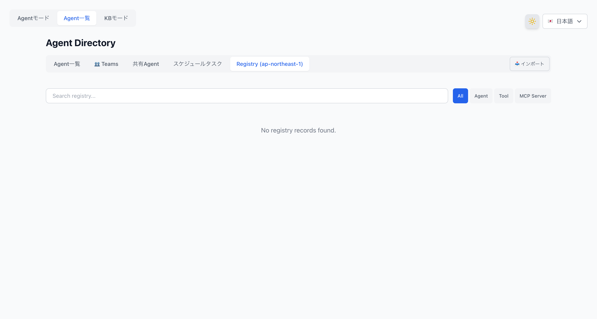
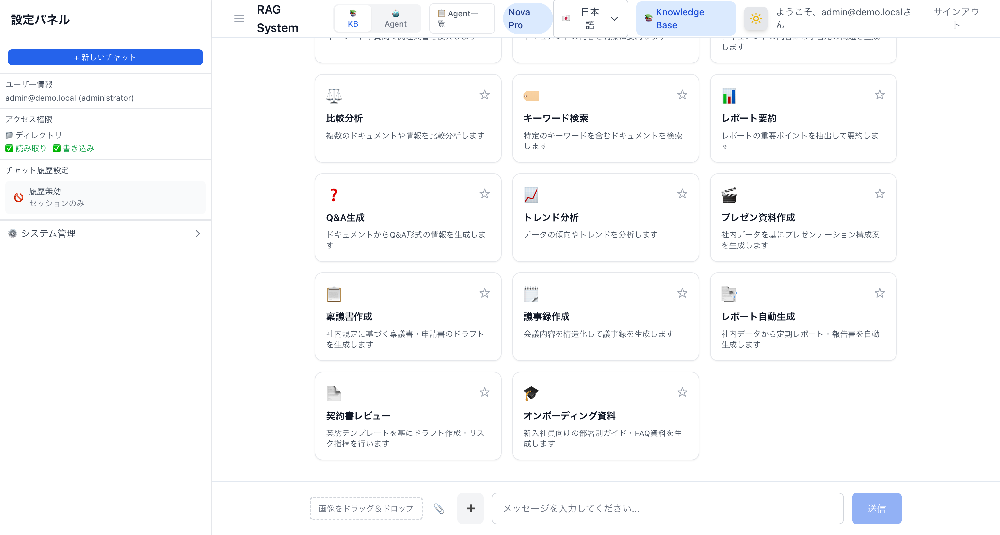

# Agentic Access-Aware RAG with Amazon FSx for NetApp ONTAP

[](LICENSE)

**🌐 Language / 言語:** [日本語](README.md) | **English** | [한국어](README.ko.md) | [简体中文](README.zh-CN.md) | [繁體中文](README.zh-TW.md) | [Français](README.fr.md) | [Deutsch](README.de.md) | [Español](README.es.md)

> A reference implementation providing Permission-aware RAG + Agentic AI over enterprise data on FSx for ONTAP, matching per-document permission metadata against the caller's SID / UID-GID at query time (Fail-Closed). Single-command AWS CDK deployment. Supports PoC through production evaluation.

---

## Get Started

| I want to... | Guide | Time |
|--------------|-------|------|
| Try it out quickly | [PoC Workshop Guide](docs/en/poc-workshop-guide.md) | 90 min |
| Deploy to my account (greenfield) | [Deployment Guide](docs/deployment-guide.md) | 30-40 min |
| Integrate with existing FSx for ONTAP | [Deployment Guide](docs/deployment-guide.md) (§3.3) | 15-20 min |
| Validate with real data | [Safe Experimentation Guide](docs/en/safe-experimentation-guide.md) | 2-4 weeks |
| Evaluate accuracy & cost | [RAG/Agent Evaluation Framework](docs/en/evaluation.md) | 1 week |
| Assess production readiness | [Production Readiness Checklist](docs/en/production-readiness-checklist.md) | — |
| Estimate costs | [Cost Estimation Worksheet](docs/en/cost-estimation-worksheet.md) | — |

## Decide before you arrive / What this repository does not cover

This repository holds the **implementation and the measurements**. The **decisions** — whether FSx for ONTAP fits, whether to expose data through an S3 Access Point, which layer holds the permissions — live in the [FSx for ONTAP Adoption Playbook](https://github.com/Yoshiki0705/FSx-for-ONTAP-Adoption-Playbook).

| Decide first | Where the basis is |
|--------------|--------------------|
| Whether FSx for ONTAP fits the problem (including when it does not) | [Decision trees](https://github.com/Yoshiki0705/FSx-for-ONTAP-Adoption-Playbook/tree/main/docs/en/reference/decision-trees) |
| Preconditions and constraints for exposing data via an S3 Access Point (same account, same Region, and the property that every request is authorized as one identity) | [data-utilization domain](https://github.com/Yoshiki0705/FSx-for-ONTAP-Adoption-Playbook/tree/main/docs/en/domains/data-utilization) |
| Which layer authorization is established at, and what the audit trail retains | [security-governance domain](https://github.com/Yoshiki0705/FSx-for-ONTAP-Adoption-Playbook/tree/main/docs/en/domains/security-governance) |
| NFS / SMB coexistence and Active Directory identity design | [multiprotocol-identity domain](https://github.com/Yoshiki0705/FSx-for-ONTAP-Adoption-Playbook/tree/main/docs/en/domains/multiprotocol-identity) |

**Not covered here**: storage selection, migration method, block storage, performance and cost design. All of those are on the Playbook side.

**Covered here**: a RAG implementation that keeps per-document permission metadata in an index and matches it against the caller's SID / UID-GID at query time (Amazon Bedrock + AWS CDK), the deployment and operations procedures, and measurements for this architecture. **Original per-file ACLs do not carry over to end-user authorization on any path through an S3 Access Point, so permissions are maintained as a separate index** ([Permission Metadata Consistency Model](docs/en/permission-consistency.md)).

<details><summary>📂 All features & design guides</summary>

| Category | Guide | Description |
|----------|-------|-------------|
| Architecture | [Implementation Overview (22 aspects)](docs/en/implementation-overview.md) | Full technical details of all components |
| Architecture | [Architecture Decision Records](docs/en/architecture-decision-records.md) | Rationale for 6 key design decisions |
| Architecture | [Stack Architecture Comparison](docs/en/stack-architecture-comparison.md) | Vector store & deployment topology comparison |
| Permissions | [SID Filtering Architecture](docs/en/SID-Filtering-Architecture.md) | How permission matching works |
| Permissions | [Permission Consistency Model](docs/en/permission-consistency.md) | Permission metadata update flow, latency, emergency revocation |
| Auth | [Auth & User Management](docs/en/auth-and-user-management.md) | OIDC / SAML / LDAP integration |
| Auth | [Auth Mode Setup Guide](demo-data/guides/auth-mode-setup-guide.md) | Sample configs + one-shot setup scripts |
| Operations | [CloudWatch Dashboard Guide](docs/en/cloudwatch-dashboard-guide.md) | Metrics, alarms, troubleshooting |
| Operations | [KB Auto-Sync Error Handling](docs/en/kb-auto-sync-error-handling.md) | Retry & manual recovery |
| Operations | [FSx for ONTAP Sizing](docs/en/fsxn-sizing-and-performance.md) | Scale-based config, QoS, vector store selection |
| Security | [Threat Model](docs/en/threat-model.md) | 10 threat categories, attack paths, mitigations |
| How to read | [Evidence Policy](docs/en/evidence-policy.md) | How far each statement can be trusted (`verified` / `documented` / `field-observation` / `hypothesis`) |
| How to read | [Language Tiers](docs/en/i18n-policy.md) | Which languages carry the full content; abridged translations disclose it in a banner |
| For AI | [llms.txt](llms.txt) | How to read this repository, its entry points, and its checks, in one file |
| Security | [Governance & Audit Design](docs/en/governance-and-audit.md) | Audit logs, Responsible AI, Guardrails |
| Data | [Chunking Strategy Guide](docs/en/chunking-strategy-guide.md) | FIXED_SIZE / HIERARCHICAL / SEMANTIC |
| Data | [S3 Vectors SID Architecture](docs/en/s3-vectors-sid-architecture-guide.md) | Metadata constraints & filtering implementation |
| Data | [S3 AP Compatibility Matrix](https://github.com/Yoshiki0705/fsxn-lakehouse-integrations/blob/main/docs/en/compatibility-matrix.md) | Platform-specific constraints (external) |
| Partners | [Partner Deployment Patterns](docs/en/partner-deployment-patterns.md) | Multi-tenancy, cost estimation |
| Benchmarks | [Benchmark Scenarios](docs/en/benchmark-scenarios.md) | 10K/100K/1M file performance measurement |
| Demo | [Industry Demo Data (7 industries)](demo-data/industry-packs/) | Government, healthcare, legal, manufacturing, construction, education, insurance |
| All docs | [Documentation Index](docs/en/DOCUMENTATION_INDEX.md) | Complete list with recommended reading order |

</details>

---

## Architecture

```
Browser → WAF → CloudFront (OAC) → Lambda Web Adapter (Next.js 15)
                                         │
              ┌──────────────────────────┼──────────────────────────┐
              ▼                          ▼                          ▼
     Cognito User Pool          Bedrock KB + S3 Vectors      DynamoDB
     (Auth: OIDC/SAML/Email)    (RAG search + Embedding)     (SID/perm data)
                                         │
                                         ▼
                                FSx for ONTAP (SVM + Volume)
                                + S3 Access Point
```

**Flow**: User auth → fetch SIDs from DynamoDB → Bedrock KB vector search → SID matching filter → generate answer from permitted documents only

Key features:
- **Permission-aware RAG** — per-document permission metadata matched against the caller's SID / UID-GID at query time (Fail-Closed)
- **Agentic AI** — Toggle between document search (KB mode) and autonomous multi-step reasoning (Agent mode)
- **Smart Routing** — Auto-selects Haiku / Sonnet / Opus based on query complexity (40-60% cost reduction, [benchmark](docs/en/benchmark-scenarios.md))
- **Low cost** — S3 Vectors (a few dollars/month) as default
- **22 integrated capabilities** — Voice chat, Guardrails, Graph RAG, Web Search, and more ([details](docs/en/implementation-overview.md))

> **Default ON**: Permission-aware RAG, Smart Routing, S3 Vectors, WAF, CloudFront
> **Optional (default OFF)**: Agent, Multi-Agent, Voice Chat, Guardrails, Transfer Family, KB Auto-Sync, Monitoring, Graph RAG, Web Search, AgentCore Gateway
> See `cdk.context.json.example` for the full feature flag reference.

<details><summary>⚠️ Prerequisites & constraints</summary>

| Item | Details |
|------|---------|
| Prerequisites | Node.js 22+, Docker, AWS CLI configured, AdministratorAccess equivalent |
| Deploy regions | ap-northeast-1 (changeable) + us-east-1 (WAF/Web Search, fixed) |
| ONTAP version | 9.17.1+ (S3 Access Points requirement) |
| S3 AP key constraints | No conditional writes, no Event Notifications, high ListObjectsV2 latency |
| Vector store | S3 Vectors (default, 2KB filterable metadata limit) / OpenSearch Serverless (high perf) |
| Responsible AI | AI output is an assistive signal. Final decisions are human responsibility. [Details](docs/en/governance-and-audit.md) |

For the comprehensive S3 AP compatibility matrix, see [fsxn-lakehouse-integrations](https://github.com/Yoshiki0705/fsxn-lakehouse-integrations/blob/main/docs/en/compatibility-matrix.md).

</details>

<details><summary>📚 Related repositories</summary>

| Repository | Purpose | Description |
|-----------|---------|-------------|
| **[This repo]** | AI / RAG | Permission-aware RAG + Agentic AI |
| [FSx-for-ONTAP-S3AccessPoints-Serverless-Patterns](https://github.com/Yoshiki0705/FSx-for-ONTAP-S3AccessPoints-Serverless-Patterns) | Serverless automation | 17 industry serverless patterns (FPolicy event-driven) |
| [fsxn-lakehouse-integrations](https://github.com/Yoshiki0705/fsxn-lakehouse-integrations) | Analytics | Athena / Glue / EMR / SageMaker integration |
| [fsxn-observability-integrations](https://github.com/Yoshiki0705/fsxn-observability-integrations) | Observability | Audit log delivery to Datadog / Splunk / Grafana without EC2 |
| [FSx-for-ONTAP-Adoption-Playbook — data-utilization](https://github.com/Yoshiki0705/FSx-for-ONTAP-Adoption-Playbook/tree/main/docs/en/domains/data-utilization) | Adoption decisions | Data-utilization domain hub: S3 AP authorization behaviour, constraints, and design options |

**Common foundation**: All repos use FSx for ONTAP S3 Access Points, extending data utilization without disrupting NFS/SMB workloads.

**AWS official resources**:
- [Build a RAG application using Amazon Bedrock Knowledge Bases with FSx for ONTAP](https://docs.aws.amazon.com/fsx/latest/ONTAPGuide/tutorial-build-rag-with-bedrock.html)
- [FSx for ONTAP S3 Access Points as an Amazon Bedrock Data Source](https://repost.aws/articles/AReKa8-o8XRGeVW2Nicbg1_w/fsxn-s3-access-points-as-an-amazon-bedrock-data-source)

</details>

<details><summary>🔧 For developers</summary>

Every check has a single entry point in the `Makefile`, running the same commands as CI.

```bash
make help    # list the available targets

make all     # the fast checks (types, Jest, Python, links, evidence labels, i18n disclosure, dependencies)
make synth   # cdk synth across the same ten lanes as CI (flags read from ci-cd.yml)

make test-frontend  # Vitest (known flaky)
make test-python    # pytest for the Python suites (149 tests; the venvs are created if missing)
make workflow-paths # every path a workflow references exists
make secrets        # gitleaks
make actions        # zizmor
```

Each detector runs its own `--selftest` before the real check: **a gate passing is not evidence that the gate ran**, so we confirm every time that it fails on input it must reject.

For project structure, coding conventions, and CI pipeline details, see [CONTRIBUTING.md](CONTRIBUTING.md).

For changelog, see [CHANGELOG.md](CHANGELOG.md).

</details>

<details><summary>🖼️ Screenshots</summary>

> Note: Screenshots show the Japanese UI. The English UI has an identical layout with localized labels.

| Screen | Description |
|--------|-------------|
|  | KB mode — card grid + sidebar |
|  | Agent mode — agent selection + card grid |
|  | Citations + access level badges |
|  | Agent management & Registry integration |
|  | Automatic model selection |
|  | Supervisor + Collaborator coordination |

</details>

---

## License

[Apache License 2.0](LICENSE)

---

🌐 [日本語](README.md) | [한국어](README.ko.md) | [简体中文](README.zh-CN.md) | [繁體中文](README.zh-TW.md) | [Français](README.fr.md) | [Deutsch](README.de.md) | [Español](README.es.md)
