# Agentic Access-Aware RAG with Amazon FSx for NetApp ONTAP

**🌐 Language / Idioma:** [日本語](README.md) | [English](README.en.md) | [한국어](README.ko.md) | [简体中文](README.zh-CN.md) | [繁體中文](README.zh-TW.md) | [Français](README.fr.md) | [Deutsch](README.de.md) | **Español**

[](LICENSE)

Los agentes de IA buscan, analizan y responden de forma autónoma a los datos empresariales almacenados en Amazon FSx for NetApp ONTAP, **respetando los permisos de acceso de cada usuario**. A diferencia de la IA generativa tradicional que "responde preguntas", este Agentic AI planifica, toma decisiones y ejecuta acciones continuamente para alcanzar objetivos, optimizando y automatizando procesos de negocio completos. Los documentos confidenciales solo se incluyen en las respuestas para usuarios autorizados.

Despliegue con un solo comando de AWS CDK. Combina Amazon Bedrock (RAG/Agent), Amazon Cognito (autenticación), Amazon FSx for NetApp ONTAP (almacenamiento) y Amazon S3 Vectors (base de datos vectorial). Interfaz de usuario orientada a tareas basada en Next.js 15, compatible con 8 idiomas.

Características principales:
- **Filtrado de permisos**: las ACL NTFS / permisos UNIX de FSx for ONTAP se aplican automáticamente a los resultados de búsqueda RAG
- **Aprovisionamiento sin intervención**: la integración AD / OIDC / LDAP obtiene automáticamente los permisos en el primer inicio de sesión
- **Agentic AI**: alterne entre búsqueda de documentos (modo KB) y razonamiento multi-paso autónomo y ejecución de tareas (modo Agent) con un clic
- **Bajo costo**: S3 Vectors (unos pocos dólares/mes) por defecto. Posibilidad de cambiar a OpenSearch Serverless
---

## Quick Start

```bash
git clone https://github.com/Yoshiki0705/FSx-for-ONTAP-Agentic-Access-Aware-RAG.git
cd FSx-for-ONTAP-Agentic-Access-Aware-RAG && npm install
npx cdk bootstrap aws://$(aws sts get-caller-identity --query Account --output text)/ap-northeast-1
npx cdk bootstrap aws://$(aws sts get-caller-identity --query Account --output text)/us-east-1
bash demo-data/scripts/pre-deploy-setup.sh
npx cdk deploy --all --require-approval never
bash demo-data/scripts/post-deploy-setup.sh
```


## Arquitectura

```
+----------+     +----------+     +------------+     +---------------------+
| Browser  |---->| AWS WAF  |---->| CloudFront |---->| Lambda Web Adapter  |
+----------+     +----------+     | (OAC+Geo)  |     | (Next.js, IAM Auth) |
                                  +------------+     +------+--------------+
                                                            |
                      +---------------------+---------------+--------------------+
                      v                     v               v                    v
             +-------------+    +------------------+ +--------------+   +--------------+
             | Cognito     |    | Bedrock KB       | | DynamoDB     |   | DynamoDB     |
             | User Pool   |    | + S3 Vectors /   | | user-access  |   | perm-cache   |
             +-------------+    |   OpenSearch SL  | | (SID Data)   |   | (Perm Cache) |
                                +--------+---------+ +--------------+   +--------------+
                                         |
                                         v
                                +------------------+
                                | FSx for ONTAP    |
                                | (SVM + Volume)   |
                                | + S3 Access Point|
                                +--------+---------+
                                         | CIFS/SMB (optional)
                                         v
                                +------------------+
                                | Embedding EC2    |
                                | (Titan Embed v2) |
                                | (optional)       |
                                +------------------+
```

## Descripción general de la implementación (15 perspectivas)

La implementación de este sistema está organizada en 15 perspectivas. Para detalles de cada elemento, consulte [docs/implementation-overview.md](docs/implementation-overview.md).

| # | Perspectiva | Descripción general | Stack CDK relacionado |
|---|-------------|---------------------|----------------------|
| 1 | Aplicación Chatbot | Next.js 15 (App Router) ejecutándose de forma serverless con Lambda Web Adapter. Soporte de cambio de modo KB/Agent. Interfaz de usuario orientada a tareas basada en tarjetas | WebAppStack |
| 2 | AWS WAF | Configuración de 6 reglas: limitación de velocidad, reputación IP, reglas compatibles con OWASP, protección SQLi, lista blanca de IP | WafStack |
| 3 | Autenticación IAM | Seguridad multicapa con Lambda Function URL + CloudFront OAC | WebAppStack |
| 4 | Base de datos vectorial | S3 Vectors (predeterminado, bajo costo) / OpenSearch Serverless (alto rendimiento). Seleccionado mediante `vectorStoreType` | AIStack |
| 5 | Servidor de embedding | Vectoriza documentos en EC2 con el volumen FSx ONTAP montado vía CIFS/SMB y escribe en AOSS (solo configuración AOSS) | EmbeddingStack |
| 6 | Titan Text Embeddings | Utiliza `amazon.titan-embed-text-v2:0` (1024 dimensiones) tanto para la ingesta de KB como para el servidor de embedding | AIStack |
| 7 | Metadatos SID + Filtrado de permisos | Gestiona la información SID de ACL NTFS mediante `.metadata.json` y filtra por coincidencia de SID de usuario durante la búsqueda | StorageStack |
| 8 | Cambio de modo KB/Agent | Alternar entre modo KB (búsqueda de documentos) y modo Agent (razonamiento multi-paso). Directorio de Agents (`/genai/agents`) para gestión de Agents estilo catálogo, creación de plantillas, edición y eliminación. Creación dinámica de Agents y vinculación de tarjetas. Flujos de trabajo orientados a resultados (presentaciones, documentos de aprobación, actas de reuniones, informes, contratos, incorporación). Soporte i18n de 8 idiomas. Gestión de permisos en ambos modos | WebAppStack |
| 9 | RAG con análisis de imágenes | Se agregó carga de imágenes (arrastrar y soltar / selector de archivos) a la entrada del chat. Analiza imágenes con la API Bedrock Vision (Claude Haiku 4.5) e integra los resultados en el contexto de búsqueda KB. Soporta JPEG/PNG/GIF/WebP, límite de 3MB | WebAppStack |
| 10 | Interfaz de conexión KB | Interfaz para seleccionar, conectar y desconectar Bedrock Knowledge Bases durante la creación/edición de Agents. Muestra la lista de KB conectadas en el panel de detalle del Agent | WebAppStack |
| 11 | Enrutamiento inteligente | Selección automática de modelo basada en la complejidad de la consulta. Las consultas factuales cortas se enrutan al modelo ligero (Haiku), las consultas analíticas largas al modelo de alto rendimiento (Sonnet). Interruptor ON/OFF en la barra lateral | WebAppStack |
| 12 | Monitoreo y alertas | Panel de CloudWatch (Lambda/CloudFront/DynamoDB/Bedrock/WAF/integración RAG avanzada), alertas SNS (notificaciones de umbral de tasa de error y latencia), notificaciones de fallo de EventBridge KB Ingestion Job, métricas personalizadas EMF. Activar con `enableMonitoring=true` | WebAppStack (MonitoringConstruct) |
| 13 | AgentCore Memory | Mantenimiento del contexto de conversación mediante AgentCore Memory (memoria a corto y largo plazo). Historial de conversación en sesión (corto plazo) + preferencias de usuario y resúmenes entre sesiones (largo plazo). Activar con `enableAgentCoreMemory=true` | AIStack |
| 14 | OIDC/LDAP Federation + ONTAP Name-Mapping | Integración OIDC IdP (Auth0/Keycloak/Okta), consulta LDAP directa (OpenLDAP/FreeIPA) para obtención automática de UID/GID, ONTAP REST API name-mapping (mapeo UNIX→Windows). Habilitación automática por configuración. Habilitar con `oidcProviderConfig` + `ldapConfig` + `ontapNameMappingEnabled`. **Extensiones Phase 2**: Multi-OIDC IdP (array `oidcProviders`), control de acceso a documentos basado en grupos OIDC (`allowed_oidc_groups`), verificación de certificado TLS LDAP (`tlsCaCertArn`), actualización de token/gestión de sesión, modo Fail-Closed (`authFailureMode`), verificación de salud LDAP (EventBridge + CloudWatch Alarm), registro de auditoría de autenticación (`auditLogEnabled`) | SecurityStack |
| 15 | Integración Agent Registry | Agrega una pestaña AWS Agent Registry (AgentCore) al Agent Directory. Búsqueda semántica, importación y publicación de Agents, herramientas y servidores MCP en la organización. Soporte de flujo de trabajo de aprobación. Acceso entre regiones (`agentRegistryRegion`). Habilitar con `enableAgentRegistry=true` | AIStack, WebAppStack |
| 16 | Búsqueda RAG Multimodal | Búsqueda cross-modal de texto, imágenes, video y audio con Amazon Nova Multimodal Embeddings. Extensible mediante Embedding Model Registry + KB Config Strategy. Arquitectura Dual KB (solo texto + multimodal en paralelo). Activación opt-in con `embeddingModel: "nova-multimodal"` | AIStack |
| 17 | Guardrails Organizational Safeguards | Extensión de Bedrock Guardrails. Configuración detallada de intensidad de filtros de contenido, políticas de temas y detección PII mediante el parámetro CDK `guardrailsConfig`. Detección y visualización de Organizational Safeguards de AWS Organizations. GuardrailsStatusBadge (✅ safe / ⚠️ filtered) en respuestas de chat. Registros de intervención (JSON estructurado), métricas EMF, integración con panel CloudWatch. GuardrailsAdminPanel de solo lectura para administradores. Manejo de errores Fail-Open. Habilitar con `enableGuardrails=true` + `guardrailsConfig` | AIStack, WebAppStack |
| 18 | Chat de voz (Nova Sonic) | Interacción por voz mediante Amazon Nova Sonic. Entrada de micrófono del navegador → Nova Sonic (speech-to-speech) → salida simultánea de texto + audio. Integrado con el pipeline RAG existente (incluido Permission Filter). Soporta modos KB y Agent. Animación de forma de onda, timeout de silencio 30s, reconexión automática (máx. 3 intentos), respaldo a texto. Soporte i18n de 8 idiomas. Habilitar con `enableVoiceChat=true`. Costo estimado: $70–$100/mes | AIStack, WebAppStack |
| 19 | AgentCore Policy | Control de comportamiento de agentes mediante AgentCore Policy. Definición de políticas en lenguaje natural para restringir el acceso a herramientas, API y servidores MCP. 3 plantillas de política (seguridad, costos, flexibilidad). PolicyEvaluationMiddleware (timeout 3s, fail-open/fail-closed). Registros de violación (formato EMF) e integración con CloudWatch. Soporte i18n de 8 idiomas. Habilitar con `enableAgentPolicy=true` | WebAppStack |

#### Notas técnicas v4.0.0

| Función | Estado API | Implementación | Notas |
|---------|-----------|----------------|-------|
| Agent Registry | Preview (abril 2026) | HTTP firmado SigV4 + mapeo de rutas REST | Los comandos SDK (`search_registry_records` etc.) están disponibles en boto3/CLI. Node.js usa SigV4 HTTP. Requiere crear primero un registro mediante `create_registry`. Especificar ARN mediante `agentRegistryArn` |
| RAG multimodal | GA (nov. 2025) | AWS SDK v3 (BedrockAgentRuntimeClient) | Completamente implementado. Nova Multimodal Embeddings disponible solo en us-east-1, us-west-2 |
| Guardrails Org Safeguards | GA (abril 2026) | AWS SDK v3 (BedrockClient) | Completamente implementado. Organizational Safeguards se configuran en la cuenta de administración de AWS Organizations |
| AgentCore Episodic Memory | GA (dic. 2025) | AWS SDK v3 (BedrockAgentCoreClient) | `episodicMemoryStrategy` requiere el parámetro `reflectionConfiguration.namespaces`. Sin él, CreateMemory devuelve el error "Invalid memory strategy input" |
| Chat de voz Nova Sonic | GA (dic. 2025) | REST + Bedrock Converse API | Implementación Phase 1 (basada en REST). El streaming bidireccional en tiempo real requiere API Gateway WebSocket (Phase 2) |
| AgentCore Policy | GA (marzo 2026) | HTTP firmado SigV4 (modelo Policy Engine + Gateway) | La versión GA cambió a arquitectura Policy Engine + Gateway. Las políticas se escriben en lenguaje Cedar. Las acciones IAM actualizadas a `bedrock-agentcore:CreatePolicyEngine` etc. |

**Arquitectura Phase 1 / Phase 2 del chat de voz:**

| Elemento | Phase 1 (actual) | Phase 2 (futuro) |
|----------|-----------------|------------------|
| Comunicación | REST (POST /api/voice/stream) | WebSocket (API Gateway) |
| Procesamiento de audio | Bedrock Converse API para conversión voz→texto, luego entrada al pipeline RAG | Nova Sonic InvokeModelWithBidirectionalStream para streaming bidireccional |
| Latencia | Media (almacenamiento en búfer + procesamiento por lotes) | Baja (streaming en tiempo real) |
| Filtrado de permisos | ✅ Filtrado SID/UID/GID existente aplicado | ✅ Misma lógica aplicada |

**Indicadores de funcionalidades v4.0.0:**

La visualización en la interfaz de las nuevas funcionalidades de v4.0.0 (panel de administración de Guardrails, pestaña Agent Registry, sección AgentCore Policy, etc.) está controlada por una API de indicadores de funcionalidades (`/api/config/features`) que obtiene los indicadores de las variables de entorno de Lambda en tiempo de ejecución. Cuando habilita una funcionalidad a través de los parámetros de CDK, la variable de entorno de Lambda correspondiente se establece y se refleja automáticamente en el frontend.

**Colaboración multi-agente:**

Cuando `enableAgent=true`, `enableMultiAgent` está habilitado por defecto (solo se deshabilita cuando se establece explícitamente en `false`). Los Bedrock Agents no tienen costo en espera, por lo que habilitar el modo multi-agente no genera costos de ejecución adicionales. El consumo de tokens aumenta de 3 a 6 veces solo cuando se chatea efectivamente en modo Multi Agent.

**Dependencias npm (añadidas en v4.0.0):**

Los siguientes paquetes son necesarios en `docker/nextjs/package.json` (utilizados para la firma SigV4):
```bash
cd docker/nextjs
npm install @aws-crypto/sha256-js @smithy/signature-v4 @smithy/protocol-http @aws-sdk/credential-provider-node
```

## Capturas de pantalla de la interfaz

### Modo KB — Cuadrícula de tarjetas (Estado inicial)

El encabezado presenta un alternador unificado de 3 modos (KB / Single Agent / Multi Agent). La barra lateral muestra información del usuario, permisos de acceso (nombres de directorio, permisos de lectura/escritura), configuración del historial de chat y administración del sistema (región, selección de modelo, Smart Routing, control de permisos). El área de chat muestra 14 tarjetas de propósito específico en un diseño de cuadrícula.

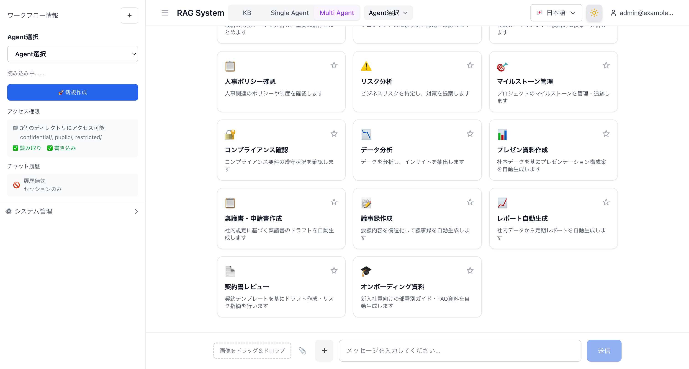

### Modo Agent — Cuadrícula de tarjetas + Barra lateral

El modo Agent muestra 14 tarjetas de flujo de trabajo (8 de investigación + 6 de producción). Al hacer clic en una tarjeta se busca automáticamente un Bedrock Agent, y si no se ha creado, navega al formulario de creación del directorio de Agents. La barra lateral incluye un menú desplegable de selección de Agent, configuración del historial de chat y una sección de administración del sistema plegable.


### Directorio de Agents — Lista de Agents y pantalla de gestión

Una pantalla de gestión dedicada a Agents accesible en `/[locale]/genai/agents`. Proporciona visualización de catálogo de Bedrock Agents creados, filtros de búsqueda y categoría, panel de detalle, creación basada en plantillas y edición/eliminación en línea. La barra de navegación permite cambiar entre modo Agent / lista de Agents / modo KB. Cuando las funciones empresariales están habilitadas, se agregan las pestañas "Agents compartidos" y "Tareas programadas".

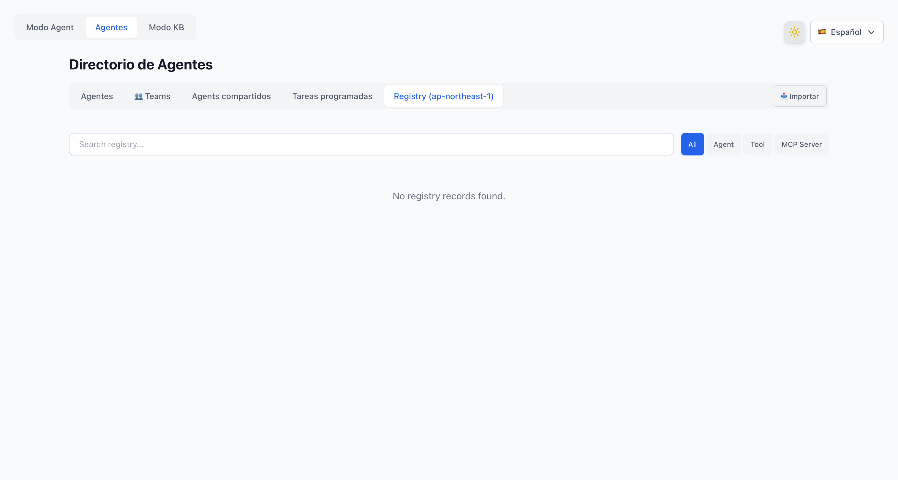

#### Directorio de Agents — Pestaña de Agents compartidos

Habilitado con `enableAgentSharing=true`. Lista, previsualiza e importa configuraciones de Agent desde el bucket S3 compartido.

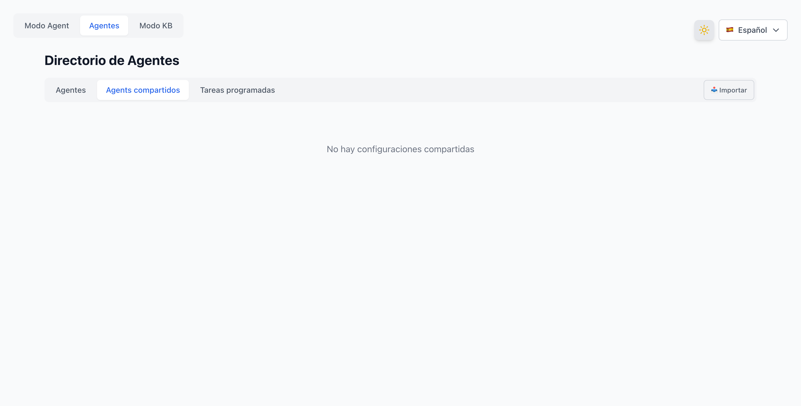

### Directorio de Agents — Formulario de creación de Agent

Al hacer clic en "Crear desde plantilla" en una tarjeta de plantilla se muestra un formulario de creación donde puede editar el nombre del Agent, la descripción, el prompt del sistema y el modelo de IA. El mismo formulario aparece al hacer clic en una tarjeta en modo Agent si el Agent aún no se ha creado.

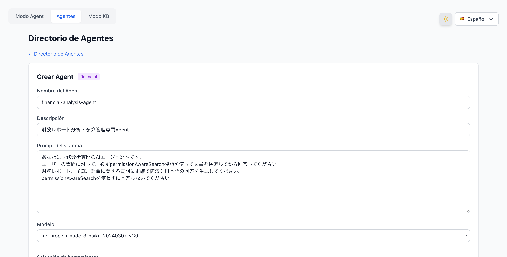

### Directorio de Agents — Detalle y edición del Agent

Al hacer clic en una tarjeta de Agent se muestra un panel de detalle que muestra el ID del Agent, estado, modelo, versión, fecha de creación, prompt del sistema (plegable) y grupos de acciones. Las acciones disponibles incluyen "Editar" para edición en línea, "Usar en chat" para navegar al modo Agent, "Exportar" para descarga de configuración JSON, "Subir al bucket compartido" para compartir en S3, "Crear programación" para configuración de ejecución periódica, y "Eliminar" con un diálogo de confirmación.

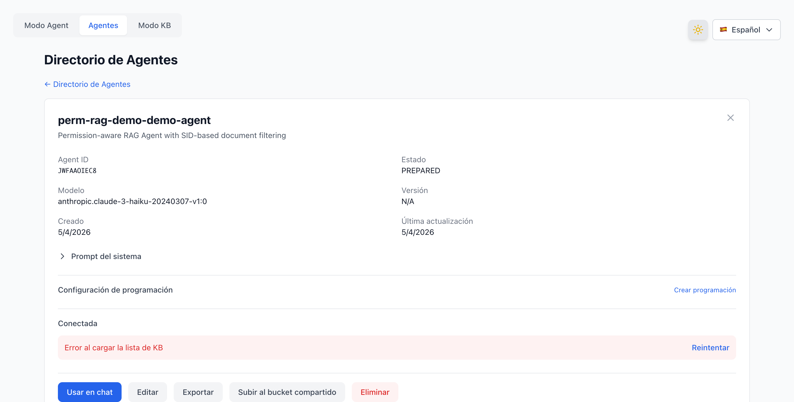

### Respuesta del chat — Visualización de citas + Insignia de nivel de acceso

Los resultados de búsqueda RAG muestran las rutas de archivos FSx e insignias de nivel de acceso (accesible para todos / solo administradores / grupos específicos). Durante el chat, un botón "🔄 Volver a la selección de flujo de trabajo" regresa a la cuadrícula de tarjetas. Un botón "➕" en el lado izquierdo del campo de entrada de mensajes inicia un nuevo chat.

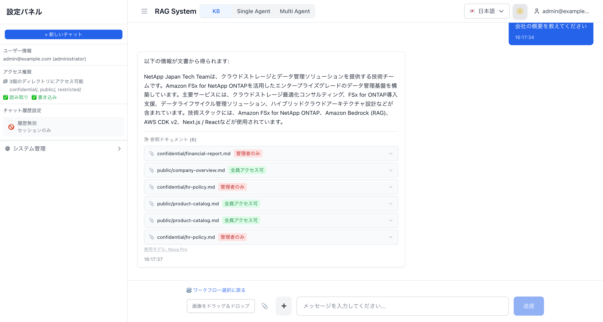

### Carga de imágenes — Arrastrar y soltar + Selector de archivos (v3.1.0)

Se agregó funcionalidad de carga de imágenes al área de entrada del chat. Adjunte imágenes a través de la zona de arrastrar y soltar y el botón 📎 selector de archivos, analice con la API Bedrock Vision (Claude Haiku 4.5) e integre en el contexto de búsqueda KB. Soporta JPEG/PNG/GIF/WebP, límite de 3MB.

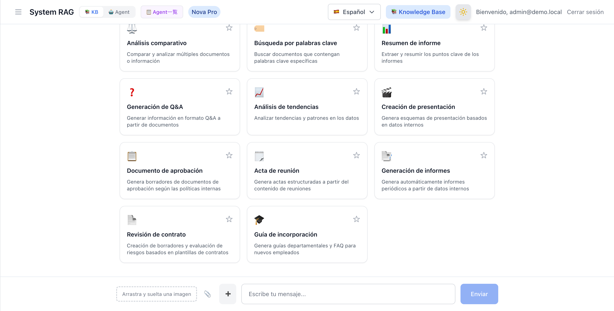

### Enrutamiento inteligente — Selección automática de modelo optimizada en costos (v3.1.0)

Cuando el interruptor de enrutamiento inteligente en la barra lateral está activado, selecciona automáticamente un modelo ligero (Haiku) o un modelo de alto rendimiento (Sonnet) según la complejidad de la consulta. Se agrega una opción "⚡ Auto" al ModelSelector, y las respuestas muestran el nombre del modelo utilizado junto con una insignia "Auto".

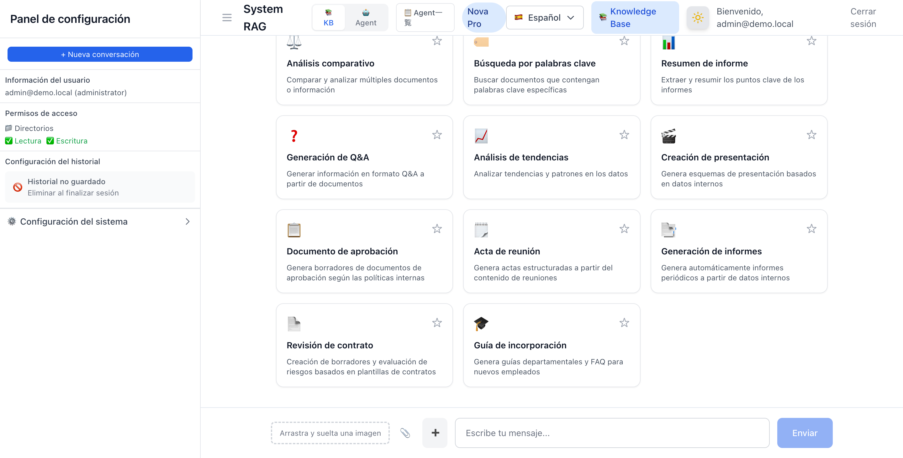

### AgentCore Memory — Lista de sesiones + Sección de memoria (v3.3.0)

Habilitado con `enableAgentCoreMemory=true`. Agrega una lista de sesiones (SessionList) y una visualización de memoria a largo plazo (MemorySection) a la barra lateral del modo Agent. La configuración del historial de chat se reemplaza con una insignia "AgentCore Memory: Enabled".

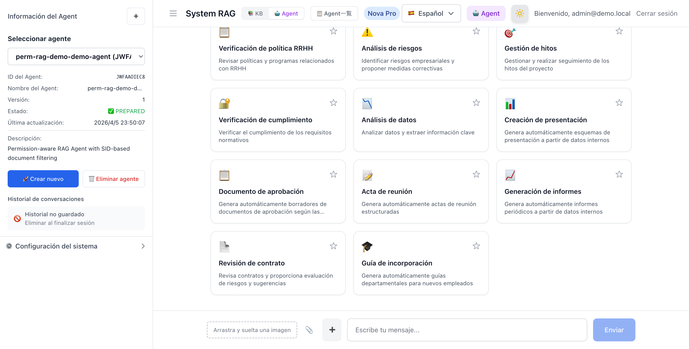

## Estructura de stacks CDK

| # | Stack | Región | Recursos | Descripción |
|---|-------|--------|----------|-------------|
| 1 | WafStack | us-east-1 | WAF WebACL, IP Set | WAF para CloudFront (limitación de velocidad, reglas administradas) |
| 2 | NetworkingStack | ap-northeast-1 | VPC, Subnets, Security Groups, VPC Endpoints (opcional) | Infraestructura de red |
| 3 | SecurityStack | ap-northeast-1 | Cognito User Pool, Client, SAML IdP + OIDC IdP + Cognito Domain (cuando Federation está habilitado), Identity Sync Lambda (opcional), LDAP Health Check Lambda + CloudWatch Alarm (opcional), Auth Audit Log DynamoDB (opcional) | Autenticación y autorización (SAML/OIDC/Email) |
| 4 | StorageStack | ap-northeast-1 | FSx ONTAP + SVM + Volume, S3, DynamoDB×2, (AD), cifrado KMS (opcional), CloudTrail (opcional) | Almacenamiento, datos SID, caché de permisos |
| 5 | AIStack | ap-northeast-1 | Bedrock KB, S3 Vectors / OpenSearch Serverless (seleccionado mediante `vectorStoreType`), Bedrock Guardrails (opcional) | Infraestructura de búsqueda RAG (Titan Embed v2) |
| 6 | WebAppStack | ap-northeast-1 | Lambda (Docker, IAM Auth + OAC), CloudFront, Permission Filter Lambda (opcional), MonitoringConstruct (opcional) | Aplicación web, gestión de Agents, monitoreo y alertas |
| 7 | EmbeddingStack (opcional) | ap-northeast-1 | EC2 (m5.large), ECR, recuperación automática de ACL ONTAP (opcional) | Montaje FlexCache CIFS + servidor de embedding |

### Características de seguridad (Defensa de 6 capas)

| Capa | Tecnología | Propósito |
|------|-----------|-----------|
| L1: Red | CloudFront Geo Restriction | Restricción de acceso geográfico (predeterminado: `["JP"]`. Ver [Restricción Geo](#restricción-geo)) |
| L2: WAF | AWS WAF (6 reglas) | Detección y bloqueo de patrones de ataque |
| L3: Autenticación de origen | CloudFront OAC (SigV4) | Prevenir acceso directo eludiendo CloudFront |
| L4: Autenticación API | Lambda Function URL IAM Auth | Control de acceso mediante autenticación IAM |
| L5: Autenticación de usuario | Cognito JWT / SAML / OIDC Federation | Autenticación y autorización a nivel de usuario |
| L6: Autorización de datos | SID / UID+GID / Filtrado por grupos OIDC | Control de acceso a nivel de documento. El modo Fail-Closed (`authFailureMode=fail-closed`) puede bloquear el inicio de sesión cuando falla la obtención de permisos |

## Requisitos previos

- Cuenta AWS (con permisos equivalentes a AdministratorAccess)
- Node.js 22+, npm
- Docker (Colima, Docker Desktop o docker.io en EC2)
- CDK inicializado (`cdk bootstrap aws://ACCOUNT_ID/REGION`)

> **Nota**: Las compilaciones se pueden ejecutar localmente (macOS / Linux) o en EC2. Para Apple Silicon (M1/M2/M3), `pre-deploy-setup.sh` utiliza automáticamente el modo de pre-compilación (compilación local de Next.js + empaquetado Docker) para generar imágenes compatibles con Lambda x86_64. En EC2 (x86_64), se realiza una compilación Docker completa.

> **Solo para verificación/desarrollo de UI**: Puede verificar la UI de la aplicación Next.js sin entorno AWS. Solo se requiere Node.js 22+, y el middleware de autenticación funciona de forma idéntica a producción. → [Guía de desarrollo local](docker/nextjs/LOCAL_DEVELOPMENT.es.md)

## Pasos de despliegue

### ⚠️ Aviso importante sobre el impacto en entornos AWS existentes

Este proyecto CDK crea y modifica los siguientes recursos de AWS. **Si despliega en un entorno de producción existente o un entorno compartido de equipo, verifique el impacto de antemano.**

#### La autenticación de este sistema y la autenticación de la consola de administración de AWS son completamente independientes

Los métodos de autenticación del sistema RAG (OIDC / LDAP / email-contraseña) y el acceso a la consola de administración de AWS (IAM Identity Center / usuarios IAM) son **sistemas completamente independientes**. Cambiar el método de autenticación del sistema RAG no tiene impacto en el acceso a la consola de administración.

```
┌──────────────────────────────┐    ┌──────────────────────────────┐
│  AWS Management Console      │    │  RAG System (Chat UI)        │
│                              │    │                              │
│  Auth: IAM Identity Center   │    │  Auth: Cognito User Pool     │
│        or IAM Users          │    │    ├ OIDC (Auth0/Okta/etc.)  │
│                              │    │    ├ SAML (AD Federation)    │
│  ← Not modified by this CDK  │    │    └ Email/Password          │
│                              │    │                              │
│  Completely independent ─────┼────┤  ← Configured by this CDK   │
└──────────────────────────────┘    └──────────────────────────────┘
```

#### Parámetros que afectan entornos existentes

| Parámetro | Impacto | Nivel de riesgo | Verificación previa |
|-----------|---------|----------------|-------------------|
| `adPassword` | Crea un nuevo AWS Managed Microsoft AD (para FSx ONTAP). El AD en sí no afecta a Identity Center — ver nota abajo | 🟡 Medio | Ver "Nota sobre Managed AD" abajo |
| `enableAdFederation` | Crea un IdP SAML de Cognito. Agrega un botón "Iniciar sesión con AD" a la pantalla de inicio de sesión RAG | 🟢 Bajo | Verificar que no exista un Cognito User Pool existente |
| `enableVpcEndpoints` | Crea endpoints VPC. Puede afectar el enrutamiento VPC existente | 🟡 Medio | Verificar los límites de endpoints VPC |
| `enableKmsEncryption` | Crea una CMK de KMS. Cambia la configuración de cifrado de S3/DynamoDB | 🟢 Bajo | Verificar el número de claves KMS existentes |

#### Nota sobre Managed AD

Configurar `adPassword` crea un AWS Managed Microsoft AD, pero **crear el AD por sí solo no afecta a Identity Center**.

El problema ocurre solo si realiza la siguiente **operación manual**:

1. CDK crea Managed AD (`adPassword` configurado)
2. **Usted cambia manualmente** la fuente de identidad de Identity Center de "Directorio de Identity Center" a "Active Directory"
3. Identity Center comienza a usar los usuarios de Managed AD como fuente de identidad
4. `cdk destroy` elimina el Managed AD
5. → La fuente de identidad de Identity Center se pierde, el acceso a la consola queda bloqueado

**Mitigación:**
- Mantenga la fuente de identidad de Identity Center como "Directorio de Identity Center" (predeterminado) — no la cambie
- Mantenga el acceso a la consola mediante usuario IAM como respaldo
- Verifique la configuración de fuente de identidad de Identity Center antes de ejecutar `cdk destroy`

**Comandos de verificación:**
```bash
# Verificar instancias y usuarios de IAM Identity Center
aws sso-admin list-instances --region ap-northeast-1
aws identitystore list-users --identity-store-id <IDENTITY_STORE_ID> --region ap-northeast-1

# Verificar Managed AD existente
aws ds describe-directories --region ap-northeast-1

# Verificar Cognito User Pools existentes
aws cognito-idp list-user-pools --max-results 10 --region ap-northeast-1
```

> **Recomendado**: Para entornos de producción o compartidos de equipo, recomendamos encarecidamente desplegar en una cuenta AWS dedicada o un entorno sandbox.

#### Notas de actualización de optimización UI/UX v3.5.0

v3.5.0 incluye cambios importantes en la UI del encabezado, la estructura de la barra lateral y la lógica de cambio de modo. Al actualizar desde un entorno existente, verifique lo siguiente:

| Cambio | Impacto | Verificación |
|--------|---------|-------------|
| Selector unificado de 3 modos (KB / Agente único / Multi-Agente) | El selector de 2 pasos anterior (KB/Agente + Único/Multi) se fusionó en uno. Los parámetros de consulta URL (`?mode=agent`, `?mode=multi-agent`) siguen siendo compatibles | Verifique que el cambio de modo funcione sin errores en el navegador |
| ModelIndicator eliminado del encabezado | La selección de modelo se consolidó en la Configuración del sistema de la barra lateral. No se puede cambiar el modelo desde el encabezado | Verifique que el cambio de modelo funcione desde la Configuración del sistema de la barra lateral |
| Desplegable de selección de Agente promovido al encabezado | El enlace del Directorio de Agentes se movió del menú de usuario al desplegable de selección de Agente | Verifique que el Directorio de Agentes sea accesible desde el desplegable "Selección de Agente" en modo Agente |
| Sección de permisos de acceso añadida a la barra lateral de Agente | La barra lateral del modo Agente ahora muestra nombres de directorio y permisos de lectura/escritura | Verifique que los permisos de acceso aparezcan en la barra lateral del modo Agente |
| CDK AI Stack: SupervisorAgent `agentCollaboration` | Cambiado de `DISABLED` a `SUPERVISOR_ROUTER`. Requerido cuando ya hay colaboradores asociados | Ejecute `cdk diff perm-rag-demo-demo-AI` para verificar |

**Pasos de actualización:**
```bash
# 1. Verificar diferencias
cdk diff perm-rag-demo-demo-WebApp
cdk diff perm-rag-demo-demo-AI

# 2. Desplegar WebApp (actualización de imagen Docker)
./development/scripts/deploy-webapp.sh

# 3. Verificación en navegador
# - El cambio KB → Agente único → Multi-Agente funciona sin errores
# - El desplegable de selección de Agente muestra la lista de agentes
# - La barra lateral muestra los permisos de acceso
```

### Paso 1: Configuración del entorno

Se puede ejecutar localmente (macOS / Linux) o en EC2.

#### Local (macOS)

```bash
# Node.js 22+ (Homebrew)
brew install node@22

# Docker (cualquiera de los dos)
brew install --cask docker          # Docker Desktop (requiere sudo)
brew install docker colima          # Colima (no requiere sudo, recomendado)
colima start --cpu 4 --memory 8     # Iniciar Colima

# AWS CDK
npm install -g aws-cdk typescript ts-node
```

#### EC2 (Ubuntu 22.04)

```bash
# Lanzar un t3.large en una subred pública (con rol IAM habilitado para SSM)
aws ec2 run-instances \
  --region ap-northeast-1 \
  --image-id <UBUNTU_22_04_AMI_ID> \
  --instance-type t3.large \
  --subnet-id <PUBLIC_SUBNET_ID> \
  --security-group-ids <SG_ID> \
  --iam-instance-profile Name=<ADMIN_INSTANCE_PROFILE> \
  --associate-public-ip-address \
  --block-device-mappings '[{"DeviceName":"/dev/sda1","Ebs":{"VolumeSize":50,"VolumeType":"gp3"}}]' \
  --tag-specifications 'ResourceType=instance,Tags=[{Key=Name,Value=cdk-deploy-server}]'
```

El grupo de seguridad solo necesita el puerto de salida 443 (HTTPS) abierto para que SSM Session Manager funcione. No se requieren reglas de entrada.

### Paso 2: Instalación de herramientas (para EC2)

Después de conectarse a través de SSM Session Manager, ejecute lo siguiente.

```bash
# Actualización del sistema + herramientas básicas
sudo apt-get update -y
sudo apt-get install -y curl git unzip docker.io

# Node.js 22
curl -fsSL https://deb.nodesource.com/setup_22.x | sudo -E bash -
sudo apt-get install -y nodejs

# Habilitar Docker
sudo systemctl enable docker
sudo systemctl start docker
sudo usermod -aG docker ubuntu

# AWS CDK (global)
sudo npm install -g aws-cdk typescript ts-node
```

#### ⚠️ Notas sobre la versión del CLI de CDK

La versión del CLI de CDK instalada mediante `npm install -g aws-cdk` puede no ser compatible con el `aws-cdk-lib` del proyecto.

```bash
# Cómo verificar
cdk --version          # Versión CLI global
npx cdk --version      # Versión CLI local del proyecto
```

Este proyecto utiliza `aws-cdk-lib@2.244.0`. Si la versión del CLI está desactualizada, verá el siguiente error:

```
Cloud assembly schema version mismatch: Maximum schema version supported is 48.x.x, but found 52.0.0
```

**Solución**: Actualice el CLI de CDK local del proyecto a la última versión.

```bash
cd Permission-aware-RAG-FSxN-CDK
npm install aws-cdk@latest
npx cdk --version  # Verificar la versión actualizada
```

> **Importante**: Use `npx cdk` en lugar de `cdk` para asegurarse de que se utilice el CLI local más reciente del proyecto.

### Paso 3: Clonar el repositorio e instalar dependencias

```bash
cd /home/ubuntu
git clone https://github.com/Yoshiki0705/FSx-for-ONTAP-Agentic-Access-Aware-RAG.git
cd FSx-for-ONTAP-Agentic-Access-Aware-RAG
npm install
```

### Paso 4: CDK Bootstrap (solo la primera vez)

Ejecute esto si CDK Bootstrap no se ha ejecutado en las regiones objetivo. Como el stack WAF se despliega en us-east-1, se requiere Bootstrap en ambas regiones.

```bash
# ap-northeast-1 (región principal)
npx cdk bootstrap aws://$(aws sts get-caller-identity --query Account --output text)/ap-northeast-1

# us-east-1 (para el stack WAF)
npx cdk bootstrap aws://$(aws sts get-caller-identity --query Account --output text)/us-east-1
```

> **Al desplegar en una cuenta AWS diferente**: Elimine la caché de AZ (`availability-zones:account=...`) de `cdk.context.json`. CDK recuperará automáticamente la información de AZ para la nueva cuenta.

> **Cómo inician sesión los usuarios LDAP**: Elija el botón "Iniciar sesión con {providerName}" en la página de inicio de sesión (ej: "Iniciar sesión con Keycloak"). LDAP se encarga de la obtención de permisos, no de la autenticación.

### Paso 5: Configuración del contexto CDK

```bash
cat > cdk.context.json << 'EOF'
{
  "projectName": "rag-demo",
  "environment": "demo",
  "imageTag": "latest",
  "allowedIps": [],
  "allowedCountries": ["JP"]
}
EOF
```

#### Integración con Active Directory (opcional)

Para unir el SVM de FSx ONTAP a un dominio de Active Directory y usar ACL NTFS (basado en SID) con recursos compartidos CIFS, agregue lo siguiente a `cdk.context.json`.

```bash
cat > cdk.context.json << 'EOF'
{
  "projectName": "rag-demo",
  "environment": "demo",
  "imageTag": "latest",
  "allowedIps": [],
  "allowedCountries": ["JP"],
  "adPassword": "YourStrongP@ssw0rd123",
  "adDomainName": "demo.local"
}
EOF
```

| Parámetro | Tipo | Predeterminado | Descripción |
|-----------|------|----------------|-------------|
| `adPassword` | string | No establecido (no se crea AD) | Contraseña de administrador de AWS Managed Microsoft AD. Cuando se establece, crea AD y une el SVM al dominio |
| `adDomainName` | string | `demo.local` | Nombre de dominio AD (FQDN) |

> **⚠️ Importante**: Establecer `adPassword` crea un AWS Managed Microsoft AD. Crear el AD por sí solo no afecta a Identity Center. Sin embargo, si cambia manualmente la fuente de identidad de Identity Center a Managed AD, eliminar el AD mediante `cdk destroy` causará la pérdida de los usuarios de Identity Center. Mantenga la fuente de identidad de Identity Center como "Directorio de Identity Center" (predeterminado).

> **Nota**: La creación de AD toma 20-30 minutos adicionales. Las demostraciones de filtrado SID son posibles sin AD (verificado usando datos SID de DynamoDB).

#### Federación SAML de AD (opcional)

Puede habilitar la federación SAML para que los usuarios de AD inicien sesión directamente desde la interfaz de CloudFront, con creación automática de usuario Cognito + registro automático de datos SID en DynamoDB.

**Descripción general de la arquitectura:**

```
AD User → CloudFront UI → "Sign in with AD" button
  → Cognito Hosted UI → SAML IdP (AD) → AD Authentication
  → Automatic Cognito User Creation
  → Post-Auth Trigger → AD Sync Lambda → DynamoDB SID Data Registration
  → OAuth Callback → Session Cookie → Chat Screen
```

**Parámetros CDK:**

| Parámetro | Tipo | Predeterminado | Descripción |
|-----------|------|----------------|-------------|
| `enableAdFederation` | boolean | `false` | Indicador de habilitación de federación SAML |
| `cloudFrontUrl` | string | No establecido | URL de CloudFront para la URL de callback OAuth (ej. `https://d3xxxxx.cloudfront.net`) |
| `samlMetadataUrl` | string | No establecido | Para AD autogestionado: URL de metadatos de federación de Entra ID |
| `adEc2InstanceId` | string | No establecido | Para AD autogestionado: ID de instancia EC2 |

> **Configuración automática de variables de entorno**: Al desplegar CDK con `enableAdFederation=true` o `oidcProviderConfig`, las variables de entorno de Federation (`COGNITO_DOMAIN`, `COGNITO_CLIENT_SECRET`, `CALLBACK_URL`, `IDP_NAME`) se configuran automáticamente en la función Lambda de WebAppStack. No se requiere configuración manual de variables de entorno Lambda.

**Patrón de AD administrado:**

Al usar AWS Managed Microsoft AD.

> **⚠️ Se requiere la configuración de IAM Identity Center (anteriormente AWS SSO):**
> Para usar la URL de metadatos SAML del AD administrado (`portal.sso.{region}.amazonaws.com/saml/metadata/{directoryId}`), necesita habilitar AWS IAM Identity Center, configurar el AD administrado como fuente de identidad y crear una aplicación SAML. Simplemente crear un AD administrado no proporciona un punto de conexión de metadatos SAML.
>
> Si configurar IAM Identity Center es difícil, también puede especificar directamente una URL de metadatos de IdP externo (AD FS, etc.) a través del parámetro `samlMetadataUrl`.

```json
{
  "enableAdFederation": true,
  "adPassword": "YourStrongP@ssw0rd123",
  "adDomainName": "demo.local",
  "cloudFrontUrl": "https://d3xxxxx.cloudfront.net",
  // Opcional: Al usar una URL de metadatos SAML diferente a IAM Identity Center
  // "samlMetadataUrl": "https://your-adfs-server/federationmetadata/2007-06/federationmetadata.xml"
}
```

Pasos de configuración:
1. Establecer `adPassword` y desplegar CDK (crea AD administrado + SAML IdP + Cognito Domain)
2. Habilitar AWS IAM Identity Center y cambiar la fuente de identidad a AD administrado
3. Configurar direcciones de correo electrónico para usuarios AD (PowerShell: `Set-ADUser -Identity Admin -EmailAddress "admin@demo.local"`)
4. En IAM Identity Center, ir a "Administrar sincronización" → "Configuración guiada" para sincronizar usuarios AD
5. Crear una aplicación SAML "Permission-aware RAG Cognito" en IAM Identity Center:
   - URL ACS: `https://{cognito-domain}.auth.{region}.amazoncognito.com/saml2/idpresponse`
   - Audiencia SAML: `urn:amazon:cognito:sp:{user-pool-id}`
   - Mapeos de atributos: Subject → `${user:email}` (emailAddress), emailaddress → `${user:email}`
6. Asignar usuarios AD a la aplicación SAML
7. Después del despliegue, establecer la URL de CloudFront en `cloudFrontUrl` y redesplegar
8. Ejecutar la autenticación AD desde el botón "Iniciar sesión con AD" en la interfaz de CloudFront

**Patrón de AD autogestionado (en EC2, con integración Entra Connect):**

Integra AD en EC2 con Entra ID (anteriormente Azure AD) y usa la URL de metadatos de federación de Entra ID.

```json
{
  "enableAdFederation": true,
  "adEc2InstanceId": "i-0123456789abcdef0",
  "samlMetadataUrl": "https://login.microsoftonline.com/{tenant-id}/federationmetadata/2007-06/federationmetadata.xml",
  "cloudFrontUrl": "https://d3xxxxx.cloudfront.net"
}
```

Pasos de configuración:
1. Instalar AD DS en EC2 y configurar la sincronización con Entra Connect
2. Obtener la URL de metadatos de federación de Entra ID
3. Establecer los parámetros anteriores y desplegar CDK
4. Ejecutar la autenticación AD desde el botón "Sign in with AD" en la interfaz de CloudFront

**Comparación de patrones:**

| Elemento | AD administrado | AD autogestionado |
|----------|----------------|-------------------|
| Metadatos SAML | A través de IAM Identity Center o especificación de `samlMetadataUrl` | URL de metadatos de Entra ID (especificación de `samlMetadataUrl`) |
| Método de recuperación de SID | LDAP o a través de SSM | SSM → EC2 → PowerShell |
| Parámetros requeridos | `adPassword`, `cloudFrontUrl` + configuración de IAM Identity Center (o `samlMetadataUrl`) | `adEc2InstanceId`, `samlMetadataUrl`, `cloudFrontUrl` |
| Gestión de AD | Administrado por AWS | Administrado por el usuario |
| Costo | Precios de AD administrado | Precios de instancia EC2 |

**Solución de problemas:**

| Síntoma | Causa | Solución |
|---------|-------|----------|
| Fallo de autenticación SAML | URL de metadatos SAML IdP inválida | AD administrado: Verificar la configuración de IAM Identity Center, o especificar directamente a través de `samlMetadataUrl`. Autogestionado: Verificar la URL de metadatos de Entra ID |
| Error de callback OAuth | `cloudFrontUrl` no establecido o no coincide | Verificar que `cloudFrontUrl` en el contexto CDK coincida con la URL de distribución de CloudFront |
| Fallo del Post-Auth Trigger | Permisos insuficientes del Lambda AD Sync | Verificar los detalles del error en CloudWatch Logs. El inicio de sesión en sí no se bloquea |
| Error de acceso S3 en búsqueda KB | El rol IAM de KB carece de permisos de acceso directo al bucket S3 | El rol IAM de KB solo tiene permisos a través de S3 Access Point. Al usar el bucket S3 directamente como fuente de datos, se necesitan agregar permisos `s3:GetObject` y `s3:ListBucket` (no específico de AD Federation) |
| S3 AP data plane API AccessDenied | WindowsUser incluye prefijo de dominio | El WindowsUser del S3 AP NO debe incluir prefijo de dominio (ej: `DEMO\Admin`). Especifique solo el nombre de usuario (ej: `Admin`). CLI acepta el prefijo pero las API del plano de datos fallan |
| Fallo en la creación del dominio Cognito | Conflicto de prefijo de dominio | Verificar si el prefijo `{projectName}-{environment}-auth` está en conflicto con otras cuentas |
| Error USER_PASSWORD_AUTH 401 | SECRET_HASH no enviado cuando Client Secret está habilitado | Con `enableAdFederation=true`, el Client del User Pool tiene Client Secret. La API de inicio de sesión necesita calcular SECRET_HASH desde la variable de entorno `COGNITO_CLIENT_SECRET` |
| Post-Auth Trigger `Cannot find module 'index'` | Lambda TypeScript no compilado | CDK `Code.fromAsset` tiene opción de empaquetado esbuild. `npx esbuild index.ts --bundle --platform=node --target=node22 --outfile=index.js --external:@aws-sdk/*` |
| Redirección OAuth Callback `0.0.0.0` | Lambda Web Adapter `request.url` es `http://0.0.0.0:3000/...` | Usar la variable de entorno `CALLBACK_URL` para construir la URL base de redirección |
| Inicio de sesión OIDC `invalid_request` | Discrepancia de issuerUrl | Verificar que `oidcProviderConfig.issuerUrl` coincida exactamente con el campo `issuer` del `/.well-known/openid-configuration` del IdP. Auth0 requiere barra final (`https://xxx.auth0.com/`) |
| Inicio de sesión OIDC `Attribute cannot be updated` | El atributo email del Cognito User Pool es `mutable: false` | Verificar que `standardAttributes.email.mutable` del CDK sea `true`. `mutable` no se puede cambiar después de la creación del User Pool, se necesita recrear el User Pool |
| Fallo de despliegue CDK tras eliminar manualmente el IdP OIDC | Inconsistencia del estado del stack CDK | Eliminar y recrear manualmente un IdP de Cognito causa una inconsistencia entre el estado del stack CDK y el estado real. Gestionar solo mediante despliegue CDK y evitar operaciones manuales |
| Timeout del Lambda de verificación de salud LDAP | El Lambda VPC no puede acceder a Secrets Manager | Se requiere NAT Gateway o `enableVpcEndpoints=true`. Prueba: `aws lambda invoke --function-name perm-rag-demo-demo-ldap-health-check /tmp/result.json` |
| Alarm de verificación de salud LDAP en estado ALARM | Fallo de conexión LDAP | Verificar los logs estructurados en CloudWatch Logs. Connection error → SG/VPC, Bind error → contraseña/DN, Search error → baseDN |
| Fallo de actualización del stack Networking sin `--exclusively` | Dependencia VPC CrossStack Export | Usar `npx cdk deploy perm-rag-demo-demo-Security perm-rag-demo-demo-WebApp --exclusively` |
| Error `AD_EC2_INSTANCE_ID is required` al iniciar sesión con email/contraseña | La sincronización SID se ejecuta cuando AD no está configurado | Corregido en v3.5.0. Valor predeterminado de `AD_TYPE` cambiado a `none`, sincronización SID omitida cuando AD no configurado. Redesplegar si usa Lambda antiguo |
| El modo Fail-Closed no se activa (usuario LDAP no encontrado) | Comportamiento por diseño | Usuario LDAP no encontrado no es un error — retrocede a solo claims OIDC. Fail-Closed se activa solo en errores fatales: timeout de conexión LDAP, fallo de obtención de Secrets Manager, etc. |
| Fallo de despliegue CDK al migrar `oidcProviderConfig`→`oidcProviders` | Conflicto de ID de recurso Cognito IdP | Corregido en v3.5.0. ID de recurso CDK del primer IdP fijado a `OidcIdP` para compatibilidad de migración. Para versiones anteriores, `cdk destroy` del stack Security → redesplegar |
| ONTAP REST API `User is not authorized` | Contraseña fsxadmin no configurada | Configurar via `aws fsx update-file-system --file-system-id <FS_ID> --ontap-configuration '{"FsxAdminPassword":"<PASSWORD>"}'`. Almacenar en Secrets Manager y especificar `ontapAdminSecretArn` |

#### OIDC/LDAP Federation (opcional) — Aprovisionamiento de usuarios sin intervención

Además de SAML AD Federation, puede habilitar OIDC IdP (Keycloak, Okta, Entra ID, etc.) y consultas LDAP directas para el aprovisionamiento de usuarios sin intervención. Los permisos de usuario existentes de FSx for ONTAP se mapean automáticamente a los usuarios de la interfaz RAG — no se requiere registro manual por parte de administradores o usuarios.

##### Cómo elegir su método de autenticación

Elija el método de autenticación que coincida con su entorno existente. **Independientemente del método que elija, el acceso a la consola de administración de AWS no se ve afectado.**

| Su entorno | Método recomendado | Botón de inicio de sesión | Configuración |
|-----------|-------------------|--------------------------|---------------|
| Nada en particular (solo quiere probar) | Email/Contraseña | Solo formulario | No requiere configuración (predeterminado) |
| Usando Okta | OIDC Federation | "Iniciar sesión con Okta" | `oidcProviderConfig.providerName: "Okta"` |
| Usando Keycloak | OIDC + LDAP | "Iniciar sesión con Keycloak" | `oidcProviderConfig` + `ldapConfig` |
| Usando Entra ID (Azure AD) | OIDC Federation | "Iniciar sesión con EntraID" | `oidcProviderConfig.providerName: "EntraID"` |
| Usando Auth0 | OIDC Federation | "Iniciar sesión con Auth0" | `oidcProviderConfig.providerName: "Auth0"` |
| Usando Windows AD | SAML AD Federation | "Iniciar sesión con AD" | `enableAdFederation: true` |
| Múltiples IdPs simultáneamente | Multi-OIDC | Botones para cada IdP | Array `oidcProviders` |

> **Los nombres de los botones son personalizables**: El nombre establecido en `providerName` se muestra directamente en el botón. Por ejemplo, establecer `"Corporate SSO"` muestra "Iniciar sesión con Corporate SSO".

Cada método de autenticación utiliza la "activación automática basada en configuración". Simplemente agregue los valores de configuración en `cdk.context.json` para habilitarlo, con un costo de recursos AWS adicional prácticamente nulo. La activación simultánea de SAML + OIDC también es compatible.

Consulte la [Guía de autenticación y gestión de usuarios](docs/en/auth-and-user-management.md) para más detalles.

> **Cómo inician sesión los usuarios LDAP**: Elija el botón "Iniciar sesión con {providerName}" en la página de inicio de sesión (por ejemplo, "Iniciar sesión con Keycloak", "Iniciar sesión con Okta"). LDAP se encarga de la obtención de permisos, no de la autenticación — después de iniciar sesión a través del IdP OIDC, el Lambda Identity Sync obtiene automáticamente UID/GID/grupos desde LDAP.

**Ejemplo de configuración OIDC + LDAP (OpenLDAP/FreeIPA + Keycloak):**

```json
{
  "oidcProviderConfig": {
    "providerName": "Keycloak",
    "clientId": "rag-system",
    "clientSecret": "arn:aws:secretsmanager:ap-northeast-1:123456789012:secret:oidc-client-secret",
    "issuerUrl": "https://keycloak.example.com/realms/main",
    "groupClaimName": "groups"
  },
  "ldapConfig": {
    "ldapUrl": "ldaps://ldap.example.com:636",
    "baseDn": "dc=example,dc=com",
    "bindDn": "cn=readonly,dc=example,dc=com",
    "bindPasswordSecretArn": "arn:aws:secretsmanager:ap-northeast-1:123456789012:secret:ldap-bind-password"
  },
  "permissionMappingStrategy": "uid-gid"
}
```

**Parámetros CDK:**

| Parámetro | Tipo | Descripción |
|-----------|------|-------------|
| `oidcProviderConfig` | object | Configuración de OIDC IdP (`providerName`, `clientId`, `clientSecret`, `issuerUrl`, `groupClaimName`) |
| `ldapConfig` | object | Configuración de conexión LDAP (`ldapUrl`, `baseDn`, `bindDn`, `bindPasswordSecretArn`, `userSearchFilter`, `groupSearchFilter`) |
| `permissionMappingStrategy` | string | Estrategia de mapeo de permisos: `sid-only` (predeterminado), `uid-gid`, `hybrid` |
| `ontapNameMappingEnabled` | boolean | Integración ONTAP name-mapping (mapeo de usuario UNIX→Windows) |

> **⚠️ Nota issuerUrl**: El `oidcProviderConfig.issuerUrl` debe coincidir exactamente con el campo `issuer` del `/.well-known/openid-configuration` del IdP. Auth0 requiere barra final (`https://xxx.auth0.com/`), Keycloak no (`https://keycloak.example.com/realms/main`). Una discrepancia causa un error `invalid_request` en la validación de token de Cognito.

> **⚠️ Despliegue en 2 etapas para federación OIDC**: La configuración OIDC requiere `cloudFrontUrl` para los callbacks OAuth, pero la URL de CloudFront es desconocida durante el primer despliegue. Siga estos pasos:
> 1. Ejecute `cdk deploy` sin `cloudFrontUrl`
> 2. Obtenga la URL de CloudFront de las salidas del stack WebApp: `aws cloudformation describe-stacks --stack-name perm-rag-demo-demo-WebApp --query 'Stacks[0].Outputs[?OutputKey==\`CloudFrontUrl\`].OutputValue' --output text`
> 3. Agregue `cloudFrontUrl` en `cdk.context.json` y redespliegue
> 4. Configure las Allowed Callback URLs del IdP OIDC con `https://{cognito-domain}.auth.{region}.amazoncognito.com/oauth2/idpresponse`

##### Extensiones Phase 2

Phase 2 agrega las siguientes 7 funciones de extensión. Todas se controlan mediante parámetros de `cdk.context.json`.

**Configuración Multi-OIDC IdP (array `oidcProviders`):**

Además de `oidcProviderConfig` (IdP único), el array `oidcProviders` permite registrar múltiples OIDC IdPs simultáneamente. Los botones de inicio de sesión para cada IdP se muestran dinámicamente en la página de inicio de sesión. `oidcProviderConfig` y `oidcProviders` son configuraciones mutuamente excluyentes.

```json
{
  "oidcProviders": [
    {
      "providerName": "Okta",
      "clientId": "0oa1234567890",
      "clientSecret": "arn:aws:secretsmanager:ap-northeast-1:123456789012:secret:okta-client-secret",
      "issuerUrl": "https://company.okta.com",
      "groupClaimName": "groups"
    },
    {
      "providerName": "Keycloak",
      "clientId": "rag-system",
      "clientSecret": "arn:aws:secretsmanager:ap-northeast-1:123456789012:secret:keycloak-client-secret",
      "issuerUrl": "https://keycloak.example.com/realms/main",
      "groupClaimName": "roles"
    }
  ]
}
```

**Modo Fail-Closed (`authFailureMode`):**

El valor predeterminado es Fail-Open (el inicio de sesión continúa incluso cuando falla la obtención de permisos). En entornos de alta seguridad, configurar `authFailureMode: "fail-closed"` bloquea el inicio de sesión cuando falla la obtención de permisos.

> **⚠️ Condiciones de activación de Fail-Closed**: Cuando un usuario LDAP no se encuentra, no es un error — retrocede a solo claims OIDC (el inicio de sesión continúa). Fail-Closed se activa solo en errores fatales: timeout de conexión LDAP, fallo de obtención de contraseña de Secrets Manager, fallo de escritura en DynamoDB, etc.

**Verificación de salud LDAP (`healthCheckEnabled`):**

Se habilita automáticamente cuando se especifica `ldapConfig` (predeterminado: `true`). Ejecuta verificaciones periódicas cada 5 minutos mediante EventBridge Rule, verificando la conexión, enlace y búsqueda LDAP. Notifica mediante CloudWatch Alarm en caso de fallo.

> **⚠️ Requisito de red VPC**: El Lambda de verificación de salud se despliega dentro del VPC, por lo que se requiere un NAT Gateway o un punto de enlace VPC de Secrets Manager para acceder a Secrets Manager. Se recomienda `enableVpcEndpoints=true`.

> **Método de verificación**: Para verificar que el chequeo de salud LDAP funciona correctamente:
> ```bash
> # Manual Lambda invocation
> aws lambda invoke --function-name perm-rag-demo-demo-ldap-health-check \
>   --region ap-northeast-1 /tmp/health-check-result.json && cat /tmp/health-check-result.json
>
> # CloudWatch Alarm state
> aws cloudwatch describe-alarms --alarm-names perm-rag-demo-demo-ldap-health-check-failure \
>   --region ap-northeast-1 --query 'MetricAlarms[0].{State:StateValue,Reason:StateReason}'
>
> # CloudWatch Logs
> aws logs tail /aws/lambda/perm-rag-demo-demo-ldap-health-check --region ap-northeast-1 --since 1h
> ```

**Registro de auditoría (`auditLogEnabled`):**

Configurar `auditLogEnabled: true` registra eventos de autenticación (éxito/fallo de inicio de sesión) en una tabla de auditoría DynamoDB. Eliminación automática mediante TTL (predeterminado: 90 días). El inicio de sesión no se bloquea aunque fallen las escrituras en la tabla de auditoría.

**Verificación de certificado TLS (`tlsCaCertArn`, `tlsRejectUnauthorized`):**

Especifique `tlsCaCertArn` (ARN del certificado CA en Secrets Manager) y `tlsRejectUnauthorized` (predeterminado: `true`) dentro de `ldapConfig` para controlar la verificación de certificado CA personalizado para conexiones LDAPS. En entornos de desarrollo, `tlsRejectUnauthorized: false` permite certificados autofirmados.

**Control de acceso a documentos basado en grupos OIDC:**

Configurar `allowed_oidc_groups` en los metadatos del documento habilita el control de acceso mediante verificación de intersección con los `oidcGroups` del usuario. También funciona como respaldo cuando falla la coincidencia SID/UID-GID.

**Actualización de token y gestión de sesión:**

Actualiza automáticamente los tokens de acceso después de la autenticación OIDC. Realiza la actualización en segundo plano 5 minutos antes de la expiración, y redirige a la página de inicio de sesión cuando expira el token de actualización.

**Parámetros CDK de Phase 2:**

| Parámetro | Tipo | Predeterminado | Descripción |
|-----------|------|----------------|-------------|
| `oidcProviders` | array | (ninguno) | Array de configuración de múltiples OIDC IdP (mutuamente excluyente con `oidcProviderConfig`) |
| `authFailureMode` | string | `fail-open` | Comportamiento ante fallo de obtención de permisos (`fail-open` / `fail-closed`) |
| `auditLogEnabled` | boolean | `false` | Crear tabla DynamoDB de registro de auditoría de autenticación |
| `auditLogRetentionDays` | number | `90` | Días de retención del registro de auditoría (eliminación automática por TTL) |
| `healthCheckEnabled` | boolean | `true` | Lambda de verificación de salud LDAP + EventBridge + CloudWatch Alarm |
| `tlsCaCertArn` | string | (ninguno) | Dentro de `ldapConfig`: ARN de Secrets Manager para certificado CA personalizado para LDAPS |
| `tlsRejectUnauthorized` | boolean | `true` | Dentro de `ldapConfig`: Verificación de certificado TLS (`false` para permitir certificados autofirmados) |

Página de inicio de sesión híbrida SAML + OIDC (Iniciar sesión con AD + Iniciar sesión con Auth0 + Correo/Contraseña):

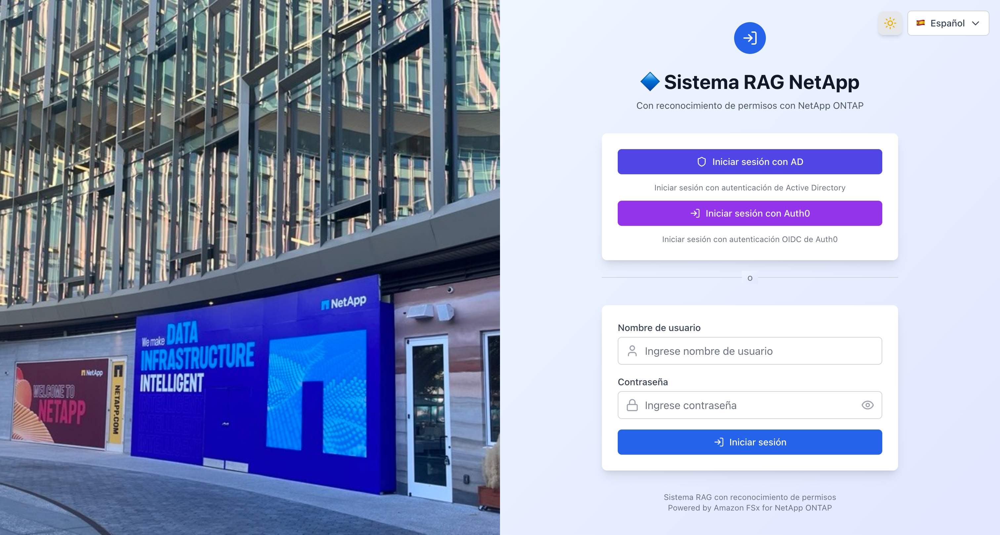

#### Funciones empresariales (opcional)

Los siguientes parámetros de contexto CDK habilitan funciones de mejora de seguridad y unificación de arquitectura.

```json
{
  "useS3AccessPoint": "true",
  "usePermissionFilterLambda": "true",
  "enableGuardrails": "true",
  "enableKmsEncryption": "true",
  "enableCloudTrail": "true",
  "enableVpcEndpoints": "true"
}
```

| Parámetro | Predeterminado | Descripción |
|-----------|----------------|-------------|
| `ontapMgmtIp` | (ninguno) | IP de gestión ONTAP. Cuando se establece, el servidor de embedding genera automáticamente `.metadata.json` desde la API REST de ONTAP |
| `ontapSvmUuid` | (ninguno) | UUID de SVM (usado con `ontapMgmtIp`) |
| `ontapAdminSecretArn` | (ninguno) | ARN de Secrets Manager para la contraseña de administrador de ONTAP |
| `useS3AccessPoint` | `false` | Usar S3 Access Point como fuente de datos de Bedrock KB |
| `volumeSecurityStyle` | `NTFS` | Estilo de seguridad del volumen FSx ONTAP (`NTFS` or `UNIX`) |
| `s3apUserType` | (auto) | Tipo de usuario S3 AP (`WINDOWS` or `UNIX`). Predeterminado: AD configurado→WINDOWS, sin AD→UNIX |
| `s3apUserName` | (auto) | Nombre de usuario S3 AP. Predeterminado: WINDOWS→`Admin`, UNIX→`root` |
| `usePermissionFilterLambda` | `false` | Ejecutar filtrado SID a través de Lambda dedicado (con respaldo de filtrado en línea) |
| `enableGuardrails` | `false` | Bedrock Guardrails (filtro de contenido dañino + protección PII) |
| `guardrailsConfig` | *(ninguno)* | Configuración detallada de Guardrails (`contentFilters`, `topicPolicies`, `piiConfig`, `contextualGrounding`). Efectivo solo con `enableGuardrails=true`. Configuración predeterminada (todas las categorías HIGH) si no se establece |
| `enableAgent` | `false` | Bedrock Agent + Action Group con gestión de permisos (búsqueda KB + filtrado SID). Creación dinámica de Agent (crea y vincula automáticamente Agents específicos de categoría al hacer clic en la tarjeta) |
| `enableAgentSharing` | `false` | Bucket S3 de compartición de configuración de Agent. Exportación/importación JSON de configuraciones de Agent, compartición a nivel organizacional a través de S3 |
| `enableAgentSchedules` | `false` | Infraestructura de ejecución programada de Agents (EventBridge Scheduler + Lambda + tabla de historial de ejecución DynamoDB) |
| `enableKmsEncryption` | `false` | Cifrado KMS CMK para S3 y DynamoDB (rotación de claves habilitada) |
| `enableCloudTrail` | `false` | Registros de auditoría CloudTrail (acceso a datos S3 + invocaciones Lambda, retención de 90 días) |
| `enableVpcEndpoints` | `false` | VPC Endpoints (S3, DynamoDB, Bedrock, SSM, Secrets Manager, CloudWatch Logs) |
| `enableMonitoring` | `false` | Panel de CloudWatch + alertas SNS + monitoreo de EventBridge KB Ingestion. Costo: Panel $3/mes + Alarmas $0.10/alarma/mes |
| `monitoringEmail` | *(ninguno)* | Dirección de correo electrónico para notificaciones de alerta (efectivo cuando `enableMonitoring=true`) |
| `enableAgentCoreMemory` | `false` | Habilitar AgentCore Memory (memoria a corto y largo plazo). Requiere `enableAgent=true` |
| `enableEpisodicMemory` | `false` | Habilitar memoria episódica. Requiere `enableAgentCoreMemory=true`. Registra y busca experiencias pasadas del agente |
| `enableAgentCoreObservability` | `false` | Integrar métricas de AgentCore Runtime en el panel (efectivo cuando `enableMonitoring=true`) |
| `enableAdvancedPermissions` | `false` | Control de acceso basado en tiempo + registro de auditoría de decisiones de permisos. Crea la tabla DynamoDB `permission-audit` |
| `alarmEvaluationPeriods` | `1` | Número de períodos de evaluación de alarma (la alarma se activa después de N violaciones consecutivas del umbral) |
| `dashboardRefreshInterval` | `300` | Intervalo de actualización automática del panel (segundos) |
| `authFailureMode` | `fail-open` | Cambio de modo Fail-Closed (`fail-open` / `fail-closed`). `fail-closed` bloquea el inicio de sesión cuando falla la obtención de permisos |
| `auditLogEnabled` | `false` | Registro de auditoría de autenticación. Crea tabla DynamoDB de auditoría (`{prefix}-auth-audit-log`) |
| `auditLogRetentionDays` | `90` | Días de retención del registro de auditoría (eliminación automática por TTL) |
| `healthCheckEnabled` | `true` | Verificación de salud LDAP (cuando se especifica `ldapConfig`). EventBridge intervalo de 5 min + CloudWatch Alarm |
| `enableAgentRegistry` | `false` | Habilitar integración Agent Registry. Agrega pestaña Registry al Agent Directory |
| `agentRegistryRegion` | Región de despliegue | Región destino para llamadas API de Agent Registry. Soportadas: us-east-1, us-west-2, ap-southeast-2, ap-northeast-1, eu-west-1 |

#
#### Permission Metadata — Design & Future Improvements

`.metadata.json` is a standard Bedrock KB specification, not custom to this project.

At scale (thousands of documents), managing `.metadata.json` per file becomes a burden. Alternative approaches:

| Approach | Feasibility | Pros | Cons |
|---|---|---|---|
| `.metadata.json` (current) | ✅ | Bedrock KB native. No extra infra | Doubles file count |
| DynamoDB permission master + auto-gen | ✅ | DB-only permission changes. Easy audit | Requires generation pipeline |
| ONTAP REST API dynamic retrieval | ✅ Partial | File server ACLs as source of truth | Needs Embedding server |
| Bedrock KB Custom Data Source | ✅ | No `.metadata.json` needed | No S3 AP integration |

**Recommended (large-scale):** ONTAP REST API → DynamoDB (permission master) → auto-generate `.metadata.json` → Bedrock KB Ingestion Job.

### Selección de configuración del almacén de vectores

Cambie el almacén de vectores usando el parámetro `vectorStoreType`. El predeterminado es S3 Vectors (bajo costo).

| Configuración | Costo | Latencia | Uso recomendado |
|--------------|-------|---------|-----------------|
| `s3vectors` (predeterminado) | Unos pocos dólares/mes | Sub-segundo a 100ms | Demo, desarrollo, optimización de costos |

#### Uso de un FSx for ONTAP existente

Si ya existe un sistema de archivos FSx for ONTAP, puede referenciar recursos existentes en lugar de crear nuevos. Esto reduce significativamente el tiempo de despliegue (elimina la espera de 30-40 minutos para la creación de FSx ONTAP).

```bash
npx cdk deploy --all --app "npx ts-node bin/demo-app.ts" \
  -c existingFileSystemId=fs-0123456789abcdef0 \
  -c existingSvmId=svm-0123456789abcdef0 \
  -c existingVolumeId=fsvol-0123456789abcdef0 \
  -c vectorStoreType=s3vectors \
  -c enableAgent=true
```

| Parámetro | Descripción |
|-----------|-------------|
| `existingFileSystemId` | ID del sistema de archivos FSx ONTAP existente (ej. `fs-0123456789abcdef0`) |
| `existingSvmId` | ID de SVM existente (ej. `svm-0123456789abcdef0`) |
| `existingVolumeId` | ID del volumen existente (ej: `fsvol-0123456789abcdef0`) — especifique **un volumen principal** |

> **Nota**: En el modo de referencia FSx existente, FSx/SVM/Volume están fuera de la gestión de CDK. No serán eliminados por `cdk destroy`. El AD administrado tampoco se crea (usa la configuración AD del entorno existente).


##### Múltiples volúmenes bajo un mismo SVM

Cuando un SVM tiene múltiples volúmenes, especifique solo **un volumen principal** en `existingVolumeId` durante el despliegue CDK. Los volúmenes adicionales se agregan después del despliegue mediante el procedimiento de gestión de objetivos de embedding.

```
FileSystem: fs-0123456789abcdef0
└── SVM: svm-0123456789abcdef0
    ├── vol-data      (fsvol-aaaa...)  ← existingVolumeId
    ├── vol-reports   (fsvol-bbbb...)  ← post-deploy
    └── vol-archives  (fsvol-cccc...)  ← post-deploy
```

| Configuración | Costo | Latencia | Uso recomendado | Restricciones de metadatos |
|--------------|-------|---------|-----------------|---------------------------|
| `s3vectors` (predeterminado) | Unos pocos dólares/mes | Sub-segundo a 100ms | Demo, desarrollo, optimización de costos | Límite filterable de 2KB (ver abajo) |
| `opensearch-serverless` | ~$700/mes | ~10ms | Entornos de producción de alto rendimiento | Sin restricciones |

```bash
# Configuración S3 Vectors (predeterminado)
npx cdk deploy --all --app "npx ts-node bin/demo-app.ts" -c vectorStoreType=s3vectors

# Configuración OpenSearch Serverless
npx cdk deploy --all --app "npx ts-node bin/demo-app.ts" -c vectorStoreType=opensearch-serverless
```

Si se necesita alto rendimiento mientras se ejecuta con la configuración S3 Vectors, puede exportar bajo demanda a OpenSearch Serverless usando `demo-data/scripts/export-to-opensearch.sh`. Para más detalles, consulte [docs/stack-architecture-comparison.md](docs/stack-architecture-comparison.md).

### Paso 6: Configuración previa al despliegue (Preparación de imagen ECR)

El stack WebApp referencia una imagen Docker de un repositorio ECR, por lo que la imagen debe prepararse antes del despliegue CDK.

```bash
bash demo-data/scripts/pre-deploy-setup.sh
```

Este script realiza automáticamente lo siguiente:
1. Crea el repositorio ECR (`permission-aware-rag-webapp`)
2. Construye y sube la imagen Docker

El modo de construcción se selecciona automáticamente según la arquitectura del host:

| Host | Modo de construcción | Descripción |
|------|---------------------|-------------|
| x86_64 (EC2, etc.) | Construcción Docker completa | npm install + next build dentro del Dockerfile |
| arm64 (Apple Silicon) | Modo pre-construcción | Construcción next local → Empaquetado Docker |

> **Tiempo requerido**: EC2 (x86_64): 3-5 min, Local (Apple Silicon): 5-8 min, CodeBuild: 5-10 min

> **Nota para Apple Silicon**: Se requiere `docker buildx` (`brew install docker-buildx`). Al subir a ECR, especifique `--provenance=false` (porque Lambda no soporta el formato manifest list).

### Paso 7: Despliegue CDK

```bash
npx cdk deploy --all \
  --app "npx ts-node bin/demo-app.ts" \
  -c enableAgent=true \
  --require-approval never
```

Para habilitar funciones empresariales:

```bash
npx cdk deploy --all \
  --app "npx ts-node bin/demo-app.ts" \
  -c enableAgent=true \
  -c enableAgentSharing=true \
  -c enableAgentSchedules=true \
  --require-approval never
```

Para habilitar monitoreo y alertas:

```bash
npx cdk deploy --all \
  --app "npx ts-node bin/demo-app.ts" \
  -c enableAgent=true \
  -c enableMonitoring=true \
  -c monitoringEmail=ops@example.com \
  --require-approval never
```

> **Estimación de costo de monitoreo**: CloudWatch Dashboard $3/mes + Alarmas $0.10/alarma/mes (7 alarmas = $0.70/mes) + notificaciones SNS dentro del nivel gratuito. Total aproximadamente $4/mes.

> **Tiempo requerido**: La creación de FSx for ONTAP toma 20-30 minutos, por lo que el total es aproximadamente 30-40 minutos.

### Paso 8: Configuración posterior al despliegue (Comando único)

Una vez completado el despliegue CDK, toda la configuración se finaliza con este único comando:

```bash
bash demo-data/scripts/post-deploy-setup.sh
```

Este script realiza automáticamente lo siguiente:
1. Crea S3 Access Point + configura la política
2. Sube datos de demostración a FSx ONTAP (vía S3 AP)
3. Agrega fuente de datos Bedrock KB + sincroniza
4. Registra datos SID de usuario en DynamoDB
5. Crea usuarios de demostración en Cognito (admin / user)

> **Tiempo requerido**: 2-5 minutos (incluyendo espera de sincronización KB)

### Paso 9: Verificación del despliegue (Pruebas automatizadas)

Ejecute scripts de prueba automatizados para verificar toda la funcionalidad.

```bash
bash demo-data/scripts/verify-deployment.sh
```

Los resultados de las pruebas se generan automáticamente en `docs/test-results.md`. Elementos de verificación:
- Estado de los stacks (todos los 6 stacks CREATE/UPDATE_COMPLETE)
- Existencia de recursos (Lambda URL, KB, Agent)
- Respuesta de la aplicación (página de inicio de sesión HTTP 200)
- Modo KB con gestión de permisos (admin: todos los documentos permitidos, user: solo públicos)
- Modo Agent con gestión de permisos (filtrado SID de Action Group)
- S3 Access Point (AVAILABLE)
- Funciones empresariales de Agent (bucket S3 compartido, tabla de historial de ejecución DynamoDB, Lambda programador, respuestas API Sharing/Schedules) *solo cuando `enableAgentSharing`/`enableAgentSchedules` están habilitados

### Paso 10: Acceso por navegador

Recupere la URL de las salidas de CloudFormation y acceda en su navegador.

```bash
aws cloudformation describe-stacks \
  --stack-name perm-rag-demo-demo-WebApp \
  --query 'Stacks[0].Outputs[?OutputKey==`CloudFrontUrl`].OutputValue' \
  --output text
```

### Limpieza de recursos

> **⚠️ Importante**: `cleanup-all.sh` elimina todos los stacks CDK. Si el Managed AD (cuando `adPassword` está configurado) se elimina, puede afectar la fuente de identidad de IAM Identity Center. Antes de eliminar, verifique:
> - La fuente de identidad de Identity Center no está configurada como Managed AD
> - El acceso a la consola mediante usuario IAM está habilitado (como respaldo)

Use el script que elimina todos los recursos (stacks CDK + recursos creados manualmente) de una vez:

```bash
bash demo-data/scripts/cleanup-all.sh
```

Este script realiza automáticamente lo siguiente:
1. Elimina recursos creados manualmente (S3 AP, ECR, CodeBuild)
2. Elimina fuentes de datos Bedrock KB (requerido antes de cdk destroy)
3. Elimina Bedrock Agents creados dinámicamente (Agents fuera de la gestión CDK)
4. Elimina recursos de funciones empresariales de Agent (programaciones y grupos de EventBridge Scheduler, bucket S3 compartido)
5. Elimina el stack Embedding (si existe)
6. CDK destroy (todos los stacks)
7. Eliminación individual de stacks restantes + eliminación de SG AD huérfanos
8. Eliminación de instancias EC2 y SG no gestionados por CDK en VPC + re-eliminación del stack Networking
9. Eliminación de CDKToolkit + bucket S3 staging CDK (ambas regiones, compatible con versionado)

> **Nota**: La eliminación de FSx ONTAP toma 20-30 minutos, por lo que el total es aproximadamente 30-40 minutos.

## Solución de problemas

### Fallo en la creación del stack WebApp (Imagen ECR no encontrada)

| Síntoma | Causa | Solución |
|---------|-------|----------|
| `Source image ... does not exist` | No hay imagen Docker en el repositorio ECR | Ejecute primero `bash demo-data/scripts/pre-deploy-setup.sh` |

> **Importante**: Para cuentas nuevas, siempre ejecute `pre-deploy-setup.sh` antes del despliegue CDK. El stack WebApp referencia la imagen `permission-aware-rag-webapp:latest` en ECR.

### Incompatibilidad de versión del CLI de CDK

| Síntoma | Causa | Solución |
|---------|-------|----------|
| `Cloud assembly schema version mismatch` | El CLI CDK global está desactualizado | Actualice localmente con `npm install aws-cdk@latest` y use `npx cdk` |

### Fallo de despliegue por Hook de CloudFormation

| Síntoma | Causa | Solución |
|---------|-------|----------|
| `The following hook(s)/validation failed: [AWS::EarlyValidation::ResourceExistenceCheck]` | Hook de CloudFormation a nivel de organización bloqueando ChangeSet | Agregue la opción `--method=direct` para omitir ChangeSet |

```bash
# Despliegue en entornos con Hook de CloudFormation habilitado
npx cdk deploy --all --app "npx ts-node bin/demo-app.ts" --method=direct --require-approval never

# Bootstrap también usa create-stack para creación directa
aws cloudformation create-stack --stack-name CDKToolkit \
  --template-body file://cdk-bootstrap-template.yaml \
  --capabilities CAPABILITY_IAM CAPABILITY_NAMED_IAM CAPABILITY_AUTO_EXPAND
```

### Error de permisos de Docker

| Síntoma | Causa | Solución |
|---------|-------|----------|
| `permission denied while trying to connect to the Docker daemon` | El usuario no está en el grupo docker | `sudo usermod -aG docker ubuntu && newgrp docker` |

### Fallo de despliegue de AgentCore Memory

| Síntoma | Causa | Solución |
|---------|-------|----------|
| `EarlyValidation::PropertyValidation` | Las propiedades de CfnMemory no cumplen con el esquema | No se permiten guiones en Name (reemplazar con `_`), EventExpiryDuration es en días (min:3, max:365) |
| `Please provide a role with a valid trust policy` | Principal de servicio inválido para el rol IAM de Memory | Use `bedrock-agentcore.amazonaws.com` (no `bedrock.amazonaws.com`) |
| `actorId failed to satisfy constraint` | actorId contiene `@` `.` de la dirección de correo electrónico | Ya manejado en `lib/agentcore/auth.ts`: `@` → `_at_`, `.` → `_dot_` |
| `AccessDeniedException: bedrock-agentcore:CreateEvent` | El rol de ejecución Lambda carece de permisos AgentCore | Se agrega automáticamente al desplegar CDK con `enableAgentCoreMemory=true` |
| `exec format error` (fallo de inicio de Lambda) | Arquitectura de imagen Docker no coincide con Lambda | Lambda es x86_64. En Apple Silicon, use `docker buildx` + `--platform linux/amd64` |

### Integración Agent Registry

| Síntoma | Causa | Solución |
|---------|-------|----------|
| La pestaña Registry no se muestra | `enableAgentRegistry=false` o no configurado | Configurar `enableAgentRegistry: true` en `cdk.context.json` y redesplegar |
| Tiempo de espera en búsqueda Registry | Fallo de conexión con AgentCore Registry API | Verificar que `agentRegistryRegion` sea una región soportada. El tiempo de espera entre regiones es de 15 segundos |
| Advertencia de región Registry no soportada | La región de despliegue no soporta Agent Registry | Configurar `agentRegistryRegion` con una región soportada (us-east-1, us-west-2, ap-southeast-2, ap-northeast-1, eu-west-1) |

### Guardrails Organizational Safeguards

| Síntoma | Causa | Solución |
|---------|-------|----------|
| El badge de estado Guardrails no se muestra | `enableGuardrails=false` o variable de entorno Lambda `GUARDRAILS_ENABLED` no configurada | Configurar `enableGuardrails: true` en `cdk.context.json` y redesplegar |
| Se muestra badge "⚠️ Verificación no disponible" | Timeout de API Guardrails (>5s) o error 5xx | Verificar detalles del error en logs de CloudWatch. La funcionalidad de chat continúa mediante estrategia Fail-Open |
| GuardrailsAdminPanel no se muestra | No es rol de administrador o `enableGuardrails=false` | Iniciar sesión con rol de administrador y verificar `enableGuardrails=true` |
| Se muestra "Guardrails organizacionales: No disponible" | Fallo en API de detección de Organizational Safeguards | Verificar que el rol de ejecución Lambda tenga permisos `bedrock:ListGuardrails`, `bedrock:GetGuardrail` |
| La configuración `guardrailsConfig` no se aplica | `guardrailsConfig` configurado con `enableGuardrails=false` | Configurar primero `enableGuardrails=true`. `guardrailsConfig` se ignora cuando `enableGuardrails=false` |
| Sin sección Guardrails en el panel CloudWatch | `enableMonitoring=false` o `enableGuardrails=false` | Configurar ambos en `true` y redesplegar |

## Configuración de WAF y restricción geográfica

### Configuración de reglas WAF

El WAF de CloudFront se despliega en `us-east-1` y consta de 6 reglas (evaluadas en orden de prioridad).

| Prioridad | Nombre de regla | Tipo | Descripción |
|-----------|----------------|------|-------------|
| 100 | RateLimit | Personalizado | Bloquea cuando una sola dirección IP excede 3000 solicitudes en 5 minutos |
| 200 | AWSIPReputationList | AWS administrado | Bloquea direcciones IP maliciosas como botnets y fuentes DDoS |
| 300 | AWSCommonRuleSet | AWS administrado | Reglas generales compatibles con OWASP Top 10 (XSS, LFI, RFI, etc.). `GenericRFI_BODY`, `SizeRestrictions_BODY`, `CrossSiteScripting_BODY` excluidos para compatibilidad con solicitudes RAG |
| 400 | AWSKnownBadInputs | AWS administrado | Bloquea solicitudes que explotan vulnerabilidades conocidas como Log4j (CVE-2021-44228) |
| 500 | AWSSQLiRuleSet | AWS administrado | Detecta y bloquea patrones de ataque de inyección SQL |
| 600 | IPAllowList | Personalizado (opcional) | Solo activo cuando `allowedIps` está configurado. Bloquea IPs que no están en la lista |

### Configuración de documentos objetivo de embedding

Los documentos integrados en Bedrock KB están determinados por la estructura de archivos en el volumen FSx ONTAP.

#### Estructura de directorios y metadatos SID

```
FSx ONTAP Volume (/data)
  ├── public/                          ← Accesible para todos los usuarios
  │   ├── product-catalog.md           ← Cuerpo del documento
  │   └── product-catalog.md.metadata.json  ← Metadatos SID
  ├── confidential/                    ← Solo administradores
  │   ├── financial-report.md
  │   └── financial-report.md.metadata.json
  └── restricted/                      ← Solo grupos específicos
      ├── project-plan.md
      └── project-plan.md.metadata.json
```

#### Formato .metadata.json

Configure el control de acceso basado en SID en el archivo `.metadata.json` correspondiente a cada documento.

```json
{
  "metadataAttributes": {
    "allowed_group_sids": "[\"S-1-1-0\"]",
    "access_level": "public",
    "doc_type": "catalog"
  }
}
```

| Campo | Requerido | Descripción |
|-------|-----------|-------------|
| `allowed_group_sids` | ✅ | Cadena de array JSON de SIDs con acceso permitido. `S-1-1-0` es Everyone |
| `access_level` | Opcional | Nivel de acceso para visualización en UI (`public`, `confidential`, `restricted`) |
| `doc_type` | Opcional | Tipo de documento (para filtrado futuro) |

#### Valores SID clave

| SID | Nombre | Uso |
|-----|--------|-----|
| `S-1-1-0` | Everyone | Documentos publicados para todos los usuarios |
| `S-1-5-21-...-512` | Domain Admins | Documentos accesibles solo para administradores |
| `S-1-5-21-...-1100` | Engineering | Documentos para el grupo de ingeniería |

> **Detalles**: Consulte [docs/SID-Filtering-Architecture.md](docs/SID-Filtering-Architecture.md) para el mecanismo de filtrado SID.

#### Restricciones y consideraciones de metadatos de S3 Vectors

Al usar la configuración S3 Vectors (`vectorStoreType=s3vectors`), tenga en cuenta las siguientes restricciones de metadatos.

| Restricción | Valor | Impacto |
|------------|-------|---------|
| Metadatos filtrables | 2KB/vector | Incluyendo metadatos internos de Bedrock KB (~1KB), los metadatos personalizados son efectivamente **1KB o menos** |
| Claves de metadatos no filtrables | Máx 10 claves/índice | Alcanza el límite con claves auto de Bedrock KB (5) + claves personalizadas (5) |
| Metadatos totales | 40KB/vector | Generalmente no es un problema |

### Selección de ruta de ingesta de datos

| Ruta | Método | Activación CDK | Estado |
|------|--------|---------------|--------|
| Principal | FSx ONTAP → S3 Access Point → Bedrock KB → Vector Store | Ejecutar `post-deploy-setup.sh` después del despliegue CDK | ✅ |
| Respaldo | Carga directa a bucket S3 → Bedrock KB → Vector Store | Manual (`upload-demo-data.sh`) | ✅ |
| Alternativa (opcional) | Servidor de embedding (montaje CIFS) → Escritura directa AOSS | `-c enableEmbeddingServer=true` | ✅ (solo configuración AOSS) |

> **Ruta de respaldo**: Si FSx ONTAP S3 AP no está disponible (ej. restricciones SCP de Organization), puede cargar directamente documentos + `.metadata.json` a un bucket S3 y configurarlo como fuente de datos KB. El filtrado SID no depende del tipo de fuente de datos.


#### Ingestion Job

Ingestion Job (KB sync) ingests documents from a data source into the vector store. **It does not run automatically.**

```bash
aws bedrock-agent start-ingestion-job \
  --knowledge-base-id <KB_ID> \
  --data-source-id <DATA_SOURCE_ID> \
  --region ap-northeast-1
```

| Constraint | Value | Description |
|-----------|-------|-------------|
| Max data per job | **100 GB** | Total data source size per Ingestion Job |
| Max file size | **50 MB** | Individual file size limit (images: 3.75 MB) |
| Concurrent jobs (per KB) | **1** | No parallel jobs on same KB |
| Concurrent jobs (per account) | **5** | Max 5 simultaneous jobs |
| API rate | **0.1 req/sec** | Once every 10 seconds |

> Reference: [Amazon Bedrock quotas](https://docs.aws.amazon.com/general/latest/gr/bedrock.html)

**100 GB workaround:** Split into multiple data sources, each with its own S3 Access Point.

### Gestión manual de documentos objetivo de embedding

Puede agregar, modificar y eliminar documentos objetivo de embedding sin despliegue CDK.

#### Agregar documentos

Vía FSx ONTAP S3 Access Point (ruta principal):

```bash
# Colocar archivos en FSx ONTAP vía SMB desde EC2 o WorkSpaces dentro del VPC
SVM_IP=<SVM_SMB_IP>
smbclient //$SVM_IP/data -U 'demo.local\Admin%<PASSWORD>' \
  -c "cd public; put new-document.md; put new-document.md.metadata.json"

# Ejecutar sincronización KB (requerido después de agregar documentos)
aws bedrock-agent start-ingestion-job \
  --knowledge-base-id <KB_ID> \
  --data-source-id <DATA_SOURCE_ID> \
  --region ap-northeast-1
```

Carga directa a bucket S3 (ruta de respaldo):

```bash
# Cargar documentos + metadatos al bucket S3
aws s3 cp new-document.md s3://<DATA_BUCKET>/public/new-document.md
aws s3 cp new-document.md.metadata.json s3://<DATA_BUCKET>/public/new-document.md.metadata.json

# Sincronización KB
aws bedrock-agent start-ingestion-job \
  --knowledge-base-id <KB_ID> \
  --data-source-id <DATA_SOURCE_ID> \
  --region ap-northeast-1
```

#### Actualizar documentos

Después de sobrescribir un documento, vuelva a ejecutar la sincronización KB. Bedrock KB detecta automáticamente los documentos modificados y los re-integra.

```bash
# Sobrescribir documento vía SMB
smbclient //$SVM_IP/data -U 'demo.local\Admin%<PASSWORD>' \
  -c "cd public; put updated-document.md product-catalog.md"

# Sincronización KB (detección de cambios + re-embedding)
aws bedrock-agent start-ingestion-job \
  --knowledge-base-id <KB_ID> \
  --data-source-id <DATA_SOURCE_ID> \
  --region ap-northeast-1
```

#### Eliminar documentos

```bash
# Eliminar documento vía SMB
smbclient //$SVM_IP/data -U 'demo.local\Admin%<PASSWORD>' \
  -c "cd public; del old-document.md; del old-document.md.metadata.json"

# Sincronización KB (detección de eliminación + eliminación del almacén de vectores)
aws bedrock-agent start-ingestion-job \
  --knowledge-base-id <KB_ID> \
  --data-source-id <DATA_SOURCE_ID> \
  --region ap-northeast-1
```

#### Cambiar metadatos SID (Cambios de permisos de acceso)

Para cambiar los permisos de acceso de un documento, actualice el `.metadata.json` y ejecute la sincronización KB.

```bash
# Ejemplo: Cambiar un documento público a confidencial
cat > financial-report.md.metadata.json << 'EOF'
{"metadataAttributes":{"allowed_group_sids":"[\"S-1-5-21-...-512\"]","access_level":"confidential","doc_type":"financial"}}
EOF

smbclient //$SVM_IP/data -U 'demo.local\Admin%<PASSWORD>' \
  -c "cd confidential; put financial-report.md.metadata.json"

# Sincronización KB
aws bedrock-agent start-ingestion-job \
  --knowledge-base-id <KB_ID> \
  --data-source-id <DATA_SOURCE_ID> \
  --region ap-northeast-1
```

> **Nota**: Siempre ejecute la sincronización KB después de agregar, actualizar o eliminar documentos. Los cambios no se reflejan en el almacén de vectores sin sincronización. La sincronización generalmente se completa en 30 segundos a 2 minutos.

## Cómo funciona el RAG con gestión de permisos

### Flujo de procesamiento (Método de 2 etapas: Retrieve + Converse)

```
User              Next.js API             DynamoDB            Bedrock KB         Converse API
  |                    |                      |                    |                  |
  | 1. Send query      |                      |                    |                  |
  |------------------->|                      |                    |                  |
  |                    | 2. Get user SIDs     |                    |                  |
  |                    |--------------------->|                    |                  |
  |                    |<---------------------|                    |                  |
  |                    | userSID + groupSIDs  |                    |                  |
  |                    |                      |                    |                  |
  |                    | 3. Retrieve API      |                    |                  |
  |                    |  (vector search)     |                    |                  |
  |                    |--------------------->|------------------->|                  |
  |                    |<---------------------|                    |                  |
  |                    | Results + metadata   |                    |                  |
  |                    |  (allowed_group_sids)|                    |                  |
  |                    |                      |                    |                  |
  |                    | 4. SID matching      |                    |                  |
  |                    | userSIDs n docSIDs   |                    |                  |
  |                    | -> Match: ALLOW      |                    |                  |
  |                    | -> No match: DENY    |                    |                  |
  |                    |                      |                    |                  |
  |                    | 5. Generate answer   |                    |                  |
  |                    |  (allowed docs only) |                    |                  |
  |                    |--------------------->|------------------->|----------------->|
  |                    |<---------------------|                    |                  |
  |                    |                      |                    |                  |
  | 6. Filtered result |                      |                    |                  |
  |<-------------------|                      |                    |                  |
```

1. El usuario envía una pregunta a través del chat
2. Recupera la lista de SID del usuario (SID personal + SIDs de grupo) de la tabla DynamoDB `user-access`
3. La API Bedrock KB Retrieve realiza una búsqueda vectorial para recuperar documentos relevantes (los metadatos incluyen información SID)
4. Compara los `allowed_group_sids` de cada documento con la lista de SID del usuario, permitiendo solo los documentos coincidentes
5. Genera una respuesta a través de la API Converse usando solo los documentos a los que el usuario tiene acceso como contexto
6. Muestra la respuesta filtrada y la información de citas

## Stack tecnológico

| Capa | Tecnología |
|------|-----------|
| IaC | AWS CDK v2 (TypeScript) |
| Frontend | Next.js 15 + React 18 + Tailwind CSS |
| Auth | Amazon Cognito |
| AI/RAG | Amazon Bedrock Knowledge Base + S3 Vectors / OpenSearch Serverless |
| Embedding | Amazon Titan Text Embeddings v2 (`amazon.titan-embed-text-v2:0`, 1024 dimensions) |
| Almacenamiento | Amazon FSx for NetApp ONTAP + S3 |
| Cómputo | Lambda Web Adapter + CloudFront |
| Permisos | DynamoDB (user-access: SID data, perm-cache: permission cache) |
| Seguridad | AWS WAF + IAM Auth + OAC + Geo Restriction |

## Escenarios de verificación

Consulte [demo-data/guides/demo-scenario.md](demo-data/guides/demo-scenario.md) para los procedimientos de verificación del filtrado de permisos.

Cuando dos tipos de usuarios (administrador y usuario regular) hacen la misma pregunta, puede confirmar que se devuelven diferentes resultados de búsqueda según los permisos de acceso.

## Lista de documentación

| Documento | Contenido |
|-----------|-----------|
| [docs/implementation-overview.md](docs/implementation-overview.md) | Descripción detallada de la implementación (14 perspectivas) |
| [docs/ui-specification.md](docs/ui-specification.md) | Especificación de UI (cambio de modo KB/Agent, directorio de Agents, diseño de barra lateral, visualización de citas) |
| [docs/SID-Filtering-Architecture.md](docs/SID-Filtering-Architecture.md) | Detalles de la arquitectura de filtrado basado en SID |
| [docs/embedding-server-design.md](docs/embedding-server-design.md) | Diseño del servidor de embedding (incluyendo recuperación automática de ACL ONTAP) |
| [docs/stack-architecture-comparison.md](docs/stack-architecture-comparison.md) | Guía de arquitectura de stacks CDK (comparación de almacenes de vectores, perspectivas de implementación) |
| [docs/verification-report.md](docs/verification-report.md) | Procedimientos de verificación post-despliegue y casos de prueba |
| [docs/demo-recording-guide.md](docs/demo-recording-guide.md) | Guía de grabación de video de demostración de verificación (6 elementos de evidencia) |
| [docs/demo-environment-guide.md](docs/demo-environment-guide.md) | Guía de configuración del entorno de verificación |
| [docs/DOCUMENTATION_INDEX.md](docs/DOCUMENTATION_INDEX.md) | Índice de documentación (orden de lectura recomendado) |
| [demo-data/guides/demo-scenario.md](demo-data/guides/demo-scenario.md) | Escenarios de verificación (confirmación de diferencia de permisos admin vs. usuario regular) |
| [demo-data/guides/ontap-setup-guide.md](demo-data/guides/ontap-setup-guide.md) | FSx ONTAP + integración AD, recurso compartido CIFS, configuración ACL NTFS |

## Configuración de FSx ONTAP + Active Directory

Consulte [demo-data/guides/ontap-setup-guide.md](demo-data/guides/ontap-setup-guide.md) para los procedimientos de integración AD de FSx ONTAP, recurso compartido CIFS y configuración ACL NTFS.

El despliegue CDK crea AWS Managed Microsoft AD y FSx ONTAP (SVM + Volume). La unión del SVM al dominio AD se ejecuta vía CLI después del despliegue (para control de temporización).

```bash
# Obtener IPs DNS de AD
AD_DNS_IPS=$(aws ds describe-directories --region ap-northeast-1 \
  --query 'DirectoryDescriptions[?Name==`demo.local`].DnsIpAddrs' --output json)

# Unir SVM a AD
# Nota: Para AWS Managed AD, se debe especificar OrganizationalUnitDistinguishedName
aws fsx update-storage-virtual-machine \
  --storage-virtual-machine-id <SVM_ID> \
  --active-directory-configuration '{
    "NetBiosName": "RAGSVM",
    "SelfManagedActiveDirectoryConfiguration": {
      "DomainName": "demo.local",
      "UserName": "Admin",
      "Password": "<AD_PASSWORD>",
      "DnsIps": <AD_DNS_IPS>,
      "FileSystemAdministratorsGroup": "Domain Admins",
      "OrganizationalUnitDistinguishedName": "OU=Computers,OU=demo,DC=demo,DC=local"
    }
  }' --region ap-northeast-1
```

> **Importante**: Para AWS Managed AD, si no se especifica `OrganizationalUnitDistinguishedName`, la unión del SVM a AD quedará como `MISCONFIGURED`. El formato de la ruta OU es `OU=Computers,OU=<AD ShortName>,DC=<domain>,DC=<tld>`.

Las decisiones de diseño para S3 Access Point (tipo de usuario WINDOWS, acceso a Internet) también están documentadas en la guía.

### Guía de diseño de usuarios de S3 Access Point

La combinación de tipo de usuario y nombre de usuario especificados al crear un S3 Access Point varía según el estilo de seguridad del volumen y el estado de unión a AD. Existen 4 patrones.

#### Matriz de decisión de 4 patrones

| Patrón | Tipo de usuario | Fuente de usuario | Condición | Ejemplo de parámetro CDK |
|--------|----------------|-------------------|-----------|-------------------------|
| A | WINDOWS | Usuario AD existente | SVM unido a AD + volumen NTFS/UNIX | `s3apUserType=WINDOWS` (predeterminado) |
| B | WINDOWS | Nuevo usuario dedicado | SVM unido a AD + cuenta de servicio dedicada | `s3apUserType=WINDOWS s3apUserName=s3ap-service` |
| C | UNIX | Usuario UNIX existente | Sin unión a AD o volumen UNIX | `s3apUserType=UNIX` (predeterminado) |
| D | UNIX | Nuevo usuario dedicado | Sin unión a AD + usuario dedicado | `s3apUserType=UNIX s3apUserName=s3ap-user` |

#### Diagrama de flujo de selección de patrón

```
¿El SVM está unido a AD?
  ├── Sí → ¿Volumen NTFS?
  │           ├── Sí → Patrón A (WINDOWS + usuario AD existente) recomendado
  │           └── No → Patrón A o C (ambos funcionan)
  └── No → Patrón C (UNIX + root) recomendado
```

#### Detalles de cada patrón

**Patrón A: WINDOWS + Usuario AD existente (Recomendado: entorno NTFS)**

```bash
# Despliegue CDK
npx cdk deploy --all -c adPassword=<PASSWORD> -c volumeSecurityStyle=NTFS
# → S3 AP: WINDOWS, Admin (configurado automáticamente)
```

- El control de acceso a nivel de archivo basado en ACL NTFS está habilitado
- El acceso a archivos a través de S3 AP se realiza con el usuario AD `Admin`
- Importante: No incluir el prefijo de dominio (`DEMO\Admin`). Especificar solo `Admin`

**Patrón B: WINDOWS + Nuevo usuario dedicado**

```bash
# 1. Crear una cuenta de servicio dedicada en AD (PowerShell)
New-ADUser -Name "s3ap-service" -AccountPassword (ConvertTo-SecureString "P@ssw0rd" -AsPlainText -Force) -Enabled $true

# 2. Despliegue CDK
npx cdk deploy --all -c adPassword=<PASSWORD> -c s3apUserName=s3ap-service
```

- Cuenta dedicada basada en el principio de mínimo privilegio
- El acceso S3 AP puede identificarse claramente en los registros de auditoría

**Patrón C: UNIX + Usuario UNIX existente (Recomendado: entorno UNIX)**

```bash
# Despliegue CDK (sin configuración AD)
npx cdk deploy --all -c volumeSecurityStyle=UNIX
# → S3 AP: UNIX, root (configurado automáticamente)
```

- Control de acceso basado en permisos POSIX (uid/gid)
- Todos los archivos accesibles con el usuario `root`
- El filtrado SID opera basándose en los metadatos de `.metadata.json` (no depende de las ACL del sistema de archivos)

**Patrón D: UNIX + Nuevo usuario dedicado**

```bash
# 1. Crear un usuario UNIX dedicado a través de ONTAP CLI
vserver services unix-user create -vserver <SVM_NAME> -user s3ap-user -id 1100 -primary-gid 0

# 2. Despliegue CDK
npx cdk deploy --all -c volumeSecurityStyle=UNIX -c s3apUserType=UNIX -c s3apUserName=s3ap-user
```

- Cuenta dedicada basada en el principio de mínimo privilegio
- Al acceder con un usuario distinto de `root`, es necesario configurar los permisos POSIX del volumen

#### Relación con el filtrado SID

El filtrado SID no depende del tipo de usuario S3 AP. La misma lógica funciona en todos los patrones:

```
allowed_group_sids en .metadata.json
  ↓
Devuelto como metadatos a través de Bedrock KB Retrieve API
  ↓
Comparado con los SID de usuario (DynamoDB user-access) en route.ts
  ↓
Coincidencia → ALLOW, Sin coincidencia → DENY
```

Ya sea un volumen NTFS o UNIX, se aplica el mismo filtrado SID siempre que la información SID esté incluida en `.metadata.json`.

## Colaboración Multi-Agente

Aprovecha el patrón **Supervisor + Collaborator** de Amazon Bedrock Agents para orquestar múltiples agentes especializados que realizan búsqueda filtrada por permisos, análisis y generación de documentos.

### Arquitectura

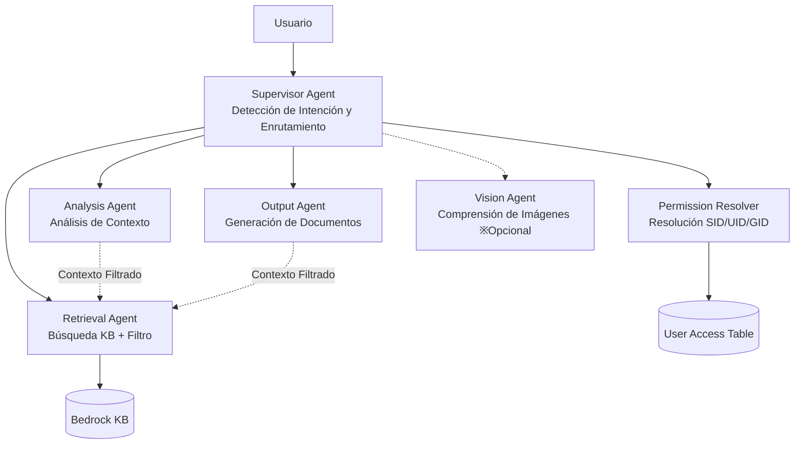

### Características Principales

- **Límites de permisos preservados**: Acceso a KB restringido solo a Permission Resolver y Retrieval Agent. Otros agentes usan exclusivamente "contexto filtrado"
- **Separación de roles IAM**: Cada Collaborator recibe un rol IAM individual con privilegios mínimos
- **Optimizado en costos**: Habilitado por defecto con `enableAgent: true` (`enableMultiAgent: true`). Costo de espera de Bedrock Agent $0. El consumo de tokens aumenta 3-6 veces solo al chatear en modo multi-Agent
- **Dos modos de enrutamiento**: `supervisor_router` (baja latencia) / `supervisor` (tareas complejas)
- **Alternador UI**: Cambio entre modo Single / Multi con un clic en la interfaz de chat
- **Agent Trace**: Visualización de la línea de tiempo de ejecución multi-agente y desglose de costos por Collaborator

### Capturas de Pantalla de la UI

#### Alternador Unificado de 3 Modos — KB / Single Agent / Multi Agent

El encabezado presenta un alternador unificado de 3 modos. KB (azul), Single Agent (púrpura) y Multi Agent (púrpura) se pueden cambiar con un clic. El menú desplegable de selección de Agent aparece solo en los modos Agent — el modo Single muestra agentes individuales, el modo Multi muestra solo Supervisor Agents.


#### Agent Directory — Pestaña Teams + Galería de Plantillas

El Agent Directory incluye una pestaña Teams con una galería de plantillas para crear Teams con un clic.

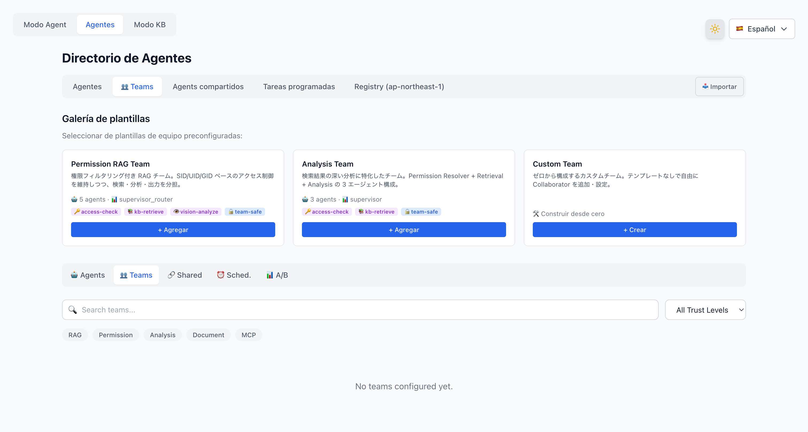

#### Asistente de Creación de Team — 5 Pasos

Al hacer clic en "+" en una plantilla se abre un asistente de creación de Team de 5 pasos.


#### Team Creado — Tarjeta de Team

Después de la creación, la tarjeta del Team aparece en la pestaña Teams mostrando la cantidad de agentes, modo de enrutamiento, Trust Level y badges de Tool Profile.


#### Modo Multi Habilitado — Después de la Creación del Team

Después de crear un Team, el toggle del modo Multi en el encabezado del chat se habilita (ya no está deshabilitado).


#### Respuesta del Supervisor Agent — Filtrada por Permisos

Al seleccionar el Supervisor Agent y enviar un mensaje de chat, se activa la cadena de Collaborator Agent para la búsqueda en KB, devolviendo una respuesta filtrada por permisos con citas.


### Notas de Despliegue

Hallazgos técnicos críticos del despliegue real en AWS.

#### Valores válidos de CloudFormation `AgentCollaboration`

- Valores válidos: `DISABLED` | `SUPERVISOR` | `SUPERVISOR_ROUTER` solamente
- `COLLABORATOR` NO es un valor válido (a pesar de aparecer en alguna documentación)
- Los Collaborator Agents NO deben establecer `AgentCollaboration` (por defecto: `DISABLED`)

#### Despliegue en 2 etapas requerido (Supervisor Agent)

El Supervisor Agent no puede crearse con `AgentCollaboration=SUPERVISOR_ROUTER` y `AgentCollaborators` en una sola operación de CloudFormation.

1. Crear primero el Supervisor Agent con `AgentCollaboration=DISABLED`
2. Usar un Custom Resource Lambda para:
   - `UpdateAgent` → cambiar a `SUPERVISOR_ROUTER`
   - `AssociateAgentCollaborator` para cada colaborador
   - `PrepareAgent`

#### Requisitos de permisos IAM

- El rol IAM del Supervisor Agent necesita: `bedrock:GetAgentAlias` + `bedrock:InvokeAgent` en `agent-alias/*/*`
- El Custom Resource Lambda necesita: `iam:PassRole` para el rol del Supervisor
- `autoPrepare=true` no puede usarse en el Supervisor Agent (falla sin colaboradores)

#### Alias de Collaborator Agent

- Cada Collaborator Agent necesita un `CfnAgentAlias` antes de poder ser referenciado por el Supervisor
- Formato de ARN del alias: `arn:aws:bedrock:REGION:ACCOUNT:agent-alias/{agent-id}/{alias-id}`

#### Construcción de imagen Docker (Lambda)

- Apple Silicon: Usar `Dockerfile.prebuilt` con `--provenance=false --sbom=false`
- `docker/app/Dockerfile` NO es para Lambda Web Adapter (archivo heredado)
- Después del push a ECR, usar `aws lambda update-function-code` directamente (CDK no detecta cambios en la etiqueta `latest`)

### Estructura de Costos

| Escenario | Llamadas de Agent | Costo Est./Solicitud |
|---|---|---|
| Single Agent (existente) | 1 | ~$0.02 |
| Multi-Agent (consulta simple) | 2–3 | ~$0.06 |
| Multi-Agent (consulta compleja) | 4–6 | ~$0.17 |

> Facturación basada en solicitudes — sin costo adicional si no se utiliza.

## Licencia

[Apache License 2.0](LICENSE)
