# Agentic Access-Aware RAG with Amazon FSx for NetApp ONTAP

**🌐 Language / 言語:** **日本語** | [English](README.en.md) | [한국어](README.ko.md) | [简体中文](README.zh-CN.md) | [繁體中文](README.zh-TW.md) | [Français](README.fr.md) | [Deutsch](README.de.md) | [Español](README.es.md)

[](LICENSE)

Amazon FSx for NetApp ONTAP に保存された企業データに対して、**ユーザーごとのアクセス権限を守りながら**、AIエージェントが自律的に検索・分析・回答を行うシステムです。従来の「質問に回答する」生成AIとは異なり、Agentic AIとして目標達成のために計画・意思決定・行動を連続的に実行し、業務プロセス全体を最適化・自動化します。管理者だけが見られる機密文書は管理者にだけ回答し、一般ユーザーには公開文書のみで回答する権限制御を備えています。

AWS CDK でワンコマンドデプロイでき、Amazon Bedrock（RAG / Agent）、Amazon Cognito（認証）、Amazon FSx for NetApp ONTAP（ストレージ）、Amazon S3 Vectors（ベクトルDB）を組み合わせたエンタープライズ向けの構成を検証できます。Next.js 15 によるカードベースのタスク指向 UI を備え、8言語に対応しています。

主な特徴:
- **権限フィルタリング**: FSx for ONTAP の NTFS ACL / UNIX パーミッションを RAG 検索に自動反映
- **ゼロタッチプロビジョニング**: AD / OIDC / LDAP 連携で、ユーザーが初回サインインするだけで権限情報を自動取得
- **Agentic AI**: 文書検索（KB モード）と多段階推論・自律的タスク実行（Agent モード）をワンクリックで切替
- **低コスト**: S3 Vectors（月数ドル）をデフォルト採用。OpenSearch Serverless への切替も可能

---

## クイックスタート（最短手順）

```bash
# 1. クローン & 依存関係インストール
git clone https://github.com/Yoshiki0705/FSx-for-ONTAP-Agentic-Access-Aware-RAG.git
cd FSx-for-ONTAP-Agentic-Access-Aware-RAG
npm install

# 2. CDK Bootstrap（初回のみ）
npx cdk bootstrap aws://$(aws sts get-caller-identity --query Account --output text)/ap-northeast-1
npx cdk bootstrap aws://$(aws sts get-caller-identity --query Account --output text)/us-east-1

# 3. Dockerイメージ準備
bash demo-data/scripts/pre-deploy-setup.sh

# 4. デプロイ（約30-40分）
npx cdk deploy --all --require-approval never

# 5. テストデータ + ユーザー作成
bash demo-data/scripts/post-deploy-setup.sh

# 6. ブラウザでアクセス
aws cloudformation describe-stacks --stack-name perm-rag-demo-demo-WebApp \
  --query 'Stacks[0].Outputs[?OutputKey==`CloudFrontUrl`].OutputValue' --output text
```

> 前提: Node.js 22+、Docker、AWS CLI設定済み、AdministratorAccess相当の権限。詳細は [デプロイ手順](#デプロイ手順) を参照。
> 認証モード別の構成例は [認証モード別デモ環境構築ガイド](demo-data/guides/auth-mode-setup-guide.md) を参照。

## Architecture

```
+----------+     +----------+     +------------+     +---------------------+
| Browser  |---->| AWS WAF  |---->| CloudFront |---->| Lambda Web Adapter  |
+----------+     +----------+     | (OAC+Geo)  |     | (Next.js, IAM Auth) |
                                  +------------+     +------+--------------+
                                                            |
                      +---------------------+---------------+--------------------+
                      v                     v               v                    v
             +-------------+    +------------------+ +--------------+   +--------------+
             | Cognito     |    | Bedrock KB       | | DynamoDB     |   | DynamoDB     |
             | User Pool   |    | + S3 Vectors /   | | user-access  |   | perm-cache   |
             +-------------+    |   OpenSearch SL  | | (SID Data)   |   | (Perm Cache) |
                                +--------+---------+ +--------------+   +--------------+
                                         |
                                         v
                                +------------------+
                                | FSx for ONTAP    |
                                | (SVM + Volume)   |
                                | + S3 Access Point|
                                +--------+---------+
                                         | CIFS/SMB (optional)
                                         v
                                +------------------+
                                | Embedding EC2    |
                                | (Titan Embed v2) |
                                | (optional)       |
                                +------------------+
```

## 実装概要（14の観点）

本システムの実装内容を14の観点で整理しています。各項目の詳細は [docs/implementation-overview.md](docs/implementation-overview.md) を参照してください。

| # | 観点 | 概要 | 関連CDKスタック |
|---|------|------|----------------|
| 1 | Chatbotアプリケーション | Next.js 15 (App Router) をLambda Web Adapterでサーバーレス実行。KB/Agentモード切替対応。カードベースのタスク指向UI | WebAppStack |
| 2 | AWS WAF | レートリミット、IP Reputation、OWASP準拠ルール、SQLi防御、IP許可リストの6ルール構成 | WafStack |
| 3 | IAM認証 | Lambda Function URL + CloudFront OAC による多層セキュリティ | WebAppStack |
| 4 | ベクトルDB | S3 Vectors（デフォルト、低コスト）/ OpenSearch Serverless（高パフォーマンス）。`vectorStoreType`で選択 | AIStack |
| 5 | Embedding Server | FSx ONTAPボリュームをCIFS/SMBマウントしたEC2でドキュメントをベクトル化しAOSSに書き込み（AOSS構成時のみ） | EmbeddingStack |
| 6 | Titan Text Embeddings | `amazon.titan-embed-text-v2:0`（1024次元）をKB取り込みとEmbeddingサーバーの両方で使用 | AIStack |
| 7 | SIDメタデータ + 権限フィルタリング | NTFS ACLのSID情報を`.metadata.json`で管理し、検索時にユーザーSIDと照合してフィルタリング | StorageStack |
| 8 | KB/Agentモード切替 | KBモード（文書検索）とAgentモード（多段階推論）をトグルで切替。Agent Directory（`/genai/agents`）でカタログ形式のAgent管理・テンプレート作成・編集・削除。動的Agent作成・カード紐付け。アウトプット指向ワークフロー（プレゼン資料、稟議書、議事録、レポート、契約書、オンボーディング）。8言語i18n対応。両モードでPermission-aware | WebAppStack |
| 9 | 画像分析RAG | チャット入力に画像アップロード（ドラッグ＆ドロップ / ファイルピッカー）を追加。Bedrock Vision API（Claude Haiku 4.5）で画像を分析し、結果をKB検索コンテキストに統合。JPEG/PNG/GIF/WebP対応、3MB上限 | WebAppStack |
| 10 | KB接続UI | Agent作成・編集時にBedrock Knowledge Baseの選択・接続・解除を行うUI。Agent詳細パネルに接続済みKB一覧表示 | WebAppStack |
| 11 | Smart Routing | クエリ複雑度に基づく自動モデル選択。短い事実確認クエリは軽量モデル（Haiku）、長い分析的クエリは高性能モデル（Sonnet）へルーティング。サイドバーにON/OFFトグル | WebAppStack |
| 12 | 監視・アラート | CloudWatchダッシュボード（Lambda/CloudFront/DynamoDB/Bedrock/WAF/Advanced RAG統合）、SNSアラート（エラー率・レイテンシ閾値超過通知）、EventBridge KB Ingestion Job失敗通知、EMFカスタムメトリクス。`enableMonitoring=true`で有効化 | WebAppStack (MonitoringConstruct) |
| 13 | AgentCore Memory | AgentCore Memory（短期・長期メモリ）による会話コンテキスト維持。セッション内会話履歴（短期）+ セッション横断のユーザー嗜好・要約（長期）。`enableAgentCoreMemory=true`で有効化 | AIStack |
| 14 | OIDC/LDAP Federation + ONTAP Name-Mapping | OIDC IdP（Auth0/Keycloak/Okta）連携、LDAP直接クエリ（OpenLDAP/FreeIPA）によるUID/GID自動取得、ONTAP REST API name-mapping（UNIX→Windowsユーザー対応付け）。設定駆動の自動有効化。`oidcProviderConfig` + `ldapConfig` + `ontapNameMappingEnabled`で有効化 | SecurityStack |

## UI Screenshots

### KBモード — カードグリッド（初期状態）

チャットエリアの初期状態では、目的別カード14枚（調査系8枚 + アウトプット系6枚）がグリッド表示されます。カテゴリフィルタ、お気に入り機能、InfoBanner（権限情報）を備えています。

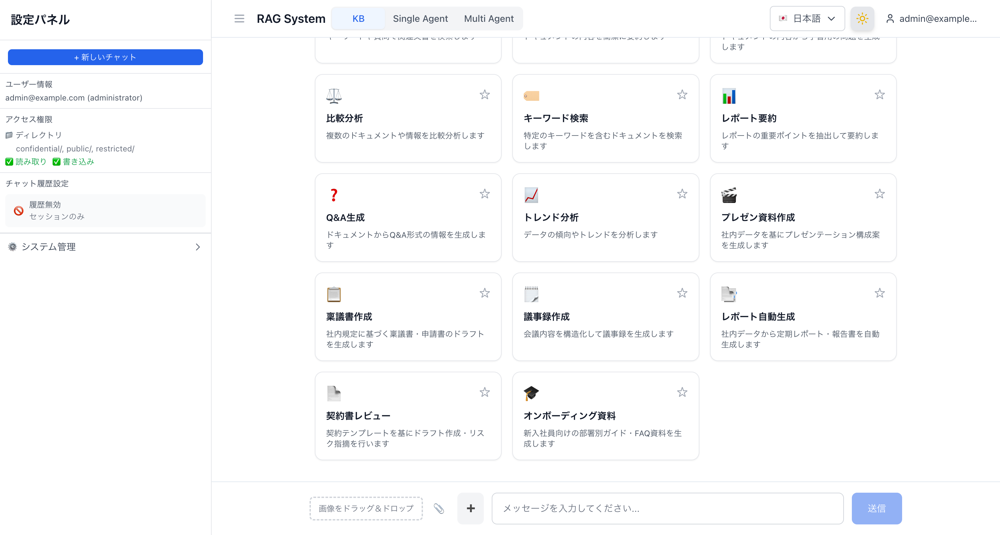

### Agentモード — カードグリッド + サイドバー

Agentモードでは14枚のワークフローカード（リサーチ系8枚 + アウトプット系6枚）が表示されます。カードクリック時にBedrock Agentが自動検索され、未作成の場合はAgent Directory作成フォームに遷移します。サイドバーにはAgent選択ドロップダウン、チャット履歴設定、折りたたみ可能なシステム管理セクションがあります。

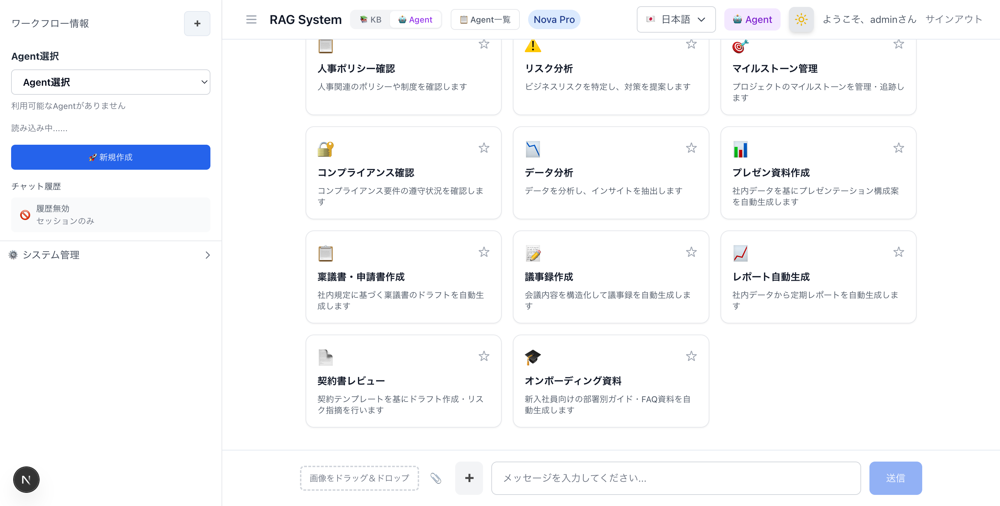

### Agent Directory — Agent一覧・管理画面

`/[locale]/genai/agents` でアクセスできるAgent管理専用画面です。作成済みBedrock Agentのカタログ表示、検索・カテゴリフィルタ、詳細パネル、テンプレートからの作成、インライン編集・削除が可能です。ナビゲーションバーでAgentモード / Agent一覧 / KBモードを切り替えられます。エンタープライズ機能有効時は「共有Agent」「スケジュールタスク」タブが追加されます。

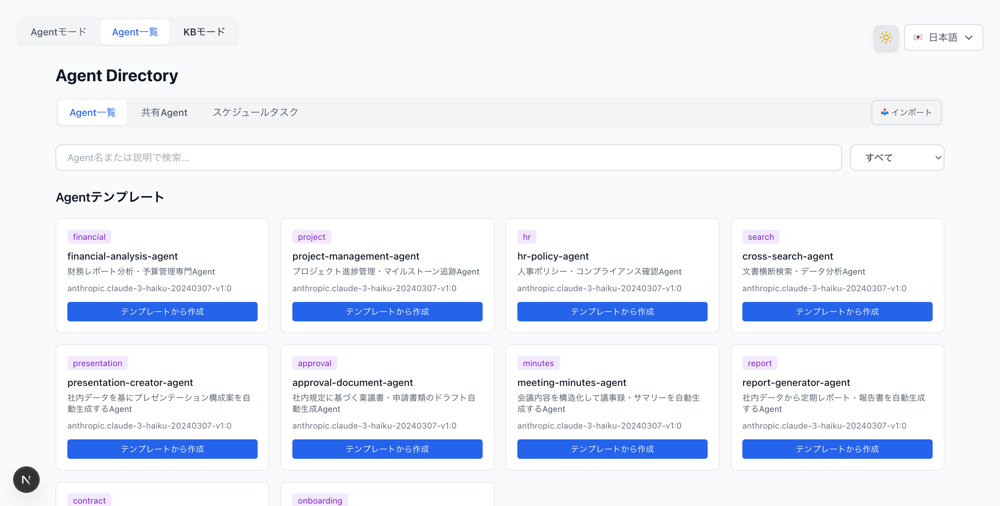

#### Agent Directory — 共有Agentタブ

`enableAgentSharing=true` で有効化。S3共有バケット内のAgent構成を一覧・プレビュー・インポートできます。

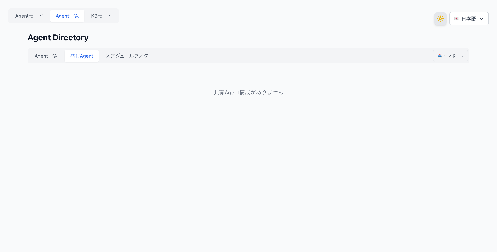

### Agent Directory — Agent作成フォーム

テンプレートカードの「テンプレートから作成」をクリックすると、Agent名・説明・システムプロンプト・AIモデルを編集できる作成フォームが表示されます。Agentモードのカードクリック時にAgentが未作成の場合も同じフォームに遷移します。

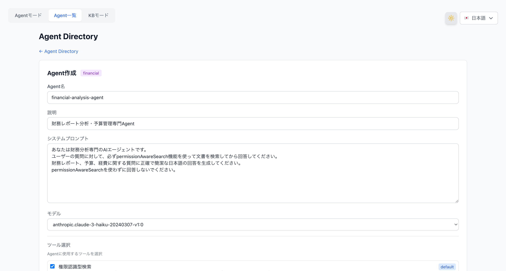

### Agent Directory — Agent詳細・編集

Agentカードをクリックすると詳細パネルが表示され、Agent ID、ステータス、モデル、バージョン、作成日、システムプロンプト（折りたたみ）、アクショングループを確認できます。「編集」ボタンでインライン編集、「チャットで使用」でAgentモードに遷移、「エクスポート」でJSON構成ダウンロード、「共有バケットにアップロード」でS3共有、「スケジュール作成」で定期実行設定、「削除」で確認ダイアログ付き削除が可能です。

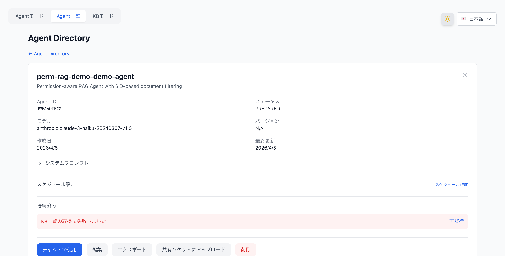

### チャット応答 — Citation表示 + アクセスレベルバッジ

RAG検索結果にはFSxファイルパスとアクセスレベルバッジ（全員アクセス可/管理者のみ/特定グループ）が表示されます。チャット中は「🔄 ワークフロー選択に戻る」ボタンでカードグリッドに戻れます。メッセージ入力欄の左側に「➕」ボタンで新しいチャットを開始できます。

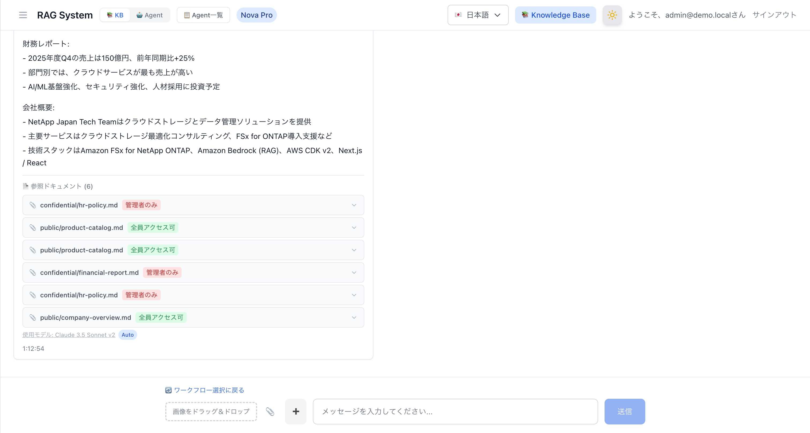

### 画像アップロード — ドラッグ＆ドロップ + ファイルピッカー（v3.1.0）

チャット入力エリアに画像アップロード機能を追加。ドラッグ＆ドロップ領域と📎ファイルピッカーボタンで画像を添付し、Bedrock Vision API（Claude Haiku 4.5）で分析後、KB検索コンテキストに統合します。JPEG/PNG/GIF/WebP対応、3MB上限。

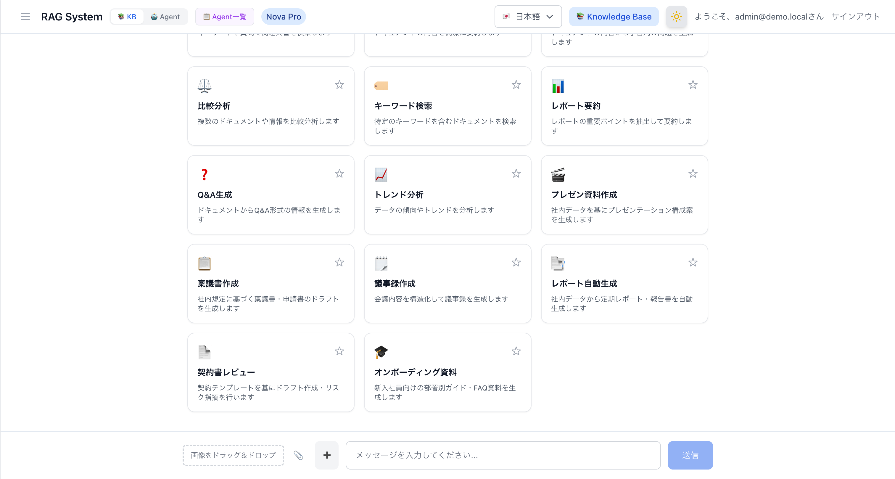

### Smart Routing — コスト最適化モデル自動選択（v3.1.0）

サイドバーのSmart RoutingトグルをONにすると、クエリの複雑度に基づいて軽量モデル（Haiku）または高性能モデル（Sonnet）を自動選択します。ModelSelectorに「⚡ 自動」オプションが追加され、レスポンスには使用モデル名と「Auto」バッジが表示されます。

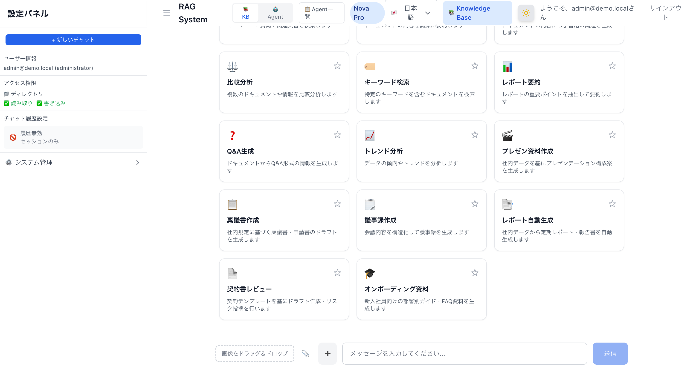

### AgentCore Memory — セッション一覧 + メモリセクション（v3.3.0）

`enableAgentCoreMemory=true` で有効化。Agentモードのサイドバーにセッション一覧（SessionList）と長期メモリ表示（MemorySection）が追加されます。チャット履歴設定は「AgentCore Memory: 有効」バッジに置き換わります。

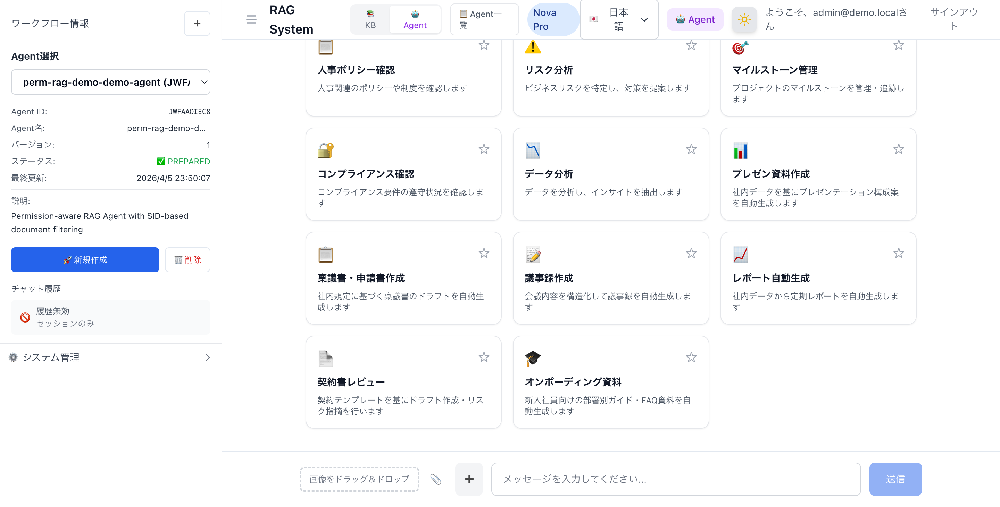

## CDK Stack Structure

| # | Stack | Region | Resources | Description |
|---|-------|--------|-----------|-------------|
| 1 | WafStack | us-east-1 | WAF WebACL, IPセット | CloudFront用WAF（レートリミット、マネージドルール） |
| 2 | NetworkingStack | ap-northeast-1 | VPC, サブネット, セキュリティグループ, VPCエンドポイント（オプション） | ネットワーク基盤 |
| 3 | SecurityStack | ap-northeast-1 | Cognito User Pool, Client, SAML IdP + OIDC IdP + Cognito Domain（Federation有効時）, Identity Sync Lambda（オプション） | 認証・認可（SAML/OIDC/メール） |
| 4 | StorageStack | ap-northeast-1 | FSx ONTAP + SVM + Volume, S3, DynamoDB×2, (AD), KMS暗号化（オプション）, CloudTrail（オプション） | ストレージ・SIDデータ・権限キャッシュ |
| 5 | AIStack | ap-northeast-1 | Bedrock KB, S3 Vectors / OpenSearch Serverless（`vectorStoreType`で選択）, Bedrock Guardrails（オプション） | RAG検索基盤（Titan Embed v2） |
| 6 | WebAppStack | ap-northeast-1 | Lambda (Docker, IAM Auth + OAC), CloudFront, Permission Filter Lambda（オプション）, MonitoringConstruct（オプション） | Webアプリケーション、Agent Management、監視・アラート |
| 7 | EmbeddingStack（任意） | ap-northeast-1 | EC2 (m5.large), ECR, ONTAP ACL自動取得（オプション） | FlexCache CIFSマウント + Embeddingサーバー |

### セキュリティ機能（6層防御）

| レイヤー | 技術 | 目的 |
|---------|------|------|
| L1: ネットワーク | CloudFront Geo制限 | 地理的アクセス制限（デフォルト: `["JP"]`。[変更方法](#geo制限)参照） |
| L2: WAF | AWS WAF (6ルール) | 攻撃パターン検出・ブロック |
| L3: オリジン認証 | CloudFront OAC (SigV4) | CloudFront以外からの直接アクセス防止 |
| L4: API認証 | Lambda Function URL IAM Auth | IAM認証によるアクセス制御 |
| L5: ユーザー認証 | Cognito JWT / SAML / OIDCフェデレーション | ユーザーレベルの認証・認可 |
| L6: データ認可 | SID / UID+GIDフィルタリング | ドキュメントレベルのアクセス制御 |

## Prerequisites

- AWS アカウント（AdministratorAccess相当の権限）
- Node.js 22+、npm
- Docker（Colima、Docker Desktop、またはEC2上のdocker.io）
- CDK Bootstrap済み (`cdk bootstrap aws://ACCOUNT_ID/REGION`)

> **Note**: ビルドはローカル（macOS / Linux）またはEC2上で実行できます。Apple Silicon (M1/M2/M3) の場合、`pre-deploy-setup.sh` が自動的にプリビルドモード（ローカルNext.jsビルド + Dockerパッケージング）を使用し、x86_64 Lambda互換イメージを生成します。EC2 (x86_64) の場合はフルDockerビルドが実行されます。

> **UIの検証・開発のみ行いたい場合**: AWS環境なしでNext.jsアプリのUI検証ができます。Node.js 22+ のみで動作し、認証ミドルウェアも本番同等に動作します。→ [ローカル開発ガイド](docker/nextjs/LOCAL_DEVELOPMENT.md)

## デプロイ手順

### Step 1: 環境セットアップ

ローカル（macOS / Linux）またはEC2上で実行できます。

#### ローカル（macOS）の場合

```bash
# Node.js 22+（Homebrew）
brew install node@22

# Docker（いずれか）
brew install --cask docker          # Docker Desktop（sudo必要）
brew install docker colima          # Colima（sudo不要、推奨）
colima start --cpu 4 --memory 8     # Colima起動

# AWS CDK
npm install -g aws-cdk typescript ts-node
```

#### EC2（Ubuntu 22.04）の場合

```bash
# パブリックサブネットにt3.largeを起動（SSM対応IAMロール付き）
aws ec2 run-instances \
  --region ap-northeast-1 \
  --image-id <UBUNTU_22_04_AMI_ID> \
  --instance-type t3.large \
  --subnet-id <PUBLIC_SUBNET_ID> \
  --security-group-ids <SG_ID> \
  --iam-instance-profile Name=<ADMIN_INSTANCE_PROFILE> \
  --associate-public-ip-address \
  --block-device-mappings '[{"DeviceName":"/dev/sda1","Ebs":{"VolumeSize":50,"VolumeType":"gp3"}}]' \
  --tag-specifications 'ResourceType=instance,Tags=[{Key=Name,Value=cdk-deploy-server}]'
```

セキュリティグループはアウトバウンド443（HTTPS）が開いていればSSM Session Managerが動作します。インバウンドルールは不要です。

### Step 2: ツールインストール（EC2の場合）

SSM Session Managerで接続後、以下を実行します。

```bash
# システム更新 + 基本ツール
sudo apt-get update -y
sudo apt-get install -y curl git unzip docker.io

# Node.js 22
curl -fsSL https://deb.nodesource.com/setup_22.x | sudo -E bash -
sudo apt-get install -y nodejs

# Docker有効化
sudo systemctl enable docker
sudo systemctl start docker
sudo usermod -aG docker ubuntu

# AWS CDK（グローバル）
sudo npm install -g aws-cdk typescript ts-node
```

#### ⚠️ CDK CLIバージョンの注意点

`npm install -g aws-cdk` でインストールされるCDK CLIのバージョンが、プロジェクトの `aws-cdk-lib` と互換性がない場合があります。

```bash
# 確認方法
cdk --version          # グローバルCLIバージョン
npx cdk --version      # プロジェクトローカルCLIバージョン
```

本プロジェクトでは `aws-cdk-lib@2.244.0` を使用しています。CLIバージョンが古い場合、以下のエラーが出ます：

```
Cloud assembly schema version mismatch: Maximum schema version supported is 48.x.x, but found 52.0.0
```

**対処法**: プロジェクトローカルのCDK CLIを最新に更新します。

```bash
cd Permission-aware-RAG-FSxN-CDK
npm install aws-cdk@latest
npx cdk --version  # 更新後のバージョンを確認
```

> **重要**: `cdk` コマンドではなく `npx cdk` を使うことで、プロジェクトローカルの最新CLIが使われます。

### Step 3: リポジトリのクローンと依存関係インストール

```bash
cd /home/ubuntu
git clone https://github.com/Yoshiki0705/FSx-for-ONTAP-Agentic-Access-Aware-RAG.git
cd FSx-for-ONTAP-Agentic-Access-Aware-RAG
npm install
```

### Step 4: CDK Bootstrap（初回のみ）

対象リージョンでCDK Bootstrapが未実行の場合に実行します。WAFスタックはus-east-1にデプロイされるため、両リージョンでBootstrapが必要です。

```bash
# ap-northeast-1（メインリージョン — 他リージョンに変更可能）
npx cdk bootstrap aws://$(aws sts get-caller-identity --query Account --output text)/ap-northeast-1

# us-east-1（WAFスタック用 — CloudFront WAFは常にus-east-1が必要）
npx cdk bootstrap aws://$(aws sts get-caller-identity --query Account --output text)/us-east-1
```

> **リージョンの変更**: デフォルトのデプロイ先は `ap-northeast-1`（東京）です。他のリージョンにデプロイする場合は、環境変数 `CDK_DEFAULT_REGION` を設定してください（例: `export CDK_DEFAULT_REGION=us-west-2`）。WAFスタックは常に `us-east-1` にデプロイされます（CloudFrontの要件）。

> **別AWSアカウントにデプロイする場合**: `cdk.context.json`のAZキャッシュ（`availability-zones:account=...`）を削除してください。CDKが新しいアカウントのAZ情報を自動取得します。

### Step 5: CDK Context設定

```bash
cat > cdk.context.json << 'EOF'
{
  "projectName": "rag-demo",
  "environment": "demo",
  "imageTag": "latest",
  "allowedIps": [],
  "allowedCountries": ["JP"]
}
EOF
```

> **⚠️ Geo制限について**: `allowedCountries` のデフォルトは `["JP"]`（日本のみ）です。日本以外からアクセスする場合は、利用する国のISO 3166-1 alpha-2コードを追加してください（例: `["JP", "US", "DE"]`）。全世界からのアクセスを許可する場合は空配列 `[]` を設定します。詳細は [Geo制限](#geo制限) を参照してください。

#### Active Directory連携（オプション）

FSx ONTAP SVMをActive Directoryドメインに参加させ、CIFS共有でNTFS ACL（SIDベース）を使用する場合は、`cdk.context.json` に以下を追加します。

```bash
cat > cdk.context.json << 'EOF'
{
  "projectName": "rag-demo",
  "environment": "demo",
  "imageTag": "latest",
  "allowedIps": [],
  "allowedCountries": ["JP"],
  "adPassword": "YourStrongP@ssw0rd123",
  "adDomainName": "demo.local"
}
EOF
```

| パラメータ | 型 | デフォルト | 説明 |
|-----------|-----|----------|------|
| `adPassword` | string | 未設定（AD作成なし） | AWS Managed Microsoft AD管理者パスワード。設定するとADを作成しSVMをドメイン参加させる |
| `adDomainName` | string | `demo.local` | ADドメイン名（FQDN）。実環境では組織のドメイン名に変更 |

> **Note**: AD作成には追加で20〜30分かかります。ADなしでもSIDフィルタリングのデモは可能です（DynamoDBのSIDデータで検証）。

#### AD SAMLフェデレーション（オプション）

ADユーザーがCloudFront UIから直接サインインし、Cognitoユーザー自動作成 + DynamoDB SIDデータ自動登録を行うSAMLフェデレーションを有効化できます。認証モードの選択やSID自動登録の仕組みの詳細は [認証・ユーザー管理ガイド](docs/auth-and-user-management.md) を参照してください。

**アーキテクチャ概要:**

```
AD User -> CloudFront UI -> "Sign in with AD" button
  -> Cognito Hosted UI -> SAML IdP (AD) -> AD authentication
  -> Cognito auto user creation
  -> Post-Auth Trigger -> AD Sync Lambda -> DynamoDB SID data registration
  -> OAuth Callback -> Session Cookie -> Chat screen
```

**CDKパラメータ:**

| パラメータ | 型 | デフォルト | 説明 |
|-----------|-----|----------|------|
| `enableAdFederation` | boolean | `false` | SAMLフェデレーション有効化フラグ |
| `cloudFrontUrl` | string | 未設定 | OAuthコールバックURL用CloudFront URL（例: `https://d3xxxxx.cloudfront.net`） |
| `samlMetadataUrl` | string | 未設定 | セルフマネージドAD用: Entra IDフェデレーションメタデータURL |
| `adEc2InstanceId` | string | 未設定 | セルフマネージドAD用: EC2インスタンスID |

> **環境変数の自動設定**: `enableAdFederation=true` または `oidcProviderConfig` を指定してCDKデプロイすると、WebAppStack Lambda関数にFederation用の環境変数（`COGNITO_DOMAIN`, `COGNITO_CLIENT_SECRET`, `CALLBACK_URL`, `IDP_NAME`）が自動的に設定されます。手動でのLambda環境変数設定は不要です。

**Managed ADパターン:**

AWS Managed Microsoft ADを使用する場合。

> **⚠️ IAM Identity Center（旧AWS SSO）の設定が必要です:**
> Managed ADのSAMLメタデータURL（`portal.sso.{region}.amazonaws.com/saml/metadata/{directoryId}`）を使用するには、AWS IAM Identity Centerを有効化し、Managed ADをIDソースとして設定した上で、SAMLアプリケーションを作成する必要があります。Managed ADを作成しただけではSAMLメタデータエンドポイントは提供されません。
>
> IAM Identity Centerの設定が困難な場合は、`samlMetadataUrl` パラメータで外部IdP（AD FS等）のメタデータURLを直接指定することも可能です。

```json
{
  "enableAdFederation": true,
  "adPassword": "YourStrongP@ssw0rd123",
  "adDomainName": "demo.local",
  "cloudFrontUrl": "https://d3xxxxx.cloudfront.net",
  // オプション: IAM Identity Center以外のSAMLメタデータURLを使用する場合
  // "samlMetadataUrl": "https://your-adfs-server/federationmetadata/2007-06/federationmetadata.xml"
}
```

セットアップ手順:
1. `adPassword` を設定してCDKデプロイ（Managed AD + SAML IdP + Cognito Domain作成）
2. AWS IAM Identity Centerを有効化し、IDソースをManaged ADに変更
3. ADユーザーにメールアドレスを設定（PowerShell: `Set-ADUser -Identity Admin -EmailAddress "admin@demo.local"`）
4. IAM Identity Centerで「同期を管理」→「ガイド付き設定」でADユーザーを同期
5. IAM Identity CenterでSAMLアプリケーション「Permission-aware RAG Cognito」を作成:
   - ACS URL: `https://{cognito-domain}.auth.{region}.amazoncognito.com/saml2/idpresponse`
   - SAMLオーディエンス: `urn:amazon:cognito:sp:{user-pool-id}`
   - 属性マッピング: Subject → `${user:email}` (emailAddress), emailaddress → `${user:email}`
6. SAMLアプリケーションにADユーザーを割り当て
7. デプロイ完了後、CloudFront URLを `cloudFrontUrl` に設定して再デプロイ
8. CloudFront UIの「ADでサインイン」ボタンからAD認証を実行

**セルフマネージドADパターン（EC2上、Entra Connect連携）:**

EC2上のADとEntra ID（旧Azure AD）を連携し、Entra IDのフェデレーションメタデータURLを使用します。

```json
{
  "enableAdFederation": true,
  "adEc2InstanceId": "i-0123456789abcdef0",
  "samlMetadataUrl": "https://login.microsoftonline.com/{tenant-id}/federationmetadata/2007-06/federationmetadata.xml",
  "cloudFrontUrl": "https://d3xxxxx.cloudfront.net"
}
```

セットアップ手順:
1. EC2上にAD DSをインストールし、Entra Connectで同期設定
2. Entra IDのフェデレーションメタデータURLを取得
3. 上記パラメータを設定してCDKデプロイ
4. CloudFront UIの「ADでサインイン」ボタンからAD認証を実行

**パターン比較:**

| 項目 | Managed AD | セルフマネージドAD |
|------|-----------|------------------|
| SAMLメタデータ | IAM Identity Center経由 or `samlMetadataUrl`指定 | Entra IDメタデータURL（`samlMetadataUrl`指定） |
| SID取得方式 | LDAP or SSM経由 | SSM → EC2 → PowerShell |
| 必須パラメータ | `adPassword`, `cloudFrontUrl` + IAM Identity Center設定（または `samlMetadataUrl`） | `adEc2InstanceId`, `samlMetadataUrl`, `cloudFrontUrl` |
| AD管理 | AWSマネージド | ユーザー管理 |
| コスト | Managed AD料金 | EC2インスタンス料金 |

**トラブルシューティング:**

| 症状 | 原因 | 対処 |
|------|------|------|
| SAML認証失敗 | SAML IdPメタデータURL不正 | Managed AD: IAM Identity Centerの設定を確認、または `samlMetadataUrl` で直接指定。Self-managed: Entra IDメタデータURLを確認 |
| OAuthコールバックエラー | `cloudFrontUrl`未設定 or 不一致 | CDKコンテキストの`cloudFrontUrl`がCloudFront Distribution URLと一致することを確認 |
| Post-Auth Trigger失敗 | AD Sync Lambda権限不足 | CloudWatch Logsでエラー詳細を確認。サインイン自体はブロックされない |
| KB検索でS3アクセスエラー | KB IAMロールにS3バケット直接アクセス権限がない | KB IAMロールはS3 Access Point経由の権限のみ保持。S3バケットを直接データソースとして使用する場合は `s3:GetObject`, `s3:ListBucket` 権限の追加が必要（AD Federation固有の問題ではない） |
| S3 APデータプレーンAPI AccessDenied | WindowsUserにドメインプレフィクスが含まれている | S3 APのWindowsUserにドメインプレフィクス（例: `DEMO\Admin`）を含めてはいけない。ユーザー名のみ（例: `Admin`）を指定する。CLIではドメインプレフィクス付きが受け入れられるがデータプレーンAPIが失敗する |
| Cognito Domain作成失敗 | ドメインプレフィックス重複 | `{projectName}-{environment}-auth` プレフィックスが他アカウントと重複していないか確認 |
| USER_PASSWORD_AUTH 401エラー | Client Secret有効時にSECRET_HASHが未送信 | `enableAdFederation=true`でUser Pool ClientにClient Secretが設定される。サインインAPIで`COGNITO_CLIENT_SECRET`環境変数からSECRET_HASHを計算して送信する必要がある |
| Post-Auth Trigger `Cannot find module 'index'` | Lambda TypeScriptが未コンパイル | CDKの`Code.fromAsset`にesbuildバンドリングオプションを追加。`npx esbuild index.ts --bundle --platform=node --target=node22 --outfile=index.js --external:@aws-sdk/*` |
| OAuth Callback `0.0.0.0`リダイレクト | Lambda Web Adapter環境で`request.url`が`http://0.0.0.0:3000/...` | `CALLBACK_URL`環境変数からベースURLを取得してリダイレクト先を構築 |

#### OIDC/LDAP Federation（オプション）— ゼロタッチユーザープロビジョニング

SAML AD Federationに加え、OIDC IdP（Keycloak、Okta、Entra ID等）およびLDAP直接クエリによるゼロタッチユーザープロビジョニングを有効化できます。FSx for ONTAP の既存ユーザー権限がRAGシステムのUIユーザーに自動マッピングされ、管理者やユーザー自身による手動登録は不要です。

各認証方式は「設定駆動の自動有効化」で動作します。`cdk.context.json` に設定値を追加するだけで有効化され、追加AWSリソースコストはほぼゼロです。SAML + OIDCの同時有効化も可能です。

詳細は [認証・ユーザー管理ガイド](docs/auth-and-user-management.md) を参照してください。認証モード別のサンプル構成ファイルとワンショットセットアップスクリプトは [認証モード別デモ環境構築ガイド](demo-data/guides/auth-mode-setup-guide.md) を参照してください。

> **LDAPユーザーのサインイン方法**: サインイン画面の「{providerName}でサインイン」ボタン（例: 「Keycloakでサインイン」「Oktaでサインイン」）を選択してください。LDAPは認証ではなく権限取得を担当するバックエンドの仕組みで、OIDC IdP経由のサインイン後にIdentity Sync Lambdaが自動的にLDAPからUID/GID/グループを取得します。

**OIDC + LDAP構成例（OpenLDAP/FreeIPA + Keycloak）:**

```json
{
  "oidcProviderConfig": {
    "providerName": "Keycloak",
    "clientId": "rag-system",
    "clientSecret": "arn:aws:secretsmanager:ap-northeast-1:123456789012:secret:oidc-client-secret",
    "issuerUrl": "https://keycloak.example.com/realms/main",
    "groupClaimName": "groups"
  },
  "ldapConfig": {
    "ldapUrl": "ldaps://ldap.example.com:636",
    "baseDn": "dc=example,dc=com",
    "bindDn": "cn=readonly,dc=example,dc=com",
    "bindPasswordSecretArn": "arn:aws:secretsmanager:ap-northeast-1:123456789012:secret:ldap-bind-password"
  },
  "permissionMappingStrategy": "uid-gid"
}
```

**SAML + OIDC ハイブリッド構成例（Managed AD + Okta）:**

```json
{
  "enableAdFederation": true,
  "adPassword": "YourStrongP@ssw0rd123",
  "adDomainName": "demo.local",
  "oidcProviderConfig": {
    "providerName": "Okta",
    "clientId": "0oa1234567890",
    "clientSecret": "arn:aws:secretsmanager:...",
    "issuerUrl": "https://company.okta.com"
  },
  "permissionMappingStrategy": "hybrid",
  "cloudFrontUrl": "https://dxxxxxxxx.cloudfront.net"
}
```

**CDKパラメータ:**

| パラメータ | 型 | 説明 |
|-----------|-----|------|
| `oidcProviderConfig` | object | OIDC IdP設定（`providerName`, `clientId`, `clientSecret`, `issuerUrl`, `groupClaimName`） |
| `ldapConfig` | object | LDAP接続設定（`ldapUrl`, `baseDn`, `bindDn`, `bindPasswordSecretArn`, `userSearchFilter`, `groupSearchFilter`） |
| `permissionMappingStrategy` | string | 権限マッピング戦略: `sid-only`（デフォルト）, `uid-gid`, `hybrid` |
| `ontapNameMappingEnabled` | boolean | ONTAP name-mapping連携（UNIXユーザー→Windowsユーザー対応付け） |

SAML + OIDC ハイブリッド構成のサインイン画面（ADでサインイン + Auth0でサインイン + メール/パスワード）:

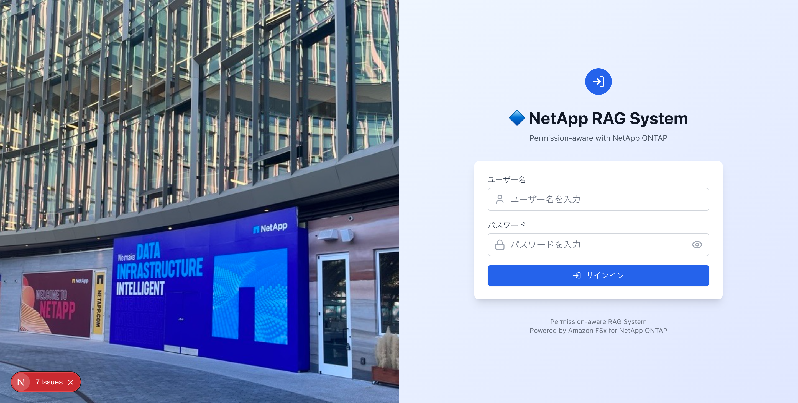

#### エンタープライズ機能（オプション）

以下のCDKコンテキストパラメータで、セキュリティ強化・アーキテクチャ統一機能を有効化できます。

```json
{
  "useS3AccessPoint": "true",
  "usePermissionFilterLambda": "true",
  "enableGuardrails": "true",
  "enableKmsEncryption": "true",
  "enableCloudTrail": "true",
  "enableVpcEndpoints": "true"
}
```

| パラメータ | デフォルト | 説明 |
|-----------|----------|------|
| `ontapMgmtIp` | (なし) | ONTAP管理IP。設定するとEmbeddingサーバーが`.metadata.json`をONTAP REST APIから自動生成 |
| `ontapSvmUuid` | (なし) | SVM UUID（`ontapMgmtIp`と併用） |
| `ontapAdminSecretArn` | (なし) | ONTAP管理者パスワードのSecrets Manager ARN |
| `useS3AccessPoint` | `false` | S3 Access PointをBedrock KBデータソースとして使用 |
| `volumeSecurityStyle` | `NTFS` | FSx ONTAPボリュームのセキュリティスタイル（`NTFS` or `UNIX`） |
| `s3apUserType` | (自動) | S3 APユーザータイプ（`WINDOWS` or `UNIX`）。未指定時: AD設定あり→WINDOWS、なし→UNIX |
| `s3apUserName` | (自動) | S3 APユーザー名。未指定時: WINDOWS→`Admin`、UNIX→`root` |
| `usePermissionFilterLambda` | `false` | SIDフィルタリングを専用Lambda経由で実行（インラインフィルタリングのフォールバック付き） |
| `enableGuardrails` | `false` | Bedrock Guardrails（有害コンテンツフィルタ + PII保護） |
| `enableAgent` | `false` | Bedrock Agent + Permission-aware Action Group（KB検索 + SIDフィルタリング）。動的Agent作成（カードクリック時にカテゴリ別Agentを自動作成・紐付け） |
| `enableAgentSharing` | `false` | Agent構成共有S3バケット。Agent構成のJSON export/import、S3経由の組織内共有機能 |
| `enableAgentSchedules` | `false` | Agent定期実行基盤（EventBridge Scheduler + Lambda + DynamoDB実行履歴テーブル） |
| `enableKmsEncryption` | `false` | KMS CMKによるS3・DynamoDB暗号化（キーローテーション有効） |
| `enableCloudTrail` | `false` | CloudTrail監査ログ（S3データアクセス + Lambda呼び出し、90日保持） |
| `enableVpcEndpoints` | `false` | VPCエンドポイント（S3, DynamoDB, Bedrock, SSM, Secrets Manager, CloudWatch Logs） |
| `enableMonitoring` | `false` | CloudWatchダッシュボード + SNSアラート + EventBridge KB Ingestion監視。コスト: ダッシュボード$3/月 + アラーム$0.10/個/月 |
| `monitoringEmail` | *(なし)* | アラート通知先メールアドレス（`enableMonitoring=true`時に有効） |
| `enableAgentCoreMemory` | `false` | AgentCore Memory（短期・長期メモリ）を有効化。`enableAgent=true` が前提条件 |
| `enableAgentCoreObservability` | `false` | AgentCore Runtimeメトリクスをダッシュボードに統合（`enableMonitoring=true`時に有効） |
| `enableAdvancedPermissions` | `false` | 時間ベースアクセス制御 + 権限判定監査ログ。`permission-audit` DynamoDBテーブルを作成 |
| `alarmEvaluationPeriods` | `1` | アラーム評価期間数（連続N回閾値超過でアラーム発火） |
| `dashboardRefreshInterval` | `300` | ダッシュボード自動リフレッシュ間隔（秒） |

#### ベクトルストア構成の選択

`vectorStoreType`パラメータでベクトルストアを切り替えられます。デフォルトはS3 Vectors（低コスト）です。

#### 既存FSx for ONTAPの利用

既にFSx for ONTAPファイルシステムが存在する場合、新規作成せずに既存リソースを参照できます。これによりデプロイ時間が大幅に短縮されます（FSx ONTAP作成の30-40分待ちが不要）。

```bash
npx cdk deploy --all --app "npx ts-node bin/demo-app.ts" \
  -c existingFileSystemId=fs-0123456789abcdef0 \
  -c existingSvmId=svm-0123456789abcdef0 \
  -c existingVolumeId=fsvol-0123456789abcdef0 \
  -c vectorStoreType=s3vectors \
  -c enableAgent=true
```

| パラメータ | 説明 |
|-----------|------|
| `existingFileSystemId` | 既存FSx ONTAPファイルシステムID（例: `fs-0123456789abcdef0`） |
| `existingSvmId` | 既存SVM ID（例: `svm-0123456789abcdef0`） |
| `existingVolumeId` | 既存ボリュームID（例: `fsvol-0123456789abcdef0`）— **プライマリボリューム1つ** を指定 |

> **注意**: 既存FSx参照モードでは、FSx/SVM/VolumeはCDK管理外となります。`cdk destroy`で削除されません。Managed ADも作成されません（既存環境のAD設定を使用）。

##### 複数ボリュームがある場合

1つのSVMに複数のボリュームがある場合、CDKデプロイ時には **プライマリボリューム1つ** のみを `existingVolumeId` に指定します。このボリュームに対してS3 Access Pointが自動作成され、Bedrock KBのデータソースとして登録されます。

追加ボリュームは、デプロイ完了後に [FSx for ONTAPボリュームのEmbedding対象管理](#fsx-for-ontapボリュームのembedding対象管理) の手順で個別にEmbedding対象に追加します。

```
既存FSx ONTAP環境の例:
  FileSystem: fs-0123456789abcdef0
  └── SVM: svm-0123456789abcdef0
      ├── vol-data     (fsvol-aaaa...)  ← existingVolumeId に指定（プライマリ）
      ├── vol-reports   (fsvol-bbbb...)  ← デプロイ後に手動でEmbedding対象に追加
      └── vol-archives  (fsvol-cccc...)  ← 必要に応じて追加
```

**手順:**

```bash
# Step 1: プライマリボリュームを指定してCDKデプロイ
npx cdk deploy --all \
  -c existingFileSystemId=fs-0123456789abcdef0 \
  -c existingSvmId=svm-0123456789abcdef0 \
  -c existingVolumeId=fsvol-aaaa...

# Step 2: ポストデプロイ（プライマリボリュームのS3 AP + KB登録）
bash demo-data/scripts/post-deploy-setup.sh

# Step 3: 追加ボリュームをEmbedding対象に追加（下記セクション参照）
# → 「FSx for ONTAPボリュームのEmbedding対象管理」の手順に従う
```

> **SVM IDの確認方法**: `aws fsx describe-storage-virtual-machines --region ap-northeast-1` で一覧を取得できます。1つのファイルシステムに複数のSVMがある場合は、Embedding対象のボリュームが属するSVMのIDを指定してください。

| 構成 | コスト | レイテンシ | 推奨用途 | メタデータ制約 |
|------|--------|-----------|---------|--------------|
| `s3vectors`（デフォルト） | 月数ドル | サブ秒〜100ms | デモ・開発・コスト最適化 | filterable 2KB制限あり（下記参照） |
| `opensearch-serverless` | ~$700/月 | ~10ms | 高パフォーマンス本番環境 | 制約なし |

```bash
# S3 Vectors構成（デフォルト）
npx cdk deploy --all --app "npx ts-node bin/demo-app.ts" -c vectorStoreType=s3vectors

# OpenSearch Serverless構成
npx cdk deploy --all --app "npx ts-node bin/demo-app.ts" -c vectorStoreType=opensearch-serverless
```

S3 Vectors構成で運用中に高パフォーマンスが必要になった場合は、`demo-data/scripts/export-to-opensearch.sh`でOpenSearch Serverlessにオンデマンドエクスポートできます。詳細は[docs/stack-architecture-comparison.md](docs/stack-architecture-comparison.md)を参照してください。

### Step 6: プリデプロイセットアップ（ECRイメージ準備）

WebAppスタックはECRリポジトリのDockerイメージを参照するため、CDKデプロイ前にイメージを準備する必要があります。

```bash
bash demo-data/scripts/pre-deploy-setup.sh
```

このスクリプトが自動的に以下を実行します:
1. ECRリポジトリ作成（`permission-aware-rag-webapp`）
2. Dockerイメージビルド + プッシュ

ビルドモードはホストアーキテクチャに応じて自動選択されます:

| ホスト | ビルドモード | 説明 |
|--------|------------|------|
| x86_64（EC2等） | フルDockerビルド | Dockerfile内でnpm install + next build |
| arm64（Apple Silicon） | プリビルドモード | ローカルでnext build → Dockerでパッケージング |

> **所要時間**: EC2 (x86_64): 3-5分、ローカル (Apple Silicon): 5-8分、CodeBuild: 5-10分

> **Apple Silicon での注意**: `docker buildx` が必要です（`brew install docker-buildx`）。ECRプッシュ時は `--provenance=false` を指定してください（Lambda がマニフェストリスト形式をサポートしないため）。

### Step 7: CDKデプロイ

```bash
npx cdk deploy --all \
  --app "npx ts-node bin/demo-app.ts" \
  -c enableAgent=true \
  --require-approval never
```

エンタープライズ機能を有効化する場合：

```bash
npx cdk deploy --all \
  --app "npx ts-node bin/demo-app.ts" \
  -c enableAgent=true \
  -c enableAgentSharing=true \
  -c enableAgentSchedules=true \
  --require-approval never
```

監視・アラート機能を有効化する場合：

```bash
npx cdk deploy --all \
  --app "npx ts-node bin/demo-app.ts" \
  -c enableAgent=true \
  -c enableMonitoring=true \
  -c monitoringEmail=ops@example.com \
  --require-approval never
```

> **監視コスト目安**: CloudWatchダッシュボード $3/月 + アラーム $0.10/個/月（7個 = $0.70/月）+ SNS通知 無料枠内。合計 約$4/月。

> **所要時間**: FSx for ONTAPの作成に20〜30分かかるため、全体で30〜40分程度です。

### Step 8: ポストデプロイセットアップ（1コマンド）

CDKデプロイ完了後、以下の1コマンドで全セットアップが完了します:

```bash
bash demo-data/scripts/post-deploy-setup.sh
```

このスクリプトが自動的に以下を実行します:
1. S3 Access Point作成 + ポリシー設定
2. FSx ONTAPにデモデータアップロード（S3 AP経由）
3. Bedrock KBデータソース追加 + 同期
4. DynamoDBにユーザーSIDデータ登録
5. Cognitoにデモユーザー作成（admin / user）

> **所要時間**: 2〜5分（KB同期待ち含む）

### Step 9: デプロイ検証（自動テスト）

全機能の動作確認を自動テストスクリプトで実行します。

```bash
bash demo-data/scripts/verify-deployment.sh
```

テスト結果は`docs/test-results.md`に自動生成されます。検証項目:
- スタック状態（6スタック全てCREATE/UPDATE_COMPLETE）
- リソース存在（Lambda URL, KB, Agent）
- アプリケーション応答（サインインページ HTTP 200）
- KBモード Permission-aware（admin: 全ドキュメント許可、user: 公開のみ）
- Agentモード Permission-aware（Action Group SIDフィルタリング）
- S3 Access Point（AVAILABLE）
- エンタープライズAgent機能（S3共有バケット、DynamoDB実行履歴テーブル、スケジューラLambda、Sharing/Schedules API応答）※`enableAgentSharing`/`enableAgentSchedules`有効時のみ

### Step 10: ブラウザでのアクセス

CloudFormation出力からURLを取得してブラウザでアクセスします。

```bash
aws cloudformation describe-stacks \
  --stack-name perm-rag-demo-demo-WebApp \
  --query 'Stacks[0].Outputs[?OutputKey==`CloudFrontUrl`].OutputValue' \
  --output text
```

### リソースの削除

全リソース（CDKスタック + 手動作成リソース）を一括削除するスクリプトを使用します:

```bash
bash demo-data/scripts/cleanup-all.sh
```

このスクリプトが自動的に以下を実行します:
1. 手動作成リソース削除（S3 AP、ECR、CodeBuild）
2. Bedrock KBデータソース削除（CDK destroy前に必須）
3. 動的作成されたBedrock Agents削除（CDK管理外のAgent）
4. エンタープライズAgent機能リソース削除（EventBridge Schedulerスケジュール・グループ、S3共有バケット）
5. Embeddingスタック削除（存在する場合）
6. CDK destroy（全スタック）
7. 残留スタックの個別削除 + 孤立AD SG削除
8. VPC内のCDK管理外EC2インスタンス・SG削除 + Networkingスタック再削除
9. CDKToolkit + CDK staging S3バケット削除（両リージョン、バージョニング対応）

> **Note**: FSx ONTAPの削除に20-30分かかるため、全体で30-40分程度です。

## トラブルシューティング

### WebAppスタック作成失敗（ECRイメージ不存在）

| 症状 | 原因 | 対処 |
|------|------|------|
| `Source image ... does not exist` | ECRリポジトリにDockerイメージがない | `bash demo-data/scripts/pre-deploy-setup.sh`を先に実行 |

> **重要**: 新規アカウントでは必ず`pre-deploy-setup.sh`をCDKデプロイ前に実行してください。WebAppスタックはECRの`permission-aware-rag-webapp:latest`イメージを参照します。

### CDK CLI バージョン不一致

| 症状 | 原因 | 対処 |
|------|------|------|
| `Cloud assembly schema version mismatch` | グローバルCDK CLIが古い | `npm install aws-cdk@latest` でプロジェクトローカルを更新し `npx cdk` を使用 |

### CloudFormation Hook によるデプロイ失敗

| 症状 | 原因 | 対処 |
|------|------|------|
| `The following hook(s)/validation failed: [AWS::EarlyValidation::ResourceExistenceCheck]` | Organization-levelのCloudFormation HookがChangeSetをブロック | `--method=direct`オプションを追加してChangeSetをバイパス |

```bash
# CloudFormation Hookが有効な環境でのデプロイ
npx cdk deploy --all --app "npx ts-node bin/demo-app.ts" --method=direct --require-approval never

# ブートストラップも同様にcreate-stackで直接作成
aws cloudformation create-stack --stack-name CDKToolkit \
  --template-body file://cdk-bootstrap-template.yaml \
  --capabilities CAPABILITY_IAM CAPABILITY_NAMED_IAM CAPABILITY_AUTO_EXPAND
```

### Docker権限エラー

| 症状 | 原因 | 対処 |
|------|------|------|
| `permission denied while trying to connect to the Docker daemon` | ユーザーがdockerグループに未参加 | `sudo usermod -aG docker ubuntu && newgrp docker` |

### AgentCore Memory デプロイ失敗

| 症状 | 原因 | 対処 |
|------|------|------|
| `EarlyValidation::PropertyValidation` | CfnMemory プロパティがスキーマに不適合 | Name にハイフン不可（`_` に置換）、EventExpiryDuration は日数（min:3, max:365） |
| `Please provide a role with a valid trust policy` | Memory IAMロールのサービスプリンシパルが不正 | `bedrock-agentcore.amazonaws.com` を使用（`bedrock.amazonaws.com` ではない） |
| `actorId failed to satisfy constraint` | actorId にメールアドレスの `@` `.` が含まれる | `lib/agentcore/auth.ts` で `@` → `_at_`、`.` → `_dot_` に置換済み |
| `AccessDeniedException: bedrock-agentcore:CreateEvent` | Lambda実行ロールにAgentCore権限がない | `enableAgentCoreMemory=true` でCDKデプロイすると自動追加される |
| `exec format error` (Lambda起動失敗) | DockerイメージのアーキテクチャがLambdaと不一致 | Lambdaはx86_64。Apple Siliconでは `docker buildx` + `--platform linux/amd64` を使用 |

### SSM Session Manager接続不可

| 症状 | 原因 | 対処 |
|------|------|------|
| SSMでインスタンスが表示されない | IAMロール未設定 or アウトバウンド443閉鎖 | IAMインスタンスプロファイルとSGアウトバウンドルールを確認 |

### `cdk destroy` 時の削除順序問題

環境を削除する際、以下の順序で問題が発生することがあります。

#### 既知の問題: StorageスタックのUPDATE_ROLLBACK_COMPLETE

CDKテンプレートの変更（S3 APカスタムリソースのプロパティ変更等）後に`cdk deploy --all`を実行すると、StorageスタックがUPDATE_ROLLBACK_COMPLETEになることがあります。

- **影響**: `cdk deploy --all`が失敗する。リソース自体は正常に動作
- **回避策**: `npx cdk deploy <STACK> --exclusively`で個別スタックを更新
- **根本解決**: `cdk destroy`で全削除後にクリーンデプロイ

#### 問題1: Embeddingスタックが残っているとAIスタックが削除できない

`enableEmbeddingServer=true`でデプロイした場合、`cdk destroy --all`はEmbeddingスタックを認識しません（CDKコンテキストに依存するため）。

```bash
# 先にEmbeddingスタックを手動削除
aws cloudformation delete-stack --stack-name perm-rag-demo-demo-Embedding --region ap-northeast-1
aws cloudformation wait stack-delete-complete --stack-name perm-rag-demo-demo-Embedding --region ap-northeast-1

# その後にcdk destroy
npx cdk destroy --all --app "npx ts-node bin/demo-app.ts" --force
```

#### 問題2: Bedrock KBにデータソースが残っていると削除失敗

KBはデータソースが紐づいていると削除できません。AIスタック削除が`DELETE_FAILED`になった場合:

```bash
# データソースを先に削除
KB_ID=$(aws cloudformation describe-stacks --stack-name perm-rag-demo-demo-AI --region ap-northeast-1 \
  --query 'Stacks[0].Outputs[?OutputKey==`KnowledgeBaseId`].OutputValue' --output text)
DS_IDS=$(aws bedrock-agent list-data-sources --knowledge-base-id $KB_ID --region ap-northeast-1 \
  --query 'dataSourceSummaries[].dataSourceId' --output text)
for DS_ID in $DS_IDS; do
  aws bedrock-agent delete-data-source --knowledge-base-id $KB_ID --data-source-id $DS_ID --region ap-northeast-1
done
sleep 10

# AIスタック削除を再試行
aws cloudformation delete-stack --stack-name perm-rag-demo-demo-AI --region ap-northeast-1
```

#### 問題3: S3 Access PointがアタッチされているとFSxボリューム削除失敗

StorageスタックのFSx ONTAPボリュームにS3 APがアタッチされていると削除できません:

```bash
# S3 APをデタッチ・削除
aws fsx detach-and-delete-s3-access-point --name perm-rag-demo-s3ap --region ap-northeast-1
sleep 30

# Storageスタック削除を再試行
aws cloudformation delete-stack --stack-name perm-rag-demo-demo-Storage --region ap-northeast-1
```

#### 問題4: AD Controller SGが孤立してVPC削除をブロック

Managed ADを使用した場合、AD削除後もAD ControllerのSGが残ることがあります:

```bash
# 孤立SGを特定
VPC_ID=$(aws cloudformation describe-stacks --stack-name perm-rag-demo-demo-Networking --region ap-northeast-1 \
  --query 'Stacks[0].Outputs[?OutputKey==`VpcId`].OutputValue' --output text)
aws ec2 describe-security-groups --filters "Name=vpc-id,Values=$VPC_ID" "Name=group-name,Values=d-*_controllers" \
  --region ap-northeast-1 --query 'SecurityGroups[].GroupId' --output text

# SGを削除
aws ec2 delete-security-group --group-id <SG_ID> --region ap-northeast-1

# Networkingスタック削除を再試行
aws cloudformation delete-stack --stack-name perm-rag-demo-demo-Networking --region ap-northeast-1
```

#### 問題5: VPCサブネットにEC2インスタンスが残っているとNetworkingスタック削除失敗

CDK管理外のEC2インスタンス（Dockerビルド用EC2等）がVPCサブネットに残っていると、`cdk destroy`でNetworkingスタックが`DELETE_FAILED`になります。

| 症状 | 原因 | 対処 |
|------|------|------|
| `The subnet 'subnet-xxx' has dependencies and cannot be deleted` | CDK管理外のEC2がサブネットに存在 | EC2を終了→SG削除→キーペア削除→スタック再削除 |

```bash
# VPC内のEC2を特定
VPC_ID="vpc-xxx"
aws ec2 describe-instances --filters "Name=vpc-id,Values=$VPC_ID" "Name=instance-state-name,Values=running,stopped" \
  --query 'Reservations[].Instances[].{Id:InstanceId,Name:Tags[?Key==`Name`].Value|[0]}' --output table

# EC2を終了
aws ec2 terminate-instances --instance-ids <INSTANCE_ID>
aws ec2 wait instance-terminated --instance-ids <INSTANCE_ID>

# 残留SGを削除
aws ec2 describe-security-groups --filters "Name=vpc-id,Values=$VPC_ID" \
  --query 'SecurityGroups[?GroupName!=`default`].{Id:GroupId,Name:GroupName}' --output table
aws ec2 delete-security-group --group-id <SG_ID>

# キーペアを削除（不要な場合）
aws ec2 delete-key-pair --key-name <KEY_NAME>

# Networkingスタック削除を再試行
aws cloudformation delete-stack --stack-name perm-rag-demo-demo-Networking
aws cloudformation wait stack-delete-complete --stack-name perm-rag-demo-demo-Networking
```

#### 問題6: CDK staging S3バケットのバージョニングで削除失敗

CDK Bootstrapで作成されるS3 stagingバケット（`cdk-hnb659fds-assets-*`）はバージョニングが有効です。`aws s3 rb --force`ではオブジェクトバージョンとDeleteMarkerが残り、バケット削除が失敗します。

```bash
# バージョンとDeleteMarkerを全削除してからバケット削除
BUCKET="cdk-hnb659fds-assets-ACCOUNT_ID-REGION"

# オブジェクトバージョン削除
aws s3api list-object-versions --bucket "$BUCKET" \
  --query '{Objects: Versions[].{Key:Key,VersionId:VersionId}}' --output json | \
  aws s3api delete-objects --bucket "$BUCKET" --delete file:///dev/stdin

# DeleteMarker削除
aws s3api list-object-versions --bucket "$BUCKET" \
  --query '{Objects: DeleteMarkers[].{Key:Key,VersionId:VersionId}}' --output json | \
  aws s3api delete-objects --bucket "$BUCKET" --delete file:///dev/stdin

# バケット削除
aws s3api delete-bucket --bucket "$BUCKET"
```

#### 問題7: 既存FSx参照モードでのcdk destroy

`existingFileSystemId`を指定してデプロイした場合、`cdk destroy`でFSx/SVM/Volumeは削除されません（CDK管理外）。S3 Vectorsベクトルバケット・インデックスは正常に削除されます。

#### 推奨: 完全削除スクリプト

上記の問題を回避する完全削除手順は `demo-data/scripts/cleanup-all.sh` に自動化されています:

```bash
bash demo-data/scripts/cleanup-all.sh
```

このスクリプトは以下を順番に実行します:
1. 手動作成リソース削除（S3 AP、ECR、CodeBuild、CodeBuild S3バケット）
2. Bedrock KBデータソース削除（CDK destroy前に必須）
3. 動的作成されたBedrock Agents削除（CDK管理外のAgent）
4. エンタープライズAgent機能リソース削除（EventBridge Schedulerスケジュール・グループ、S3共有バケット）
5. Embeddingスタック削除（存在する場合）
6. CDK destroy（全スタック）
7. 残留スタックの個別削除 + 孤立AD SG削除
8. VPC内のCDK管理外EC2インスタンス・SG削除 + Networkingスタック再削除
9. CDKToolkit + CDK staging S3バケット削除（両リージョン、バージョニング対応）

## WAF & Geo制限の設定

### WAFルール構成

CloudFront用WAFは `us-east-1` にデプロイされ、6つのルールで構成されています（優先度順に評価）。

| 優先度 | ルール名 | 種別 | 説明 |
|--------|---------|------|------|
| 100 | RateLimit | カスタム | 1つのIPアドレスから5分間に3000リクエストを超えるとブロック |
| 200 | AWSIPReputationList | AWSマネージド | ボットネット、DDoS送信元など悪意のあるIPアドレスをブロック |
| 300 | AWSCommonRuleSet | AWSマネージド | OWASP Top 10準拠の汎用ルール（XSS、LFI、RFI等）。RAGリクエストとの互換性のため `GenericRFI_BODY`、`SizeRestrictions_BODY`、`CrossSiteScripting_BODY` を除外 |
| 400 | AWSKnownBadInputs | AWSマネージド | Log4j（CVE-2021-44228）等の既知の脆弱性を悪用するリクエストをブロック |
| 500 | AWSSQLiRuleSet | AWSマネージド | SQLインジェクション攻撃パターンを検出・ブロック |
| 600 | IPAllowList | カスタム（任意） | `allowedIps` が設定されている場合のみ有効。リスト外のIPをブロック |

### Geo制限

CloudFrontレベルで地理的アクセス制限を適用します。WAFとは別レイヤーの保護です。

- デフォルト: `["JP"]`（日本のみ許可）
- CloudFrontの `GeoRestriction.allowlist` で実装
- 許可国以外からのアクセスは `403 Forbidden` を返す

> **日本以外からアクセスする場合**: `cdk.context.json` の `allowedCountries` に利用する国のコードを追加してください。

### 設定方法

`cdk.context.json` で以下の値を変更します。

```json
{
  "allowedIps": ["203.0.113.0/24", "198.51.100.1/32"],
  "allowedCountries": ["JP", "US", "DE", "SG"]
}
```

| パラメータ | 型 | デフォルト | 説明 |
|-----------|-----|----------|------|
| `allowedIps` | string[] | `[]`（制限なし） | 許可するIPアドレスのCIDRリスト。空の場合はIPフィルタルール自体が作成されない |
| `allowedCountries` | string[] | `["JP"]` | CloudFront Geo制限で許可する国コード（[ISO 3166-1 alpha-2](https://en.wikipedia.org/wiki/ISO_3166-1_alpha-2)）。`[]`（空配列）で全世界許可 |

### カスタマイズ例

レートリミットの閾値変更やルールの追加・除外は `lib/stacks/demo/demo-waf-stack.ts` を直接編集します。

```typescript
// レートリミットを1000 req/5minに変更する場合
rateBasedStatement: { limit: 1000, aggregateKeyType: 'IP' },

// Common Rule Setの除外ルールを変更する場合
excludedRules: [
  { name: 'GenericRFI_BODY' },
  { name: 'SizeRestrictions_BODY' },
  // CrossSiteScripting_BODY を除外リストから外す（有効化する）場合はこの行を削除
],
```

変更後は `npx cdk deploy --all --app "npx ts-node bin/demo-app.ts"` で反映されます。WAFスタックは `us-east-1` にデプロイされるため、クロスリージョンデプロイが自動的に行われます。

## Embeddingサーバー（オプション）

FlexCache CacheボリュームをCIFSマウントしてEmbeddingを実行するEC2サーバーです。FSx ONTAP S3 Access Pointが利用できない場合（FlexCache Cacheボリュームでは2026年3月時点で未対応）の代替パスとして使用します。

### データ取り込みパス

本システムはFSx ONTAP → S3 Access Point → Bedrock KBの一本道アーキテクチャです。Bedrock KBがドキュメントの取得・チャンク分割・ベクトル化・格納を全て管理します。

```
FSx ONTAP Volume (/data)
  +-- public/company-overview.md
  +-- public/company-overview.md.metadata.json
  +-- confidential/financial-report.md
  +-- confidential/financial-report.md.metadata.json
  +-- ...
      | S3 Access Point
      v
  Bedrock KB Data Source (S3 AP alias)
      | Ingestion Job (chunking + Titan Embed v2 vectorization)
      v
  Vector Store (selected by vectorStoreType)
    +-- S3 Vectors (default: low cost, sub-second latency)
    +-- OpenSearch Serverless (high performance, ~$700/month)
```

Bedrock KBのIngestion Jobが実行する処理：
1. S3 Access Point経由でFSx ONTAP上のドキュメントと`.metadata.json`を読み取り
2. ドキュメントをチャンク分割
3. Amazon Titan Embed Text v2でベクトル化（1024次元）
4. ベクトル + メタデータ（`allowed_group_sids`含む）をベクトルストアに格納

#### Ingestion Jobの実行方法

Ingestion Job（KB同期）は、データソース上のドキュメントをベクトルストアに取り込む処理です。**自動実行されないため、手動またはスケジュールで実行する必要があります。**

```bash
# 手動実行
aws bedrock-agent start-ingestion-job \
  --knowledge-base-id <KB_ID> \
  --data-source-id <DATA_SOURCE_ID> \
  --region ap-northeast-1
```

**実行タイミング:**
- ドキュメントの追加・更新・削除後に必ず実行（同期しないとベクトルストアに反映されない）
- 差分同期: 変更されたドキュメントのみ再処理される（全件再処理ではない）
- 所要時間: 通常30秒〜2分（ドキュメント数に依存）

**定期実行の方法:**
- EventBridge Schedulerで定期的に `StartIngestionJob` APIを呼び出す
- `enableMonitoring=true` でデプロイすると、Ingestion Job失敗時のEventBridge通知が自動設定される
- 詳細は [docs/stack-architecture-comparison.md](docs/stack-architecture-comparison.md#bedrock-kb-ingestion-job--クォータと設計考慮点) を参照

#### Ingestion Jobのクォータと制約

| 制約 | 値 | 説明 |
|------|-----|------|
| 1ジョブあたりの最大データ量 | **100 GB** | 1回のIngestion Jobで処理できるデータソースの合計サイズ上限 |
| 1ファイルの最大サイズ | **50 MB** | 個々のドキュメントファイルのサイズ上限（画像は3.75 MB） |
| 同時実行数（KB単位） | **1** | 同一Knowledge Baseに対して並行実行不可 |
| 同時実行数（データソース単位） | **1** | 同一データソースに対して並行実行不可 |
| 同時実行数（アカウント単位） | **5** | アカウント全体で最大5ジョブ同時実行 |
| StartIngestionJob APIレート | **0.1 req/sec** | 10秒に1回まで（バースト不可） |
| 対応ファイル形式 | .txt, .md, .html, .doc/.docx, .csv, .xls/.xlsx, .pdf, .jpeg, .png | — |

> 参考: [Amazon Bedrock endpoints and quotas](https://docs.aws.amazon.com/general/latest/gr/bedrock.html)、[Prerequisites for your knowledge base data](https://docs.aws.amazon.com/bedrock/latest/userguide/knowledge-base-ds.html)

**100 GB制限の回避策:**
- データソースを複数に分割する（例: 部門別、年度別にS3 Access Pointを分ける）
- 各データソースに対して個別にIngestion Jobを実行（ただし同一KB内では直列実行）
- 大容量ファイル（50 MB超）はチャンク分割してから配置する

検索時のフロー：
```
App -> Bedrock KB Retrieve API -> Vector Store (vector search)
  -> Results + metadata (allowed_group_sids) returned
  -> App-side SID filtering -> Converse API (answer generation)
```

### Embedding対象ドキュメントの設定

Bedrock KBにEmbeddingされるドキュメントは、FSx ONTAPボリューム上のファイル構成で決まります。

#### ディレクトリ構成とSIDメタデータ

```
FSx ONTAP Volume (/data)
  +-- public/                          <- All users can access
  |   +-- product-catalog.md           <- Document body
  |   +-- product-catalog.md.metadata.json  <- SID metadata
  +-- confidential/                    <- Admin only
  |   +-- financial-report.md
  |   +-- financial-report.md.metadata.json
  +-- restricted/                      <- Specific groups only
      +-- project-plan.md
      +-- project-plan.md.metadata.json
```

#### .metadata.json の書式と作成方法

各ドキュメントに対応する `.metadata.json` ファイルで、SIDベースのアクセス制御を設定します。このファイルはドキュメントと同じディレクトリに、`<ドキュメント名>.metadata.json` という命名規則で配置します。

**命名規則:**
```
product-catalog.md              ← ドキュメント本体
product-catalog.md.metadata.json ← 権限メタデータ（必ずこの名前）
```

> **重要**: `.metadata.json` はBedrock KBの[メタデータファイル仕様](https://docs.aws.amazon.com/bedrock/latest/userguide/s3-data-source-connector.html)に準拠しています。ファイル名が正しくないとメタデータが無視され、権限フィルタリングが機能しません。

**書式:**

```json
{
  "metadataAttributes": {
    "allowed_group_sids": "[\"S-1-1-0\"]",
    "access_level": "public",
    "doc_type": "catalog"
  }
}
```

| フィールド | 必須 | 説明 |
|-----------|------|------|
| `allowed_group_sids` | ✅ | アクセスを許可するSIDのJSON配列文字列。`S-1-1-0`はEveryone |
| `access_level` | 任意 | UI表示用のアクセスレベル（`public`, `confidential`, `restricted`） |
| `doc_type` | 任意 | ドキュメント種別（将来のフィルタリング用） |

**作成方法:**

1. **手動作成**: テキストエディタで上記JSON形式のファイルを作成
2. **ONTAP ACLから自動生成**: `ontapMgmtIp` を設定すると、EmbeddingサーバーがONTAP REST APIからNTFS ACL情報を取得し `.metadata.json` を自動生成（[docs/embedding-server-design.md](docs/embedding-server-design.md) 参照）
3. **スクリプトで一括生成**: ディレクトリ構造に基づいてメタデータを一括生成するスクリプトを作成可能

**複数グループにアクセスを許可する例:**

```json
{
  "metadataAttributes": {
    "allowed_group_sids": "[\"S-1-5-21-...-512\", \"S-1-5-21-...-1100\"]",
    "access_level": "restricted"
  }
}
```

この例では、Domain Admins（-512）とEngineering（-1100）の両グループにアクセスを許可しています。

#### 主要なSID値

| SID | 名前 | 用途 |
|-----|------|------|
| `S-1-1-0` | Everyone | 全ユーザーに公開するドキュメント |
| `S-1-5-21-...-512` | Domain Admins | 管理者のみアクセス可能なドキュメント |
| `S-1-5-21-...-1100` | Engineering | エンジニアリンググループ向けドキュメント |

> **詳細**: SIDフィルタリングの仕組みは [docs/SID-Filtering-Architecture.md](docs/SID-Filtering-Architecture.md) を参照してください。

#### 権限メタデータの設計判断と将来の改善

`.metadata.json` はBedrock KBの標準仕様であり、Ingestion Job時にドキュメントと一緒に自動的に読み取られます。本プロジェクト独自の仕組みではありません。

ただし、ドキュメント数が数千〜数万規模になると、ファイルサーバー上で各ドキュメントに対応する `.metadata.json` を管理するコストが課題になります。以下に代替アプローチと将来の改善方向を整理します。

| アプローチ | 実現性 | メリット | デメリット |
|---|---|---|---|
| `.metadata.json`（現在の実装） | ✅ | Bedrock KBネイティブ。追加インフラ不要 | ファイル数が2倍。管理者の手動管理負担 |
| DynamoDB権限マスター + 自動生成 | ✅ | 権限変更がDB更新のみ。監査容易 | Ingestion Job前の生成パイプラインが必要 |
| ONTAP REST APIから動的取得 | ✅ 部分実装済み | ファイルサーバーのACLが真のソース | Embeddingサーバー（`ENV_AUTO_METADATA=true`）が必要 |
| Bedrock KB Custom Data Source | ✅ | `.metadata.json` 不要。APIで直接投入 | S3 AP連携が使えない。自前ETLパイプラインが必要 |

**推奨される改善方向（大規模環境向け）:**

```
ONTAP REST API（ACL取得）
  → DynamoDB document-permissions テーブル（権限マスター）
  → Ingestion Job前に .metadata.json を自動生成
  → S3 AP経由でBedrock KBに取り込み
```

この構成により、ファイルサーバー管理者は `.metadata.json` を手動管理する必要がなくなり、権限変更はDynamoDB更新→次回Ingestion Jobで自動反映されます。

#### S3 Vectorsメタデータの制約と考慮点

S3 Vectors構成（`vectorStoreType=s3vectors`）を使用する場合、以下のメタデータ制約に注意してください。

| 制約 | 値 | 影響 |
|------|-----|------|
| Filterable metadata | 2KB/vector | Bedrock KB内部メタデータ（~1KB）を含むため、カスタムメタデータは実質**1KB以下** |
| Non-filterable metadata keys | 最大10キー/index | Bedrock KB自動キー（5個）+ カスタムキー（5個）で上限に達する |
| Total metadata | 40KB/vector | 通常は問題なし |

CDKコードでは以下の対処が実装済みです：
- Bedrock KB自動付与メタデータキー（`x-amz-bedrock-kb-chunk-id`等5個）を`nonFilterableMetadataKeys`に設定
- `allowed_group_sids`を含む全カスタムメタデータもnon-filterableに設定
- SIDフィルタリングはBedrock KB Retrieve APIのメタデータ返却 + アプリ側照合で実現（S3 VectorsのQueryVectors filterは不使用）

カスタムメタデータを追加する場合の注意：
- `.metadata.json`のキー数は5個以下に抑える（non-filterable keys 10個制限のため）
- 値のサイズを小さくする（SID値は短縮形を推奨。例: `S-1-5-21-...-512` → `S-1-5-21-512`）
- PDFファイルはページ番号メタデータが自動付与されるため、カスタムメタデータとの合計が2KBを超えやすい
- OpenSearch Serverless構成（`vectorStoreType=opensearch-serverless`）にはこの制約なし

> **詳細**: S3 Vectorsメタデータ制約の検証結果は [docs/s3-vectors-sid-architecture-guide.md](docs/s3-vectors-sid-architecture-guide.md) を参照してください。

### データ取り込みパスの選択

| パス | 方式 | CDK有効化 | 状況 |
|------|------|----------|------|
| メイン | FSx ONTAP → S3 Access Point → Bedrock KB → ベクトルストア | CDKデプロイ後に`post-deploy-setup.sh` | ✅ |
| フォールバック | S3バケット直接アップロード → Bedrock KB → ベクトルストア | 手動（`upload-demo-data.sh`） | ✅ |
| 代替（オプション） | Embeddingサーバー（CIFSマウント）→ AOSS直接書き込み | `-c enableEmbeddingServer=true` | ✅（AOSS構成時のみ） |

> **フォールバックパス**: FSx ONTAP S3 APが利用できない場合（Organization SCPの制限等）、S3バケットにドキュメント+`.metadata.json`を直接アップロードしてKBデータソースとして設定できます。SIDフィルタリングはデータソースの種類に依存しません。

### Embedding対象ドキュメントの手動管理

CDKデプロイなしで、Embedding対象のドキュメントを追加・変更・削除できます。

#### ドキュメントの追加

FSx ONTAP S3 Access Point経由（メインパス）:

```bash
# VPC内のEC2またはWorkSpacesからSMBでFSx ONTAPにファイルを配置
SVM_IP=<SVM_SMB_IP>
smbclient //$SVM_IP/data -U 'demo.local\Admin%<PASSWORD>' \
  -c "cd public; put new-document.md; put new-document.md.metadata.json"

# KB同期を実行（ドキュメント追加後に必須）
# S3 APデータソースの場合、Bedrock KBがS3 AP経由でFSx上のファイルを自動取得
aws bedrock-agent start-ingestion-job \
  --knowledge-base-id <KB_ID> \
  --data-source-id <DATA_SOURCE_ID> \
  --region ap-northeast-1
```

S3バケット直接アップロード（フォールバックパス）:

```bash
# S3バケットにドキュメント+メタデータをアップロード
aws s3 cp new-document.md s3://<DATA_BUCKET>/public/new-document.md
aws s3 cp new-document.md.metadata.json s3://<DATA_BUCKET>/public/new-document.md.metadata.json

# KB同期
aws bedrock-agent start-ingestion-job \
  --knowledge-base-id <KB_ID> \
  --data-source-id <DATA_SOURCE_ID> \
  --region ap-northeast-1
```

#### ドキュメントの更新

ドキュメントを上書きした後、KB同期を再実行します。Bedrock KBは変更されたドキュメントを自動検出して再Embeddingします。

```bash
# SMBでドキュメントを上書き
smbclient //$SVM_IP/data -U 'demo.local\Admin%<PASSWORD>' \
  -c "cd public; put updated-document.md product-catalog.md"

# KB同期（変更検出 + 再Embedding）
aws bedrock-agent start-ingestion-job \
  --knowledge-base-id <KB_ID> \
  --data-source-id <DATA_SOURCE_ID> \
  --region ap-northeast-1
```

#### ドキュメントの削除

```bash
# SMBでドキュメントを削除
smbclient //$SVM_IP/data -U 'demo.local\Admin%<PASSWORD>' \
  -c "cd public; del old-document.md; del old-document.md.metadata.json"

# KB同期（削除検出 + ベクトルストアから削除）
aws bedrock-agent start-ingestion-job \
  --knowledge-base-id <KB_ID> \
  --data-source-id <DATA_SOURCE_ID> \
  --region ap-northeast-1
```

#### SIDメタデータの変更（アクセス権限の変更）

ドキュメントのアクセス権限を変更するには、`.metadata.json`を更新してKB同期を実行します。

```bash
# 例: publicドキュメントをconfidentialに変更
cat > financial-report.md.metadata.json << 'EOF'
{"metadataAttributes":{"allowed_group_sids":"[\"S-1-5-21-...-512\"]","access_level":"confidential","doc_type":"financial"}}
EOF

smbclient //$SVM_IP/data -U 'demo.local\Admin%<PASSWORD>' \
  -c "cd confidential; put financial-report.md.metadata.json"

# KB同期
aws bedrock-agent start-ingestion-job \
  --knowledge-base-id <KB_ID> \
  --data-source-id <DATA_SOURCE_ID> \
  --region ap-northeast-1
```

### FSx for ONTAPボリュームのEmbedding対象管理

既存のFSx ONTAPボリュームをBedrock KBのEmbedding対象として追加・除外する手順です。ボリューム自体の作成・削除はFSx管理者が行います。

> **既存FSx参照モードとの関係**: CDKデプロイ時に `existingVolumeId` で指定したプライマリボリュームは `post-deploy-setup.sh` で自動的にEmbedding対象に登録されます。同じSVM上の追加ボリュームをEmbedding対象にする場合は、以下の手順で個別に追加してください。詳細は [既存FSx for ONTAPの利用](#既存fsx-for-ontapの利用) を参照してください。

#### ボリュームをEmbedding対象に追加

```bash
# 1. 対象ボリュームにS3 Access Pointを作成
aws fsx create-and-attach-s3-access-point \
  --name <S3AP_NAME> \
  --type ONTAP \
  --ontap-configuration '{
    "VolumeId": "<VOLUME_ID>",
    "FileSystemIdentity": {
      "Type": "WINDOWS",
      "WindowsUser": {"Name": "Admin"}
    }
  }' --region ap-northeast-1
# ⚠️ 重要: WindowsUserにはドメインプレフィクスを付けないでください（例: DEMO\Admin や demo.local\Admin は不可）。
# ドメインプレフィクス付きの場合、データプレーンAPI（ListObjects, GetObject）がAccessDeniedになります。
# ユーザー名のみを指定してください（例: "Admin"）。

# S3 APがAVAILABLEになるまで待機（約1分）
watch -n 10 "aws fsx describe-s3-access-point-attachments --region ap-northeast-1 \
  --query 'S3AccessPointAttachments[?Name==\`<S3AP_NAME>\`].Lifecycle' --output text"

# 2. S3 APポリシーを設定
ACCOUNT_ID=$(aws sts get-caller-identity --query 'Account' --output text)
aws s3control put-access-point-policy \
  --account-id $ACCOUNT_ID \
  --name <S3AP_NAME> \
  --policy '{"Version":"2012-10-17","Statement":[{"Effect":"Allow","Principal":{"AWS":"arn:aws:iam::'$ACCOUNT_ID':root"},"Action":"s3:*","Resource":["arn:aws:s3:ap-northeast-1:'$ACCOUNT_ID':accesspoint/<S3AP_NAME>","arn:aws:s3:ap-northeast-1:'$ACCOUNT_ID':accesspoint/<S3AP_NAME>/object/*"]}]}' \
  --region ap-northeast-1

# 3. Bedrock KBにデータソースとして登録
S3AP_ALIAS=$(aws fsx describe-s3-access-point-attachments --region ap-northeast-1 \
  --query 'S3AccessPointAttachments[?Name==`<S3AP_NAME>`].S3AccessPoint.Alias' --output text)

aws bedrock-agent create-data-source \
  --knowledge-base-id <KB_ID> \
  --name "<DATA_SOURCE_NAME>" \
  --data-source-configuration '{"type":"S3","s3Configuration":{"bucketArn":"arn:aws:s3:::'$S3AP_ALIAS'"}}' \
  --region ap-northeast-1

# 4. KB同期を実行（ボリューム上のドキュメントをEmbedding）
aws bedrock-agent start-ingestion-job \
  --knowledge-base-id <KB_ID> \
  --data-source-id <DATA_SOURCE_ID> \
  --region ap-northeast-1
```

#### ボリュームをEmbedding対象から除外

```bash
# 1. Bedrock KBからデータソースを削除（ベクトルストアからも削除される）
aws bedrock-agent delete-data-source \
  --knowledge-base-id <KB_ID> \
  --data-source-id <DATA_SOURCE_ID> \
  --region ap-northeast-1

# 2. S3 Access Pointを削除
aws fsx detach-and-delete-s3-access-point \
  --name <S3AP_NAME> --region ap-northeast-1
```

> **注意**: データソースを削除すると、そのボリュームのドキュメントに対応するベクトルもベクトルストアから削除されます。ボリューム上のファイル自体は影響を受けません。

#### 現在のEmbedding対象ボリュームの確認

```bash
# 登録済みデータソース一覧
aws bedrock-agent list-data-sources \
  --knowledge-base-id <KB_ID> \
  --region ap-northeast-1 \
  --query 'dataSourceSummaries[*].{name:name,id:dataSourceId,status:status}'

# S3 AP一覧（FSx ONTAPボリュームとの紐付き）
aws fsx describe-s3-access-point-attachments --region ap-northeast-1 \
  --query 'S3AccessPointAttachments[*].{Name:Name,Volume:OntapConfiguration.VolumeId,Status:Lifecycle}'
```

#### KB同期状態の確認

```bash
aws bedrock-agent get-ingestion-job \
  --knowledge-base-id <KB_ID> \
  --data-source-id <DATA_SOURCE_ID> \
  --ingestion-job-id <JOB_ID> \
  --region ap-northeast-1 \
  --query 'ingestionJob.{status:status,scanned:statistics.numberOfDocumentsScanned,indexed:statistics.numberOfNewDocumentsIndexed,deleted:statistics.numberOfDocumentsDeleted,failed:statistics.numberOfDocumentsFailed}'
```

> **注意**: KB同期はドキュメントの追加・更新・削除後に必ず実行してください。同期しないとベクトルストアに反映されません。同期は通常30秒〜2分で完了します。

#### S3 Access Pointデータソースのセットアップ

CDKデプロイ後、`post-deploy-setup.sh`でS3 AP作成→データアップロード→KB同期を一括実行します。

S3 APのユーザータイプはAD設定に応じて自動選択されます:

| AD設定 | ボリュームスタイル | S3 APユーザータイプ | 動作 |
|--------|------------------|-------------------|------|
| `adPassword`設定あり | NTFS | WINDOWS (`DOMAIN\Admin`) | NTFS ACLが自動適用。SMBユーザーのファイル権限がそのまま反映される |
| `adPassword`未設定 | NTFS | UNIX (`root`) | 全ファイルアクセス可能。権限制御は`.metadata.json`のSIDで実現 |

> **本番環境推奨**: AD連携 + WINDOWSユーザータイプを使用することで、SMBで設定したNTFS ACLがS3 AP経由のアクセスにも自動適用されます。

```bash
# ポストデプロイセットアップ（S3 AP作成 + データ + KB同期 + ユーザー作成）
bash demo-data/scripts/post-deploy-setup.sh
```

### Embeddingサーバーのデプロイ

```bash
# Step 1: Embeddingスタックをデプロイ
CIFSDATA_VOL_NAME=smb_share RAGDB_VOL_PATH=/smb_share/ragdb \
  npx cdk deploy perm-rag-demo-demo-Embedding \
  --app "npx ts-node bin/demo-app.ts" \
  -c enableEmbeddingServer=true \
  -c embeddingAdSecretArn=arn:aws:secretsmanager:ap-northeast-1:<ACCOUNT_ID>:secret:<SECRET_NAME> \
  -c embeddingAdUserName=Admin \
  -c embeddingAdDomain=demo.local

# Step 2: EmbeddingコンテナイメージをECRにプッシュ
# CloudFormation出力からECRリポジトリURIを取得
ECR_URI=$(aws cloudformation describe-stacks \
  --stack-name perm-rag-demo-demo-Embedding \
  --query 'Stacks[0].Outputs[?OutputKey==`EmbeddingEcrRepoUri`].OutputValue' \
  --output text)

aws ecr get-login-password --region ap-northeast-1 | \
  docker login --username AWS --password-stdin <ACCOUNT_ID>.dkr.ecr.ap-northeast-1.amazonaws.com

docker build -t ${ECR_URI}:latest docker/embed/
docker push ${ECR_URI}:latest
```

### Embeddingサーバーのコンテキストパラメータ

| パラメータ | 環境変数 | デフォルト | 説明 |
|-----------|---------|----------|------|
| `enableEmbeddingServer` | - | `false` | Embeddingスタックの有効化 |
| `cifsdataVolName` | `CIFSDATA_VOL_NAME` | `smb_share` | CIFSマウントするFlexCache Cacheボリューム名 |
| `ragdbVolPath` | `RAGDB_VOL_PATH` | `/smb_share/ragdb` | ragdbのCIFSマウントパス |
| `embeddingAdSecretArn` | - | (必須) | AD管理者パスワードのSecrets Manager ARN |
| `embeddingAdUserName` | - | `Admin` | ADサービスアカウントユーザー名 |
| `embeddingAdDomain` | - | `demo.local` | ADドメイン名 |

### 動作の仕組み

EC2インスタンス（m5.large）が起動時に以下を実行します:

1. Secrets ManagerからADパスワードを取得
2. FSx APIからSVMのSMBエンドポイントIPを取得
3. CIFSでFlexCache Cacheボリュームを `/tmp/data` にマウント
4. ragdbディレクトリを `/tmp/db` にマウント
5. ECRからEmbeddingコンテナイメージをプルして実行
6. コンテナがマウントされたドキュメントを読み取り、OpenSearch Serverless（AOSS構成時）にベクトルデータを書き込み

## How Permission-aware RAG Works

### 処理フロー（2段階方式: Retrieve + Converse）

```
User              Next.js API             DynamoDB            Bedrock KB         Converse API
  |                    |                      |                    |                  |
  | 1. Send query      |                      |                    |                  |
  |------------------->|                      |                    |                  |
  |                    | 2. Get user SIDs     |                    |                  |
  |                    |--------------------->|                    |                  |
  |                    |<---------------------|                    |                  |
  |                    | userSID + groupSIDs  |                    |                  |
  |                    |                      |                    |                  |
  |                    | 3. Retrieve API      |                    |                  |
  |                    |  (vector search)     |                    |                  |
  |                    |--------------------->|------------------->|                  |
  |                    |<---------------------|                    |                  |
  |                    | Results + metadata   |                    |                  |
  |                    |  (allowed_group_sids)|                    |                  |
  |                    |                      |                    |                  |
  |                    | 4. SID matching      |                    |                  |
  |                    | userSIDs n docSIDs   |                    |                  |
  |                    | -> Match: ALLOW      |                    |                  |
  |                    | -> No match: DENY    |                    |                  |
  |                    |                      |                    |                  |
  |                    | 5. Generate answer   |                    |                  |
  |                    |  (allowed docs only) |                    |                  |
  |                    |--------------------->|------------------->|----------------->|
  |                    |<---------------------|                    |                  |
  |                    |                      |                    |                  |
  | 6. Filtered result |                      |                    |                  |
  |<-------------------|                      |                    |                  |
```

1. ユーザーがチャットで質問を送信
2. DynamoDB `user-access` テーブルからユーザーのSIDリスト（個人SID + グループSID）を取得
3. Bedrock KB Retrieve APIがベクトル検索で関連ドキュメントを取得（メタデータにSID情報を含む）
4. 各ドキュメントの `allowed_group_sids` とユーザーのSIDリストを照合し、マッチしたドキュメントのみ許可
5. アクセス権のあるドキュメントのみをコンテキストとしてConverse APIで回答を生成
6. フィルタ済みの回答とcitation情報を表示

### SIDフィルタリングの仕組み

各ドキュメントには `.metadata.json` でNTFS ACLのSID情報が付与されています。検索時にユーザーのSIDとドキュメントのSIDを照合し、マッチした場合のみアクセスを許可します。

```
Admin user: SID = [...-512 (Domain Admins), S-1-1-0 (Everyone)]
  public/       (Everyone)       -> S-1-1-0 match  -> Allowed
  confidential/ (Domain Admins)  -> ...-512 match  -> Allowed
  restricted/   (Engineering+DA) -> ...-512 match  -> Allowed

Regular user: SID = [...-1001, S-1-1-0 (Everyone)]
  public/       (Everyone)       -> S-1-1-0 match  -> Allowed
  confidential/ (Domain Admins)  -> No match       -> Denied
  restricted/   (Engineering+DA) -> No match       -> Denied
```

詳細は [docs/SID-Filtering-Architecture.md](docs/SID-Filtering-Architecture.md) を参照してください。

## Tech Stack

| Layer | Technology |
|-------|-----------|
| IaC | AWS CDK v2 (TypeScript) |
| Frontend | Next.js 15 + React 18 + Tailwind CSS |
| Auth | Amazon Cognito |
| AI/RAG | Amazon Bedrock Knowledge Base + S3 Vectors / OpenSearch Serverless |
| Embedding | Amazon Titan Text Embeddings v2 (`amazon.titan-embed-text-v2:0`, 1024次元) |
| Storage | Amazon FSx for NetApp ONTAP + S3 |
| Compute | Lambda Web Adapter + CloudFront |
| Permission | DynamoDB (user-access: SIDデータ, perm-cache: 権限キャッシュ) |
| Security | AWS WAF + IAM Auth + OAC + Geo制限 |

## Project Structure

```
+-- bin/
|   +-- demo-app.ts                  # CDK entry point (7 stacks)
+-- lib/stacks/demo/
|   +-- demo-waf-stack.ts             # WAF WebACL (us-east-1)
|   +-- demo-networking-stack.ts      # VPC, Subnets, SG
|   +-- demo-security-stack.ts        # Cognito
|   +-- demo-storage-stack.ts         # FSx ONTAP + SVM + Volume, S3, DynamoDB x2, AD
|   +-- demo-ai-stack.ts             # Bedrock KB, S3 Vectors / OpenSearch Serverless
|   +-- demo-webapp-stack.ts          # Lambda (IAM Auth + OAC), CloudFront
|   +-- demo-embedding-stack.ts       # (optional) Embedding Server (FlexCache CIFS)
+-- lambda/permissions/
|   +-- permission-filter-handler.ts  # Permission filtering Lambda (ACL-based, future)
|   +-- metadata-filter-handler.ts    # Permission filtering Lambda (metadata-based, demo)
|   +-- permission-calculator.ts      # SID/ACL matching logic
|   +-- types.ts                      # Type definitions
+-- lambda/agent-core-scheduler/      # Agent scheduled execution Lambda (EventBridge)
|   +-- index.ts                      # InvokeAgent + DynamoDB execution history
+-- docker/nextjs/                    # Next.js application
|   +-- src/app/[locale]/genai/       # Main chat page (KB/Agent mode toggle)
|   +-- src/app/[locale]/genai/agents/ # Agent Directory page
|   +-- src/components/agents/        # Agent Directory UI (AgentCard, AgentCreator, etc.)
|   +-- src/components/bedrock/       # AgentModeSidebar, AgentInfoSection, ModelSelector
|   +-- src/components/cards/         # CardGrid, TaskCard, InfoBanner, CategoryFilter
|   +-- src/constants/                # card-constants.ts (card data definitions)
|   +-- src/hooks/                    # useAgentMode, useAgentsList, useAgentInfo, etc.
|   +-- src/services/cardAgentBindingService.ts  # Agent search/dynamic creation service
|   +-- src/store/                    # useAgentStore, useAgentDirectoryStore (Zustand)
|   +-- src/store/useCardAgentMappingStore.ts    # Card-Agent mapping persistence
|   +-- src/store/useSidebarStore.ts             # Sidebar collapse state management
|   +-- src/types/agent-directory.ts             # Agent Directory type definitions
|   +-- src/utils/agentCategoryUtils.ts          # Category estimation/filtering
|   +-- src/components/ui/CollapsiblePanel.tsx   # Collapsible panel
|   +-- src/components/ui/WorkflowSection.tsx    # Workflow section
|   +-- src/app/api/bedrock/          # KB/Agent API routes
+-- demo-data/
|   +-- documents/                    # Demo documents + .metadata.json (SID info)
|   +-- scripts/                      # Setup scripts (user creation, SID data, etc.)
|   +-- guides/                       # Demo scenarios, ONTAP setup guide
+-- docs/
|   +-- auth-and-user-management.md   # Auth & user management guide
|   +-- implementation-overview.md    # Detailed implementation (13 perspectives)
|   +-- ui-specification.md           # UI spec (KB/Agent mode toggle, sidebar design)
|   +-- stack-architecture-comparison.md # CDK stack architecture guide
|   +-- embedding-server-design.md    # Embedding server design (ONTAP ACL auto-retrieval)
|   +-- SID-Filtering-Architecture.md # SID filtering architecture details
|   +-- demo-recording-guide.md       # Demo recording guide (6 evidence items)
|   +-- demo-environment-guide.md     # Demo environment setup guide
|   +-- verification-report.md        # Post-deploy verification procedures
|   +-- DOCUMENTATION_INDEX.md        # Documentation index
+-- tests/unit/                       # Unit tests, property-based tests
+-- .env.example                      # Environment variable template
```

## 検証シナリオ

権限フィルタリングの動作検証手順は [demo-data/guides/demo-scenario.md](demo-data/guides/demo-scenario.md) を参照してください。

2種類のユーザー（管理者・一般ユーザー）で同じ質問をすると、アクセス権に基づいて異なる検索結果が返ることを確認できます。

## ドキュメント一覧

| ドキュメント | 内容 |
|-------------|------|
| [docs/auth-and-user-management.md](docs/auth-and-user-management.md) | 認証・ユーザー管理ガイド（認証モード選択、AD Federation、SID自動登録） |
| [docs/implementation-overview.md](docs/implementation-overview.md) | 実装内容の詳細説明（14の観点） |
| [docs/ui-specification.md](docs/ui-specification.md) | UI仕様書（KB/Agentモード切替、Agent Directory、サイドバー設計、Citation表示） |
| [docs/SID-Filtering-Architecture.md](docs/SID-Filtering-Architecture.md) | SIDベース権限フィルタリングのアーキテクチャ詳細 |
| [docs/embedding-server-design.md](docs/embedding-server-design.md) | Embeddingサーバー設計（ONTAP ACL自動取得含む） |
| [docs/stack-architecture-comparison.md](docs/stack-architecture-comparison.md) | CDKスタック アーキテクチャガイド（ベクトルストア比較、実装知見） |
| [docs/verification-report.md](docs/verification-report.md) | デプロイ後の検証手順とテストケース |
| [docs/demo-recording-guide.md](docs/demo-recording-guide.md) | 検証デモ動画撮影手順書（6つの証跡） |
| [docs/demo-environment-guide.md](docs/demo-environment-guide.md) | 検証環境セットアップガイド |
| [docs/DOCUMENTATION_INDEX.md](docs/DOCUMENTATION_INDEX.md) | ドキュメントインデックス（推奨読書順序） |
| [demo-data/guides/demo-scenario.md](demo-data/guides/demo-scenario.md) | 検証シナリオ（管理者 vs 一般ユーザーの権限差異確認） |
| [demo-data/guides/ontap-setup-guide.md](demo-data/guides/ontap-setup-guide.md) | FSx ONTAP + AD連携・CIFS共有・NTFS ACL設定 |

## FSx ONTAP + Active Directory Setup

FSx ONTAPのAD連携・CIFS共有・NTFS ACL設定の手順は [demo-data/guides/ontap-setup-guide.md](demo-data/guides/ontap-setup-guide.md) を参照してください。

CDKデプロイでAWS Managed Microsoft ADとFSx ONTAP（SVM + Volume）が作成されます。SVMのADドメイン参加はデプロイ後にCLIで実行します（タイミング制御のため）。

```bash
# AD DNS IP取得
AD_DNS_IPS=$(aws ds describe-directories --region ap-northeast-1 \
  --query 'DirectoryDescriptions[?Name==`demo.local`].DnsIpAddrs' --output json)

# SVM AD参加
# 注意: AWS Managed ADの場合、OrganizationalUnitDistinguishedNameの指定が必要
aws fsx update-storage-virtual-machine \
  --storage-virtual-machine-id <SVM_ID> \
  --active-directory-configuration '{
    "NetBiosName": "RAGSVM",
    "SelfManagedActiveDirectoryConfiguration": {
      "DomainName": "demo.local",
      "UserName": "Admin",
      "Password": "<AD_PASSWORD>",
      "DnsIps": <AD_DNS_IPS>,
      "FileSystemAdministratorsGroup": "Domain Admins",
      "OrganizationalUnitDistinguishedName": "OU=Computers,OU=demo,DC=demo,DC=local"
    }
  }' --region ap-northeast-1
```

> **重要**: AWS Managed ADの場合、`OrganizationalUnitDistinguishedName`を指定しないとSVM AD参加が`MISCONFIGURED`になります。OUパスは`OU=Computers,OU=<AD ShortName>,DC=<domain>,DC=<tld>`の形式です。

S3 Access Pointの設計判断（WINDOWSユーザータイプ、Internetアクセス）の詳細もガイドに記載しています。

### S3 Access Point ユーザー設計ガイド

S3 Access Pointの作成時に指定するユーザータイプとユーザー名の組み合わせは、ボリュームのセキュリティスタイルとAD参加状況に応じて4パターンあります。

#### 4パターン決定マトリックス

| パターン | ユーザータイプ | ユーザーソース | 条件 | CDKパラメータ例 |
|---------|-------------|-------------|------|---------------|
| A | WINDOWS | 既存ADユーザー | AD参加済みSVM + NTFS/UNIXボリューム | `s3apUserType=WINDOWS` (デフォルト) |
| B | WINDOWS | 新規専用ユーザー | AD参加済みSVM + 専用サービスアカウント | `s3apUserType=WINDOWS s3apUserName=s3ap-service` |
| C | UNIX | 既存UNIXユーザー | AD非参加 or UNIXボリューム | `s3apUserType=UNIX` (デフォルト) |
| D | UNIX | 新規専用ユーザー | AD非参加 + 専用ユーザー | `s3apUserType=UNIX s3apUserName=s3ap-user` |

#### パターン選択フローチャート

```
Is SVM joined to AD?
  +-- Yes -> NTFS volume?
  |          +-- Yes -> Pattern A (WINDOWS + existing AD user) recommended
  |          +-- No  -> Pattern A or C (both work)
  +-- No  -> Pattern C (UNIX + root) recommended
```

#### 各パターンの詳細

**パターンA: WINDOWS + 既存ADユーザー（推奨: NTFS環境）**

```bash
# CDKデプロイ
npx cdk deploy --all -c adPassword=<PASSWORD> -c volumeSecurityStyle=NTFS
# → S3 AP: WINDOWS, Admin（自動設定）
```

- NTFS ACLに基づくファイルレベルのアクセス制御が有効
- ADの`Admin`ユーザーでS3 AP経由のファイルアクセスが行われる
- 重要: ドメインプレフィクス（`DEMO\Admin`）は付けない。`Admin`のみ指定

**パターンB: WINDOWS + 新規専用ユーザー**

```bash
# 1. ADに専用サービスアカウントを作成（PowerShell）
New-ADUser -Name "s3ap-service" -AccountPassword (ConvertTo-SecureString "P@ssw0rd" -AsPlainText -Force) -Enabled $true

# 2. CDKデプロイ
npx cdk deploy --all -c adPassword=<PASSWORD> -c s3apUserName=s3ap-service
```

- 最小権限の原則に基づく専用アカウント
- 監査ログでS3 APアクセスを明確に識別可能

**パターンC: UNIX + 既存UNIXユーザー（推奨: UNIX環境）**

```bash
# CDKデプロイ（AD設定なし）
npx cdk deploy --all -c volumeSecurityStyle=UNIX
# → S3 AP: UNIX, root（自動設定）
```

- POSIX権限（uid/gid）に基づくアクセス制御
- `root`ユーザーで全ファイルにアクセス可能
- SIDフィルタリングは`.metadata.json`のメタデータベースで動作（ファイルシステムACLに依存しない）

**パターンD: UNIX + 新規専用ユーザー**

```bash
# 1. ONTAP CLIで専用UNIXユーザーを作成
vserver services unix-user create -vserver <SVM_NAME> -user s3ap-user -id 1100 -primary-gid 0

# 2. CDKデプロイ
npx cdk deploy --all -c volumeSecurityStyle=UNIX -c s3apUserType=UNIX -c s3apUserName=s3ap-user
```

- 最小権限の原則に基づく専用アカウント
- `root`以外のユーザーでアクセスする場合、ボリュームのPOSIX権限設定が必要

#### SIDフィルタリングとの関係

SIDフィルタリングはS3 APのユーザータイプに依存しません。全パターンで同じロジックが動作します:

```
.metadata.json allowed_group_sids
  |
  v
Returned as metadata via Bedrock KB Retrieve API
  |
  v
route.ts matches against user SIDs (DynamoDB user-access)
  |
  v
Match -> ALLOW, No match -> DENY
```

NTFSボリュームでもUNIXボリュームでも、`.metadata.json`にSID情報を記載すれば同じSIDフィルタリングが適用されます。

## License

[Apache License 2.0](LICENSE)
