# Agentic Access-Aware RAG with Amazon FSx for NetApp ONTAP

**🌐 Language / 语言:** [日本語](README.md) | [English](README.en.md) | [한국어](README.ko.md) | **简体中文** | [繁體中文](README.zh-TW.md) | [Français](README.fr.md) | [Deutsch](README.de.md) | [Español](README.es.md)

[](LICENSE)

Amazon FSx for NetApp ONTAP 上存储的企业数据，AI代理在**遵守每个用户访问权限**的前提下，自主进行搜索、分析和回答。与传统的"回答问题"的生成式AI不同，作为Agentic AI，它会为达成目标而连续执行计划、决策和行动，优化和自动化整个业务流程。机密文档仅向授权用户回答，普通用户只能获得基于公开文档的回答。

使用 AWS CDK 一键部署，结合 Amazon Bedrock（RAG/Agent）、Amazon Cognito（认证）、Amazon FSx for NetApp ONTAP（存储）、Amazon S3 Vectors（向量数据库），可验证企业级安全架构。基于 Next.js 15 的卡片式任务导向 UI，支持 8 种语言。

主要特点：
- **权限过滤**：FSx for ONTAP 的 NTFS ACL / UNIX 权限自动应用于 RAG 搜索结果
- **零接触配置**：AD / OIDC / LDAP 集成，用户首次登录即自动获取权限信息
- **Agentic AI**：文档搜索（KB 模式）和自主多步推理·任务执行（Agent 模式）一键切换
- **低成本**：默认采用 S3 Vectors（每月数美元），可切换至 OpenSearch Serverless
---

## Quick Start

```bash
git clone https://github.com/Yoshiki0705/FSx-for-ONTAP-Agentic-Access-Aware-RAG.git
cd FSx-for-ONTAP-Agentic-Access-Aware-RAG && npm install
npx cdk bootstrap aws://$(aws sts get-caller-identity --query Account --output text)/ap-northeast-1
npx cdk bootstrap aws://$(aws sts get-caller-identity --query Account --output text)/us-east-1
bash demo-data/scripts/pre-deploy-setup.sh
npx cdk deploy --all --require-approval never
bash demo-data/scripts/post-deploy-setup.sh
```


## 架构

```
+----------+     +----------+     +------------+     +---------------------+
| Browser  |---->| AWS WAF  |---->| CloudFront |---->| Lambda Web Adapter  |
+----------+     +----------+     | (OAC+Geo)  |     | (Next.js, IAM Auth) |
                                  +------------+     +------+--------------+
                                                            |
                      +---------------------+---------------+--------------------+
                      v                     v               v                    v
             +-------------+    +------------------+ +--------------+   +--------------+
             | Cognito     |    | Bedrock KB       | | DynamoDB     |   | DynamoDB     |
             | User Pool   |    | + S3 Vectors /   | | user-access  |   | perm-cache   |
             +-------------+    |   OpenSearch SL  | | (SID Data)   |   | (Perm Cache) |
                                +--------+---------+ +--------------+   +--------------+
                                         |
                                         v
                                +------------------+
                                | FSx for ONTAP    |
                                | (SVM + Volume)   |
                                | + S3 Access Point|
                                +--------+---------+
                                         | CIFS/SMB (optional)
                                         v
                                +------------------+
                                | Embedding EC2    |
                                | (Titan Embed v2) |
                                | (optional)       |
                                +------------------+
```

## 实现概览（13 个视角）

本系统的实现从 13 个视角进行组织。各项详情请参阅 [docs/implementation-overview.md](docs/implementation-overview.md)。

| # | 视角 | 概述 | 相关 CDK Stack |
|---|------|------|---------------|
| 1 | 聊天机器人应用 | 使用 Lambda Web Adapter 以无服务器方式运行的 Next.js 15（App Router）。支持 KB/Agent 模式切换。卡片式任务导向 UI | WebAppStack |
| 2 | AWS WAF | 6 条规则配置：速率限制、IP 信誉、OWASP 合规规则、SQLi 防护、IP 白名单 | WafStack |
| 3 | IAM 认证 | 使用 Lambda Function URL + CloudFront OAC 的多层安全 | WebAppStack |
| 4 | 向量数据库 | S3 Vectors（默认，低成本）/ OpenSearch Serverless（高性能）。通过 `vectorStoreType` 选择 | AIStack |
| 5 | Embedding 服务器 | 在 EC2 上通过 CIFS/SMB 挂载 FSx ONTAP 卷进行文档向量化，并写入 AOSS（仅 AOSS 配置） | EmbeddingStack |
| 6 | Titan Text Embeddings | KB 摄取和 Embedding 服务器均使用 `amazon.titan-embed-text-v2:0`（1024 维） | AIStack |
| 7 | SID 元数据 + 权限过滤 | 通过 `.metadata.json` 管理 NTFS ACL SID 信息，在搜索时通过匹配用户 SID 进行过滤 | StorageStack |
| 8 | KB/Agent 模式切换 | 在 KB 模式（文档搜索）和 Agent 模式（多步推理）之间切换。Agent Directory（`/genai/agents`）用于目录式 Agent 管理、模板创建、编辑和删除。动态 Agent 创建和卡片绑定。面向输出的工作流（演示文稿、审批文档、会议纪要、报告、合同、入职培训）。支持 8 种语言国际化。两种模式均支持权限感知 | WebAppStack |
| 9 | 图像分析 RAG | 在聊天输入中添加了图像上传功能（拖放 / 文件选择器）。使用 Bedrock Vision API（Claude Haiku 4.5）分析图像并将结果集成到 KB 搜索上下文中。支持 JPEG/PNG/GIF/WebP，3MB 限制 | WebAppStack |
| 10 | KB 连接 UI | 在 Agent 创建/编辑时选择、连接和断开 Bedrock Knowledge Base 的 UI。在 Agent 详情面板中显示已连接的 KB 列表 | WebAppStack |
| 11 | 智能路由 | 基于查询复杂度的自动模型选择。简短事实性查询路由到轻量模型（Haiku），长分析性查询路由到高性能模型（Sonnet）。侧边栏中的开/关切换 | WebAppStack |
| 12 | 监控与告警 | CloudWatch 仪表板（Lambda/CloudFront/DynamoDB/Bedrock/WAF/高级 RAG 集成）、SNS 告警（错误率和延迟阈值通知）、EventBridge KB 摄取作业失败通知、EMF 自定义指标。通过 `enableMonitoring=true` 启用 | WebAppStack (MonitoringConstruct) |
| 13 | AgentCore Memory | 通过 AgentCore Memory（短期和长期记忆）维护对话上下文。会话内对话历史（短期）+ 跨会话用户偏好和摘要（长期）。通过 `enableAgentCoreMemory=true` 启用 | AIStack |
| 14 | OIDC/LDAP Federation + ONTAP Name-Mapping | OIDC IdP（Auth0/Keycloak/Okta）集成、LDAP直接查询（OpenLDAP/FreeIPA）自动获取UID/GID、ONTAP REST API name-mapping（UNIX→Windows用户映射）。配置驱动自动启用。通过 `oidcProviderConfig` + `ldapConfig` + `ontapNameMappingEnabled` 启用。**Phase 2 扩展**: 多OIDC IdP（`oidcProviders`数组）、OIDC组级文档访问控制（`allowed_oidc_groups`）、LDAP TLS证书验证（`tlsCaCertArn`）、令牌刷新/会话管理、Fail-Closed模式（`authFailureMode`）、LDAP健康检查（EventBridge + CloudWatch Alarm）、认证审计日志（`auditLogEnabled`） | SecurityStack |

## UI 截图

### KB 模式 — 卡片网格（初始状态）

标题栏配备统一的 3 模式切换开关（KB / Single Agent / Multi Agent）。侧边栏显示用户信息、访问权限（目录名称、读/写权限）、聊天历史设置和系统管理（区域、模型选择、Smart Routing、权限控制）。聊天区域以网格布局显示 14 张用途特定的卡片。

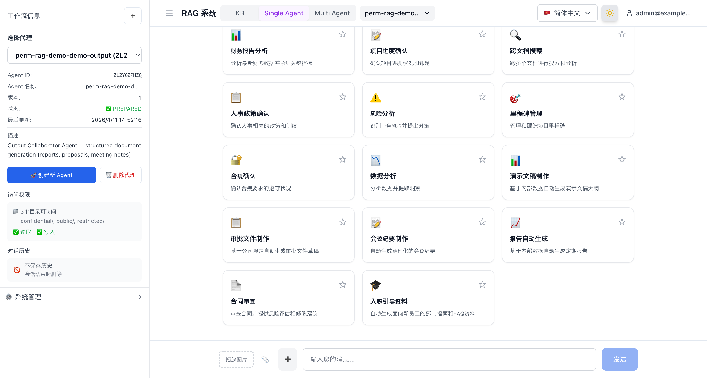

### Agent 模式 — 卡片网格 + 侧边栏

Agent 模式显示 14 张工作流卡片（8 张研究 + 6 张输出）。点击卡片会自动搜索 Bedrock Agent，如果尚未创建，则导航到 Agent Directory 创建表单。侧边栏包含 Agent 选择下拉菜单、聊天历史设置和可折叠的系统管理部分。

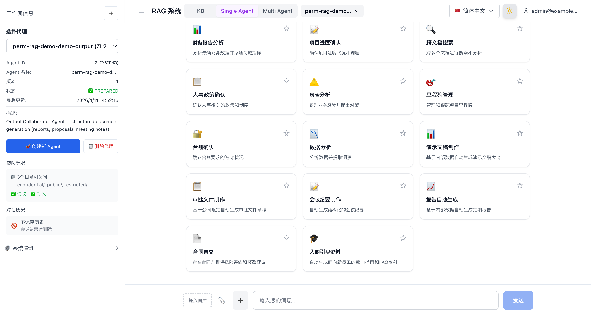

### Agent Directory — Agent 列表与管理界面

可在 `/[locale]/genai/agents` 访问的专用 Agent 管理界面。提供已创建 Bedrock Agent 的目录展示、搜索和分类过滤器、详情面板、基于模板的创建以及内联编辑/删除。导航栏支持在 Agent 模式 / Agent 列表 / KB 模式之间切换。启用企业功能后，会添加"共享 Agent"和"定时任务"选项卡。

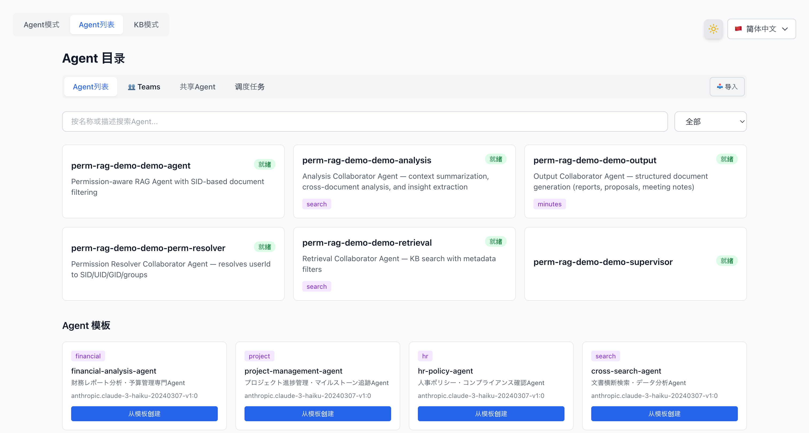

#### Agent Directory — 共享 Agent 选项卡

通过 `enableAgentSharing=true` 启用。列出、预览和导入 S3 共享存储桶中的 Agent 配置。

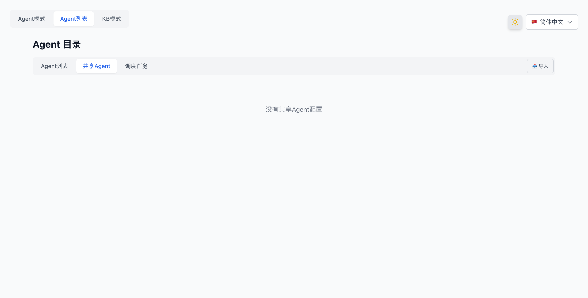

### Agent Directory — Agent 创建表单

在模板卡片上点击"从模板创建"会显示创建表单，可编辑 Agent 名称、描述、系统提示词和 AI 模型。在 Agent 模式下点击尚未创建 Agent 的卡片时也会显示相同的表单。

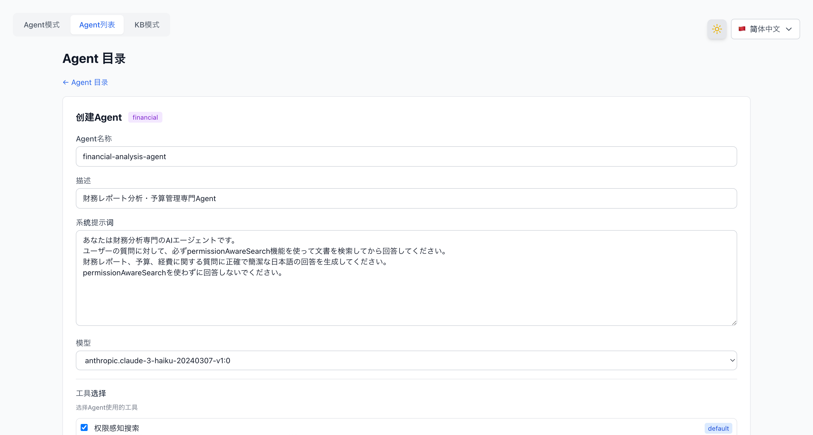

### Agent Directory — Agent 详情与编辑

点击 Agent 卡片会显示详情面板，展示 Agent ID、状态、模型、版本、创建日期、系统提示词（可折叠）和操作组。可用操作包括"编辑"进行内联编辑、"在聊天中使用"导航到 Agent 模式、"导出"下载 JSON 配置、"上传到共享存储桶"进行 S3 共享、"创建定时任务"设置定期执行，以及带确认对话框的"删除"。

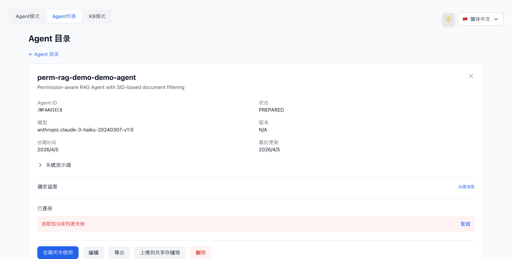

### 聊天响应 — 引用显示 + 访问级别徽章

RAG 搜索结果显示 FSx 文件路径和访问级别徽章（所有人可访问 / 仅管理员 / 特定组）。聊天过程中，"🔄 返回工作流选择"按钮可返回卡片网格。消息输入框左侧的"➕"按钮可开始新聊天。

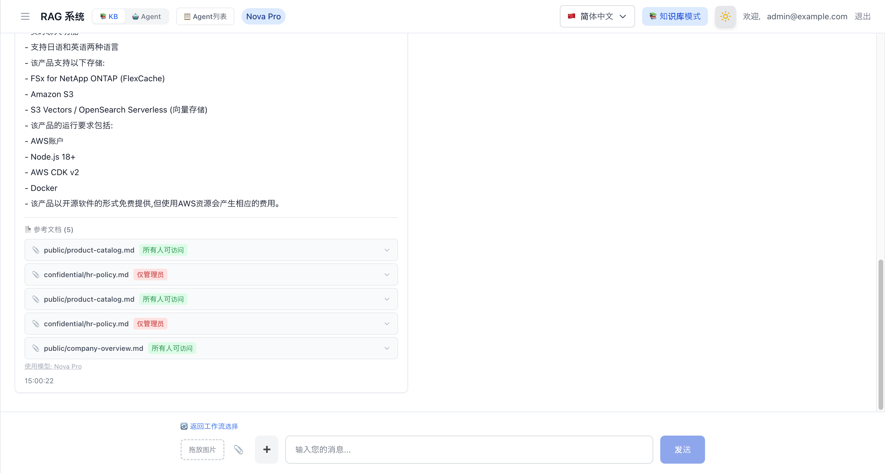

### 图像上传 — 拖放 + 文件选择器（v3.1.0）

在聊天输入区域添加了图像上传功能。通过拖放区域和 📎 文件选择器按钮附加图像，使用 Bedrock Vision API（Claude Haiku 4.5）进行分析，并集成到 KB 搜索上下文中。支持 JPEG/PNG/GIF/WebP，3MB 限制。

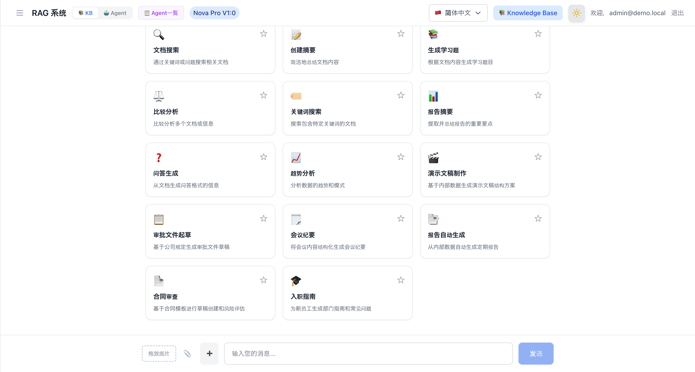

### 智能路由 — 成本优化的自动模型选择（v3.1.0）

当侧边栏中的智能路由开关打开时，会根据查询复杂度自动选择轻量模型（Haiku）或高性能模型（Sonnet）。ModelSelector 中添加了"⚡ Auto"选项，响应中显示所使用的模型名称和"Auto"徽章。

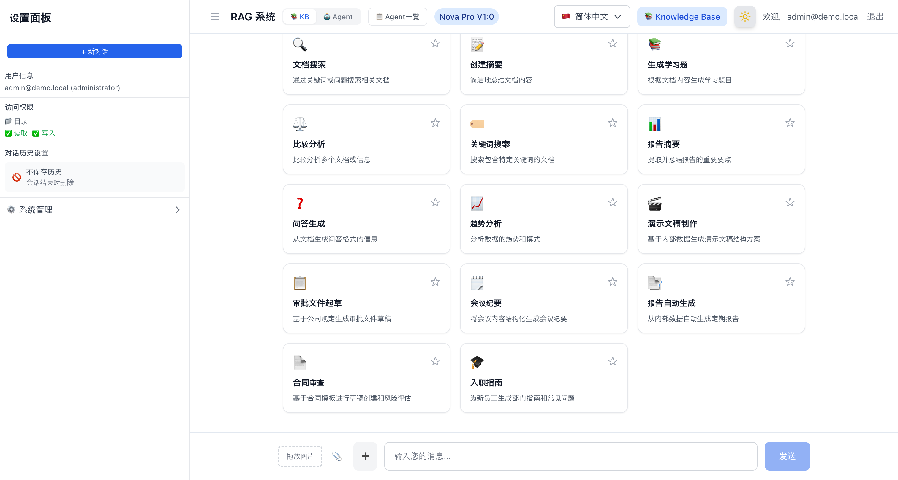

### AgentCore Memory — 会话列表 + 记忆部分（v3.3.0）

通过 `enableAgentCoreMemory=true` 启用。在 Agent 模式侧边栏中添加会话列表（SessionList）和长期记忆显示（MemorySection）。聊天历史设置替换为"AgentCore Memory: Enabled"徽章。

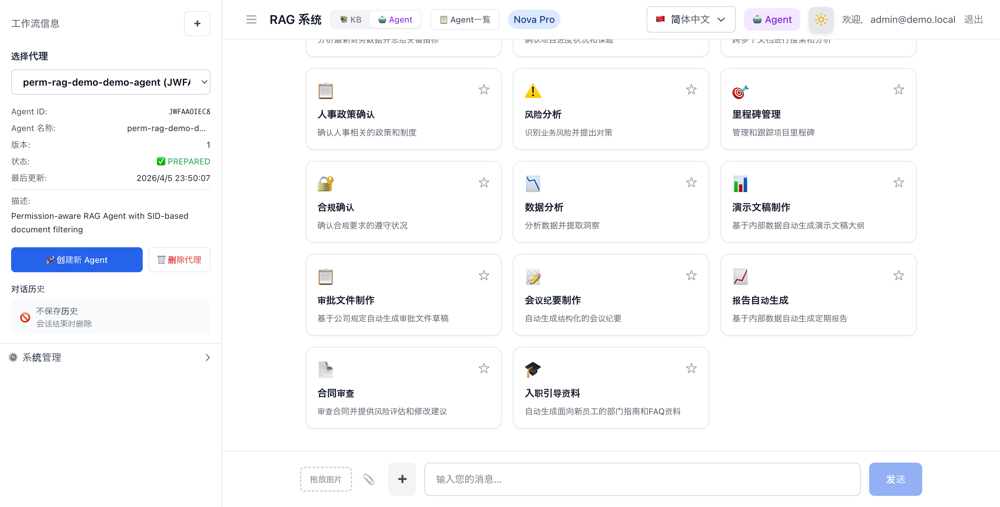

## CDK Stack 结构

| # | Stack | 区域 | 资源 | 说明 |
|---|-------|------|------|------|
| 1 | WafStack | us-east-1 | WAF WebACL, IP Set | CloudFront 的 WAF（速率限制、托管规则） |
| 2 | NetworkingStack | ap-northeast-1 | VPC, Subnets, Security Groups, VPC Endpoints (optional) | 网络基础设施 |
| 3 | SecurityStack | ap-northeast-1 | Cognito User Pool, Client, SAML IdP + OIDC IdP + Cognito Domain（启用 Federation 时）, Identity Sync Lambda（可选）, LDAP Health Check Lambda + CloudWatch Alarm（可选）, Auth Audit Log DynamoDB（可选） | 认证与授权（SAML/OIDC/邮箱） |
| 4 | StorageStack | ap-northeast-1 | FSx ONTAP + SVM + Volume, S3, DynamoDB×2, (AD), KMS encryption (optional), CloudTrail (optional) | 存储、SID 数据、权限缓存 |
| 5 | AIStack | ap-northeast-1 | Bedrock KB, S3 Vectors / OpenSearch Serverless (selected via `vectorStoreType`), Bedrock Guardrails (optional) | RAG 搜索基础设施（Titan Embed v2） |
| 6 | WebAppStack | ap-northeast-1 | Lambda (Docker, IAM Auth + OAC), CloudFront, Permission Filter Lambda (optional), MonitoringConstruct (optional) | Web 应用、Agent 管理、监控与告警 |
| 7 | EmbeddingStack (optional) | ap-northeast-1 | EC2 (m5.large), ECR, ONTAP ACL auto-retrieval (optional) | FlexCache CIFS 挂载 + Embedding 服务器 |

### 安全功能（6 层防御）

| 层级 | 技术 | 用途 |
|------|------|------|
| L1: 网络 | CloudFront Geo Restriction | 地理访问限制（默认：`["JP"]`。参见 [Geo限制](#geo限制)） |
| L2: WAF | AWS WAF (6 rules) | 攻击模式检测与阻断 |
| L3: 源站认证 | CloudFront OAC (SigV4) | 防止绕过 CloudFront 的直接访问 |
| L4: API 认证 | Lambda Function URL IAM Auth | 通过 IAM 认证进行访问控制 |
| L5: 用户认证 | Cognito JWT / SAML / OIDC Federation | 用户级认证与授权 |
| L6: 数据授权 | SID / UID+GID / OIDC组过滤 | 文档级访问控制。Fail-Closed模式（`authFailureMode=fail-closed`）可在权限获取失败时阻止登录 |

## 前提条件

- AWS 账户（具有 AdministratorAccess 等效权限）
- Node.js 22+、npm
- Docker（Colima、Docker Desktop 或 EC2 上的 docker.io）
- CDK 已引导（`cdk bootstrap aws://ACCOUNT_ID/REGION`）

> **注意**：构建可在本地（macOS / Linux）或 EC2 上运行。对于 Apple Silicon（M1/M2/M3），`pre-deploy-setup.sh` 会自动使用预构建模式（本地 Next.js 构建 + Docker 打包）生成 x86_64 Lambda 兼容镜像。在 EC2（x86_64）上执行完整 Docker 构建。

> **仅进行 UI 验证/开发时**：无需 AWS 环境即可验证 Next.js 应用的 UI。只需 Node.js 22+，认证中间件与生产环境完全相同。→ [本地开发指南](docker/nextjs/LOCAL_DEVELOPMENT.zh-CN.md)

## 部署步骤

### ⚠️ 对现有 AWS 环境影响的重要说明

本 CDK 项目会创建和修改以下 AWS 资源。**如果部署到现有生产环境或团队共享环境，请事先确认影响。**

#### 本系统的认证与 AWS 管理控制台认证完全独立

RAG 系统的认证方式（OIDC / LDAP / 邮箱密码）与 AWS 管理控制台访问（IAM Identity Center / IAM 用户）是**完全独立的系统**。更改 RAG 系统的认证方式不会影响管理控制台的访问。

```
┌──────────────────────────────┐    ┌──────────────────────────────┐
│  AWS Management Console      │    │  RAG System (Chat UI)        │
│                              │    │                              │
│  Auth: IAM Identity Center   │    │  Auth: Cognito User Pool     │
│        or IAM Users          │    │    ├ OIDC (Auth0/Okta/etc.)  │
│                              │    │    ├ SAML (AD Federation)    │
│  ← Not modified by this CDK  │    │    └ Email/Password          │
│                              │    │                              │
│  Completely independent ─────┼────┤  ← Configured by this CDK   │
└──────────────────────────────┘    └──────────────────────────────┘
```

#### 影响现有环境的参数

| 参数 | 影响 | 风险级别 | 事前确认 |
|------|------|----------|----------|
| `adPassword` | 创建新的 AWS Managed Microsoft AD（用于 FSx ONTAP）。AD 本身不影响 Identity Center — 请参阅下方说明 | 🟡 中 | 参阅下方"关于 Managed AD 的说明" |
| `enableAdFederation` | 创建 Cognito SAML IdP。在 RAG 登录页面添加"使用 AD 登录"按钮 | 🟢 低 | 确认不存在现有 Cognito User Pool |
| `enableVpcEndpoints` | 创建 VPC 端点。可能影响现有 VPC 路由 | 🟡 中 | 检查 VPC 端点限制 |
| `enableKmsEncryption` | 创建 KMS CMK。更改 S3/DynamoDB 加密设置 | 🟢 低 | 检查现有 KMS 密钥数量 |

#### 关于 Managed AD 的说明

设置 `adPassword` 会创建 AWS Managed Microsoft AD，但**仅创建 AD 不会影响 Identity Center**。

问题仅在执行以下**手动操作**时才会发生：

1. CDK 创建 Managed AD（设置了 `adPassword`）
2. **手动**将 Identity Center 的身份源从"Identity Center 目录"更改为"Active Directory"
3. Identity Center 开始使用 Managed AD 用户作为身份源
4. `cdk destroy` 删除 Managed AD
5. → Identity Center 的身份源丢失，控制台访问被阻断

**缓解措施：**
- 保持 Identity Center 的身份源为"Identity Center 目录"（默认值）— 不要更改
- 保持 IAM 用户控制台访问作为备份
- 在运行 `cdk destroy` 前检查 Identity Center 身份源设置

**验证命令：**
```bash
# 检查 IAM Identity Center 实例和用户
aws sso-admin list-instances --region ap-northeast-1
aws identitystore list-users --identity-store-id <IDENTITY_STORE_ID> --region ap-northeast-1

# 检查现有 Managed AD
aws ds describe-directories --region ap-northeast-1

# 检查现有 Cognito User Pool
aws cognito-idp list-user-pools --max-results 10 --region ap-northeast-1
```

> **建议**：对于生产环境或团队共享环境，强烈建议在专用 AWS 账户或沙箱环境中部署。

#### v3.5.0 UI/UX 优化升级说明

v3.5.0 包含对头部 UI、侧边栏结构和模式切换逻辑的重大更改。从现有环境升级时，请验证以下内容：

| 变更 | 影响 | 验证方法 |
|------|------|---------|
| 统一的 3 模式切换（KB / 单 Agent / 多 Agent） | 原有的 2 步切换（KB/Agent + 单/多）合并为一个。URL 查询参数（`?mode=agent`、`?mode=multi-agent`）保持兼容 | 在浏览器中验证模式切换是否正常工作 |
| 从头部移除 ModelIndicator | 模型选择整合到侧边栏系统设置中。无法从头部更改模型 | 验证是否可以从侧边栏系统设置更改模型 |
| Agent 选择下拉菜单提升至头部 | Agent 目录链接从用户菜单移至 Agent 选择下拉菜单 | 在 Agent 模式下验证是否可以从"Agent 选择"下拉菜单访问 Agent 目录 |
| Agent 侧边栏添加访问权限部分 | Agent 模式侧边栏现在显示目录名称和读/写权限 | 验证 Agent 模式侧边栏中是否显示访问权限 |
| CDK AI 堆栈：SupervisorAgent `agentCollaboration` | 从 `DISABLED` 更改为 `SUPERVISOR_ROUTER`。当已关联协作者时为必需 | 运行 `cdk diff perm-rag-demo-demo-AI` 进行验证 |

**升级步骤：**
```bash
# 1. 检查差异
cdk diff perm-rag-demo-demo-WebApp
cdk diff perm-rag-demo-demo-AI

# 2. 部署 WebApp（Docker 镜像更新）
./development/scripts/deploy-webapp.sh

# 3. 浏览器验证
# - KB → 单 Agent → 多 Agent 切换正常无错误
# - Agent 选择下拉菜单显示 Agent 列表
# - 侧边栏显示访问权限
```

### 步骤 1：环境设置

可在本地（macOS / Linux）或 EC2 上运行。

#### 本地（macOS）

```bash
# Node.js 22+ (Homebrew)
brew install node@22

# Docker (either one)
brew install --cask docker          # Docker Desktop (requires sudo)
brew install docker colima          # Colima (no sudo required, recommended)
colima start --cpu 4 --memory 8     # Start Colima

# AWS CDK
npm install -g aws-cdk typescript ts-node
```

#### EC2 (Ubuntu 22.04)

```bash
# Launch a t3.large in a public subnet (with SSM-enabled IAM role)
aws ec2 run-instances \
  --region ap-northeast-1 \
  --image-id <UBUNTU_22_04_AMI_ID> \
  --instance-type t3.large \
  --subnet-id <PUBLIC_SUBNET_ID> \
  --security-group-ids <SG_ID> \
  --iam-instance-profile Name=<ADMIN_INSTANCE_PROFILE> \
  --associate-public-ip-address \
  --block-device-mappings '[{"DeviceName":"/dev/sda1","Ebs":{"VolumeSize":50,"VolumeType":"gp3"}}]' \
  --tag-specifications 'ResourceType=instance,Tags=[{Key=Name,Value=cdk-deploy-server}]'
```

安全组只需开放出站 443（HTTPS）即可使 SSM Session Manager 正常工作。无需入站规则。

### 步骤 2：工具安装（EC2 用）

通过 SSM Session Manager 连接后，运行以下命令。

```bash
# System update + basic tools
sudo apt-get update -y
sudo apt-get install -y curl git unzip docker.io

# Node.js 22
curl -fsSL https://deb.nodesource.com/setup_22.x | sudo -E bash -
sudo apt-get install -y nodejs

# Enable Docker
sudo systemctl enable docker
sudo systemctl start docker
sudo usermod -aG docker ubuntu

# AWS CDK (global)
sudo npm install -g aws-cdk typescript ts-node
```

#### ⚠️ CDK CLI 版本说明

通过 `npm install -g aws-cdk` 安装的 CDK CLI 版本可能与项目的 `aws-cdk-lib` 不兼容。

```bash
# How to check
cdk --version          # Global CLI version
npx cdk --version      # Project-local CLI version
```

本项目使用 `aws-cdk-lib@2.244.0`。如果 CLI 版本过旧，会出现以下错误：

```
Cloud assembly schema version mismatch: Maximum schema version supported is 48.x.x, but found 52.0.0
```

**解决方案**：将项目本地的 CDK CLI 更新到最新版本。

```bash
cd Permission-aware-RAG-FSxN-CDK
npm install aws-cdk@latest
npx cdk --version  # Verify the updated version
```

> **重要**：使用 `npx cdk` 而非 `cdk`，以确保使用项目本地的最新 CLI。

### 步骤 3：克隆仓库并安装依赖

```bash
cd /home/ubuntu
git clone https://github.com/Yoshiki0705/FSx-for-ONTAP-Agentic-Access-Aware-RAG.git
cd FSx-for-ONTAP-Agentic-Access-Aware-RAG
npm install
```

### 步骤 4：CDK 引导（仅首次）

如果目标区域尚未执行 CDK 引导，请运行此命令。由于 WAF stack 部署到 us-east-1，两个区域都需要引导。

```bash
# ap-northeast-1 (main region)
npx cdk bootstrap aws://$(aws sts get-caller-identity --query Account --output text)/ap-northeast-1

# us-east-1 (for WAF stack)
npx cdk bootstrap aws://$(aws sts get-caller-identity --query Account --output text)/us-east-1
```

> **部署到不同 AWS 账户时**：从 `cdk.context.json` 中删除 AZ 缓存（`availability-zones:account=...`）。CDK 会自动获取新账户的 AZ 信息。

> **LDAP用户登录方式**: 请选择登录页面的"使用{providerName}登录"按钮（如"使用Keycloak登录"、"使用Okta登录"）。LDAP负责权限获取而非认证，通过OIDC IdP登录后，Identity Sync Lambda会自动从LDAP获取UID/GID/组信息。

### 步骤 5：CDK Context 配置

```bash
cat > cdk.context.json << 'EOF'
{
  "projectName": "rag-demo",
  "environment": "demo",
  "imageTag": "latest",
  "allowedIps": [],
  "allowedCountries": ["JP"]
}
EOF
```

#### Active Directory 集成（可选）

要将 FSx ONTAP SVM 加入 Active Directory 域并使用 NTFS ACL（基于 SID）的 CIFS 共享，请在 `cdk.context.json` 中添加以下内容。

```bash
cat > cdk.context.json << 'EOF'
{
  "projectName": "rag-demo",
  "environment": "demo",
  "imageTag": "latest",
  "allowedIps": [],
  "allowedCountries": ["JP"],
  "adPassword": "YourStrongP@ssw0rd123",
  "adDomainName": "demo.local"
}
EOF
```

| 参数 | 类型 | 默认值 | 说明 |
|------|------|--------|------|
| `adPassword` | string | 未设置（不创建 AD） | AWS Managed Microsoft AD 管理员密码。设置后会创建 AD 并将 SVM 加入域 |
| `adDomainName` | string | `demo.local` | AD 域名（FQDN） |

> **⚠️ 重要**：设置 `adPassword` 会创建 AWS Managed Microsoft AD。仅创建 AD 不会影响 Identity Center。但是，如果您手动将 Identity Center 的身份源更改为 Managed AD，通过 `cdk destroy` 删除 AD 将导致 Identity Center 用户丢失。请保持 Identity Center 的身份源为"Identity Center 目录"（默认值）。

> **注意**：AD 创建需要额外 20-30 分钟。无需 AD 也可进行 SID 过滤演示（使用 DynamoDB SID 数据验证）。

#### AD SAML 联合认证（可选）

可以启用 SAML 联合认证，使 AD 用户直接从 CloudFront UI 登录，并自动创建 Cognito 用户 + 自动注册 DynamoDB SID 数据。

**架构概览：**

```
AD User → CloudFront UI → "Sign in with AD" button
  → Cognito Hosted UI → SAML IdP (AD) → AD Authentication
  → Automatic Cognito User Creation
  → Post-Auth Trigger → AD Sync Lambda → DynamoDB SID Data Registration
  → OAuth Callback → Session Cookie → Chat Screen
```

**CDK 参数：**

| 参数 | 类型 | 默认值 | 说明 |
|------|------|--------|------|
| `enableAdFederation` | boolean | `false` | SAML 联合认证启用标志 |
| `cloudFrontUrl` | string | 未设置 | 用于 OAuth 回调 URL 的 CloudFront URL（例如 `https://d3xxxxx.cloudfront.net`） |
| `samlMetadataUrl` | string | 未设置 | 自管理 AD 用：Entra ID 联合认证元数据 URL |
| `adEc2InstanceId` | string | 未设置 | 自管理 AD 用：EC2 实例 ID |

> **环境变量自动配置**: 使用 `enableAdFederation=true` 或指定 `oidcProviderConfig` 部署 CDK 时，WebAppStack Lambda 函数会自动设置 Federation 环境变量（`COGNITO_DOMAIN`、`COGNITO_CLIENT_SECRET`、`CALLBACK_URL`、`IDP_NAME`）。无需手动配置 Lambda 环境变量。

**托管 AD 模式：**

使用 AWS Managed Microsoft AD 时。

> **⚠️ 需要配置 IAM Identity Center（原 AWS SSO）：**
> 要使用托管 AD SAML 元数据 URL（`portal.sso.{region}.amazonaws.com/saml/metadata/{directoryId}`），需要启用 AWS IAM Identity Center，将托管 AD 配置为身份源，并创建 SAML 应用程序。仅创建托管 AD 不会提供 SAML 元数据端点。
>
> 如果配置 IAM Identity Center 有困难，也可以通过 `samlMetadataUrl` 参数直接指定外部 IdP（AD FS 等）的元数据 URL。

```json
{
  "enableAdFederation": true,
  "adPassword": "YourStrongP@ssw0rd123",
  "adDomainName": "demo.local",
  "cloudFrontUrl": "https://d3xxxxx.cloudfront.net",
  // Optional: When using a SAML metadata URL other than IAM Identity Center
  // "samlMetadataUrl": "https://your-adfs-server/federationmetadata/2007-06/federationmetadata.xml"
}
```

设置步骤：
1. 设置 `adPassword` 并部署 CDK（创建托管 AD + SAML IdP + Cognito Domain）
2. 启用 AWS IAM Identity Center 并将身份源更改为托管 AD
3. 为 AD 用户设置电子邮件地址（PowerShell: `Set-ADUser -Identity Admin -EmailAddress "admin@demo.local"`）
4. 在 IAM Identity Center 中，转到"管理同步"→"引导式设置"以同步 AD 用户
5. 在 IAM Identity Center 中创建 SAML 应用程序"Permission-aware RAG Cognito"：
   - ACS URL: `https://{cognito-domain}.auth.{region}.amazoncognito.com/saml2/idpresponse`
   - SAML 受众: `urn:amazon:cognito:sp:{user-pool-id}`
   - 属性映射: Subject → `${user:email}` (emailAddress), emailaddress → `${user:email}`
6. 将 AD 用户分配到 SAML 应用程序
7. 部署后，在 `cloudFrontUrl` 中设置 CloudFront URL 并重新部署
8. 从 CloudFront UI 上的"使用 AD 登录"按钮执行 AD 认证

**自管理 AD 模式（EC2 上，集成 Entra Connect）：**

将 EC2 上的 AD 与 Entra ID（原 Azure AD）集成，使用 Entra ID 联合认证元数据 URL。

```json
{
  "enableAdFederation": true,
  "adEc2InstanceId": "i-0123456789abcdef0",
  "samlMetadataUrl": "https://login.microsoftonline.com/{tenant-id}/federationmetadata/2007-06/federationmetadata.xml",
  "cloudFrontUrl": "https://d3xxxxx.cloudfront.net"
}
```

设置步骤：
1. 在 EC2 上安装 AD DS 并配置 Entra Connect 同步
2. 获取 Entra ID 联合认证元数据 URL
3. 设置上述参数并部署 CDK
4. 从 CloudFront UI 上的"Sign in with AD"按钮执行 AD 认证

**模式对比：**

| 项目 | 托管 AD | 自管理 AD |
|------|---------|-----------|
| SAML 元数据 | 通过 IAM Identity Center 或 `samlMetadataUrl` 指定 | Entra ID 元数据 URL（`samlMetadataUrl` 指定） |
| SID 获取方式 | LDAP 或通过 SSM | SSM → EC2 → PowerShell |
| 必需参数 | `adPassword`、`cloudFrontUrl` + IAM Identity Center 设置（或 `samlMetadataUrl`） | `adEc2InstanceId`、`samlMetadataUrl`、`cloudFrontUrl` |
| AD 管理 | AWS 托管 | 用户自管理 |
| 成本 | 托管 AD 定价 | EC2 实例定价 |

**故障排除：**

| 症状 | 原因 | 解决方案 |
|------|------|----------|
| SAML 认证失败 | SAML IdP 元数据 URL 无效 | 托管 AD：检查 IAM Identity Center 配置，或通过 `samlMetadataUrl` 直接指定。自管理：验证 Entra ID 元数据 URL |
| OAuth 回调错误 | `cloudFrontUrl` 未设置或不匹配 | 验证 CDK context 中的 `cloudFrontUrl` 与 CloudFront Distribution URL 是否一致 |
| Post-Auth Trigger 失败 | AD Sync Lambda 权限不足 | 检查 CloudWatch Logs 获取错误详情。登录本身不会被阻止 |
| KB 搜索中的 S3 访问错误 | KB IAM 角色缺少直接 S3 存储桶访问权限 | KB IAM 角色仅通过 S3 Access Point 拥有权限。直接使用 S3 存储桶作为数据源时，需要添加 `s3:GetObject` 和 `s3:ListBucket` 权限（非 AD Federation 特有问题） |
| S3 AP 数据平面 API AccessDenied | WindowsUser 包含域前缀 | S3 AP 的 WindowsUser 不得包含域前缀（例如 `DEMO\Admin`）。仅指定用户名（例如 `Admin`）。CLI 接受域前缀但数据平面 API 会失败 |
| Cognito Domain 创建失败 | 域前缀冲突 | 检查 `{projectName}-{environment}-auth` 前缀是否与其他账户冲突 |
| USER_PASSWORD_AUTH 401 错误 | Client Secret 启用时未发送 SECRET_HASH | `enableAdFederation=true` 时 User Pool Client 设置了 Client Secret。登录 API 需要从 `COGNITO_CLIENT_SECRET` 环境变量计算 SECRET_HASH 并发送 |
| Post-Auth Trigger `Cannot find module 'index'` | Lambda TypeScript 未编译 | CDK `Code.fromAsset` 有 esbuild 打包选项。`npx esbuild index.ts --bundle --platform=node --target=node22 --outfile=index.js --external:@aws-sdk/*` |
| OAuth Callback `0.0.0.0` 重定向 | Lambda Web Adapter `request.url` 为 `http://0.0.0.0:3000/...` | 使用 `CALLBACK_URL` 环境变量构建重定向基础 URL |
| OIDC 登录 `invalid_request` | issuerUrl不一致 | 确认 `oidcProviderConfig.issuerUrl` 与IdP的 `/.well-known/openid-configuration` 的 `issuer` 字段完全一致。Auth0需要尾部斜杠（`https://xxx.auth0.com/`） |
| OIDC 登录 `Attribute cannot be updated` | Cognito User Pool的email属性为 `mutable: false` | 确认CDK的 `standardAttributes.email.mutable` 为 `true`。`mutable` 在User Pool创建后无法更改，需要重新创建User Pool |
| OIDC IdP手动删除后CDK部署失败 | CDK堆栈状态不一致 | 手动删除·重新创建Cognito IdP会导致CDK堆栈状态与实际状态不一致。仅通过CDK部署管理，避免手动操作 |
| LDAP健康检查Lambda超时 | VPC Lambda无法访问Secrets Manager | 需要NAT Gateway或 `enableVpcEndpoints=true`。测试：`aws lambda invoke --function-name perm-rag-demo-demo-ldap-health-check /tmp/result.json` |
| LDAP健康检查Alarm处于ALARM状态 | LDAP连接失败 | 检查CloudWatch Logs中的结构化日志。Connection error → SG/VPC，Bind error → 密码/DN，Search error → baseDN |
| 不使用 `--exclusively` 更新Networking堆栈失败 | VPC CrossStack Export依赖 | 使用 `npx cdk deploy perm-rag-demo-demo-Security perm-rag-demo-demo-WebApp --exclusively` |
| 邮箱/密码登录时出现 `AD_EC2_INSTANCE_ID is required` 错误 | AD 未配置时执行了 SID 同步 | v3.5.0 已修复。`AD_TYPE` 默认值改为 `none`，AD 未配置时跳过 SID 同步。使用旧版 Lambda 时需重新部署 |
| Fail-Closed 模式未触发（LDAP 用户未找到时） | 设计如此 | LDAP 用户未找到不是错误，而是回退到仅 OIDC 声明。Fail-Closed 仅在致命错误时触发：LDAP 连接超时、Secrets Manager 获取失败等 |
| `oidcProviderConfig`→`oidcProviders` 迁移时 CDK 部署失败 | Cognito IdP 资源 ID 冲突 | v3.5.0 已修复。第一个 IdP 的 CDK 资源 ID 固定为 `OidcIdP` 以保持迁移兼容性。旧版本需要 Security 堆栈 `cdk destroy` → 重新部署 |
| ONTAP REST API `User is not authorized` | fsxadmin 密码未设置 | 通过 `aws fsx update-file-system --file-system-id <FS_ID> --ontap-configuration '{"FsxAdminPassword":"<PASSWORD>"}'` 设置。存储到 Secrets Manager 并指定 `ontapAdminSecretArn` |

#### OIDC/LDAP Federation（可选）— 零接触用户配置

除 SAML AD Federation 外，还可以启用 OIDC IdP（Keycloak、Okta、Entra ID 等）和 LDAP 直接查询，实现零接触用户配置。FSx for ONTAP 的现有用户权限会自动映射到 RAG 系统 UI 用户，无需管理员或用户手动注册。

##### 如何选择认证方式

选择与您现有环境匹配的认证方式。**无论选择哪种方式，AWS 管理控制台的访问都不会受到影响。**

| 您的环境 | 推荐方式 | 登录按钮 | 配置 |
|---------|---------|---------|------|
| 没有特别的（只想试试） | 邮箱/密码 | 仅表单 | 无需配置（默认） |
| 使用 Okta | OIDC Federation | "使用 Okta 登录" | `oidcProviderConfig.providerName: "Okta"` |
| 使用 Keycloak | OIDC + LDAP | "使用 Keycloak 登录" | `oidcProviderConfig` + `ldapConfig` |
| 使用 Entra ID (Azure AD) | OIDC Federation | "使用 EntraID 登录" | `oidcProviderConfig.providerName: "EntraID"` |
| 使用 Auth0 | OIDC Federation | "使用 Auth0 登录" | `oidcProviderConfig.providerName: "Auth0"` |
| 使用 Windows AD | SAML AD Federation | "使用 AD 登录" | `enableAdFederation: true` |
| 同时使用多个 IdP | Multi-OIDC | 每个 IdP 的按钮 | `oidcProviders` 数组 |

> **按钮名称可自定义**：`providerName` 中设置的名称会直接显示在按钮上。例如，设置 `"Corporate SSO"` 会显示"使用 Corporate SSO 登录"。

各认证方式采用"配置驱动自动启用"机制。只需在 `cdk.context.json` 中添加配置值即可启用，几乎不产生额外 AWS 资源成本。SAML + OIDC 同时启用也受支持。

详情请参阅[认证与用户管理指南](docs/en/auth-and-user-management.md)。

> **LDAP 用户如何登录**：在登录页面选择"使用 {providerName} 登录"按钮（例如"使用 Keycloak 登录"、"使用 Okta 登录"）。LDAP 负责权限获取而非认证 — 通过 OIDC IdP 登录后，Identity Sync Lambda 会自动从 LDAP 获取 UID/GID/组。

**OIDC + LDAP 配置示例（OpenLDAP/FreeIPA + Keycloak）：**

```json
{
  "oidcProviderConfig": {
    "providerName": "Keycloak",
    "clientId": "rag-system",
    "clientSecret": "arn:aws:secretsmanager:ap-northeast-1:123456789012:secret:oidc-client-secret",
    "issuerUrl": "https://keycloak.example.com/realms/main",
    "groupClaimName": "groups"
  },
  "ldapConfig": {
    "ldapUrl": "ldaps://ldap.example.com:636",
    "baseDn": "dc=example,dc=com",
    "bindDn": "cn=readonly,dc=example,dc=com",
    "bindPasswordSecretArn": "arn:aws:secretsmanager:ap-northeast-1:123456789012:secret:ldap-bind-password"
  },
  "permissionMappingStrategy": "uid-gid"
}
```

**CDK 参数：**

| 参数 | 类型 | 说明 |
|------|------|------|
| `oidcProviderConfig` | object | OIDC IdP 设置（`providerName`, `clientId`, `clientSecret`, `issuerUrl`, `groupClaimName`） |
| `ldapConfig` | object | LDAP 连接设置（`ldapUrl`, `baseDn`, `bindDn`, `bindPasswordSecretArn`, `userSearchFilter`, `groupSearchFilter`） |
| `permissionMappingStrategy` | string | 权限映射策略：`sid-only`（默认）、`uid-gid`、`hybrid` |
| `ontapNameMappingEnabled` | boolean | ONTAP name-mapping 集成（UNIX 用户→Windows 用户映射） |

> **⚠️ issuerUrl注意**: `oidcProviderConfig.issuerUrl` 必须与IdP的 `/.well-known/openid-configuration` 中的 `issuer` 字段值完全匹配。Auth0需要尾部斜杠（`https://xxx.auth0.com/`），Keycloak不需要（`https://keycloak.example.com/realms/main`）。不匹配会导致Cognito令牌验证返回 `invalid_request` 错误。

> **⚠️ OIDC 联合身份验证两阶段部署**: OIDC 配置需要 `cloudFrontUrl` 用于 OAuth 回调，但首次部署时 CloudFront URL 未知。请按以下步骤进行两阶段部署：
> 1. 不设置 `cloudFrontUrl` 执行 `cdk deploy`
> 2. 从 WebApp 堆栈输出获取 CloudFront URL：`aws cloudformation describe-stacks --stack-name perm-rag-demo-demo-WebApp --query 'Stacks[0].Outputs[?OutputKey==\`CloudFrontUrl\`].OutputValue' --output text`
> 3. 在 `cdk.context.json` 中添加 `cloudFrontUrl` 并重新部署
> 4. 在 OIDC IdP 的 Allowed Callback URLs 中设置 `https://{cognito-domain}.auth.{region}.amazoncognito.com/oauth2/idpresponse`

##### Phase 2 扩展功能

Phase 2 新增了以下 7 项扩展功能。全部通过 `cdk.context.json` 参数控制。

**多OIDC IdP配置（`oidcProviders`数组）：**

除 `oidcProviderConfig`（单一IdP）外，`oidcProviders` 数组可同时注册多个OIDC IdP。登录页面会动态显示各IdP的按钮。`oidcProviderConfig` 和 `oidcProviders` 为互斥设置。

```json
{
  "oidcProviders": [
    {
      "providerName": "Okta",
      "clientId": "0oa1234567890",
      "clientSecret": "arn:aws:secretsmanager:ap-northeast-1:123456789012:secret:okta-client-secret",
      "issuerUrl": "https://company.okta.com",
      "groupClaimName": "groups"
    },
    {
      "providerName": "Keycloak",
      "clientId": "rag-system",
      "clientSecret": "arn:aws:secretsmanager:ap-northeast-1:123456789012:secret:keycloak-client-secret",
      "issuerUrl": "https://keycloak.example.com/realms/main",
      "groupClaimName": "roles"
    }
  ]
}
```

**Fail-Closed模式（`authFailureMode`）：**

默认为Fail-Open（权限获取失败时仍继续登录）。在高安全环境中，设置 `authFailureMode: "fail-closed"` 可在权限获取失败时阻止登录。

> **⚠️ Fail-Closed 触发条件**：LDAP 用户未找到不是错误，而是回退到仅 OIDC 声明（登录继续）。Fail-Closed 仅在致命错误时触发：LDAP 连接超时、Secrets Manager 密码获取失败、DynamoDB 写入失败等。

**LDAP健康检查（`healthCheckEnabled`）：**

指定 `ldapConfig` 时自动启用（默认：`true`）。通过EventBridge Rule每5分钟定期执行，验证LDAP连接、绑定和搜索的健康状态。失败时通过CloudWatch Alarm通知。

> **⚠️ VPC 网络要求**：健康检查 Lambda 部署在 VPC 内，因此访问 Secrets Manager（获取绑定密码）需要 NAT Gateway 或 Secrets Manager VPC 端点。建议使用 `enableVpcEndpoints=true`。

> **验证方法**：要验证 LDAP 健康检查是否正常工作：
> ```bash
> # Manual Lambda invocation
> aws lambda invoke --function-name perm-rag-demo-demo-ldap-health-check \
>   --region ap-northeast-1 /tmp/health-check-result.json && cat /tmp/health-check-result.json
>
> # CloudWatch Alarm state
> aws cloudwatch describe-alarms --alarm-names perm-rag-demo-demo-ldap-health-check-failure \
>   --region ap-northeast-1 --query 'MetricAlarms[0].{State:StateValue,Reason:StateReason}'
>
> # CloudWatch Logs
> aws logs tail /aws/lambda/perm-rag-demo-demo-ldap-health-check --region ap-northeast-1 --since 1h
> ```

**审计日志（`auditLogEnabled`）：**

设置 `auditLogEnabled: true` 将认证事件（登录成功/失败）记录到DynamoDB审计表。通过TTL自动删除（默认：90天）。审计表写入失败时不会阻止登录。

**TLS证书验证（`tlsCaCertArn`、`tlsRejectUnauthorized`）：**

在 `ldapConfig` 中指定 `tlsCaCertArn`（Secrets Manager的CA证书ARN）和 `tlsRejectUnauthorized`（默认：`true`）来控制LDAPS连接的自定义CA证书验证。开发环境中可设置 `tlsRejectUnauthorized: false` 允许自签名证书。

**OIDC组级文档访问控制：**

在文档元数据中设置 `allowed_oidc_groups`，通过与用户 `oidcGroups` 的交集检查进行访问控制。也可作为SID/UID-GID匹配失败时的回退机制。

**令牌刷新与会话管理：**

OIDC认证后自动刷新访问令牌。在过期前5分钟在后台执行刷新，刷新令牌过期时重定向到登录页面。

**Phase 2 CDK参数：**

| 参数 | 类型 | 默认值 | 说明 |
|------|------|--------|------|
| `oidcProviders` | array | （无） | 多OIDC IdP设置数组（与 `oidcProviderConfig` 互斥） |
| `authFailureMode` | string | `fail-open` | 权限获取失败时的行为（`fail-open` / `fail-closed`） |
| `auditLogEnabled` | boolean | `false` | 创建认证审计日志DynamoDB表 |
| `auditLogRetentionDays` | number | `90` | 审计日志保留天数（TTL自动删除） |
| `healthCheckEnabled` | boolean | `true` | LDAP健康检查Lambda + EventBridge + CloudWatch Alarm |
| `tlsCaCertArn` | string | （无） | `ldapConfig`内：LDAPS用自定义CA证书的Secrets Manager ARN |
| `tlsRejectUnauthorized` | boolean | `true` | `ldapConfig`内：TLS证书验证（`false`允许自签名证书） |

SAML + OIDC 混合配置的登录页面（AD 登录 + Auth0 登录 + 邮箱/密码）：

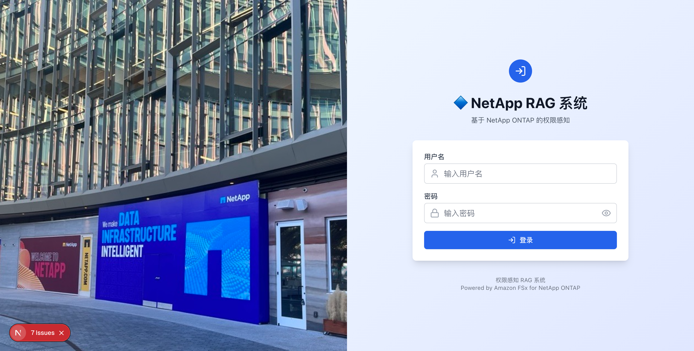

#### 企业功能（可选）

以下 CDK context 参数可启用安全增强和架构统一功能。

```json
{
  "useS3AccessPoint": "true",
  "usePermissionFilterLambda": "true",
  "enableGuardrails": "true",
  "enableKmsEncryption": "true",
  "enableCloudTrail": "true",
  "enableVpcEndpoints": "true"
}
```

| 参数 | 默认值 | 说明 |
|------|--------|------|
| `ontapMgmtIp` | （无） | ONTAP 管理 IP。设置后，Embedding 服务器会从 ONTAP REST API 自动生成 `.metadata.json` |
| `ontapSvmUuid` | （无） | SVM UUID（与 `ontapMgmtIp` 配合使用） |
| `ontapAdminSecretArn` | （无） | ONTAP 管理员密码的 Secrets Manager ARN |
| `useS3AccessPoint` | `false` | 使用 S3 Access Point 作为 Bedrock KB 数据源 |
| `volumeSecurityStyle` | `NTFS` | FSx ONTAP 卷安全样式（`NTFS` or `UNIX`） |
| `s3apUserType` | （自动） | S3 AP 用户类型（`WINDOWS` or `UNIX`）。默认：已配置 AD→WINDOWS，未配置 AD→UNIX |
| `s3apUserName` | （自动） | S3 AP 用户名。默认：WINDOWS→`Admin`，UNIX→`root` |
| `usePermissionFilterLambda` | `false` | 通过专用 Lambda 执行 SID 过滤（带内联过滤回退） |
| `enableGuardrails` | `false` | Bedrock Guardrails（有害内容过滤 + PII 保护） |
| `enableAgent` | `false` | Bedrock Agent + 权限感知 Action Group（KB 搜索 + SID 过滤）。动态 Agent 创建（点击卡片时自动创建并绑定特定类别的 Agent） |
| `enableAgentSharing` | `false` | Agent 配置共享 S3 存储桶。Agent 配置的 JSON 导出/导入，通过 S3 进行组织范围共享 |
| `enableAgentSchedules` | `false` | Agent 定时执行基础设施（EventBridge Scheduler + Lambda + DynamoDB 执行历史表） |
| `enableKmsEncryption` | `false` | S3 和 DynamoDB 的 KMS CMK 加密（启用密钥轮换） |
| `enableCloudTrail` | `false` | CloudTrail 审计日志（S3 数据访问 + Lambda 调用，90 天保留） |
| `enableVpcEndpoints` | `false` | VPC Endpoints（S3、DynamoDB、Bedrock、SSM、Secrets Manager、CloudWatch Logs） |
| `enableMonitoring` | `false` | CloudWatch 仪表板 + SNS 告警 + EventBridge KB 摄取监控。成本：仪表板 $3/月 + 告警 $0.10/告警/月 |
| `monitoringEmail` | *（无）* | 告警通知邮箱地址（`enableMonitoring=true` 时生效） |
| `enableAgentCoreMemory` | `false` | 启用 AgentCore Memory（短期和长期记忆）。需要 `enableAgent=true` |
| `enableAgentCoreObservability` | `false` | 将 AgentCore Runtime 指标集成到仪表板（`enableMonitoring=true` 时生效） |
| `enableAdvancedPermissions` | `false` | 时间基础访问控制 + 权限判定审计日志。创建 `permission-audit` DynamoDB 表 |
| `alarmEvaluationPeriods` | `1` | 告警评估周期数（连续 N 次超过阈值后触发告警） |
| `dashboardRefreshInterval` | `300` | 仪表板自动刷新间隔（秒） |
| `authFailureMode` | `fail-open` | Fail-Closed模式切换（`fail-open` / `fail-closed`）。`fail-closed`可在权限获取失败时阻止登录 |
| `auditLogEnabled` | `false` | 认证审计日志。创建DynamoDB审计表（`{prefix}-auth-audit-log`） |
| `auditLogRetentionDays` | `90` | 审计日志保留天数（TTL自动删除） |
| `healthCheckEnabled` | `true` | LDAP健康检查（指定`ldapConfig`时）。EventBridge 5分钟间隔 + CloudWatch Alarm |

#### 向量存储配置选择

使用 `vectorStoreType` 参数切换向量存储。默认为 S3 Vectors（低成本）。

| 配置 | 成本 | 延迟 | 推荐用途 |
|------|------|------|----------|
| `s3vectors`（默认） | 每月几美元 | 亚秒级到 100ms | 演示、开发、成本优化 |

#### 使用现有的 FSx for ONTAP

如果已存在 FSx for ONTAP 文件系统，可以引用现有资源而无需创建新资源。这将显著缩短部署时间（省去 FSx ONTAP 创建的 30-40 分钟等待）。

```bash
npx cdk deploy --all --app "npx ts-node bin/demo-app.ts" \
  -c existingFileSystemId=fs-0123456789abcdef0 \
  -c existingSvmId=svm-0123456789abcdef0 \
  -c existingVolumeId=fsvol-0123456789abcdef0 \
  -c vectorStoreType=s3vectors \
  -c enableAgent=true
```

| 参数 | 说明 |
|------|------|
| `existingFileSystemId` | 现有 FSx ONTAP 文件系统 ID（例如 `fs-0123456789abcdef0`） |
| `existingSvmId` | 现有 SVM ID（例如 `svm-0123456789abcdef0`） |
| `existingVolumeId` | 现有卷 ID（例：`fsvol-0123456789abcdef0`）— 指定 **一个主卷** |

> **注意**：在现有 FSx 引用模式下，FSx/SVM/Volume 不受 CDK 管理。`cdk destroy` 不会删除它们。也不会创建托管 AD（使用现有环境的 AD 设置）。


##### 一个SVM下有多个卷的情况

当一个SVM下有多个卷时，CDK部署时只需在 `existingVolumeId` 中指定 **一个主卷**。其他卷在部署完成后，按照Embedding目标管理的步骤单独添加。

```
FileSystem: fs-0123456789abcdef0
└── SVM: svm-0123456789abcdef0
    ├── vol-data      (fsvol-aaaa...)  ← existingVolumeId
    ├── vol-reports   (fsvol-bbbb...)  ← post-deploy
    └── vol-archives  (fsvol-cccc...)  ← post-deploy
```

| 配置 | 成本 | 延迟 | 推荐用途 | 元数据约束 |
|------|------|------|----------|------------|
| `s3vectors`（默认） | 每月几美元 | 亚秒级到 100ms | 演示、开发、成本优化 | filterable 2KB 限制（见下文） |
| `opensearch-serverless` | 约 $700/月 | 约 10ms | 高性能生产环境 | 无约束 |

```bash
# S3 Vectors configuration (default)
npx cdk deploy --all --app "npx ts-node bin/demo-app.ts" -c vectorStoreType=s3vectors

# OpenSearch Serverless configuration
npx cdk deploy --all --app "npx ts-node bin/demo-app.ts" -c vectorStoreType=opensearch-serverless
```

如果在 S3 Vectors 配置下需要高性能，可以使用 `demo-data/scripts/export-to-opensearch.sh` 按需导出到 OpenSearch Serverless。详情请参阅 [docs/stack-architecture-comparison.md](docs/stack-architecture-comparison.md)。

### 步骤 6：部署前设置（ECR 镜像准备）

WebApp stack 引用 ECR 仓库中的 Docker 镜像，因此必须在 CDK 部署前准备好镜像。

```bash
bash demo-data/scripts/pre-deploy-setup.sh
```

此脚本自动执行以下操作：
1. 创建 ECR 仓库（`permission-aware-rag-webapp`）
2. 构建并推送 Docker 镜像

构建模式根据主机架构自动选择：

| 主机 | 构建模式 | 说明 |
|------|----------|------|
| x86_64（EC2 等） | 完整 Docker 构建 | 在 Dockerfile 内执行 npm install + next build |
| arm64（Apple Silicon） | 预构建模式 | 本地 next build → Docker 打包 |

> **所需时间**：EC2（x86_64）：3-5 分钟，本地（Apple Silicon）：5-8 分钟，CodeBuild：5-10 分钟

> **Apple Silicon 注意事项**：需要 `docker buildx`（`brew install docker-buildx`）。推送到 ECR 时需指定 `--provenance=false`（因为 Lambda 不支持 manifest list 格式）。

### 步骤 7：CDK 部署

```bash
npx cdk deploy --all \
  --app "npx ts-node bin/demo-app.ts" \
  -c enableAgent=true \
  --require-approval never
```

启用企业功能：

```bash
npx cdk deploy --all \
  --app "npx ts-node bin/demo-app.ts" \
  -c enableAgent=true \
  -c enableAgentSharing=true \
  -c enableAgentSchedules=true \
  --require-approval never
```

启用监控与告警：

```bash
npx cdk deploy --all \
  --app "npx ts-node bin/demo-app.ts" \
  -c enableAgent=true \
  -c enableMonitoring=true \
  -c monitoringEmail=ops@example.com \
  --require-approval never
```

> **监控成本估算**：CloudWatch Dashboard $3/月 + Alarms $0.10/告警/月（7 个告警 = $0.70/月）+ SNS 通知在免费额度内。总计约 $4/月。

> **所需时间**：FSx for ONTAP 创建需要 20-30 分钟，因此总计约 30-40 分钟。

### 步骤 8：部署后设置（单条命令）

CDK 部署完成后，使用此单条命令即可完成所有设置：

```bash
bash demo-data/scripts/post-deploy-setup.sh
```

此脚本自动执行以下操作：
1. 创建 S3 Access Point + 配置策略
2. 上传演示数据到 FSx ONTAP（通过 S3 AP）
3. 添加 Bedrock KB 数据源 + 同步
4. 在 DynamoDB 中注册用户 SID 数据
5. 在 Cognito 中创建演示用户（admin / user）

> **所需时间**：2-5 分钟（包括 KB 同步等待）

### 步骤 9：部署验证（自动化测试）

运行自动化测试脚本验证所有功能。

```bash
bash demo-data/scripts/verify-deployment.sh
```

测试结果自动生成在 `docs/test-results.md` 中。验证项目：
- Stack 状态（所有 6 个 stack CREATE/UPDATE_COMPLETE）
- 资源存在性（Lambda URL、KB、Agent）
- 应用响应（登录页面 HTTP 200）
- KB 模式权限感知（admin：所有文档允许，user：仅公开文档）
- Agent 模式权限感知（Action Group SID 过滤）
- S3 Access Point（AVAILABLE）
- 企业 Agent 功能（S3 共享存储桶、DynamoDB 执行历史表、scheduler Lambda、Sharing/Schedules API 响应）*仅在启用 `enableAgentSharing`/`enableAgentSchedules` 时

### 步骤 10：浏览器访问

从 CloudFormation 输出中获取 URL 并在浏览器中访问。

```bash
aws cloudformation describe-stacks \
  --stack-name perm-rag-demo-demo-WebApp \
  --query 'Stacks[0].Outputs[?OutputKey==`CloudFrontUrl`].OutputValue' \
  --output text
```

### 资源清理

> **⚠️ 重要**：`cleanup-all.sh` 会删除所有 CDK 堆栈。如果 Managed AD（设置了 `adPassword` 时）被删除，可能会影响 IAM Identity Center 的身份源。删除前请确认：
> - Identity Center 的身份源未设置为 Managed AD
> - IAM 用户控制台访问已启用（作为备份）

使用一次性删除所有资源（CDK stack + 手动创建的资源）的脚本：

```bash
bash demo-data/scripts/cleanup-all.sh
```

此脚本自动执行以下操作：
1. 删除手动创建的资源（S3 AP、ECR、CodeBuild）
2. 删除 Bedrock KB 数据源（CDK destroy 前必需）
3. 删除动态创建的 Bedrock Agent（CDK 管理范围外的 Agent）
4. 删除企业 Agent 功能资源（EventBridge Scheduler 计划和组、S3 共享存储桶）
5. 删除 Embedding stack（如果存在）
6. CDK destroy（所有 stack）
7. 逐个删除剩余 stack + 孤立 AD SG 删除
8. 删除 VPC 中非 CDK 管理的 EC2 实例和 SG + 重新删除 Networking stack
9. CDKToolkit + CDK staging S3 存储桶删除（两个区域，支持版本控制）

> **注意**：FSx ONTAP 删除需要 20-30 分钟，因此总计约 30-40 分钟。

## 故障排除

### WebApp Stack 创建失败（ECR 镜像未找到）

| 症状 | 原因 | 解决方案 |
|------|------|----------|
| `Source image ... does not exist` | ECR 仓库中没有 Docker 镜像 | 先运行 `bash demo-data/scripts/pre-deploy-setup.sh` |

> **重要**：对于新账户，务必在 CDK 部署前运行 `pre-deploy-setup.sh`。WebApp stack 引用 ECR 中的 `permission-aware-rag-webapp:latest` 镜像。

### CDK CLI 版本不匹配

| 症状 | 原因 | 解决方案 |
|------|------|----------|
| `Cloud assembly schema version mismatch` | 全局 CDK CLI 版本过旧 | 使用 `npm install aws-cdk@latest` 更新项目本地版本，并使用 `npx cdk` |

### CloudFormation Hook 导致部署失败

| 症状 | 原因 | 解决方案 |
|------|------|----------|
| `The following hook(s)/validation failed: [AWS::EarlyValidation::ResourceExistenceCheck]` | 组织级 CloudFormation Hook 阻止 ChangeSet | 添加 `--method=direct` 选项绕过 ChangeSet |

```bash
# Deploying in environments with CloudFormation Hook enabled
npx cdk deploy --all --app "npx ts-node bin/demo-app.ts" --method=direct --require-approval never

# Bootstrap also uses create-stack for direct creation
aws cloudformation create-stack --stack-name CDKToolkit \
  --template-body file://cdk-bootstrap-template.yaml \
  --capabilities CAPABILITY_IAM CAPABILITY_NAMED_IAM CAPABILITY_AUTO_EXPAND
```

### Docker 权限错误

| 症状 | 原因 | 解决方案 |
|------|------|----------|
| `permission denied while trying to connect to the Docker daemon` | 用户不在 docker 组中 | `sudo usermod -aG docker ubuntu && newgrp docker` |

### AgentCore Memory 部署失败

| 症状 | 原因 | 解决方案 |
|------|------|----------|
| `EarlyValidation::PropertyValidation` | CfnMemory 属性不符合 schema | Name 中不允许使用连字符（替换为 `_`），EventExpiryDuration 以天为单位（最小:3，最大:365） |
| `Please provide a role with a valid trust policy` | Memory IAM 角色的服务主体无效 | 使用 `bedrock-agentcore.amazonaws.com`（而非 `bedrock.amazonaws.com`） |
| `actorId failed to satisfy constraint` | actorId 包含邮箱地址中的 `@` `.` | 已在 `lib/agentcore/auth.ts` 中处理：`@` → `_at_`、`.` → `_dot_` |
| `AccessDeniedException: bedrock-agentcore:CreateEvent` | Lambda 执行角色缺少 AgentCore 权限 | 使用 `enableAgentCoreMemory=true` 部署 CDK 时会自动添加 |
| `exec format error`（Lambda 启动失败） | Docker 镜像架构与 Lambda 不匹配 | Lambda 为 x86_64。在 Apple Silicon 上使用 `docker buildx` + `--platform linux/amd64` |

### SSM Session Manager 连接失败

| 症状 | 原因 | 解决方案 |
|------|------|----------|
| 实例未在 SSM 中显示 | IAM 角色未配置或出站 443 被阻止 | 检查 IAM 实例配置文件和 SG 出站规则 |

### `cdk destroy` 时的删除顺序问题

删除环境时可能依次出现以下问题。

#### 已知问题：Storage Stack UPDATE_ROLLBACK_COMPLETE

CDK 模板更改（如 S3 AP 自定义资源属性更改）后，运行 `cdk deploy --all` 可能导致 Storage stack 进入 UPDATE_ROLLBACK_COMPLETE 状态。

- **影响**：`cdk deploy --all` 失败。资源本身正常运行
- **临时解决方案**：使用 `npx cdk deploy <STACK> --exclusively` 单独更新 stack
- **根本修复**：使用 `cdk destroy` 完全删除后重新部署

#### 问题 1：Embedding Stack 存在时无法删除 AI Stack

如果使用 `enableEmbeddingServer=true` 部署，`cdk destroy --all` 无法识别 Embedding stack（因为它依赖 CDK context）。

```bash
# Manually delete the Embedding stack first
aws cloudformation delete-stack --stack-name perm-rag-demo-demo-Embedding --region ap-northeast-1
aws cloudformation wait stack-delete-complete --stack-name perm-rag-demo-demo-Embedding --region ap-northeast-1

# Then run cdk destroy
npx cdk destroy --all --app "npx ts-node bin/demo-app.ts" --force
```

#### 问题 2：Bedrock KB 中存在数据源时删除失败

附加了数据源的 KB 无法删除。如果 AI stack 删除结果为 `DELETE_FAILED`：

```bash
# Delete data sources first
KB_ID=$(aws cloudformation describe-stacks --stack-name perm-rag-demo-demo-AI --region ap-northeast-1 \
  --query 'Stacks[0].Outputs[?OutputKey==`KnowledgeBaseId`].OutputValue' --output text)
DS_IDS=$(aws bedrock-agent list-data-sources --knowledge-base-id $KB_ID --region ap-northeast-1 \
  --query 'dataSourceSummaries[].dataSourceId' --output text)
for DS_ID in $DS_IDS; do
  aws bedrock-agent delete-data-source --knowledge-base-id $KB_ID --data-source-id $DS_ID --region ap-northeast-1
done
sleep 10

# Retry AI stack deletion
aws cloudformation delete-stack --stack-name perm-rag-demo-demo-AI --region ap-northeast-1
```

#### 问题 3：附加 S3 Access Point 时 FSx Volume 删除失败

附加了 S3 AP 的 Storage stack FSx ONTAP volume 无法删除：

```bash
# Detach and delete S3 AP
aws fsx detach-and-delete-s3-access-point --name perm-rag-demo-s3ap --region ap-northeast-1
sleep 30

# Retry Storage stack deletion
aws cloudformation delete-stack --stack-name perm-rag-demo-demo-Storage --region ap-northeast-1
```

#### 问题 4：孤立 AD Controller SG 阻止 VPC 删除

使用托管 AD 时，AD 删除后 AD Controller SG 可能残留：

```bash
# Identify orphaned SG
VPC_ID=$(aws cloudformation describe-stacks --stack-name perm-rag-demo-demo-Networking --region ap-northeast-1 \
  --query 'Stacks[0].Outputs[?OutputKey==`VpcId`].OutputValue' --output text)
aws ec2 describe-security-groups --filters "Name=vpc-id,Values=$VPC_ID" "Name=group-name,Values=d-*_controllers" \
  --region ap-northeast-1 --query 'SecurityGroups[].GroupId' --output text

# Delete SG
aws ec2 delete-security-group --group-id <SG_ID> --region ap-northeast-1

# Retry Networking stack deletion
aws cloudformation delete-stack --stack-name perm-rag-demo-demo-Networking --region ap-northeast-1
```

#### 问题 5：VPC 子网中存在 EC2 实例时 Networking Stack 删除失败

如果 VPC 子网中存在非 CDK 管理的 EC2 实例（如 Docker 构建 EC2），`cdk destroy` 会导致 Networking stack 进入 `DELETE_FAILED` 状态。

| 症状 | 原因 | 解决方案 |
|------|------|----------|
| `The subnet 'subnet-xxx' has dependencies and cannot be deleted` | 子网中存在非 CDK 管理的 EC2 | 终止 EC2 → 删除 SG → 删除密钥对 → 重试 stack 删除 |

```bash
# Identify EC2 instances in VPC
VPC_ID="vpc-xxx"
aws ec2 describe-instances --filters "Name=vpc-id,Values=$VPC_ID" "Name=instance-state-name,Values=running,stopped" \
  --query 'Reservations[].Instances[].{Id:InstanceId,Name:Tags[?Key==`Name`].Value|[0]}' --output table

# Terminate EC2
aws ec2 terminate-instances --instance-ids <INSTANCE_ID>
aws ec2 wait instance-terminated --instance-ids <INSTANCE_ID>

# Delete remaining SGs
aws ec2 describe-security-groups --filters "Name=vpc-id,Values=$VPC_ID" \
  --query 'SecurityGroups[?GroupName!=`default`].{Id:GroupId,Name:GroupName}' --output table
aws ec2 delete-security-group --group-id <SG_ID>

# Delete key pair (if no longer needed)
aws ec2 delete-key-pair --key-name <KEY_NAME>

# Retry Networking stack deletion
aws cloudformation delete-stack --stack-name perm-rag-demo-demo-Networking
aws cloudformation wait stack-delete-complete --stack-name perm-rag-demo-demo-Networking
```

#### 问题 6：CDK Staging S3 存储桶因版本控制导致删除失败

CDK Bootstrap 创建的 S3 staging 存储桶（`cdk-hnb659fds-assets-*`）启用了版本控制。`aws s3 rb --force` 会留下对象版本和 DeleteMarker，导致存储桶删除失败。

```bash
# Delete all versions and DeleteMarkers before deleting the bucket
BUCKET="cdk-hnb659fds-assets-ACCOUNT_ID-REGION"

# Delete object versions
aws s3api list-object-versions --bucket "$BUCKET" \
  --query '{Objects: Versions[].{Key:Key,VersionId:VersionId}}' --output json | \
  aws s3api delete-objects --bucket "$BUCKET" --delete file:///dev/stdin

# Delete DeleteMarkers
aws s3api list-object-versions --bucket "$BUCKET" \
  --query '{Objects: DeleteMarkers[].{Key:Key,VersionId:VersionId}}' --output json | \
  aws s3api delete-objects --bucket "$BUCKET" --delete file:///dev/stdin

# Delete bucket
aws s3api delete-bucket --bucket "$BUCKET"
```

#### 问题 5：构建 EC2 阻止子网删除

如果 VPC 中残留构建 EC2 实例，Networking stack 子网删除将失败：

```bash
# Terminate build EC2
aws ec2 describe-instances --filters "Name=instance-state-name,Values=running" \
  --query 'Reservations[].Instances[?Tags[?Key==`Name` && contains(Value, `build`)]].InstanceId' \
  --output text --region ap-northeast-1
aws ec2 terminate-instances --instance-ids <INSTANCE_ID> --region ap-northeast-1

# Wait 60 seconds then retry Networking stack deletion
sleep 60
aws cloudformation delete-stack --stack-name <PREFIX>-Networking --regio
```

#### 问题 6：现有 FSx 引用模式下的 cdk destroy

使用 `existingFileSystemId` 指定部署时，`cdk destroy` 不会删除 FSx/SVM/Volume（CDK 管理范围外）。S3 Vectors 向量存储桶和索引会正常删除。

#### 推荐：完整清理脚本

> **⚠️ 重要**：`cleanup-all.sh` 会删除所有 CDK 堆栈。如果 Managed AD（设置了 `adPassword` 时）被删除，可能会影响 IAM Identity Center 的身份源。删除前请确认：
> - Identity Center 的身份源未设置为 Managed AD
> - IAM 用户控制台访问已启用（作为备份）

避免上述问题的完整删除流程已自动化在 `demo-data/scripts/cleanup-all.sh` 中：

```bash
bash demo-data/scripts/cleanup-all.sh
```

此脚本按顺序执行以下操作：
1. 删除手动创建的资源（S3 AP、ECR、CodeBuild、CodeBuild S3 存储桶）
2. 删除 Bedrock KB 数据源（CDK destroy 前必需）
3. 删除动态创建的 Bedrock Agent（CDK 管理范围外的 Agent）
4. 删除企业 Agent 功能资源（EventBridge Scheduler 计划和组、S3 共享存储桶）
5. 删除 Embedding stack（如果存在）
6. CDK destroy（所有 stack）
7. 逐个删除剩余 stack + 孤立 AD SG 删除
8. 删除 VPC 中非 CDK 管理的 EC2 实例和 SG + 重新删除 Networking stack
9. CDKToolkit + CDK staging S3 存储桶删除（两个区域，支持版本控制）

## WAF 与地理限制配置

### WAF 规则配置

CloudFront WAF 部署到 `us-east-1`，由 6 条规则组成（按优先级顺序评估）。

| 优先级 | 规则名称 | 类型 | 说明 |
|--------|----------|------|------|
| 100 | RateLimit | Custom | 单个 IP 地址在 5 分钟内超过 3000 次请求时阻止 |
| 200 | AWSIPReputationList | AWS Managed | 阻止僵尸网络和 DDoS 源等恶意 IP 地址 |
| 300 | AWSCommonRuleSet | AWS Managed | OWASP Top 10 合规通用规则（XSS、LFI、RFI 等）。为兼容 RAG 请求，排除了 `GenericRFI_BODY`、`SizeRestrictions_BODY`、`CrossSiteScripting_BODY` |
| 400 | AWSKnownBadInputs | AWS Managed | 阻止利用已知漏洞（如 Log4j（CVE-2021-44228））的请求 |
| 500 | AWSSQLiRuleSet | AWS Managed | 检测并阻止 SQL 注入攻击模式 |
| 600 | IPAllowList | Custom（可选） | 仅在配置了 `allowedIps` 时激活。阻止不在列表中的 IP |

### 地理限制

在 CloudFront 层面应用地理访问限制。这是独立于 WAF 的另一层保护。

- 默认：`["JP"]`（仅日本）
- 通过 CloudFront 的 `GeoRestriction.allowlist` 实现
- 来自非允许国家的访问返回 `403 Forbidden`

> **从日本以外访问时**：在 `cdk.context.json` 的 `allowedCountries` 中添加您所在国家的 ISO 3166-1 alpha-2 代码（例：`["JP", "US", "DE", "SG"]`）。设置为空数组 `[]` 可允许全球访问。

### 配置

修改 `cdk.context.json` 中的以下值。

```json
{
  "allowedIps": ["203.0.113.0/24", "198.51.100.1/32"],
  "allowedCountries": ["JP", "US"]
}
```

| 参数 | 类型 | 默认值 | 说明 |
|------|------|--------|------|
| `allowedIps` | string[] | `[]`（无限制） | 允许的 IP 地址 CIDR 列表。为空时不创建 IP 过滤规则 |
| `allowedCountries` | string[] | `["JP"]` | CloudFront 地理限制允许的国家代码（ISO 3166-1 alpha-2） |

### 自定义示例

要更改速率限制阈值或添加/排除规则，请直接编辑 `lib/stacks/demo/demo-waf-stack.ts`。

```typescript
// To change rate limit to 1000 req/5min
rateBasedStatement: { limit: 1000, aggregateKeyType: 'IP' },

// To change Common Rule Set exclusion rules
excludedRules: [
  { name: 'GenericRFI_BODY' },
  { name: 'SizeRestrictions_BODY' },
  // Remove this line to remove CrossSiteScripting_BODY from exclusion list (enable it)
],
```

更改后，使用 `npx cdk deploy --all --app "npx ts-node bin/demo-app.ts"` 应用。由于 WAF stack 部署到 `us-east-1`，会自动执行跨区域部署。

## Embedding 服务器（可选）

通过 CIFS 挂载 FlexCache Cache 卷并执行 Embedding 的 EC2 服务器。当 FSx ONTAP S3 Access Point 不可用时（截至 2026 年 3 月，FlexCache Cache 卷不支持 S3 Access Point）作为替代路径使用。

### 数据摄取路径

本系统使用单路径架构：FSx ONTAP → S3 Access Point → Bedrock KB。Bedrock KB 管理所有文档检索、分块、向量化和存储。

```
FSx ONTAP Volume (/data)
  ├── public/company-overview.md
  ├── public/company-overview.md.metadata.json
  ├── confidential/financial-report.md
  ├── confidential/financial-report.md.metadata.json
  └── ...
      │ S3 Access Point
      ▼
  Bedrock KB Data Source (S3 AP alias)
      │ Ingestion Job (chunking + vectorization with Titan Embed v2)
      ▼
  Vector Store (selected via vectorStoreType)
    ├── S3 Vectors (default: low cost, sub-second latency)
    └── OpenSearch Serverless (high performance, ~$700/month)
```

Bedrock KB Ingestion Job 执行的处理：
1. 通过 S3 Access Point 从 FSx ONTAP 读取文档和 `.metadata.json`
2. 对文档进行分块
3. 使用 Amazon Titan Embed Text v2（1024 维）进行向量化
4. 将向量 + 元数据（包括 `allowed_group_sids`）存储到向量存储中

#### Ingestion Job

Ingestion Job (KB sync) ingests documents from a data source into the vector store. **It does not run automatically.**

```bash
aws bedrock-agent start-ingestion-job \
  --knowledge-base-id <KB_ID> \
  --data-source-id <DATA_SOURCE_ID> \
  --region ap-northeast-1
```

| Constraint | Value | Description |
|-----------|-------|-------------|
| Max data per job | **100 GB** | Total data source size per Ingestion Job |
| Max file size | **50 MB** | Individual file size limit (images: 3.75 MB) |
| Concurrent jobs (per KB) | **1** | No parallel jobs on same KB |
| Concurrent jobs (per account) | **5** | Max 5 simultaneous jobs |
| API rate | **0.1 req/sec** | Once every 10 seconds |

> Reference: [Amazon Bedrock quotas](https://docs.aws.amazon.com/general/latest/gr/bedrock.html)

**100 GB workaround:** Split into multiple data sources (e.g., by department), each with its own S3 Access Point.

搜索流程：
```
App → Bedrock KB Retrieve API → Vector Store (vector search)
  → Search results + metadata (allowed_group_sids) returned
  → App-side SID filtering → Converse API (response generation)
```

### Embedding 目标文档配置

嵌入到 Bedrock KB 中的文档由 FSx ONTAP 卷上的文件结构决定。

#### 目录结构和 SID 元数据

```
FSx ONTAP Volume (/data)
  ├── public/                          ← Accessible to all users
  │   ├── product-catalog.md           ← Document body
  │   └── product-catalog.md.metadata.json  ← SID metadata
  ├── confidential/                    ← Admin only
  │   ├── financial-report.md
  │   └── financial-report.md.metadata.json
  └── restricted/                      ← Specific groups only
      ├── project-plan.md
      └── project-plan.md.metadata.json
```

#### .metadata.json 格式

在每个文档对应的 `.metadata.json` 文件中设置基于 SID 的访问控制。

```json
{
  "metadataAttributes": {
    "allowed_group_sids": "[\"S-1-1-0\"]",
    "access_level": "public",
    "doc_type": "catalog"
  }
}
```

| 字段 | 必需 | 说明 |
|------|------|------|
| `allowed_group_sids` | ✅ | 允许访问的 SID JSON 数组字符串。`S-1-1-0` 表示 Everyone |
| `access_level` | 可选 | UI 显示用的访问级别（`public`、`confidential`、`restricted`） |
| `doc_type` | 可选 | 文档类型（用于未来过滤） |

#### 关键 SID 值

| SID | 名称 | 用途 |
|-----|------|------|
| `S-1-1-0` | Everyone | 向所有用户公开的文档 |
| `S-1-5-21-...-512` | Domain Admins | 仅管理员可访问的文档 |
| `S-1-5-21-...-1100` | Engineering | 工程组的文档 |

> **详情**：SID 过滤机制请参阅 [docs/SID-Filtering-Architecture.md](docs/SID-Filtering-Architecture.md)。


#### Permission Metadata — Design & Future Improvements

`.metadata.json` is a standard Bedrock KB specification, not custom to this project.

At scale (thousands of documents), managing `.metadata.json` per file becomes a burden. Alternative approaches:

| Approach | Feasibility | Pros | Cons |
|---|---|---|---|
| `.metadata.json` (current) | ✅ | Bedrock KB native. No extra infra | Doubles file count |
| DynamoDB permission master + auto-gen | ✅ | DB-only permission changes. Easy audit | Requires generation pipeline |
| ONTAP REST API dynamic retrieval | ✅ Partial | File server ACLs as source of truth | Needs Embedding server |
| Bedrock KB Custom Data Source | ✅ | No `.metadata.json` needed | No S3 AP integration |

**Recommended (large-scale):** ONTAP REST API → DynamoDB (permission master) → auto-generate `.metadata.json` → Bedrock KB Ingestion Job.

#### S3 Vectors 元数据约束和注意事项

使用 S3 Vectors 配置（`vectorStoreType=s3vectors`）时，请注意以下元数据约束。

| 约束 | 值 | 影响 |
|------|-----|------|
| 可过滤元数据 | 2KB/向量 | 包括 Bedrock KB 内部元数据（约 1KB），自定义元数据实际上 **1KB 或更少** |
| 不可过滤元数据键 | 最多 10 个键/索引 | Bedrock KB 自动键（5 个）+ 自定义键（5 个）即达到限制 |
| 总元数据 | 40KB/向量 | 通常不是问题 |

CDK 代码中实现了以下缓解措施：
- Bedrock KB 自动分配的元数据键（`x-amz-bedrock-kb-chunk-id` 等，5 个键）设置为 `nonFilterableMetadataKeys`
- 包括 `allowed_group_sids` 在内的所有自定义元数据也设置为不可过滤
- SID 过滤通过 Bedrock KB Retrieve API 元数据返回 + 应用端匹配实现（不使用 S3 Vectors QueryVectors 过滤器）

添加自定义元数据时的注意事项：
- `.metadata.json` 中的键数量保持在 5 个或更少（由于 10 个不可过滤键的限制）
- 保持值大小较小（建议使用缩短的 SID 值，例如 `S-1-5-21-...-512` → `S-1-5-21-512`）
- PDF 文件会自动分配页码元数据，容易导致自定义元数据总量超过 2KB
- OpenSearch Serverless 配置（`vectorStoreType=opensearch-serverless`）没有此类约束

> **详情**：S3 Vectors 元数据约束验证结果请参阅 [docs/s3-vectors-sid-architecture-guide.md](docs/s3-vectors-sid-architecture-guide.md)。

### 数据摄取路径选择

| 路径 | 方式 | CDK 激活 | 状态 |
|------|------|----------|------|
| 主路径 | FSx ONTAP → S3 Access Point → Bedrock KB → Vector Store | CDK 部署后运行 `post-deploy-setup.sh` | ✅ |
| 回退路径 | 直接 S3 存储桶上传 → Bedrock KB → Vector Store | 手动（`upload-demo-data.sh`） | ✅ |
| 替代路径（可选） | Embedding 服务器（CIFS 挂载）→ 直接 AOSS 写入 | `-c enableEmbeddingServer=true` | ✅（仅 AOSS 配置） |

> **回退路径**：如果 FSx ONTAP S3 AP 不可用（例如 Organization SCP 限制），可以直接将文档 + `.metadata.json` 上传到 S3 存储桶并配置为 KB 数据源。SID 过滤不依赖于数据源类型。

### 手动管理 Embedding 目标文档

无需 CDK 部署即可添加、修改和删除 Embedding 目标文档。

#### 添加文档

通过 FSx ONTAP S3 Access Point（主路径）：

```bash
# Place files on FSx ONTAP via SMB from EC2 or WorkSpaces within the VPC
SVM_IP=<SVM_SMB_IP>
smbclient //$SVM_IP/data -U 'demo.local\Admin%<PASSWORD>' \
  -c "cd public; put new-document.md; put new-document.md.metadata.json"

# Run KB sync (required after adding documents)
# For S3 AP data source, Bedrock KB automatically retrieves files from FSx via S3 AP
aws bedrock-agent start-ingestion-job \
  --knowledge-base-id <KB_ID> \
  --data-source-id <DATA_SOURCE_ID> \
  --region ap-northeast-1
```

直接 S3 存储桶上传（回退路径）：

```bash
# Upload documents + metadata to S3 bucket
aws s3 cp new-document.md s3://<DATA_BUCKET>/public/new-document.md
aws s3 cp new-document.md.metadata.json s3://<DATA_BUCKET>/public/new-document.md.metadata.json

# KB sync
aws bedrock-agent start-ingestion-job \
  --knowledge-base-id <KB_ID> \
  --data-source-id <DATA_SOURCE_ID> \
  --region ap-northeast-1
```

#### 更新文档

覆盖文档后，重新运行 KB 同步。Bedrock KB 会自动检测更改的文档并重新嵌入。

```bash
# Overwrite document via SMB
smbclient //$SVM_IP/data -U 'demo.local\Admin%<PASSWORD>' \
  -c "cd public; put updated-document.md product-catalog.md"

# KB sync (change detection + re-embedding)
aws bedrock-agent start-ingestion-job \
  --knowledge-base-id <KB_ID> \
  --data-source-id <DATA_SOURCE_ID> \
  --region ap-northeast-1
```

#### 删除文档

```bash
# Delete document via SMB
smbclient //$SVM_IP/data -U 'demo.local\Admin%<PASSWORD>' \
  -c "cd public; del old-document.md; del old-document.md.metadata.json"

# KB sync (deletion detection + removal from vector store)
aws bedrock-agent start-ingestion-job \
  --knowledge-base-id <KB_ID> \
  --data-source-id <DATA_SOURCE_ID> \
  --region ap-northeast-1
```

#### 更改 SID 元数据（访问权限变更）

要更改文档访问权限，更新 `.metadata.json` 并运行 KB 同步。

```bash
# Example: Change a public document to confidential
cat > financial-report.md.metadata.json << 'EOF'
{"metadataAttributes":{"allowed_group_sids":"[\"S-1-5-21-...-512\"]","access_level":"confidential","doc_type":"financial"}}
EOF

smbclient //$SVM_IP/data -U 'demo.local\Admin%<PASSWORD>' \
  -c "cd confidential; put financial-report.md.metadata.json"

# KB sync
aws bedrock-agent start-ingestion-job \
  --knowledge-base-id <KB_ID> \
  --data-source-id <DATA_SOURCE_ID> \
  --region ap-northeast-1
```

### 管理 FSx for ONTAP 卷 Embedding 目标

将现有 FSx ONTAP 卷添加或移除为 Bedrock KB Embedding 目标的操作步骤。卷的创建/删除由 FSx 管理员执行。

#### 将卷添加为 Embedding 目标

```bash
# 1. Create S3 Access Point for the target volume
aws fsx create-and-attach-s3-access-point \
  --name <S3AP_NAME> \
  --type ONTAP \
  --ontap-configuration '{
    "VolumeId": "<VOLUME_ID>",
    "FileSystemIdentity": {
      "Type": "WINDOWS",
      "WindowsUser": {"Name": "Admin"}
    }
  }' --region ap-northeast-1
# ⚠️ 重要：WindowsUser 不得包含域前缀（例如 DEMO\Admin 或 demo.local\Admin）。
# 域前缀会导致数据平面 API（ListObjects、GetObject）返回 AccessDenied。
# 只需指定用户名（例如 "Admin"）。

# Wait until S3 AP becomes AVAILABLE (approximately 1 minute)
watch -n 10 "aws fsx describe-s3-access-point-attachments --region ap-northeast-1 \
  --query 'S3AccessPointAttachments[?Name==\`<S3AP_NAME>\`].Lifecycle' --output text"

# 2. Configure S3 AP policy
ACCOUNT_ID=$(aws sts get-caller-identity --query 'Account' --output text)
aws s3control put-access-point-policy \
  --account-id $ACCOUNT_ID \
  --name <S3AP_NAME> \
  --policy '{"Version":"2012-10-17","Statement":[{"Effect":"Allow","Principal":{"AWS":"arn:aws:iam::'$ACCOUNT_ID':root"},"Action":"s3:*","Resource":["arn:aws:s3:ap-northeast-1:'$ACCOUNT_ID':accesspoint/<S3AP_NAME>","arn:aws:s3:ap-northeast-1:'$ACCOUNT_ID':accesspoint/<S3AP_NAME>/object/*"]}]}' \
  --region ap-northeast-1

# 3. Register as Bedrock KB data source
S3AP_ALIAS=$(aws fsx describe-s3-access-point-attachments --region ap-northeast-1 \
  --query 'S3AccessPointAttachments[?Name==`<S3AP_NAME>`].S3AccessPoint.Alias' --output text)

aws bedrock-agent create-data-source \
  --knowledge-base-id <KB_ID> \
  --name "<DATA_SOURCE_NAME>" \
  --data-source-configuration '{"type":"S3","s3Configuration":{"bucketArn":"arn:aws:s3:::'$S3AP_ALIAS'"}}' \
  --region ap-northeast-1

# 4. Run KB sync (embed documents on the volume)
aws bedrock-agent start-ingestion-job \
  --knowledge-base-id <KB_ID> \
  --data-source-id <DATA_SOURCE_ID> \
  --region ap-northeast-1
```

#### 从 Embedding 目标中移除卷

```bash
# 1. Delete data source from Bedrock KB (also removes from vector store)
aws bedrock-agent delete-data-source \
  --knowledge-base-id <KB_ID> \
  --data-source-id <DATA_SOURCE_ID> \
  --region ap-northeast-1

# 2. Delete S3 Access Point
aws fsx detach-and-delete-s3-access-point \
  --name <S3AP_NAME> --region ap-northeast-1
```

> **注意**：删除数据源也会从向量存储中移除相应的向量。卷上的文件本身不受影响。

#### 检查当前 Embedding 目标卷

```bash
# List registered data sources
aws bedrock-agent list-data-sources \
  --knowledge-base-id <KB_ID> \
  --region ap-northeast-1 \
  --query 'dataSourceSummaries[*].{name:name,id:dataSourceId,status:status}'

# List S3 APs (association with FSx ONTAP volumes)
aws fsx describe-s3-access-point-attachments --region ap-northeast-1 \
  --query 'S3AccessPointAttachments[*].{Name:Name,Volume:OntapConfiguration.VolumeId,Status:Lifecycle}'
```

#### 检查 KB 同步状态

```bash
aws bedrock-agent get-ingestion-job \
  --knowledge-base-id <KB_ID> \
  --data-source-id <DATA_SOURCE_ID> \
  --ingestion-job-id <JOB_ID> \
  --region ap-northeast-1 \
  --query 'ingestionJob.{status:status,scanned:statistics.numberOfDocumentsScanned,indexed:statistics.numberOfNewDocumentsIndexed,deleted:statistics.numberOfDocumentsDeleted,failed:statistics.numberOfDocumentsFailed}'
```

> **注意**：添加、更新或删除文档后务必运行 KB 同步。不同步则更改不会反映到向量存储中。同步通常在 30 秒到 2 分钟内完成。

#### S3 Access Point 数据源设置

CDK 部署后，`post-deploy-setup.sh` 会一次性执行 S3 AP 创建 → 数据上传 → KB 同步。

S3 AP 用户类型根据 AD 配置自动选择：

| AD 配置 | 卷样式 | S3 AP 用户类型 | 行为 |
|---------|--------|---------------|------|
| 设置了 `adPassword` | NTFS | WINDOWS（`DOMAIN\Admin`） | 自动应用 NTFS ACL。SMB 用户文件权限原样反映 |
| 未设置 `adPassword` | NTFS | UNIX（`root`） | 所有文件可访问。通过 `.metadata.json` 中的 SID 实现权限控制 |

> **生产建议**：使用 AD 集成 + WINDOWS 用户类型可确保通过 SMB 设置的 NTFS ACL 也自动应用于通过 S3 AP 的访问。

```bash
# Post-deploy setup (S3 AP creation + data + KB sync + user creation)
bash demo-data/scripts/post-deploy-setup.sh
```

### Embedding 服务器部署

```bash
# Step 1: Deploy Embedding stack
CIFSDATA_VOL_NAME=smb_share RAGDB_VOL_PATH=/smb_share/ragdb \
  npx cdk deploy perm-rag-demo-demo-Embedding \
  --app "npx ts-node bin/demo-app.ts" \
  -c enableEmbeddingServer=true \
  -c embeddingAdSecretArn=arn:aws:secretsmanager:ap-northeast-1:<ACCOUNT_ID>:secret:<SECRET_NAME> \
  -c embeddingAdUserName=Admin \
  -c embeddingAdDomain=demo.local

# Step 2: Push Embedding container image to ECR
# Get ECR repository URI from CloudFormation outputs
ECR_URI=$(aws cloudformation describe-stacks \
  --stack-name perm-rag-demo-demo-Embedding \
  --query 'Stacks[0].Outputs[?OutputKey==`EmbeddingEcrRepoUri`].OutputValue' \
  --output text)

aws ecr get-login-password --region ap-northeast-1 | \
  docker login --username AWS --password-stdin <ACCOUNT_ID>.dkr.ecr.ap-northeast-1.amazonaws.com

docker build -t ${ECR_URI}:latest docker/embed/
docker push ${ECR_URI}:latest
```

### Embedding 服务器 Context 参数

| 参数 | 环境变量 | 默认值 | 说明 |
|------|----------|--------|------|
| `enableEmbeddingServer` | - | `false` | 启用 Embedding stack |
| `cifsdataVolName` | `CIFSDATA_VOL_NAME` | `smb_share` | CIFS 挂载的 FlexCache Cache 卷名称 |
| `ragdbVolPath` | `RAGDB_VOL_PATH` | `/smb_share/ragdb` | ragdb 的 CIFS 挂载路径 |
| `embeddingAdSecretArn` | - | （必需） | AD 管理员密码的 Secrets Manager ARN |
| `embeddingAdUserName` | - | `Admin` | AD 服务账户用户名 |
| `embeddingAdDomain` | - | `demo.local` | AD 域名 |

### 工作原理

EC2 实例（m5.large）在启动时执行以下操作：

1. 从 Secrets Manager 获取 AD 密码
2. 从 FSx API 获取 SVM SMB 端点 IP
3. 通过 CIFS 将 FlexCache Cache 卷挂载到 `/tmp/data`
4. 将 ragdb 目录挂载到 `/tmp/db`
5. 从 ECR 拉取 Embedding 容器镜像并运行
6. 容器读取挂载的文档并将向量数据写入 OpenSearch Serverless（AOSS 配置时）

## 权限感知 RAG 工作原理

### 处理流程（2 阶段方式：Retrieve + Converse）

```
User              Next.js API             DynamoDB            Bedrock KB         Converse API
  |                    |                      |                    |                  |
  | 1. Send query      |                      |                    |                  |
  |------------------->|                      |                    |                  |
  |                    | 2. Get user SIDs     |                    |                  |
  |                    |--------------------->|                    |                  |
  |                    |<---------------------|                    |                  |
  |                    | userSID + groupSIDs  |                    |                  |
  |                    |                      |                    |                  |
  |                    | 3. Retrieve API      |                    |                  |
  |                    |  (vector search)     |                    |                  |
  |                    |--------------------->|------------------->|                  |
  |                    |<---------------------|                    |                  |
  |                    | Results + metadata   |                    |                  |
  |                    |  (allowed_group_sids)|                    |                  |
  |                    |                      |                    |                  |
  |                    | 4. SID matching      |                    |                  |
  |                    | userSIDs n docSIDs   |                    |                  |
  |                    | -> Match: ALLOW      |                    |                  |
  |                    | -> No match: DENY    |                    |                  |
  |                    |                      |                    |                  |
  |                    | 5. Generate answer   |                    |                  |
  |                    |  (allowed docs only) |                    |                  |
  |                    |--------------------->|------------------->|----------------->|
  |                    |<---------------------|                    |                  |
  |                    |                      |                    |                  |
  | 6. Filtered result |                      |                    |                  |
  |<-------------------|                      |                    |                  |
```

1. 用户通过聊天发送问题
2. 从 DynamoDB `user-access` 表中获取用户的 SID 列表（个人 SID + 组 SID）
3. Bedrock KB Retrieve API 执行向量搜索以检索相关文档（元数据包含 SID 信息）
4. 将每个文档的 `allowed_group_sids` 与用户的 SID 列表进行匹配，仅允许匹配的文档
5. 通过 Converse API 仅使用用户有权访问的文档作为上下文生成响应
6. 显示过滤后的响应和引用信息

### SID 过滤工作原理

每个文档通过 `.metadata.json` 附加了 NTFS ACL SID 信息。搜索时，将用户 SID 与文档 SID 进行匹配，仅在匹配时允许访问。

```
■ Admin user: SID = [...-512 (Domain Admins), S-1-1-0 (Everyone)]
  public/     (Everyone)      → S-1-1-0 match → ✅ Permitted
  confidential/ (Domain Admins) → ...-512 match → ✅ Permitted
  restricted/ (Engineering+DA) → ...-512 match → ✅ Permitted

■ Regular user: SID = [...-1001, S-1-1-0 (Everyone)]
  public/     (Everyone)      → S-1-1-0 match → ✅ Permitted
  confidential/ (Domain Admins) → No match    → ❌ Denied
  restricted/ (Engineering+DA) → No match    → ❌ Denied
```

详情请参阅 [docs/SID-Filtering-Architecture.md](docs/SID-Filtering-Architecture.md)。

## 技术栈

| 层级 | 技术 |
|------|------|
| IaC | AWS CDK v2 (TypeScript) |
| 前端 | Next.js 15 + React 18 + Tailwind CSS |
| 认证 | Amazon Cognito |
| AI/RAG | Amazon Bedrock Knowledge Base + S3 Vectors / OpenSearch Serverless |
| Embedding | Amazon Titan Text Embeddings v2 (`amazon.titan-embed-text-v2:0`, 1024 dimensions) |
| 存储 | Amazon FSx for NetApp ONTAP + S3 |
| 计算 | Lambda Web Adapter + CloudFront |
| 权限 | DynamoDB (user-access: SID data, perm-cache: permission cache) |
| 安全 | AWS WAF + IAM Auth + OAC + Geo Restriction |

## 项目结构

```
├── bin/
│   └── demo-app.ts                  # CDK entry point (7-stack configuration)
├── lib/stacks/demo/
│   ├── demo-waf-stack.ts             # WAF WebACL (us-east-1)
│   ├── demo-networking-stack.ts      # VPC, Subnets, SG
│   ├── demo-security-stack.ts        # Cognito
│   ├── demo-storage-stack.ts         # FSx ONTAP + SVM + Volume, S3, DynamoDB×2, AD
│   ├── demo-ai-stack.ts             # Bedrock KB, S3 Vectors / OpenSearch Serverless
│   ├── demo-webapp-stack.ts          # Lambda (IAM Auth + OAC), CloudFront
│   └── demo-embedding-stack.ts       # (optional) Embedding Server (FlexCache CIFS)
├── lambda/permissions/
│   ├── permission-filter-handler.ts  # Permission filtering Lambda (ACL-based, for future extension)
│   ├── metadata-filter-handler.ts    # Permission filtering Lambda (metadata-based, for demo stack)
│   ├── permission-calculator.ts      # SID/ACL matching logic
│   └── types.ts                      # Type definitions
├── lambda/agent-core-scheduler/      # Agent scheduled execution Lambda (for EventBridge Scheduler)
│   └── index.ts                      # InvokeAgent + DynamoDB execution history recording
├── docker/nextjs/                    # Next.js application
│   ├── src/app/[locale]/genai/       # Main chat page (KB/Agent mode switching)
│   ├── src/app/[locale]/genai/agents/ # Agent Directory page
│   ├── src/components/agents/        # Agent Directory UI (AgentCard, AgentCreator, AgentEditor, etc.)
│   ├── src/components/bedrock/       # AgentModeSidebar, AgentInfoSection, ModelSelector, etc.
│   ├── src/components/cards/         # CardGrid, TaskCard, InfoBanner, CategoryFilter
│   ├── src/constants/                # card-constants.ts (card data definitions)
│   ├── src/hooks/                    # useAgentMode, useAgentsList, useAgentInfo, etc.
│   ├── src/services/cardAgentBindingService.ts  # Agent search & dynamic creation service
│   ├── src/store/                    # useAgentStore, useAgentDirectoryStore, useFavoritesStore (Zustand)
│   ├── src/store/useCardAgentMappingStore.ts    # Card-Agent mapping persistence
│   ├── src/store/useSidebarStore.ts             # Sidebar collapse state management
│   ├── src/types/agent-directory.ts             # Agent Directory type definitions
│   ├── src/utils/agentCategoryUtils.ts          # Category estimation & filtering
│   ├── src/components/ui/CollapsiblePanel.tsx   # Collapsible panel
│   ├── src/components/ui/WorkflowSection.tsx    # Workflow section
│   └── src/app/api/bedrock/          # KB/Agent API routes
├── demo-data/
│   ├── documents/                    # Verification documents + .metadata.json (SID information)
│   ├── scripts/                      # Setup scripts (user creation, SID data registration, etc.)
│   └── guides/                       # Verification scenarios & ONTAP setup guide
├── docs/
│   ├── implementation-overview.md    # Detailed implementation description (14 perspectives)
│   ├── ui-specification.md           # UI specification (KB/Agent mode switching, sidebar design)
│   ├── stack-architecture-comparison.md # CDK stack architecture guide
│   ├── embedding-server-design.md    # Embedding server design (including ONTAP ACL auto-retrieval)
│   ├── SID-Filtering-Architecture.md # SID filtering architecture details
│   ├── demo-recording-guide.md       # Verification demo video recording guide (6 evidence items)
│   ├── demo-environment-guide.md     # Verification environment setup guide
│   ├── verification-report.md        # Post-deployment verification procedures and test cases
│   └── DOCUMENTATION_INDEX.md        # Documentation index
├── tests/unit/                       # Unit tests & property tests
└── .env.example                      # Environment variable template
```

## 验证场景

权限过滤验证步骤请参阅 [demo-data/guides/demo-scenario.md](demo-data/guides/demo-scenario.md)。

当两种类型的用户（管理员和普通用户）提出相同问题时，可以确认根据访问权限返回不同的搜索结果。

## 文档列表

| 文档 | 内容 |
|------|------|
| [docs/implementation-overview.md](docs/implementation-overview.md) | 详细实现说明（13 个视角） |
| [docs/ui-specification.md](docs/ui-specification.md) | UI 规格（KB/Agent 模式切换、Agent Directory、侧边栏设计、引用显示） |
| [docs/SID-Filtering-Architecture.md](docs/SID-Filtering-Architecture.md) | 基于 SID 的权限过滤架构详情 |
| [docs/embedding-server-design.md](docs/embedding-server-design.md) | Embedding 服务器设计（包括 ONTAP ACL 自动获取） |
| [docs/stack-architecture-comparison.md](docs/stack-architecture-comparison.md) | CDK stack 架构指南（向量存储对比、实现洞察） |
| [docs/verification-report.md](docs/verification-report.md) | 部署后验证步骤和测试用例 |
| [docs/demo-recording-guide.md](docs/demo-recording-guide.md) | 验证演示视频录制指南（6 项证据） |
| [docs/demo-environment-guide.md](docs/demo-environment-guide.md) | 验证环境设置指南 |
| [docs/DOCUMENTATION_INDEX.md](docs/DOCUMENTATION_INDEX.md) | 文档索引（推荐阅读顺序） |
| [demo-data/guides/demo-scenario.md](demo-data/guides/demo-scenario.md) | 验证场景（管理员与普通用户权限差异确认） |
| [demo-data/guides/ontap-setup-guide.md](demo-data/guides/ontap-setup-guide.md) | FSx ONTAP + AD 集成、CIFS 共享、NTFS ACL 配置 |

## FSx ONTAP + Active Directory 设置

FSx ONTAP AD 集成、CIFS 共享和 NTFS ACL 配置步骤请参阅 [demo-data/guides/ontap-setup-guide.md](demo-data/guides/ontap-setup-guide.md)。

CDK 部署会创建 AWS Managed Microsoft AD 和 FSx ONTAP（SVM + Volume）。SVM AD 域加入在部署后通过 CLI 执行（用于时序控制）。

```bash
# Get AD DNS IPs
AD_DNS_IPS=$(aws ds describe-directories --region ap-northeast-1 \
  --query 'DirectoryDescriptions[?Name==`demo.local`].DnsIpAddrs' --output json)

# Join SVM to AD
# Note: For AWS Managed AD, OrganizationalUnitDistinguishedName must be specified
aws fsx update-storage-virtual-machine \
  --storage-virtual-machine-id <SVM_ID> \
  --active-directory-configuration '{
    "NetBiosName": "RAGSVM",
    "SelfManagedActiveDirectoryConfiguration": {
      "DomainName": "demo.local",
      "UserName": "Admin",
      "Password": "<AD_PASSWORD>",
      "DnsIps": <AD_DNS_IPS>,
      "FileSystemAdministratorsGroup": "Domain Admins",
      "OrganizationalUnitDistinguishedName": "OU=Computers,OU=demo,DC=demo,DC=local"
    }
  }' --region ap-northeast-1
```

> **重要**：对于 AWS Managed AD，如果未指定 `OrganizationalUnitDistinguishedName`，SVM AD 加入将变为 `MISCONFIGURED` 状态。OU 路径格式为 `OU=Computers,OU=<AD ShortName>,DC=<domain>,DC=<tld>`。

S3 Access Point 的设计决策（WINDOWS 用户类型、Internet 访问）也记录在该指南中。

### S3 Access Point 用户设计指南

创建 S3 Access Point 时指定的用户类型和用户名的组合，根据卷的安全样式和 AD 加入状态有 4 种模式。

#### 4 种模式决策矩阵

| 模式 | 用户类型 | 用户来源 | 条件 | CDK 参数示例 |
|------|---------|---------|------|-------------|
| A | WINDOWS | 现有 AD 用户 | 已加入 AD 的 SVM + NTFS/UNIX 卷 | `s3apUserType=WINDOWS`（默认） |
| B | WINDOWS | 新建专用用户 | 已加入 AD 的 SVM + 专用服务账户 | `s3apUserType=WINDOWS s3apUserName=s3ap-service` |
| C | UNIX | 现有 UNIX 用户 | 未加入 AD 或 UNIX 卷 | `s3apUserType=UNIX`（默认） |
| D | UNIX | 新建专用用户 | 未加入 AD + 专用用户 | `s3apUserType=UNIX s3apUserName=s3ap-user` |

#### 模式选择流程图

```
SVM 是否已加入 AD？
  ├── 是 → NTFS 卷？
  │           ├── 是 → 模式 A（WINDOWS + 现有 AD 用户）推荐
  │           └── 否 → 模式 A 或 C（两者均可）
  └── 否 → 模式 C（UNIX + root）推荐
```

#### 各模式详细说明

**模式 A：WINDOWS + 现有 AD 用户（推荐：NTFS 环境）**

```bash
# CDK 部署
npx cdk deploy --all -c adPassword=<PASSWORD> -c volumeSecurityStyle=NTFS
# → S3 AP: WINDOWS, Admin（自动配置）
```

- 基于 NTFS ACL 的文件级访问控制已启用
- 通过 AD 的 `Admin` 用户进行 S3 AP 文件访问
- 重要：不要添加域前缀（`DEMO\Admin`）。仅指定 `Admin`

**模式 B：WINDOWS + 新建专用用户**

```bash
# 1. 在 AD 中创建专用服务账户（PowerShell）
New-ADUser -Name "s3ap-service" -AccountPassword (ConvertTo-SecureString "P@ssw0rd" -AsPlainText -Force) -Enabled $true

# 2. CDK 部署
npx cdk deploy --all -c adPassword=<PASSWORD> -c s3apUserName=s3ap-service
```

- 基于最小权限原则的专用账户
- 可在审计日志中明确识别 S3 AP 访问

**模式 C：UNIX + 现有 UNIX 用户（推荐：UNIX 环境）**

```bash
# CDK 部署（无 AD 配置）
npx cdk deploy --all -c volumeSecurityStyle=UNIX
# → S3 AP: UNIX, root（自动配置）
```

- 基于 POSIX 权限（uid/gid）的访问控制
- 使用 `root` 用户可访问所有文件
- SID 过滤基于 `.metadata.json` 的元数据运行（不依赖文件系统 ACL）

**模式 D：UNIX + 新建专用用户**

```bash
# 1. 通过 ONTAP CLI 创建专用 UNIX 用户
vserver services unix-user create -vserver <SVM_NAME> -user s3ap-user -id 1100 -primary-gid 0

# 2. CDK 部署
npx cdk deploy --all -c volumeSecurityStyle=UNIX -c s3apUserType=UNIX -c s3apUserName=s3ap-user
```

- 基于最小权限原则的专用账户
- 使用 `root` 以外的用户访问时，需要设置卷的 POSIX 权限

#### 与 SID 过滤的关系

SID 过滤不依赖于 S3 AP 的用户类型。所有模式中运行相同的逻辑：

```
.metadata.json 中的 allowed_group_sids
  ↓
通过 Bedrock KB Retrieve API 作为元数据返回
  ↓
在 route.ts 中与用户 SID（DynamoDB user-access）进行匹配
  ↓
匹配 → ALLOW，不匹配 → DENY
```

无论是 NTFS 卷还是 UNIX 卷，只要在 `.metadata.json` 中记录了 SID 信息，就会应用相同的 SID 过滤。

## 多智能体协作（Multi-Agent Collaboration）

利用 Amazon Bedrock Agents 的 **Supervisor + Collaborator 模式**，编排多个专业智能体协同执行权限过滤搜索、分析和文档生成。

### 架构

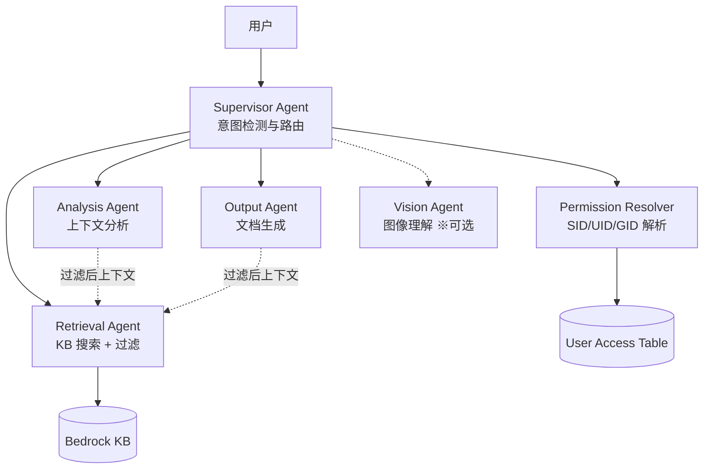

### 主要特性

- **权限边界保持**：KB 访问仅限 Permission Resolver 和 Retrieval Agent。其他 Agent 仅使用"过滤后上下文"
- **IAM 角色分离**：每个 Collaborator 获得最小权限的独立 IAM 角色
- **成本优化**：默认禁用（`enableMultiAgent: false`）。未启用则无额外费用
- **两种路由模式**：`supervisor_router`（低延迟）/ `supervisor`（复杂任务）
- **UI 切换**：在聊天界面一键切换 Single / Multi 模式
- **Agent Trace**：可视化多智能体执行时间线及各 Collaborator 成本明细

### UI 截图

#### 统一 3 模式切换 — KB / Single Agent / Multi Agent

标题栏配备统一的 3 模式切换开关。KB（蓝色）、Single Agent（紫色）和 Multi Agent（紫色）可一键切换。Agent 选择下拉菜单仅在 Agent 模式下显示——Single 模式显示单个 Agent，Multi 模式仅显示 Supervisor Agent。


#### Agent Directory — Teams 标签页 + 模板库

Agent Directory 包含 Teams 标签页，通过模板库可一键创建 Team。

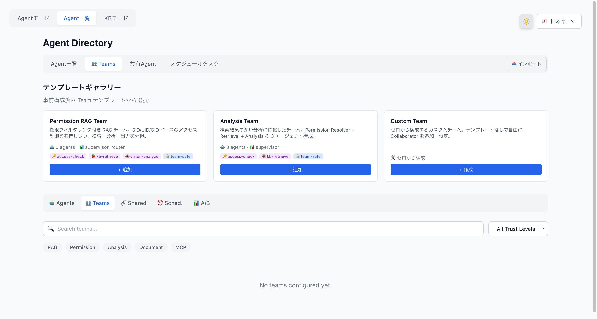

#### Team 创建向导 — 5 个步骤

点击模板上的"+"按钮，将打开 5 步 Team 创建向导。

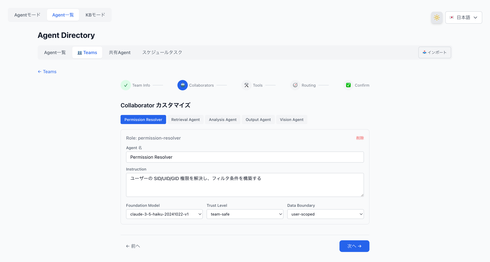

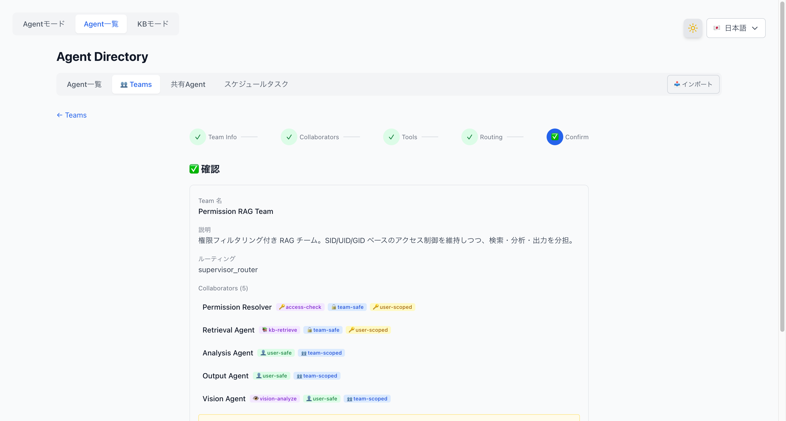

#### Team 创建完成 — Team 卡片显示

创建完成后，Team 卡片将显示在 Teams 标签页中，展示智能体数量、路由模式、Trust Level 和 Tool Profile 徽章。

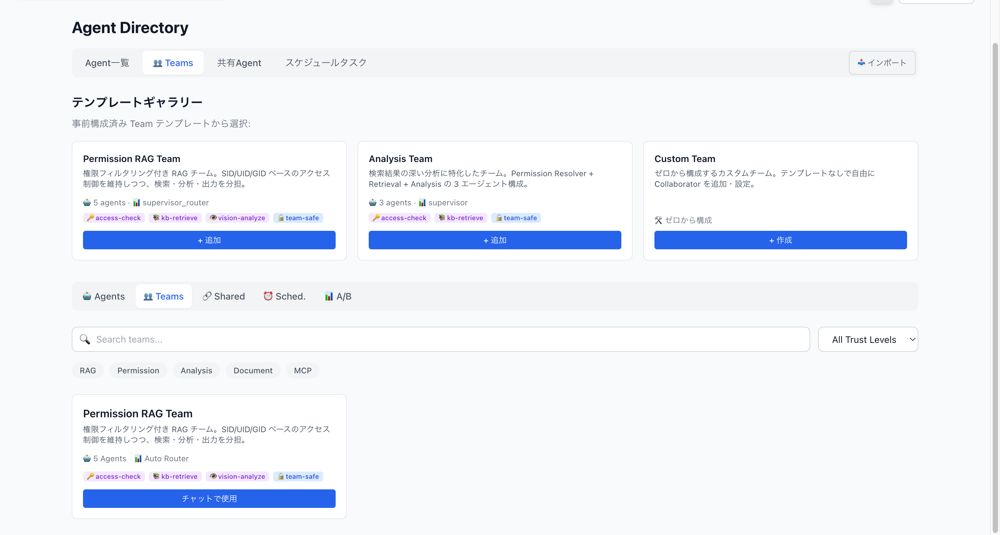

#### Multi 模式启用 — Team 创建后

创建 Team 后，聊天标题栏中的 Multi 模式开关将变为启用状态（不再处于禁用状态）。

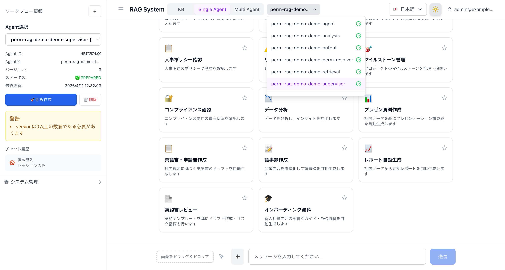

#### Supervisor Agent 响应 — 权限过滤

选择 Supervisor Agent 并发送聊天消息后，将触发 Collaborator Agent 链进行 KB 搜索，返回经过权限过滤的响应及引用。

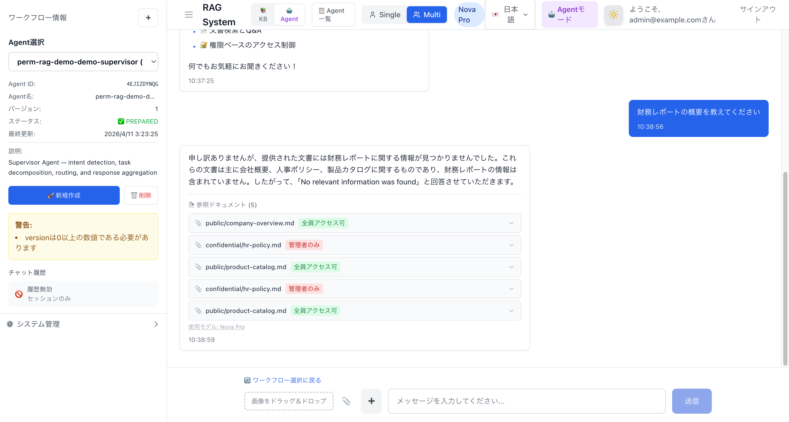

### 部署注意事项

实际 AWS 部署中发现的关键技术要点。

#### CloudFormation `AgentCollaboration` 有效值

- 有效值：`DISABLED` | `SUPERVISOR` | `SUPERVISOR_ROUTER` 仅此三种
- `COLLABORATOR` 不是有效值（尽管某些文档中有提及）
- Collaborator Agent 不应设置 `AgentCollaboration`（默认使用 `DISABLED`）

#### 需要 2 阶段部署（Supervisor Agent）

Supervisor Agent 无法在单次 CloudFormation 操作中同时创建 `AgentCollaboration=SUPERVISOR_ROUTER` 和 `AgentCollaborators`。

1. 首先以 `AgentCollaboration=DISABLED` 创建 Supervisor Agent
2. 使用 Custom Resource Lambda 执行：
   - `UpdateAgent` → 更改为 `SUPERVISOR_ROUTER`
   - `AssociateAgentCollaborator` 关联每个 Collaborator
   - `PrepareAgent`

#### IAM 权限要求

- Supervisor Agent IAM 角色需要：`bedrock:GetAgentAlias` + `bedrock:InvokeAgent`（资源：`agent-alias/*/*`）
- Custom Resource Lambda 需要：对 Supervisor 角色的 `iam:PassRole`
- Supervisor Agent 不能使用 `autoPrepare=true`（没有 Collaborator 时会失败）

#### Collaborator Agent Alias

- 每个 Collaborator Agent 在被 Supervisor 引用之前需要 `CfnAgentAlias`
- Alias ARN 格式：`arn:aws:bedrock:REGION:ACCOUNT:agent-alias/{agent-id}/{alias-id}`

#### Docker 镜像构建（Lambda）

- Apple Silicon：使用 `Dockerfile.prebuilt` 并指定 `--provenance=false --sbom=false`
- `docker/app/Dockerfile` 不是 Lambda Web Adapter 用的（旧文件）
- ECR 推送后直接使用 `aws lambda update-function-code`（CDK 不检测 `latest` 标签变更）

### 成本结构

| 场景 | Agent 调用 | 预估成本/请求 |
|---|---|---|
| Single Agent（现有） | 1 次 | 约 $0.02 |
| Multi-Agent（简单查询） | 2~3 次 | 约 $0.06 |
| Multi-Agent（复杂查询） | 4~6 次 | 约 $0.17 |

> 按请求计费 — 不使用则不产生额外费用。

## 许可证

[Apache License 2.0](LICENSE)
