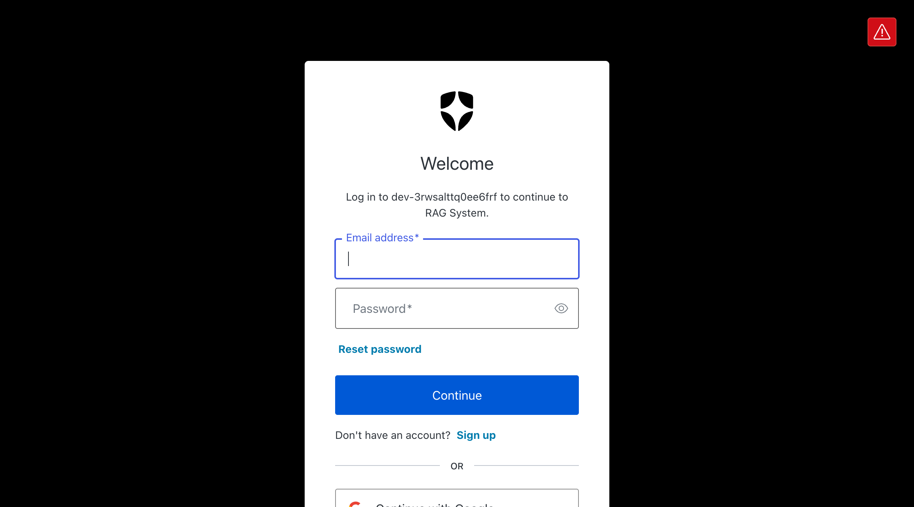
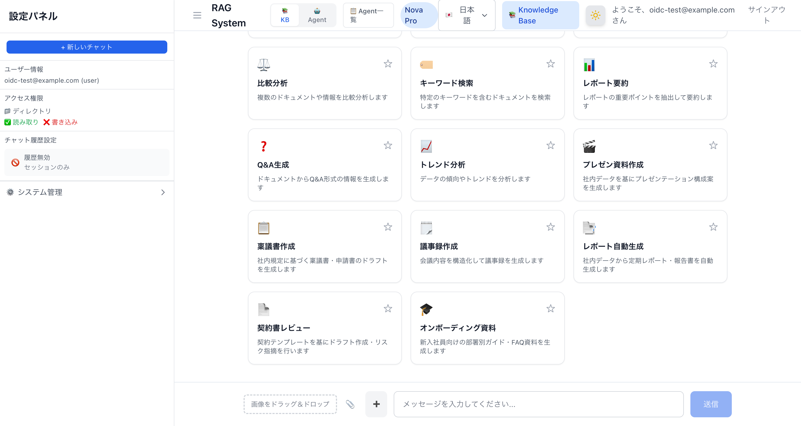

# 認証・ユーザー管理ガイド

**🌐 Language:** **日本語** | [English](en/auth-and-user-management.md) | [한국어](ko/auth-and-user-management.md) | [简体中文](zh-CN/auth-and-user-management.md) | [繁體中文](zh-TW/auth-and-user-management.md) | [Français](fr/auth-and-user-management.md) | [Deutsch](de/auth-and-user-management.md) | [Español](es/auth-and-user-management.md)

**作成日**: 2026-04-02
**バージョン**: 3.4.0

---

## 概要

本システムは2つの認証モードを提供します。デプロイ時のCDKコンテキストパラメータで切り替えます。

| モード | CDKパラメータ | ユーザー作成 | SID登録 | 推奨用途 |
|--------|-------------|------------|---------|---------|
| メール/パスワード | `enableAdFederation=false`（デフォルト） | 管理者が手動作成 | 管理者が手動登録 | PoC・デモ |
| AD Federation | `enableAdFederation=true` | 初回サインイン時に自動作成 | サインイン時に自動登録 | 本番・エンタープライズ |
| OIDC/LDAP Federation | `oidcProviderConfig` 指定 | 初回サインイン時に自動作成 | サインイン時に自動登録 | マルチIdP・LDAP環境 |

### ゼロタッチユーザープロビジョニング

AD FederationおよびOIDC/LDAP Federationモードでは、「ゼロタッチユーザープロビジョニング」を実現します。これは、ファイルサーバー（FSx for NetApp ONTAP）の既存ユーザー権限を、RAGシステムのUIユーザーに自動的にマッピングする仕組みです。

- 管理者がRAGシステム側でユーザーを手動作成する必要はありません
- ユーザー自身がセルフ登録する必要もありません
- IdP（AD/Keycloak/Okta/Entra ID等）で管理されているユーザーが初回サインインするだけで、Cognitoユーザー作成 → 権限情報取得 → DynamoDB登録が全て自動で行われます
- ファイルサーバー側の権限変更は、キャッシュTTL（24時間）経過後の次回サインイン時に自動反映されます

```
IdP (AD/OIDC) ──認証──> Cognito User Pool
                              │
                        Post-Auth Trigger
                              │
                              v
                    Identity Sync Lambda
                     ┌────────┴────────┐
                     │                 │
              SSM PowerShell      LDAP直接クエリ
              (Windows AD)     (OpenLDAP/FreeIPA)
                     │                 │
                     └────────┬────────┘
                              │
                     SID / UID+GID / Groups
                              │
                              v
                    DynamoDB user-access Table
                              │
                              v
                    RAG検索時の権限フィルタリング
```

---

## モード1: メール/パスワード認証（デフォルト）

### 仕組み

```
User -> CloudFront -> Next.js Sign-in Page
  -> Cognito USER_PASSWORD_AUTH (email + password)
  -> JWT issued -> Session Cookie -> Chat UI
```

Cognito User Poolに直接ユーザーを作成し、メールアドレスとパスワードでサインインします。

### 管理者の作業

**Step 1: Cognitoユーザー作成**

```bash
# post-deploy-setup.sh が自動実行、または手動で:
bash demo-data/scripts/create-demo-users.sh
```

**Step 2: DynamoDB SIDデータ登録**

```bash
# SIDデータを手動登録
bash demo-data/scripts/setup-user-access.sh
```

このスクリプトはDynamoDB `user-access` テーブルに以下を登録します:

| userId | userSID | groupSIDs | アクセス範囲 |
|--------|---------|-----------|------------|
| admin@example.com | S-1-5-21-...-500 | [...-512, S-1-1-0] | 全ドキュメント |
| user@example.com | S-1-5-21-...-1001 | [S-1-1-0] | publicのみ |

### 制約

- ユーザー追加のたびに管理者がCognito + DynamoDBの両方を手動更新する必要がある
- ADのグループメンバーシップ変更が自動反映されない
- 大規模運用には不向き

---

## モード2: AD Federation（推奨: エンタープライズ）

### 仕組み

```
AD User -> CloudFront UI -> "AD Sign-in" button
  -> Cognito Hosted UI -> SAML IdP (AD)
  -> AD authentication
  -> Cognito auto user creation
  -> Post-Auth Trigger -> AD Sync Lambda
  -> DynamoDB SID auto-registration (24h cache)
  -> OAuth Callback -> Session Cookie -> Chat UI
```

ADユーザーがSAML経由でサインインすると、以下が全て自動で行われます:

1. **Cognitoユーザー自動作成** — SAMLアサーションのメール属性からCognitoユーザーを自動生成
2. **SID自動取得** — AD Sync LambdaがADからユーザーSID + グループSIDを取得
3. **DynamoDB自動登録** — 取得したSIDデータを `user-access` テーブルに保存（24時間キャッシュ）

管理者の手動作業は不要です。

### AD Sync Lambda の動作

| AD方式 | SID取得方法 | 必要なインフラ |
|--------|-----------|--------------|
| Managed AD | LDAP or SSM経由PowerShell | AWS Managed AD + (オプション) Windows EC2 |
| Self-managed AD | SSM経由PowerShell | Windows EC2 (AD参加済み) |

**キャッシュ動作:**
- 初回サインイン: ADにクエリしてSIDを取得、DynamoDBに保存
- 2回目以降（24時間以内）: DynamoDBキャッシュを使用、ADクエリをスキップ
- 24時間経過後: 次回サインイン時にADから再取得

**エラー時の動作:**
- AD Sync Lambda失敗時もサインインはブロックされない（エラーログのみ）
- SIDデータがない場合、SIDフィルタリングはFail-Closed（全ドキュメント拒否）

### パターンA: AWS Managed AD

```bash
npx cdk deploy --all \
  -c enableAdFederation=true \
  -c adType=managed \
  -c adPassword="YourStrongP@ssw0rd123" \
  -c adDirectoryId=d-0123456789 \
  -c samlMetadataUrl="https://portal.sso.ap-northeast-1.amazonaws.com/saml/metadata/..." \
  -c cloudFrontUrl="https://dxxxxxxxx.cloudfront.net"
```

**セットアップ手順:**
1. CDKデプロイ（Managed AD + SAML IdP + Cognito Domain作成）
2. SVM AD参加（`post-deploy-setup.sh` が自動実行）
3. IAM Identity CenterでCognito向けSAMLアプリケーション作成（または `samlMetadataUrl` で外部IdP指定）
4. Cognito Hosted UIの「ADでサインイン」ボタンからAD認証を実行

### パターンB: Self-managed AD + Entra ID

```bash
npx cdk deploy --all \
  -c enableAdFederation=true \
  -c adType=self-managed \
  -c adEc2InstanceId=i-0123456789 \
  -c samlMetadataUrl="https://login.microsoftonline.com/.../federationmetadata.xml" \
  -c cloudFrontUrl="https://dxxxxxxxx.cloudfront.net"
```

**セットアップ手順:**
1. Windows EC2をADに参加させ、SSM Agentを有効化
2. Entra IDでSAMLアプリケーションを作成し、メタデータURLを取得
3. CDKデプロイ
4. CloudFront UIの「ADでサインイン」ボタンからAD認証を実行

### CDKパラメータ一覧

| パラメータ | 型 | デフォルト | 説明 |
|-----------|-----|----------|------|
| `enableAdFederation` | boolean | `false` | SAMLフェデレーション有効化 |
| `adType` | string | `none` | `managed` / `self-managed` / `none` |
| `adPassword` | string | - | Managed ADの管理者パスワード |
| `adDirectoryId` | string | - | AWS Managed AD Directory ID |
| `adEc2InstanceId` | string | - | AD参加済みWindows EC2インスタンスID |
| `samlMetadataUrl` | string | - | SAML IdPメタデータURL |
| `adDomainName` | string | - | ADドメイン名（例: demo.local） |
| `adDnsIps` | string | - | AD DNS IP（カンマ区切り） |
| `cloudFrontUrl` | string | - | OAuthコールバックURL |

---

## モード3: OIDC/LDAP Federation（マルチIdP・LDAP環境）

### 仕組み

```
OIDC User -> CloudFront UI -> "OIDCでサインイン" button
  -> Cognito Hosted UI -> OIDC IdP (Keycloak/Okta/Entra ID)
  -> OIDC authentication
  -> Cognito auto user creation
  -> Post-Auth Trigger -> Identity Sync Lambda
  -> LDAP Query or OIDC Claims -> DynamoDB auto-registration (24h cache)
  -> OAuth Callback -> Session Cookie -> Chat UI
```

OIDCユーザーがサインインすると、以下が全て自動で行われます:

1. **Cognitoユーザー自動作成** — OIDCアサーションのemail属性からCognitoユーザーを自動生成
2. **権限情報自動取得** — Identity Sync LambdaがLDAPサーバーまたはOIDCクレームからSID/UID/GID/グループ情報を取得
3. **DynamoDB自動登録** — 取得した権限データを `user-access` テーブルに保存（24時間キャッシュ）

### 設定駆動の自動有効化

各認証方式は設定値が提供された時点で自動的に有効化されます。追加AWSリソースコストはほぼゼロです。

| 機能 | 有効化条件 | 追加コスト |
|------|----------|----------|
| OIDC Federation | `oidcProviderConfig` 指定 | なし（Cognito IdP登録無料） |
| LDAP権限取得 | `ldapConfig` 指定 | なし（Lambda実行時課金のみ） |
| OIDCクレーム権限取得 | `oidcProviderConfig` 指定 + `ldapConfig` なし | なし |
| UID/GID権限フィルタリング | `permissionMappingStrategy` が `uid-gid` or `hybrid` | なし |
| ONTAP name-mapping | `ontapNameMappingEnabled=true` | なし |

> **CDK自動設定**: `oidcProviderConfig` を指定してCDKデプロイすると、以下が自動的に行われます:
> - Cognito User Pool に OIDC IdP が登録される
> - Cognito Domain が作成される（`enableAdFederation=true` で未作成の場合）
> - User Pool Client に OIDC IdP がサポートプロバイダーとして追加される
> - Identity Sync Lambda が作成され、Post-Authentication Trigger として登録される
> - WebAppStack Lambda に OAuth 環境変数（`COGNITO_DOMAIN`, `COGNITO_CLIENT_SECRET`, `CALLBACK_URL`）が自動設定される
>
> `enableAdFederation=true` と `oidcProviderConfig` を同時に指定した場合、SAML + OIDC の両方がサポートされ、サインイン画面に両方のボタンが表示されます。

### サインイン画面の動的構成

サインイン画面は有効化された認証方式に応じて動的にボタンを表示します。

| 有効な認証方式 | サインイン画面の表示 |
|--------------|-------------------|
| メール/パスワードのみ | メール/パスワードフォーム |
| + SAML | + 「ADでサインイン」ボタン |
| + OIDC | + 「{providerName}でサインイン」ボタン |
| + SAML + OIDC | + 両方のボタンを表示 |

AD FederationおよびOIDC Federationが有効な場合のサインイン画面（SAML + OIDCハイブリッド構成）:


### パターンC: OIDC + LDAP（OpenLDAP/FreeIPA + Keycloak）

```json
{
  "oidcProviderConfig": {
    "providerName": "Keycloak",
    "clientId": "rag-system",
    "clientSecret": "arn:aws:secretsmanager:ap-northeast-1:123456789012:secret:oidc-client-secret",
    "issuerUrl": "https://keycloak.example.com/realms/main",
    "groupClaimName": "groups"
  },
  "ldapConfig": {
    "ldapUrl": "ldaps://ldap.example.com:636",
    "baseDn": "dc=example,dc=com",
    "bindDn": "cn=readonly,dc=example,dc=com",
    "bindPasswordSecretArn": "arn:aws:secretsmanager:ap-northeast-1:123456789012:secret:ldap-bind-password",
    "userSearchFilter": "(mail={email})",
    "groupSearchFilter": "(member={dn})"
  },
  "permissionMappingStrategy": "uid-gid"
}
```

**セットアップ手順:**
1. OIDC IdP（Keycloak等）でクライアントアプリケーションを作成し、`clientId`/`clientSecret`/`issuerUrl` を取得
2. LDAPバインドパスワードをSecrets Managerに登録し、ARNを取得
3. 上記パラメータを `cdk.context.json` に設定してCDKデプロイ
4. CloudFront UIの「{providerName}でサインイン」ボタンからOIDC認証を実行

### パターンD: OIDC Claims Only（LDAPなし）

LDAPサーバーへの直接接続なしで、OIDCトークンのグループクレームのみで権限マッピングを行うパターンです。

```json
{
  "oidcProviderConfig": {
    "providerName": "Okta",
    "clientId": "0oa1234567890",
    "clientSecret": "arn:aws:secretsmanager:...",
    "issuerUrl": "https://company.okta.com",
    "groupClaimName": "groups"
  }
}
```

この場合、IdP側でトークンに `groups` クレームを含める設定が必要です。

> **Auth0利用時の重要な注意点**: Auth0のOIDC準拠アプリケーションでは、IDトークンのカスタムクレームに名前空間（URL prefix）が必要です。名前空間なしの `groups` クレームはIDトークンから自動的に除外されます。Auth0のPost Login Actionで以下のように名前空間付きクレームを設定してください:
>
> ```javascript
> // Auth0 Post Login Action
> exports.onExecutePostLogin = async (event, api) => {
>   const groups = ['developers', 'rag-users']; // ユーザーのグループ
>   api.idToken.setCustomClaim('https://rag-system/groups', groups);
>   api.accessToken.setCustomClaim('https://rag-system/groups', groups);
> };
> ```
>
> CDK側の `groupClaimName` は `groups` のままで構いません。CDKが自動的に `https://rag-system/groups` → `custom:oidc_groups` の属性マッピングを設定します。

### パターンE: SAML + OIDC ハイブリッド

既存のAD SAML Federationに加えて、OIDC IdPも同時に有効化するパターンです。

```json
{
  "enableAdFederation": true,
  "adPassword": "YourStrongP@ssw0rd123",
  "adDomainName": "demo.local",
  "oidcProviderConfig": {
    "providerName": "Okta",
    "clientId": "0oa1234567890",
    "clientSecret": "arn:aws:secretsmanager:...",
    "issuerUrl": "https://company.okta.com"
  },
  "permissionMappingStrategy": "hybrid",
  "cloudFrontUrl": "https://dxxxxxxxx.cloudfront.net"
}
```

### Identity Sync Lambda の権限取得フロー

```
Post-Auth Trigger Event
  │
  ├─ 認証ソース判別（SAML / OIDC / Direct）
  │
  ├─ SAML → 既存AD Sync処理（後方互換性維持）
  │
  └─ OIDC → ldapConfig設定あり？
       │
       ├─ Yes → LDAP Connector でユーザー検索
       │         ├─ objectSid取得 → SIDベース保存（source: OIDC-LDAP）
       │         └─ uidNumber/gidNumber取得 → UID/GIDベース保存（source: OIDC-LDAP）
       │
       └─ No → OIDCクレームからグループ情報取得（source: OIDC-Claims）
```

### CDKパラメータ一覧（OIDC/LDAP）

| パラメータ | 型 | デフォルト | 説明 |
|-----------|-----|----------|------|
| `oidcProviderConfig.providerName` | string | `OIDCProvider` | IdP表示名（サインインボタンに表示） |
| `oidcProviderConfig.clientId` | string | **必須** | OIDCクライアントID |
| `oidcProviderConfig.clientSecret` | string | **必須** | OIDCクライアントシークレット（Secrets Manager ARN推奨） |
| `oidcProviderConfig.issuerUrl` | string | **必須** | OIDCイシュアーURL |
| `oidcProviderConfig.groupClaimName` | string | `groups` | グループ情報のクレーム名 |
| `ldapConfig.ldapUrl` | string | - | LDAP/LDAPS URL（例: `ldaps://ldap.example.com:636`） |
| `ldapConfig.baseDn` | string | - | 検索ベースDN（例: `dc=example,dc=com`） |
| `ldapConfig.bindDn` | string | - | バインドDN（例: `cn=readonly,dc=example,dc=com`） |
| `ldapConfig.bindPasswordSecretArn` | string | - | バインドパスワードのSecrets Manager ARN |
| `ldapConfig.userSearchFilter` | string | `(mail={email})` | ユーザー検索フィルタ |
| `ldapConfig.groupSearchFilter` | string | `(member={dn})` | グループ検索フィルタ |
| `permissionMappingStrategy` | string | `sid-only` | 権限マッピング戦略: `sid-only`, `uid-gid`, `hybrid` |
| `ontapNameMappingEnabled` | boolean | `false` | ONTAP name-mapping連携 |

### DynamoDB拡張スキーマ

OIDC/LDAP Federationでは、既存スキーマに加えて以下のフィールドが追加されます:

```json
{
  "userId": "OIDCProvider_user@example.com",
  "userSID": "",
  "groupSIDs": [],
  "uid": 1001,
  "gid": 1001,
  "unixGroups": [
    { "name": "developers", "gid": 1001 },
    { "name": "docker", "gid": 999 }
  ],
  "oidcGroups": ["developers", "project-alpha"],
  "email": "user@example.com",
  "displayName": "User Name",
  "source": "OIDC-LDAP",
  "authSource": "oidc",
  "retrievedAt": 1705750800000,
  "ttl": 1705837200
}
```

| フィールド | 型 | 説明 | 条件 |
|-----------|-----|------|------|
| `uid` | Number | UNIX UID | LDAP POSIX属性取得時 |
| `gid` | Number | UNIX プライマリGID | LDAP POSIX属性取得時 |
| `unixGroups` | List | UNIXグループ配列 `[{name, gid}]` | LDAP POSIX属性取得時 |
| `oidcGroups` | List | OIDCトークンのグループクレーム値 | OIDC認証時 |
| `authSource` | String | 認証ソース（`saml`, `oidc`, `direct`） | 全レコード |

---

## 権限フィルタリングとの連携

認証モードに関わらず、権限フィルタリングの仕組みは同じです。Permission Resolverが認証ソースに応じて適切なフィルタリング戦略を自動選択します。

### フィルタリング戦略

| 戦略 | 条件 | 動作 |
|------|------|------|
| SID Matching | `userSID` のみ存在 | ドキュメントの `allowed_group_sids` とユーザーSIDを照合 |
| UID/GID Matching | `uid` + `gid` のみ存在 | ドキュメントの `allowed_uids` / `allowed_gids` とユーザーUID/GIDを照合 |
| Hybrid Matching | `userSID` と `uid` の両方存在 | SIDマッチを優先、失敗時にUID/GIDフォールバック |
| Deny All (Fail-Closed) | 権限情報なし | 全ドキュメントアクセス拒否 |

```
DynamoDB user-access Table
  |
  | userId -> userSID + groupSIDs + uid + gid + unixGroups
  v
Permission Resolver (戦略自動選択)
  |
  ├─ SID Matching: userSIDs ∩ documentSIDs
  ├─ UID/GID Matching: uid ∈ allowed_uids OR gid ∈ allowed_gids
  └─ Hybrid: SID優先 → UID/GIDフォールバック
  v
Match -> ALLOW, No match -> DENY
```

**SIDデータの登録元の違い:**

| 認証モード | SIDデータの登録元 | `source` フィールド |
|-----------|-----------------|-------------------|
| メール/パスワード | `setup-user-access.sh`（手動） | `Demo` |
| AD Federation (Managed) | AD Sync Lambda（自動） | `AD-Sync-managed` |
| AD Federation (Self-managed) | AD Sync Lambda（自動） | `AD-Sync-self-managed` |
| OIDC + LDAP | Identity Sync Lambda（自動） | `OIDC-LDAP` |
| OIDC + Claims | Identity Sync Lambda（自動） | `OIDC-Claims` |

### DynamoDB user-access テーブルのスキーマ

```json
{
  "userId": "admin@example.com",
  "userSID": "S-1-5-21-...-500",
  "groupSIDs": ["S-1-5-21-...-512", "S-1-1-0"],
  "displayName": "Admin User",
  "email": "admin@example.com",
  "source": "AD-Sync-managed",
  "retrievedAt": 1705750800000,
  "ttl": 1705837200
}
```

---

## トラブルシューティング

| 症状 | 原因 | 対処 |
|------|------|------|
| サインイン後に全ドキュメントが拒否される | DynamoDBにSID/UID/GIDデータがない | AD Federation: AD Sync Lambdaのログを確認。OIDC: Identity Sync Lambdaのログを確認。手動: `setup-user-access.sh` を実行 |
| 「ADでサインイン」ボタンが表示されない | `enableAdFederation=false` | CDKパラメータを確認して再デプロイ |
| 「OIDCでサインイン」ボタンが表示されない | `oidcProviderConfig` 未設定 | CDKパラメータに `oidcProviderConfig` を追加して再デプロイ |
| SAML認証失敗 | SAMLメタデータURL不正 | Managed AD: IAM Identity Center設定を確認。Self-managed: Entra IDメタデータURLを確認 |
| OIDC認証失敗 | `clientId` / `issuerUrl` 不正 | OIDC IdP側のクライアント設定とCDKパラメータの一致を確認 |
| LDAP権限取得失敗 | LDAP接続エラー | CloudWatch LogsでIdentity Sync Lambdaのエラーを確認。サインイン自体はブロックされない（Fail-Open） |
| ADグループ変更が反映されない | SIDキャッシュ（24時間） | 24時間待つか、DynamoDBの該当レコードを削除して再サインイン |
| AD Sync Lambda タイムアウト | SSM経由のPowerShell実行が遅い | `SSM_TIMEOUT` 環境変数を増やす（デフォルト60秒） |
| OIDCグループが取得できない | IdP側でグループクレーム未設定、または名前空間なしクレーム | Auth0等のOIDC準拠IdPでは、IDトークンのカスタムクレームに名前空間（URL prefix）が必要。Auth0の場合、Post Login Actionで `api.idToken.setCustomClaim('https://rag-system/groups', groups)` のように名前空間付きクレームを設定し、Cognito属性マッピングも `https://rag-system/groups` → `custom:oidc_groups` に合わせる |
| OIDCサインイン後にDynamoDBに権限データが登録されない | Post-Auth TriggerまたはIdentity Sync Lambdaが未作成 | `oidcProviderConfig` を指定してCDKデプロイすると自動的にIdentity Sync LambdaとPost-Auth Triggerが作成される。CloudWatch LogsでLambdaの実行ログを確認 |
| PostConfirmation triggerでカスタム属性が空 | Cognitoの仕様でPostConfirmationイベントにカスタム属性が含まれない場合がある | Identity Sync LambdaにはCognito AdminGetUser APIフォールバックが実装済み。Lambda実行ロールに `cognito-idp:AdminGetUser` 権限が付与されていることを確認 |
| OAuthコールバックエラー（OIDC構成） | `cloudFrontUrl` 未設定 | OIDC構成でも `cloudFrontUrl` が必要。`cdk.context.json` に設定して再デプロイ |

---

## 検証結果

### CDK synth + デプロイ検証（v3.4.0）

OIDC/LDAP Federation機能追加後の検証結果:

- CDK synth: ✅ 成功（CloudFormationテンプレート正常生成）
- CDKデプロイ: ✅ SecurityStack + WebAppStack UPDATE_COMPLETE
- Cognito OIDC IdP登録: ✅ Auth0（`UserPoolIdentityProviderOidc`）
- サインイン画面: ✅ 「ADでサインイン」+「Auth0でサインイン」両ボタン表示（SAML + OIDCハイブリッド）
- OIDC認証フロー: ✅ Auth0認証 → Cognito OAuthコールバック → チャット画面（エンドツーエンド成功）
- Cognitoユーザー自動作成: ✅ `Auth0_auth0|...`（ステータス: EXTERNAL_PROVIDER）
- Auth0 SSO: ✅ 2回目のサインインで再認証不要
- Post-Auth Trigger: ✅ PostConfirmationトリガー追加により、OIDC IdP経由の初回サインインでもIdentity Sync Lambdaが発火
- DynamoDB自動保存: ✅ `source: "OIDC-Claims"`, `authSource: "oidc"` でレコード作成確認
- OIDCグループクレームパイプライン: ✅ Auth0 Post Login Action → 名前空間付きクレーム(`https://rag-system/groups`) → Cognito `custom:oidc_groups` → Identity Sync Lambda → DynamoDB `oidcGroups: ["developers","rag-users"]`
- Cognito AdminGetUser APIフォールバック: ✅ PostConfirmation triggerでカスタム属性が未含の場合、Cognito APIから直接取得して正常動作
- 後方互換性: ✅ 既存SAML AD Federationサインイン正常動作
- ユニットテスト: ✅ 130テスト全パス
- プロパティテスト: ✅ 52テスト全パス（17プロパティ、numRuns=20）

SAML + OIDC ハイブリッド構成のサインイン画面:


Auth0 OIDC認証画面:



Auth0 OIDCサインイン成功後のチャット画面:



---

## 関連ドキュメント

- [README.md — AD SAMLフェデレーション](../README.md#ad-samlフェデレーションオプション) — CDKデプロイ手順
- [docs/implementation-overview.md — セクション3: IAM認証](implementation-overview.md#3-iam認証--lambda-function-url-iam-auth--cloudfront-oac) — インフラ層の認証設計
- [docs/SID-Filtering-Architecture.md](SID-Filtering-Architecture.md) — SIDフィルタリングの詳細設計
- [demo-data/guides/ontap-setup-guide.md](../demo-data/guides/ontap-setup-guide.md) — FSx ONTAP AD連携設定
