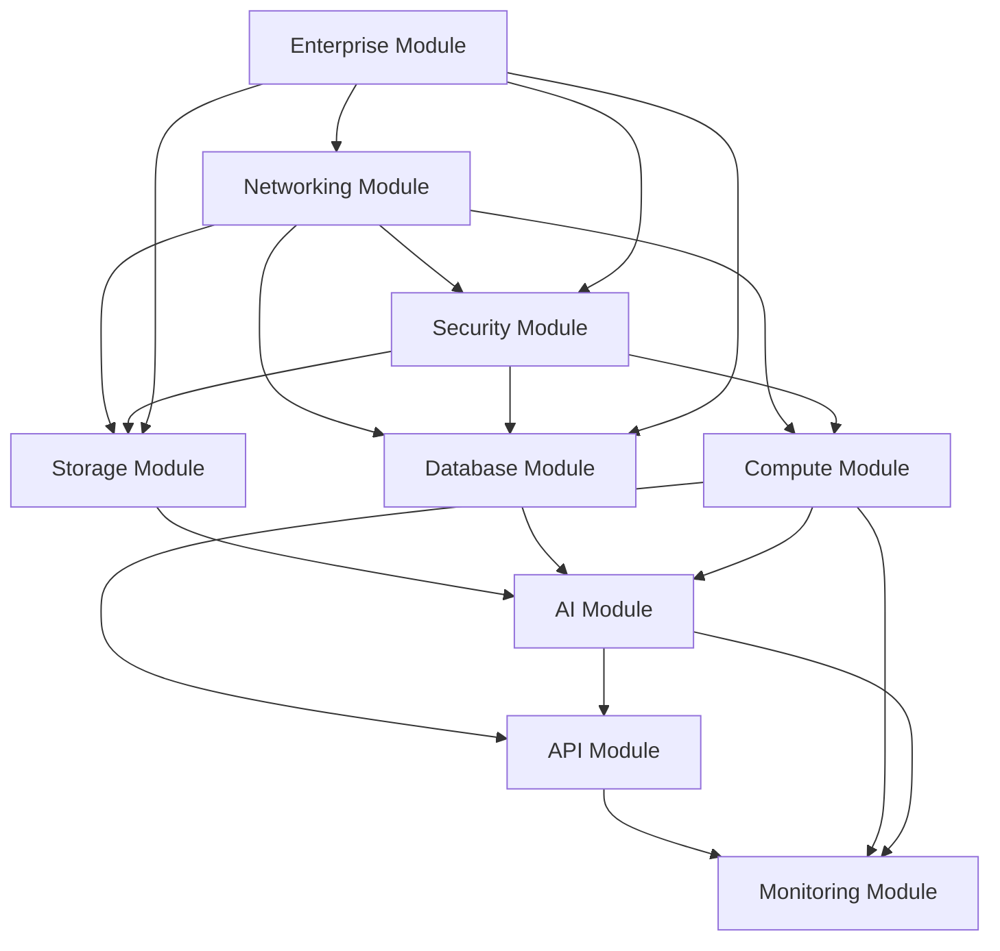

# Module Development Guide - Permission-aware RAG System with FSx for ONTAP

This guide provides detailed explanations of the modular architecture of the Permission-aware RAG System with FSx for ONTAP project and development methods for each module.

## Table of Contents

<details>
<summary><strong>1. Understanding Modular Architecture</strong></summary>

- [1.1 What is Modular Architecture](#11-what-is-modular-architecture)
- [1.2 Overview of 9 Core Modules](#12-overview-of-9-core-modules)
- [1.3 Inter-module Dependencies](#13-inter-module-dependencies)

</details>

<details>
<summary><strong>2. Module-specific Development Guide</strong></summary>

- [2.1 Networking Module](#21-networking-module)
- [2.2 Security Module](#22-security-module)
- [2.3 Storage Module](#23-storage-module)
- [2.4 Database Module](#24-database-module)
- [2.5 Compute Module](#25-compute-module)
- [2.6 AI Module](#26-ai-module)
- [2.7 API Module](#27-api-module)
- [2.8 Monitoring Module](#28-monitoring-module)
- [2.9 Enterprise Module](#29-enterprise-module)

</details>

<details>
<summary><strong>3. Creating New Modules</strong></summary>

- [3.1 Module Creation Procedures](#31-module-creation-procedures)
- [3.2 Interface Design](#32-interface-design)
- [3.3 Construct Implementation](#33-construct-implementation)
- [3.4 Test Creation](#34-test-creation)

</details>

---

## 1. Understanding Modular Architecture

### 1.1 What is Modular Architecture

Modular architecture is a design approach that divides large systems into independent functional units (modules). Each module has the following characteristics:

- **Independence**: Can be developed, tested, and deployed without depending on other modules
- **Reusability**: Generic design that can be used in other projects
- **Maintainability**: Easy to understand, modify, and extend
- **Testability**: Can be tested independently

#### Benefits of Modular Architecture

```typescript
// Example: Independent module definition
export interface NetworkingModuleProps {
  vpcCidr: string;
  availabilityZones: string[];
  enableNatGateway: boolean;
}

export class NetworkingModule extends Construct {
  public readonly vpc: ec2.Vpc;
  public readonly privateSubnets: ec2.ISubnet[];
  public readonly publicSubnets: ec2.ISubnet[];

  constructor(scope: Construct, id: string, props: NetworkingModuleProps) {
    super(scope, id);
    // Module implementation
  }
}
```

### 1.2 Overview of 9 Core Modules

This system consists of the following 9 core modules:

#### 1. Networking Module
- **Responsibility**: Network infrastructure management
- **Main Components**: VPC, Subnets, Route Tables, NAT Gateway
- **Location**: `lib/modules/networking/`

#### 2. Security Module
- **Responsibility**: Security policy and access control
- **Main Components**: Security Groups, IAM Roles, KMS Keys
- **Location**: `lib/modules/security/`

#### 3. Storage Module
- **Responsibility**: Data storage management
- **Main Components**: S3 Buckets, FSx File Systems, Backup Systems
- **Location**: `lib/modules/storage/`

#### 4. Database Module
- **Responsibility**: Database management
- **Main Components**: RDS, DynamoDB, OpenSearch Serverless
- **Location**: `lib/modules/database/`

#### 5. Compute Module
- **Responsibility**: Computing resource management
- **Main Components**: Lambda Functions, EC2 Instances, ECS Services
- **Location**: `lib/modules/compute/`

#### 6. AI Module
- **Responsibility**: AI/ML service integration
- **Main Components**: Bedrock, SageMaker, Comprehend
- **Location**: `lib/modules/ai/`

#### 7. API Module
- **Responsibility**: API management
- **Main Components**: API Gateway, Load Balancer, CloudFront
- **Location**: `lib/modules/api/`

#### 8. Monitoring Module
- **Responsibility**: System monitoring and logging
- **Main Components**: CloudWatch, X-Ray, CloudTrail
- **Location**: `lib/modules/monitoring/`

#### 9. Enterprise Module
- **Responsibility**: Enterprise-grade features
- **Main Components**: Backup, Disaster Recovery, Compliance
- **Location**: `lib/modules/enterprise/`

### 1.3 Inter-module Dependencies



## 2. Module-specific Development Guide

### 2.1 Networking Module

#### Module Structure
```
lib/modules/networking/
├── constructs/
│   ├── vpc-construct.ts
│   ├── subnet-construct.ts
│   └── nat-gateway-construct.ts
├── interfaces/
│   └── networking-config.ts
└── index.ts
```

#### Implementation Example
```typescript
import * as ec2 from 'aws-cdk-lib/aws-ec2';
import { Construct } from 'constructs';

export interface VpcConstructProps {
  vpcCidr: string;
  maxAzs: number;
  natGateways: number;
}

export class VpcConstruct extends Construct {
  public readonly vpc: ec2.Vpc;

  constructor(scope: Construct, id: string, props: VpcConstructProps) {
    super(scope, id);

    this.vpc = new ec2.Vpc(this, 'Vpc', {
      ipAddresses: ec2.IpAddresses.cidr(props.vpcCidr),
      maxAzs: props.maxAzs,
      natGateways: props.natGateways,
      subnetConfiguration: [
        {
          name: 'Public',
          subnetType: ec2.SubnetType.PUBLIC,
          cidrMask: 24
        },
        {
          name: 'Private',
          subnetType: ec2.SubnetType.PRIVATE_WITH_EGRESS,
          cidrMask: 24
        },
        {
          name: 'Isolated',
          subnetType: ec2.SubnetType.PRIVATE_ISOLATED,
          cidrMask: 24
        }
      ]
    });
  }
}
```

### 2.2 Security Module

#### Module Structure
```
lib/modules/security/
├── constructs/
│   ├── security-group-construct.ts
│   ├── iam-role-construct.ts
│   └── kms-key-construct.ts
├── interfaces/
│   └── security-config.ts
└── index.ts
```

#### Implementation Example
```typescript
import * as iam from 'aws-cdk-lib/aws-iam';
import { Construct } from 'constructs';

export interface LambdaRoleConstructProps {
  roleName: string;
  managedPolicies?: iam.IManagedPolicy[];
  inlinePolicies?: { [name: string]: iam.PolicyDocument };
}

export class LambdaRoleConstruct extends Construct {
  public readonly role: iam.Role;

  constructor(scope: Construct, id: string, props: LambdaRoleConstructProps) {
    super(scope, id);

    this.role = new iam.Role(this, 'Role', {
      roleName: props.roleName,
      assumedBy: new iam.ServicePrincipal('lambda.amazonaws.com'),
      managedPolicies: props.managedPolicies || [
        iam.ManagedPolicy.fromAwsManagedPolicyName(
          'service-role/AWSLambdaBasicExecutionRole'
        )
      ],
      inlinePolicies: props.inlinePolicies
    });
  }
}
```

### 2.3 Storage Module

#### Module Structure
```
lib/modules/storage/
├── constructs/
│   ├── s3-bucket-construct.ts
│   ├── fsx-construct.ts
│   └── backup-construct.ts
├── interfaces/
│   └── storage-config.ts
└── index.ts
```

#### Implementation Example
```typescript
import * as s3 from 'aws-cdk-lib/aws-s3';
import { Construct } from 'constructs';

export interface S3BucketConstructProps {
  bucketName: string;
  versioned?: boolean;
  encryption?: s3.BucketEncryption;
  lifecycleRules?: s3.LifecycleRule[];
}

export class S3BucketConstruct extends Construct {
  public readonly bucket: s3.Bucket;

  constructor(scope: Construct, id: string, props: S3BucketConstructProps) {
    super(scope, id);

    this.bucket = new s3.Bucket(this, 'Bucket', {
      bucketName: props.bucketName,
      versioned: props.versioned ?? true,
      encryption: props.encryption ?? s3.BucketEncryption.S3_MANAGED,
      lifecycleRules: props.lifecycleRules,
      blockPublicAccess: s3.BlockPublicAccess.BLOCK_ALL,
      enforceSSL: true
    });
  }
}
```

### 2.4 Database Module

#### Module Structure
```
lib/modules/database/
├── constructs/
│   ├── dynamodb-table-construct.ts
│   ├── rds-instance-construct.ts
│   └── opensearch-construct.ts
├── interfaces/
│   └── database-config.ts
└── index.ts
```

#### Implementation Example
```typescript
import * as dynamodb from 'aws-cdk-lib/aws-dynamodb';
import { Construct } from 'constructs';

export interface DynamoDBTableConstructProps {
  tableName: string;
  partitionKey: dynamodb.Attribute;
  sortKey?: dynamodb.Attribute;
  billingMode?: dynamodb.BillingMode;
}

export class DynamoDBTableConstruct extends Construct {
  public readonly table: dynamodb.Table;

  constructor(scope: Construct, id: string, props: DynamoDBTableConstructProps) {
    super(scope, id);

    this.table = new dynamodb.Table(this, 'Table', {
      tableName: props.tableName,
      partitionKey: props.partitionKey,
      sortKey: props.sortKey,
      billingMode: props.billingMode ?? dynamodb.BillingMode.PAY_PER_REQUEST,
      encryption: dynamodb.TableEncryption.AWS_MANAGED,
      pointInTimeRecovery: true
    });
  }
}
```

### 2.5 Compute Module

#### Module Structure
```
lib/modules/compute/
├── constructs/
│   ├── lambda-function-construct.ts
│   ├── ec2-instance-construct.ts
│   └── ecs-service-construct.ts
├── interfaces/
│   └── compute-config.ts
└── index.ts
```

#### Implementation Example
```typescript
import * as lambda from 'aws-cdk-lib/aws-lambda';
import { Duration } from 'aws-cdk-lib';
import { Construct } from 'constructs';

export interface LambdaFunctionConstructProps {
  functionName: string;
  runtime: lambda.Runtime;
  handler: string;
  code: lambda.Code;
  environment?: { [key: string]: string };
  timeout?: Duration;
  memorySize?: number;
}

export class LambdaFunctionConstruct extends Construct {
  public readonly function: lambda.Function;

  constructor(scope: Construct, id: string, props: LambdaFunctionConstructProps) {
    super(scope, id);

    this.function = new lambda.Function(this, 'Function', {
      functionName: props.functionName,
      runtime: props.runtime,
      handler: props.handler,
      code: props.code,
      environment: props.environment,
      timeout: props.timeout ?? Duration.seconds(30),
      memorySize: props.memorySize ?? 512
    });
  }
}
```

### 2.6 AI Module

#### Module Structure
```
lib/modules/ai/
├── constructs/
│   ├── bedrock-construct.ts
│   ├── sagemaker-construct.ts
│   └── comprehend-construct.ts
├── interfaces/
│   └── ai-config.ts
└── index.ts
```

#### Implementation Example
```typescript
import { Stack } from 'aws-cdk-lib';
import { Construct } from 'constructs';

export interface BedrockConstructProps {
  modelId: string;
  modelVersion?: string;
}

export class BedrockConstruct extends Construct {
  public readonly modelArn: string;

  constructor(scope: Construct, id: string, props: BedrockConstructProps) {
    super(scope, id);

    // Bedrock model configuration
    this.modelArn = `arn:aws:bedrock:${Stack.of(this).region}::foundation-model/${props.modelId}`;
  }
}
```

### 2.7 API Module

#### Module Structure
```
lib/modules/api/
├── constructs/
│   ├── api-gateway-construct.ts
│   ├── load-balancer-construct.ts
│   └── cloudfront-construct.ts
├── interfaces/
│   └── api-config.ts
└── index.ts
```

#### Implementation Example
```typescript
import * as apigateway from 'aws-cdk-lib/aws-apigateway';
import { Construct } from 'constructs';

export interface ApiGatewayConstructProps {
  apiName: string;
  description?: string;
  deployOptions?: apigateway.StageOptions;
}

export class ApiGatewayConstruct extends Construct {
  public readonly api: apigateway.RestApi;

  constructor(scope: Construct, id: string, props: ApiGatewayConstructProps) {
    super(scope, id);

    this.api = new apigateway.RestApi(this, 'Api', {
      restApiName: props.apiName,
      description: props.description,
      deployOptions: props.deployOptions ?? {
        stageName: 'prod',
        tracingEnabled: true,
        loggingLevel: apigateway.MethodLoggingLevel.INFO
      }
    });
  }
}
```

### 2.8 Monitoring Module

#### Module Structure
```
lib/modules/monitoring/
├── constructs/
│   ├── cloudwatch-dashboard-construct.ts
│   ├── alarm-construct.ts
│   └── log-group-construct.ts
├── interfaces/
│   └── monitoring-config.ts
└── index.ts
```

#### Implementation Example
```typescript
import * as cloudwatch from 'aws-cdk-lib/aws-cloudwatch';
import { Construct } from 'constructs';

export interface AlarmConstructProps {
  alarmName: string;
  metric: cloudwatch.IMetric;
  threshold: number;
  evaluationPeriods: number;
  comparisonOperator?: cloudwatch.ComparisonOperator;
}

export class AlarmConstruct extends Construct {
  public readonly alarm: cloudwatch.Alarm;

  constructor(scope: Construct, id: string, props: AlarmConstructProps) {
    super(scope, id);

    this.alarm = new cloudwatch.Alarm(this, 'Alarm', {
      alarmName: props.alarmName,
      metric: props.metric,
      threshold: props.threshold,
      evaluationPeriods: props.evaluationPeriods,
      comparisonOperator: props.comparisonOperator ?? 
        cloudwatch.ComparisonOperator.GREATER_THAN_THRESHOLD
    });
  }
}
```

### 2.9 Enterprise Module

#### Module Structure
```
lib/modules/enterprise/
├── constructs/
│   ├── backup-construct.ts
│   ├── disaster-recovery-construct.ts
│   └── compliance-construct.ts
├── interfaces/
│   └── enterprise-config.ts
└── index.ts
```

#### Implementation Example
```typescript
import * as backup from 'aws-cdk-lib/aws-backup';
import { Construct } from 'constructs';

export interface BackupConstructProps {
  backupPlanName: string;
  backupVaultName: string;
  rules: backup.BackupPlanRule[];
}

export class BackupConstruct extends Construct {
  public readonly backupPlan: backup.BackupPlan;
  public readonly backupVault: backup.BackupVault;

  constructor(scope: Construct, id: string, props: BackupConstructProps) {
    super(scope, id);

    this.backupVault = new backup.BackupVault(this, 'Vault', {
      backupVaultName: props.backupVaultName
    });

    this.backupPlan = new backup.BackupPlan(this, 'Plan', {
      backupPlanName: props.backupPlanName,
      backupPlanRules: props.rules,
      backupVault: this.backupVault
    });
  }
}
```

## 3. Creating New Modules

### 3.1 Module Creation Procedures

#### Step 1: Define Module Structure
```bash
# Create module directory
mkdir -p lib/modules/new-module/{constructs,interfaces}

# Create basic files
touch lib/modules/new-module/index.ts
touch lib/modules/new-module/interfaces/config.ts
touch lib/modules/new-module/constructs/main-construct.ts
```

#### Step 2: Define Interfaces
```typescript
// lib/modules/new-module/interfaces/config.ts
export interface NewModuleConfig {
  // Configuration properties
  moduleName: string;
  enabled: boolean;
  settings: {
    [key: string]: any;
  };
}

export interface NewModuleProps {
  config: NewModuleConfig;
  // Additional properties
}
```

### 3.2 Interface Design

#### Design Principles
1. **Type Safety**: Use TypeScript interfaces for all configurations
2. **Extensibility**: Design for future enhancements
3. **Documentation**: Include JSDoc comments
4. **Validation**: Implement runtime validation

#### Example Interface
```typescript
/**
 * Configuration for the new module
 */
export interface NewModuleConfig {
  /**
   * Unique identifier for the module
   */
  readonly moduleId: string;

  /**
   * Enable or disable the module
   * @default true
   */
  readonly enabled?: boolean;

  /**
   * Module-specific settings
   */
  readonly settings: {
    /**
     * Setting 1 description
     */
    setting1: string;

    /**
     * Setting 2 description
     */
    setting2: number;
  };
}
```

### 3.3 Construct Implementation

#### Implementation Template
```typescript
import { Construct } from 'constructs';
import { NewModuleProps, NewModuleConfig } from '../interfaces/config';

export class NewModuleConstruct extends Construct {
  // Public properties
  public readonly moduleId: string;

  constructor(scope: Construct, id: string, props: NewModuleProps) {
    super(scope, id);

    // Validate configuration
    this.validateConfig(props.config);

    // Initialize module
    this.moduleId = props.config.moduleId;

    // Create resources
    this.createResources(props);
  }

  private validateConfig(config: NewModuleConfig): void {
    if (!config.moduleId) {
      throw new Error('moduleId is required');
    }
    // Additional validation
  }

  private createResources(props: NewModuleProps): void {
    // Resource creation logic
  }
}
```

### 3.4 Test Creation

#### Unit Test Template
```typescript
import { App, Stack } from 'aws-cdk-lib';
import { Template } from 'aws-cdk-lib/assertions';
import { NewModuleConstruct } from '../constructs/main-construct';

describe('NewModuleConstruct', () => {
  let app: App;
  let stack: Stack;

  beforeEach(() => {
    app = new App();
    stack = new Stack(app, 'TestStack');
  });

  test('creates module with default configuration', () => {
    // Arrange
    const props = {
      config: {
        moduleId: 'test-module',
        enabled: true,
        settings: {
          setting1: 'value1',
          setting2: 100
        }
      }
    };

    // Act
    new NewModuleConstruct(stack, 'TestModule', props);

    // Assert
    const template = Template.fromStack(stack);
    template.resourceCountIs('AWS::Resource::Type', 1);
  });

  test('validates required configuration', () => {
    // Arrange
    const props = {
      config: {
        moduleId: '',
        enabled: true,
        settings: {
          setting1: 'value1',
          setting2: 100
        }
      }
    };

    // Act & Assert
    expect(() => {
      new NewModuleConstruct(stack, 'TestModule', props);
    }).toThrow('moduleId is required');
  });
});
```

---

## Best Practices

### Code Organization
- Keep modules focused on a single responsibility
- Use clear and consistent naming conventions
- Document all public interfaces
- Implement proper error handling

### Testing Strategy
- Write unit tests for all constructs
- Create integration tests for complex scenarios
- Use snapshot testing for CloudFormation templates
- Maintain high test coverage (>80%)

### Documentation
- Include JSDoc comments for all public APIs
- Provide usage examples in README files
- Document configuration options
- Maintain changelog for module updates

### Version Control
- Use semantic versioning
- Tag releases appropriately
- Maintain backward compatibility
- Document breaking changes

---

*Last Updated: November 16, 2024*
*Version: 1.0.0*
