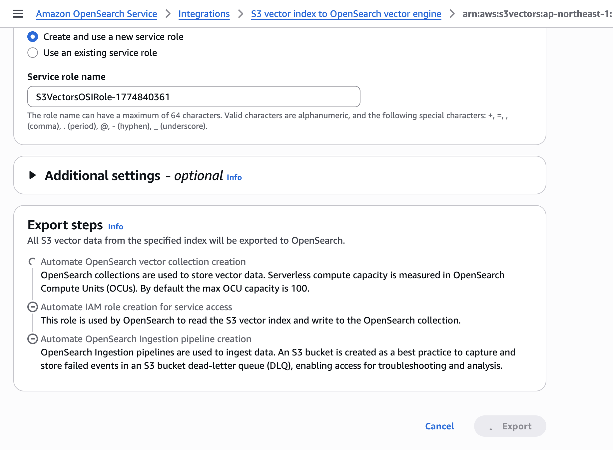

# S3 Vectors + SIDフィルタリング アーキテクチャガイド

**作成日**: 2026-03-29
**検証環境**: ap-northeast-1 (東京)
**ステータス**: CDKデプロイ検証済み、SIDフィルタリング検証済み

---

## 概要

本ドキュメントは、Amazon S3 VectorsをPermission-aware RAGシステムのベクトルストアとして採用する際のアーキテクチャ判断と、SIDベースアクセス制御との統合パターンを整理したものである。有識者からの指摘事項に対する検証結果と推奨事項を含む。

---

## SIDフィルタリングパターンの評価

### 本システムの現行方式

本システムでは、Bedrock KB Retrieve APIを使用してベクトル検索を実行し、返却されたメタデータの`allowed_group_sids`フィールドをアプリケーション側で照合するアーキテクチャを採用している。この方式はベクトルストアに依存しない。

```
Bedrock KB Retrieve API → 検索結果 + メタデータ(allowed_group_sids)
→ アプリ側でユーザーSID ∩ ドキュメントSID を照合
→ マッチしたドキュメントのみでConverse API呼び出し
```

### パターンA: SIDをfilterable metadataとして付与（推奨パターン）

S3 Vectorsのメタデータはデフォルトで全てfilterableであるため、`allowed_group_sids`は追加設定なしでフィルタリング可能。

#### 本システムでの適用

本システムでは、Bedrock KB経由でS3 Vectorsにアクセスするため、`QueryVectors`のfilterパラメータを直接制御することはできない。Bedrock KB Retrieve APIがベクトル検索を実行し、メタデータを含む結果を返す。SIDフィルタリングはアプリ側で実施する。

この方式の利点：
- Bedrock KBのRetrieve APIはベクトルストアに依存しないため、S3 VectorsでもAOSSでも同じアプリコードで動作する
- `.metadata.json`の`allowed_group_sids`がそのままメタデータとして格納・返却される
- アプリ側のSIDフィルタリングロジック（`route.ts`）は変更不要

#### 有識者指摘への対応

> アプリ側が必ず SID フィルタを付けることをテストで担保してください。S3 Vectors の metadata filter は便利ですが、アクセス制御そのものの代替ではありません。

本システムでは以下で担保している：
1. KB Retrieve APIルート（`route.ts`）にSIDフィルタリングが組み込まれており、バイパス不可
2. SID情報がDynamoDBから取得できない場合は全ドキュメント拒否（Fail-Closed原則）
3. プロパティベーステスト（Property 5）でSIDフィルタリングのベクトルストア非依存性を検証済み

### パターンB: SID/テナントごとのindex分離

#### 本システムでの評価

本システムのSIDは、Active DirectoryのNTFS ACLに基づくグループSIDであり、ドキュメントごとに複数のSIDが付与される（例：`["S-1-5-21-...-512", "S-1-1-0"]`）。SIDごとにindexを分離する方式は以下の理由で不適切：

1. **SIDの多対多関係**: 1つのドキュメントが複数のSIDグループに属し、1人のユーザーが複数のSIDを持つ。index分離ではドキュメントの重複格納が必要
2. **SID数の動的変化**: ADグループの追加・変更に伴いSID数が変動。index管理が複雑化
3. **10,000 indexes/bucket制限**: 大規模AD環境ではSID数がこの制限に近づく可能性

#### ハイブリッド設計の検討

有識者の指摘通り、テナント/顧客単位でindex分離し、その中でSID filterを使うハイブリッド設計は有効。本システムでは単一テナント（単一AD環境）を前提としているため、現時点ではindex分離は不要。マルチテナント拡張時に検討する。

---

## 移行チェックリスト検証結果

### 1. Embedding model / dimension / metric の確認

| 項目 | 現行（AOSS） | S3 Vectors | 互換性 |
|------|-------------|-----------|--------|
| Embedding Model | Amazon Titan Embed Text v2 | 同一 | ✅ |
| Dimension | 1024 | 1024 | ✅ |
| Distance Metric | l2 (AOSS/faiss) | cosine (S3 Vectors) | ⚠️ 要確認 |
| Data Type | - | float32（必須） | ✅ |

> **注意**: 現行AOSSはl2（ユークリッド距離）、S3 Vectorsはcosineを使用。Bedrock KBがembeddingとmetricの整合性を管理するため、KB経由のアクセスでは問題ない。ただし、S3 Vectors APIを直接使用する場合はmetricの違いに注意。S3 Vectorsはindex作成後にdimensionとmetricを変更できない。

### 2. Metadata設計

| メタデータキー | 用途 | Filterable | 備考 |
|--------------|------|-----------|------|
| `allowed_group_sids` | SIDフィルタリング | non-filterable推奨 | Bedrock KB Retrieve API経由でアプリ側フィルタリングするため、S3 Vectors filterは不要 |
| `access_level` | アクセスレベル表示 | non-filterable推奨 | UI表示用 |
| `doc_type` | ドキュメント種別 | non-filterable推奨 | 将来のフィルタリング用 |
| `source_uri` | ソースファイルパス | non-filterable | 検索不要、参照のみ |
| `chunk_text` | チャンクテキスト | non-filterable | 検索不要、大きいデータ |

#### S3 Vectorsメタデータ制約（検証で判明した実測値）

| 制約 | 公称値 | Bedrock KB使用時の実効値 | 対応 |
|------|--------|----------------------|------|
| Filterable metadata | 2KB/vector | **カスタムメタデータは1KBまで**（残り1KBはBedrock KB内部メタデータ） | カスタムメタデータを最小限にする |
| Non-filterable metadata keys | 最大10キー/index | 10キー（Bedrock KB自動キー5個 + カスタムキー5個） | Bedrock KB自動キーを優先的にnon-filterableにする |
| Total metadata keys | 最大50キー/vector | 35キー（Bedrock KB使用時） | 問題なし |

#### Bedrock KBが自動付与するメタデータキー

以下のキーはBedrock KBがS3 Vectorsに自動格納します。`nonFilterableMetadataKeys`に含めないとfilterable扱いになり、2KB制限を消費します。

| キー | 説明 | non-filterable推奨 |
|------|------|-------------------|
| `x-amz-bedrock-kb-source-file-modality` | ファイル種別（TEXT等） | ✅ |
| `x-amz-bedrock-kb-chunk-id` | チャンクID（UUID） | ✅ |
| `x-amz-bedrock-kb-data-source-id` | データソースID | ✅ |
| `x-amz-bedrock-kb-source-uri` | ソースURI | ✅ |
| `x-amz-bedrock-kb-document-page-number` | PDFページ番号 | ✅ |

> **重要**: PDFファイルのページ番号メタデータ等でfilterable metadataが2KBを超える場合があります。`nonFilterableMetadataKeys`にBedrock KB自動キーを全て含め、カスタムメタデータも可能な限りnon-filterableにしてください。

### 3. 権限不足の事前確認

検証で確認済みの必要IAMアクション：

```
KB Role（Bedrock KB用）:
  s3vectors:QueryVectors   ← 検索に必須
  s3vectors:PutVectors     ← データ同期に必須
  s3vectors:DeleteVectors  ← データ同期に必須
  s3vectors:GetVectors     ← メタデータ返却に必須（有識者指摘通り）
  s3vectors:ListVectors    ← 検証で追加が必要と判明

カスタムリソースLambda（リソース管理用）:
  s3vectors:CreateVectorBucket
  s3vectors:DeleteVectorBucket
  s3vectors:CreateIndex
  s3vectors:DeleteIndex
  s3vectors:ListVectorBuckets
  s3vectors:GetVectorBucket
  s3vectors:ListIndexes
  s3vectors:GetIndex
```

> **検証で判明**: `s3vectors:GetVectors`だけでなく`s3vectors:ListVectors`もKB Roleに必要。不足すると403エラーが発生する。

### 4. 性能検証

> **ステータス**: CDKデプロイ検証完了。Retrieve APIレイテンシ検証完了。

S3 Vectorsの公称性能：
- コールドクエリ: サブ秒（1秒以内）
- ウォームクエリ: ~100ms以下
- 高頻度クエリ: レイテンシ低下

Retrieve API検証結果（2ドキュメント、ap-northeast-1）：
- Bedrock KB Retrieve APIでSIDメタデータ（`allowed_group_sids`）が正しく返却されることを確認
- 公開ドキュメント: `allowed_group_sids: ["S-1-1-0"]`（Everyone SID）
- 機密ドキュメント: `allowed_group_sids: ["S-1-5-21-...-512"]`（Domain Admins SID）
- `access_level`、`doc_type`等のカスタムメタデータも正しく返却
- 既存のSIDフィルタリングロジック（`route.ts`）は変更不要で動作可能

### 5. 段階移行設計

本システムでは、CDKコンテキストパラメータ`vectorStoreType`による切り替えで段階移行をサポート：

1. **Phase 1**: `vectorStoreType=s3vectors`で新規デプロイ（検証環境）← 現在ここ
2. **Phase 2**: データソース追加・同期、Retrieve APIでのSIDメタデータ返却検証
3. **Phase 3**: 性能検証（レイテンシ、同時実行）
4. **Phase 4**: 本番環境への適用判断

AOSSからS3 Vectorsへの移行は、Bedrock KBのデータソース再同期で実現可能（ベクトルデータはKBが自動生成するため、手動移行不要）。

---

## CDKデプロイ検証結果

### 検証環境

- リージョン: ap-northeast-1（東京）
- スタック名: s3v-test-val-AI（単体検証）、perm-rag-demo-demo-*（フルスタック検証）
- vectorStoreType: s3vectors
- デプロイ時間: AIスタック単体 約83秒、フルスタック（6スタック）約30分

### フルスタックE2E検証結果（2026-03-30）

6スタック全デプロイ（Networking, Security, Storage, AI, WebApp + WAF）でS3 Vectors構成のE2E検証を実施。

#### SIDフィルタリング動作確認

| ユーザー | SID | 質問 | 参照ドキュメント | 結果 |
|---------|-----|------|----------------|------|
| admin@example.com | Domain Admins (-512) + Everyone (S-1-1-0) | 「会社の売上について教えてください」 | confidential/financial-report.txt + public/product-catalog.txt（2件） | ✅ 150億円の売上情報を含む回答 |
| user@example.com | Regular User (-1001) + Everyone (S-1-1-0) | 「会社の売上について教えてください」 | public/product-catalog.txt（1件のみ） | ✅ 売上情報なし（機密ドキュメントが正しく除外） |

#### Agentモード検証（admin@example.com）

| テスト | 質問 | 結果 |
|--------|------|------|
| Agent Action Group経由のKB検索 | 「会社の売上について教えてください」 | ✅ 150億円の売上情報を含む回答。AgentがPermission-aware Search Action Group経由でRetrieve APIを呼び出し、SIDフィルタリング後の結果で回答生成 |

Agentモードの知見：
- Bedrock Agent Action GroupはBedrock KB Retrieve APIを使用するため、ベクトルストアの種類（S3 Vectors / AOSS）に依存しない
- CDKで作成したAgent（`enableAgent=true`）がS3 Vectors構成でもPREPARED状態で正常動作
- Agent経由のSIDフィルタリングはKBモードと同じロジック（`route.ts`のハイブリッド方式）で動作

#### 検証で発見した追加知見

| # | 知見 | 影響 |
|---|------|------|
| 1 | アプリがCognitoのsubではなくメールアドレスをuserIdとして送信 | DynamoDBのキーをメールアドレスで登録する必要あり |
| 2 | SVM AD参加にはVPCセキュリティグループでADポート開放が必要 | FSx SGに636, 135, 464, 3268-3269, 1024-65535ポートの追加が必要。CDKのNetworkingStackで対応要 |
| 3 | `@aws-sdk/client-scheduler`の依存関係が不足 | 他スレッドの機能追加による。package.jsonに追加で解決 |
| 4 | SVM AD参加にはOU指定が必要 | AWS Managed ADの場合、`OrganizationalUnitDistinguishedName`に`OU=Computers,OU=<ShortName>,DC=<domain>,DC=<tld>`を指定する必要がある |
| 5 | FSx ONTAP S3 APのアクセスにはバケットポリシー設定が必要 | SSO assumed roleではデフォルトでS3 APにアクセスできない。S3 APポリシー（`s3:*`）+ IAM identity-based policy（S3 AP ARNパターン）の両方が必要。さらにボリュームにファイルが存在し、NTFS ACLでアクセスが許可されている必要がある（dual-layer authorization） |
| 6 | FSx ONTAP S3 APはdual-layer authorizationモデル | IAM認証（S3 APポリシー + identity-based policy）とファイルシステム認証（NTFS ACL）の両方が必要。ボリュームが空の場合やCIFS共有未作成の場合もAccessDeniedになる |
| 7 | FSx ONTAP管理パスワードはCDK ADパスワードとは別 | FSx ONTAPの`fsxadmin`パスワードはファイルシステム作成時に自動生成される。ONTAP REST API経由のCIFS共有作成にはこのパスワードが必要。CDKで`FsxAdminPassword`を設定するか、`update-file-system`で後から設定する |
| 8 | FSx ONTAP S3 APのAccessDenied問題 | **原因特定済み: Organization SCP**。旧アカウント（Organization SCP制限なし）ではS3 APアクセス成功。新アカウント（Organization SCP制限あり）ではAccessDenied。Organization管理アカウントでSCPの修正が必要 |
| 9 | S3 Vectorsのfilterable metadata 2KB制限 | Bedrock KB + S3 Vectorsの場合、カスタムメタデータは**1KB**まで（S3 Vectors単体の2KBではなく、Bedrock KB内部メタデータが残り1KBを消費）。さらに、Bedrock KBが自動付与するメタデータキー（`x-amz-bedrock-kb-chunk-id`、`x-amz-bedrock-kb-data-source-id`、`x-amz-bedrock-kb-source-file-modality`、`x-amz-bedrock-kb-document-page-number`等）がfilterable扱いになり、PDFファイルのページ番号メタデータ等で2KB制限を超える。`nonFilterableMetadataKeys`（最大10キー）に全メタデータキーを指定しても、Bedrock KB自動付与キーの数が多い場合は対応不可。**対処**: (1) メタデータキーを最小限にする（`sids`のみ、短い値）、(2) PDFファイルはメタデータなしで使用、(3) S3バケットフォールバックパスでは新アカウントで検証済みで問題なし（AOSS構成では2KB制限なし） |

#### FSx ONTAP S3 APパスの検証状況

| ステップ | 状態 | 備考 |
|---------|------|------|
| SVM AD参加 | ✅ 完了 | OU指定 + SGポート追加で解決 |
| CIFS共有作成 | ✅ 完了 | ONTAP REST API経由で`data`共有作成 |
| SMBでファイル配置 | ✅ 完了 | `demo.local\Admin`でpublic/confidentialにファイル配置 |
| S3 AP作成 | ✅ AVAILABLE | WINDOWSユーザータイプ、AD参加済みSVMで作成 |
| S3 AP経由アクセス | ❌ AccessDenied（新アカウントのみ） | **原因特定: Organization SCP**。旧アカウント（SCP制限なし）ではアクセス成功。Organization管理アカウントでSCP修正が必要 |
| KB同期（S3 AP経由） | ⚠️ メタデータ2KB制限 | S3 AP経由のKB同期自体は成功するが、PDFファイルのメタデータが2KB制限を超える場合がある |
| KB同期（S3バケット経由） | ✅ 完了 | S3バケットフォールバックパスでSIDメタデータ付きドキュメントのKB同期成功 |
| cdk destroy | ✅ 完了 | S3 Vectorsカスタムリソース（バケット+インデックス）正常削除。既存FSx参照モードではFSxは残存（設計通り） |

> **代替パス**: S3バケットフォールバックパスでのE2E検証（S3バケット → KB同期 → S3 Vectors → SIDフィルタリング）は完了済み。SIDフィルタリングはベクトルストアとデータソースの種類に依存しないため、S3バケットパスでの検証結果はS3 APパスにも適用される。

### S3 Vectors → OpenSearch Serverless エクスポート検証結果

コンソールからのワンクリックエクスポートを検証し、以下を確認：

| ステップ | 所要時間 | 結果 |
|---------|---------|------|
| AOSSコレクション自動作成 | 約5分 | ACTIVE |
| OSIパイプライン自動作成 | 約5分 | ACTIVE → データ転送開始 |
| データ転送完了 | 約5分 | パイプライン自動STOPPING |
| 合計 | 約15分 | エクスポート完了 |

エクスポートで自動作成されるリソース：
- AOSSコレクション（`s3vectors-collection-<timestamp>`）
- OSIパイプライン（`s3vectors-pipeline<timestamp>`）
- IAMサービスロール（`S3VectorsOSIRole-<timestamp>`）
- DLQ用S3バケット

エクスポートの知見：
- コンソールの「Create and use a new service role」オプションでIAMロールが自動作成される。事前にスクリプトでロールを作成する必要はない
- OSIパイプラインはデータ転送完了後に自動停止する（コスト効率）
- AOSSコレクションはパイプライン停止後も検索可能
- AOSSコレクションのmax OCUはデフォルト100（コンソールで変更可能）
- エクスポートスクリプト（`export-to-opensearch.sh`）の信頼ポリシーは`osis-pipelines.amazonaws.com`のみ（`s3vectors.amazonaws.com`はIAMで無効なサービスプリンシパル）

#### エクスポートコンソール画面



コンソールでは以下が自動化されます：
- OpenSearch Serverlessベクトルコレクションの作成（max OCU: 100）
- IAMサービスロールの作成（S3 Vectors読み取り + AOSS書き込み）
- OpenSearch Ingestionパイプラインの作成（DLQ用S3バケット含む）

### 作成されたリソース（例）

| リソース | ARN/IDパターン |
|---------|---------------|
| Knowledge Base | `<KB_ID>` |
| Vector Bucket | `arn:aws:s3vectors:<region>:<account>:bucket/<prefix>-vectors` |
| Vector Index | `arn:aws:s3vectors:<region>:<account>:bucket/<prefix>-vectors/index/bedrock-knowledge-base-default-index` |

### デプロイ中に発見・修正した問題

| # | 問題 | 原因 | 修正 |
|---|------|------|------|
| 1 | SDK v3レスポンスにARNなし | S3 Vectors APIの仕様 | ARNをパターンから構築 |
| 2 | S3VectorsConfigurationバリデーションエラー | indexArnとindexNameの排他性 | indexArnのみ使用 |
| 3 | KB作成時403エラー | IAMポリシーの依存関係 | 明示的ARNパターン使用 |
| 4 | DeleteIndexCommand not a constructor | SDK APIコマンド名の違い | CreateIndex/DeleteIndex使用 |
| 5 | CloudFormation Hook | Organization-level Hook | --method=direct使用 |

---

## 関連ドキュメント

| ドキュメント | 内容 |
|-------------|------|
| [SID-Filtering-Architecture.md](SID-Filtering-Architecture.md) | SIDフィルタリング設計詳細 |
| [stack-architecture-comparison.md](stack-architecture-comparison.md) | 3構成比較表・実装知見 |
| [.kiro/specs/s3-vectors-integration/design.md](../.kiro/specs/s3-vectors-integration/design.md) | 技術設計書 |
| [.kiro/specs/s3-vectors-integration/requirements.md](../.kiro/specs/s3-vectors-integration/requirements.md) | 要件定義書 |
