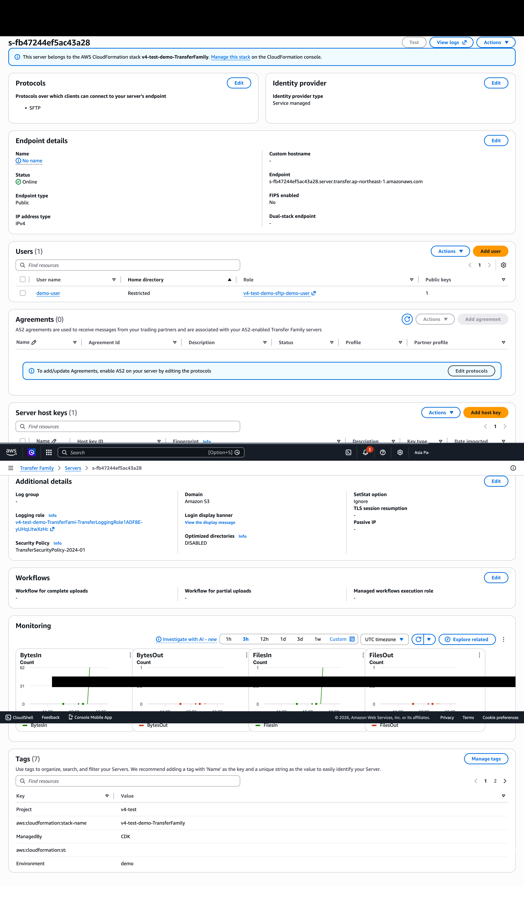
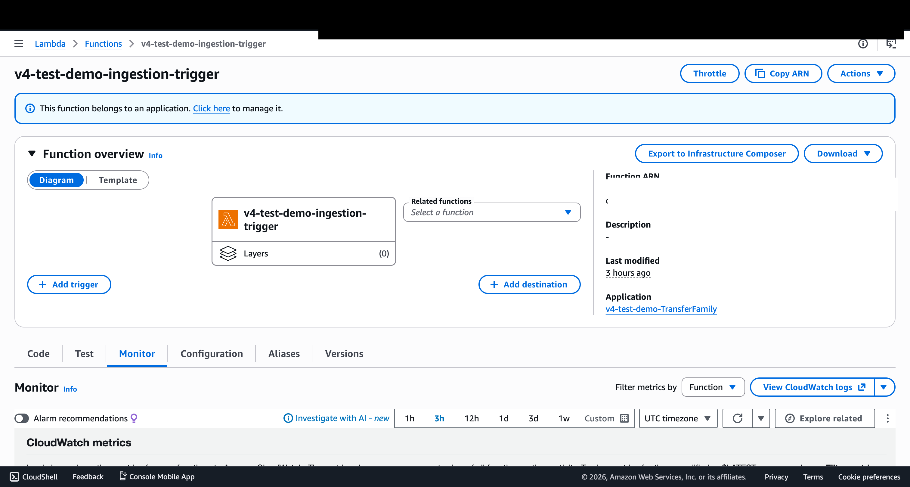
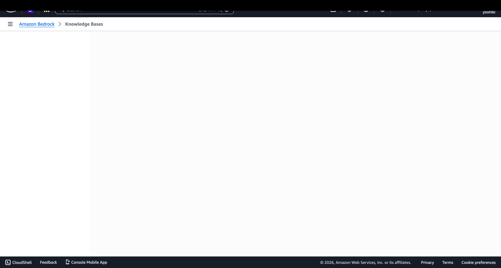

# Transfer Family FSx ONTAP E2E 検証レポート

**検証日**: 2026-05-13
**リージョン**: ap-northeast-1
**サーバーID**: s-fb47244ef5ac43a28
**エンドポイント**: s-fb47244ef5ac43a28.server.transfer.ap-northeast-1.amazonaws.com

---

## E2E フロー検証結果

| ステップ | 結果 | 詳細 |
|---------|------|------|
| 1. SSH鍵生成 | ✅ | RSA 4096bit |
| 2. Transfer Family ユーザー鍵登録 | ✅ | `import-ssh-public-key` API |
| 3. SFTP接続 | ✅ | 認証成功（publickey） |
| 4. ファイル一覧表示（ls） | ✅ | 2ファイル表示 |
| 5. ファイルアップロード（put） | ✅ | `sftp-uploaded.txt` |
| 6. Ingestion Trigger Lambda | ✅ | 1ファイル変更検出 |
| 7. KB StartIngestionJob | ✅ | ジョブID `JIGLRZMPEU` |
| 8. インジェスション完了 | ✅ | `COMPLETE`、1ドキュメント新規インデックス |

---

## 動作させるための必須設定

### 1. CDK コンテキストパラメータ

```json
{
  "enableTransferFamily": true,
  "transferFamilyTriggerMode": "polling",
  "transferFamilyPollingIntervalMinutes": 5,
  "s3AccessPointArn": "arn:aws:s3:ap-northeast-1:ACCOUNT_ID:accesspoint/AP_NAME",
  "transferFamilyS3ApAlias": "AP_NAME-xxxxxxxxxx-ext-s3alias"
}
```

> **重要**: `transferFamilyS3ApAlias` は S3 Access Point 作成後に取得する必要がある（CDK synth 時には不明）。

### 2. S3 Access Point Alias の取得方法

```bash
aws fsx describe-s3-access-point-attachments \
  --region ap-northeast-1 \
  --query "S3AccessPointAttachments[?Name=='AP_NAME'].S3AccessPoint.Alias" \
  --output text
```

### 3. HomeDirectoryMappings Target フォーマット

```
✅ 正しい: /{s3-access-point-alias}/uploads/demo-user
❌ 間違い: /{ap-name}/uploads/demo-user
❌ 間違い: /{ap-arn}/uploads/demo-user
❌ 間違い: /{alias}/uploads/demo-user/  (末尾スラッシュ)
```

### 4. IAM ポリシー Resource フォーマット

```
✅ IAM Resource: arn:aws:s3:REGION:ACCOUNT:accesspoint/AP_NAME/object/uploads/user/*
✅ IAM Resource (ListBucket): arn:aws:s3:REGION:ACCOUNT:accesspoint/AP_NAME
❌ IAM Resource にエイリアスを使用してはいけない
```

### 5. s3:prefix 条件

```
✅ 正しい: "s3:prefix": ["uploads/demo-user/*", "uploads/demo-user"]
❌ 間違い: "s3:prefix": ["/uploads/demo-user/*", "/uploads/demo-user"]
```
先頭スラッシュは不要。

### 6. 必要な IAM アクション

```json
{
  "ListBucket": ["s3:ListBucket", "s3:GetBucketLocation"],
  "ObjectOps": ["s3:PutObject", "s3:GetObject", "s3:GetObjectVersion", "s3:DeleteObject"]
}
```

### 7. SFTP 接続コマンド

```bash
# macOS/Linux での接続（HostKeyAlgorithms 指定が必要）
sftp -i /path/to/private-key \
  -o StrictHostKeyChecking=no \
  -o HostKeyAlgorithms=rsa-sha2-256,rsa-sha2-512 \
  -o PubkeyAcceptedAlgorithms=+ssh-rsa \
  USERNAME@SERVER_ID.server.transfer.REGION.amazonaws.com
```

> **⚠️ 本番環境での注意**: 上記の `StrictHostKeyChecking=no` は初回検証用です。本番環境では Transfer Family サーバーの HostKey を `~/.ssh/known_hosts` に登録し、`StrictHostKeyChecking=yes`（デフォルト）で運用してください。HostKey は `aws transfer describe-server --server-id <ID> --query 'Server.HostKeyFingerprint'` で取得できます。

### 8. FSx ONTAP ファイルシステム権限

Transfer Family ユーザーがファイルを読み書きするには、FSx ONTAP ボリューム上で S3 Access Point のファイルシステムユーザー（例: `root`）がアップロード先ディレクトリに対する読み書き権限を持っている必要がある。

---

## 発見された問題と解決策

### 問題 1: StructuredLogDestinations EarlyValidation

**症状**: ChangeSet 作成時に `AWS::EarlyValidation::PropertyValidation` エラー
**解決**: `structuredLogDestinations` プロパティを削除。`loggingRole` のみで標準ログ出力。

### 問題 2: HomeDirectoryMappings 末尾スラッシュ

**症状**: `Target in mapping has a trailing '/'`
**解決**: `homeDirectoryPrefix` のデフォルトを `/uploads/${userName}` に変更（末尾スラッシュなし）

### 問題 3: HomeDirectoryMappings Target に AP 名を使用

**症状**: `ls` で `No such file or directory`
**解決**: AP 名ではなく S3 AP **エイリアス**を使用。`/{alias}/path` 形式。

### 問題 4: IAM s3:prefix に先頭スラッシュ

**症状**: `Permission denied` on `ls`
**解決**: `s3:prefix` 条件から先頭スラッシュを除去。`uploads/user/*` が正しい。

### 問題 5: SSH HostKeyAlgorithms 不一致

**症状**: `no matching host key type found. Their offer: rsa-sha2-512,rsa-sha2-256`
**解決**: `-o HostKeyAlgorithms=rsa-sha2-256,rsa-sha2-512` を SFTP コマンドに追加。

### 問題 6: プレースホルダー SSH 鍵

**症状**: `Permission denied (publickey)` — 古いプレースホルダー鍵が残っている
**解決**: `aws transfer delete-ssh-public-key` で古い鍵を削除し、実際の鍵のみ残す。

---

## デプロイ後の手動セットアップ手順

1. **S3 Access Point 作成**（CDK外）
2. **S3 AP Alias 取得** → `cdk.context.json` に設定
3. **CDK デプロイ** (`npx cdk deploy v4-test-demo-TransferFamily`)
4. **SSH 鍵生成** (`ssh-keygen -t rsa -b 4096`)
5. **SSH 公開鍵登録** (`aws transfer import-ssh-public-key`)
6. **プレースホルダー鍵削除** (`aws transfer delete-ssh-public-key`)
7. **SFTP 接続テスト**
8. **Ingestion Trigger Lambda 手動実行** で検出確認

---

## AWS コンソール スクリーンショット

### Transfer Family サーバー詳細



- Status: **Online**
- Protocol: **SFTP**
- Endpoint Type: **Public**
- Security Policy: **TransferSecurityPolicy-2024-01**
- Users: **1** (demo-user)
- CloudWatch Monitoring: BytesIn/BytesOut/FilesIn/FilesOut

### Ingestion Trigger Lambda 監視



- Lambda 関数名: `v4-test-demo-ingestion-trigger`
- 実行成功確認

### Bedrock KB インジェスション完了



- Knowledge Base ID: `OBKM84FBQK`
- Data Source ID: `XPJGH2MCBN`
- Ingestion Job: **COMPLETE**
