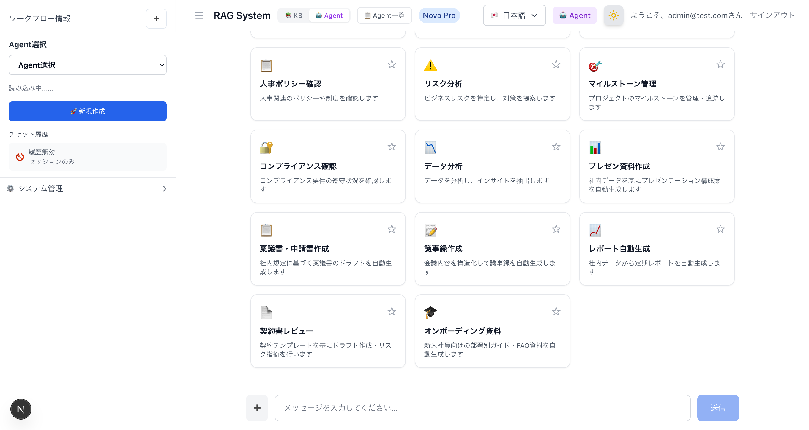
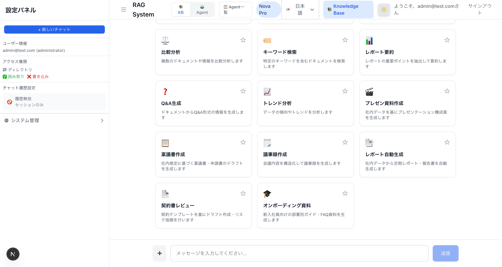
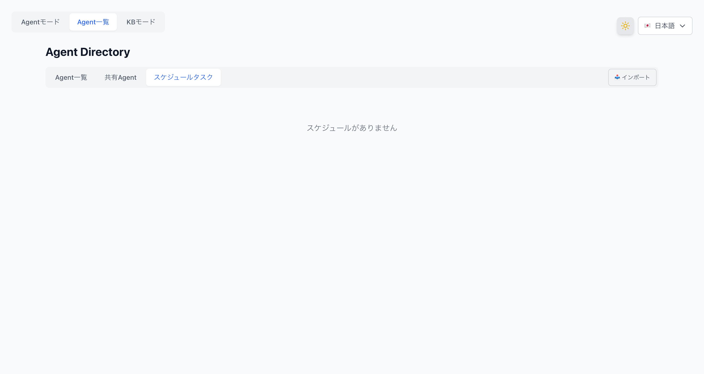

# チャットボットUI仕様書

**作成日**: 2026-03-26  
**対象**: 開発者・運用者  
**アプリケーション**: Permission-aware RAG Chatbot

---

## 概要

本ドキュメントは、RAGチャットボットのUI各要素の仕様と、バックエンドとの連携を説明します。

---

## 1. サイドバー — ユーザー情報セクション

### 表示内容

| 項目 | データソース | 説明 |
|------|------------|------|
| ユーザー名 | Cognito JWT | サインイン時のメールアドレス |
| ロール | Cognito JWT | `admin` または `user` |

### アクセス権限表示

| 項目 | データソース | 説明 |
|------|------------|------|
| ディレクトリ | `/api/fsx/directories` | SIDベースのアクセス可能ディレクトリ |
| 読み取り | 同上 | SIDデータが存在すれば `✅` |
| 書き込み | 同上 | Domain Admins SIDを持つ場合のみ `✅` |

### アクセス可能ディレクトリの仕組み

Introduction Messageには3種類のディレクトリ情報が表示されます。

| 項目 | アイコン | データソース | 説明 |
|------|---------|------------|------|
| FSxアクセス可能ディレクトリ | 📁 | DynamoDB SID → SID_DIRECTORY_MAP | FSx ONTAP上でファイルレベルでアクセス可能なディレクトリ |
| RAG検索可能ディレクトリ | 🔍 | S3 `.metadata.json` のSID照合 | KB検索でSIDマッチするドキュメントのディレクトリ |
| Embedding対象ディレクトリ | 📚 | S3バケット内の全`.metadata.json` | KBにインデックスされている全ディレクトリ |

#### ユーザー別の表示例

| ユーザー | FSxアクセス | RAG検索 | Embedding対象 |
|---------|-----------|---------|-------------|
| admin@example.com | `public/`, `confidential/`, `restricted/` | `public/`, `confidential/`, `restricted/` | `public/`, `confidential/`, `restricted/`（表示あり） |
| user@example.com | `public/` | `public/` | 非表示（セキュリティ上、アクセス不可ディレクトリの存在を隠す） |

一般ユーザーにはEmbedding対象ディレクトリは表示されません（アクセスできないディレクトリの存在を知らせないため）。管理者のようにRAG検索可能ディレクトリとEmbedding対象ディレクトリが同一の場合のみ、📚 Embedding対象ディレクトリが表示されます。

#### データ取得フロー

```
/api/fsx/directories?username={email}
  ↓
1. DynamoDB user-access → ユーザーSID取得
  ↓
2. FSxディレクトリ: SID → SID_DIRECTORY_MAP で計算
  ↓
3. RAG/Embeddingディレクトリ: S3バケットの.metadata.jsonをスキャン
   - 各ファイルの allowed_group_sids とユーザーSIDを照合
   - マッチ → RAGアクセス可能
   - 全ディレクトリ → Embedding対象
  ↓
4. 3種類のディレクトリ情報を返却
```

#### SIDとディレクトリのマッピング

| SID | 名前 | アクセス可能ディレクトリ |
|-----|------|----------------------|
| `S-1-1-0` | Everyone | `public/` |
| `S-1-5-21-...-512` | Domain Admins | `confidential/`, `restricted/` |
| `S-1-5-21-...-1100` | Engineering | `restricted/` |

#### ユーザー別の表示例

| ユーザー | 保有SID | 表示されるディレクトリ |
|---------|--------|---------------------|
| admin@example.com | Everyone + Domain Admins | `public/`, `confidential/`, `restricted/` |
| user@example.com | Everyone のみ | `public/` |

#### 環境タイプ表示

| directoryType | 表示 | 条件 |
|--------------|------|------|
| `sid-based` | 🔐 SIDベースのアクセス権限 | DynamoDB SIDデータから正常取得 |
| `actual` | 🟢 FSx for ONTAP本番環境 | FSx APIから直接取得（将来対応） |
| `fallback` | ⚠️ シミュレーション環境 | DynamoDBエラー時 |
| `no-table` | ⚠️ シミュレーション環境 | USER_ACCESS_TABLE_NAME未設定 |

### 新しいディレクトリを追加する場合

1. S3にドキュメントと`.metadata.json`をアップロード
2. `.metadata.json`の`allowed_group_sids`に適切なSIDを設定
3. Bedrock KBデータソースを同期
4. `/api/fsx/directories`の`SID_DIRECTORY_MAP`にマッピングを追加

```typescript
// docker/nextjs/src/app/api/fsx/directories/route.ts
const SID_DIRECTORY_MAP: Record<string, string[]> = {
  'S-1-1-0': ['public/'],
  'S-1-5-21-...-512': ['confidential/', 'restricted/'],
  'S-1-5-21-...-1100': ['restricted/'],
  // 新しいディレクトリを追加:
  'S-1-5-21-...-1200': ['engineering-docs/'],
};
```

---

## 2. サイドバー — Bedrockリージョンセクション

### 表示内容

| 項目 | データソース | 説明 |
|------|------------|------|
| リージョン名 | `RegionConfigManager` | 選択中リージョンの日本語名 |
| リージョンID | `regionStore` | `ap-northeast-1` 等 |
| モデル数 | `/api/bedrock/region-info` | 選択中リージョンの利用可能モデル数 |

### リージョン変更フロー

```
ユーザーがリージョン選択
  ↓
RegionSelector → /api/bedrock/change-region (POST)
  ↓
Cookie bedrock_region を更新
  ↓
ページリロード
  ↓
/api/bedrock/region-info → 新リージョンのモデル一覧取得
  ↓
/api/bedrock/models → モデルセレクターを更新
```

### リージョン別モデル数（2026-03-25時点）

| リージョン | モデル数 | 備考 |
|-----------|---------|------|
| 東京 (ap-northeast-1) | 57 | プライマリ |
| 大阪 (ap-northeast-3) | 9 | |
| シンガポール (ap-southeast-1) | 18 | |
| シドニー (ap-southeast-2) | 59 | |
| ムンバイ (ap-south-1) | 58 | |
| ソウル (ap-northeast-2) | 19 | |
| アイルランド (eu-west-1) | 50 | |
| フランクフルト (eu-central-1) | 29 | |
| ロンドン (eu-west-2) | 52 | |
| パリ (eu-west-3) | 25 | |
| バージニア (us-east-1) | 96 | |
| オレゴン (us-west-2) | 103 | 最多 |
| オハイオ (us-east-2) | 76 | |
| サンパウロ (sa-east-1) | 43 | |

> モデル数は`ListFoundationModels(byOutputModality=TEXT)`の結果です。新モデル追加時は`/api/bedrock/region-info`の`REGION_MODEL_COUNTS`を更新してください。

---

## 3. AIモデル選択セクション

### モデル一覧の取得

```
/api/bedrock/models (GET)
  ↓
ListFoundationModels API (byOutputModality=TEXT)
  ↓
provider-patterns.ts でプロバイダー自動検出
  ↓
全モデルを返却（Unknownプロバイダーも含む）
```

### 対応プロバイダー（13社）

amazon, anthropic, cohere, deepseek, google, minimax, mistral, moonshot, nvidia, openai, qwen, twelvelabs, zai

### モデル選択時の処理

KB Retrieve APIでは、選択されたモデルIDに応じてConverse APIの呼び出し方法が変わります。

| モデルIDパターン | 処理 |
|----------------|------|
| `apac.xxx` / `us.xxx` / `eu.xxx` | inference profileとしてそのまま使用 |
| `anthropic.xxx` | on-demandで直接呼び出し |
| `google.xxx`, `qwen.xxx`, `deepseek.xxx` 等 | on-demandで直接呼び出し |
| `amazon.nova-pro-v1:0` 等（プレフィックスなし） | Claude Haikuにフォールバック |
| Legacyモデル | 自動フォールバック（Nova Lite → Claude Haiku） |

### フォールバックチェーン

```
選択モデル → (失敗) → apac.amazon.nova-lite-v1:0 → (失敗) → anthropic.claude-3-haiku-20240307-v1:0
```

Legacyモデルエラー、on-demand不可エラー、ValidationExceptionが発生した場合に自動的に次のモデルを試行します。

---

## 4. チャットエリア — Introduction Message

### 表示内容

サインイン後に自動生成される初期メッセージです。

| セクション | 内容 |
|-----------|------|
| あいさつ | ユーザー名を含むウェルカムメッセージ |
| アクセス権限 | ユーザー名、ロール、アクセス可能ディレクトリ |
| 環境タイプ | SIDベース / FSx本番 / シミュレーション |
| 権限詳細 | 読み取り / 書き込み / 実行 の可否 |
| 利用可能な機能 | 文書検索とQ&A、権限ベースのアクセス制御 |

### 多言語対応

8言語対応（ja, en, de, es, fr, ko, zh-CN, zh-TW）。翻訳キーは`docker/nextjs/src/messages/{locale}.json`の`introduction`セクションに定義されています。

---

## 5. チャットエリア — RAG検索フロー

### 2段階方式（Retrieve + Converse）

```
ユーザー質問
  ↓
/api/bedrock/kb/retrieve (POST)
  ↓
Step 1: DynamoDB user-access → ユーザーSID取得
  ↓
Step 2: Bedrock KB Retrieve API → ベクトル検索（メタデータ付き）
  ↓
Step 3: SIDフィルタリング
  - ドキュメントの allowed_group_sids とユーザーSIDを照合
  - マッチ → ALLOW、不一致 → DENY
  ↓
Step 4: Converse API → 許可ドキュメントのみで回答生成
  ↓
回答 + Citation + filterLog を返却
```

### RetrieveAndGenerate APIを使わない理由

RetrieveAndGenerate APIはcitationの`metadata`フィールドに`.metadata.json`の`allowed_group_sids`を含めません。Retrieve APIはメタデータを正しく返すため、2段階方式を採用しています。

### フロントエンドのフォールバック

KB Retrieve APIが500エラーを返した場合、フロントエンドは通常のBedrock Chat API（`/api/bedrock/chat`）にフォールバックします。この場合、KBドキュメントを参照しない一般的なAI回答が返されます。

---

## 6. API一覧

| エンドポイント | メソッド | 説明 |
|--------------|---------|------|
| `/api/bedrock/kb/retrieve` | POST | RAG検索 + SIDフィルタリング + 回答生成 |
| `/api/bedrock/chat` | POST | 通常チャット（KB不使用、フォールバック用） |
| `/api/bedrock/models` | GET | 利用可能モデル一覧 |
| `/api/bedrock/region-info` | GET | リージョン情報 + モデル数 |
| `/api/bedrock/change-region` | POST | リージョン変更（Cookie更新） |
| `/api/fsx/directories` | GET | ユーザーのアクセス可能ディレクトリ（SIDベース） |
| `/api/auth/signin` | POST | Cognito認証 |
| `/api/auth/session` | GET | セッション情報 |
| `/api/auth/signout` | POST | サインアウト |
| `/api/health` | GET | ヘルスチェック |

---

## 7. 環境変数

Lambda関数に設定する環境変数です。

| 変数名 | 説明 | 例 |
|--------|------|-----|
| `DATA_BUCKET_NAME` | KBデータソースS3バケット名 | `perm-rag-demo-demo-kb-data-${ACCOUNT_ID}` |
| `BEDROCK_KB_ID` | Knowledge Base ID | `3ZZMK6YA0Q` |
| `BEDROCK_REGION` | Bedrockリージョン | `ap-northeast-1` |
| `USER_ACCESS_TABLE_NAME` | DynamoDB user-accessテーブル名 | `perm-rag-demo-demo-user-access` |
| `COGNITO_USER_POOL_ID` | Cognito User Pool ID | `ap-northeast-1_xxxxx` |
| `COGNITO_CLIENT_ID` | Cognito Client ID | `xxxxx` |
| `ENABLE_PERMISSION_CHECK` | 権限チェック有効化 | `true` |

---

## 8. トラブルシューティング

### チャットでドキュメントの情報が返らない

| 症状 | 原因 | 対処 |
|------|------|------|
| 全ユーザーで情報が返らない | KB未同期 or BEDROCK_KB_ID未設定 | `sync-kb-datasource.sh`実行、環境変数確認 |
| adminでも機密情報が返らない | SIDデータ未登録 | `setup-user-access.sh`実行 |
| 回答は返るがCitationがない | フォールバックChat APIが使われている | Lambdaログで500エラーを確認 |
| 「アクセス権限のあるドキュメントが見つかりませんでした」 | SIDマッチなし | DynamoDBのSIDデータとメタデータのSIDを確認 |

### モデル選択で500エラー

| 症状 | 原因 | 対処 |
|------|------|------|
| 特定モデルで500 | Legacyモデル or on-demand不可 | 自動フォールバックで対応済み |
| 全モデルで500 | Lambda タイムアウト | Lambdaタイムアウトを30秒以上に設定 |

### ディレクトリ表示が「❓ 不明な環境」

| 症状 | 原因 | 対処 |
|------|------|------|
| 不明な環境と表示 | `directoryType`が未対応の値 | `page.tsx`のswitchケースを確認 |
| ディレクトリが空 | SIDデータ未登録 | `setup-user-access.sh`実行 |


---

## 8. KB/Agentモード切替

### 概要

ヘッダーにKB/Agentモード切替トグルを配置し、2つのモードをシームレスに切り替えられます。

```
┌─────────────────────────────────────────────────────────┐
│ ≡  RAG System  [📚 KB] [🤖 Agent]  ➕  Nova Pro  🇯🇵  │
│                                                         │
│    📚 Knowledge Base  ← モードに応じて動的に変化        │
│    🤖 Agent                                             │
└─────────────────────────────────────────────────────────┘
```

### モード切替の仕組み

| 項目 | 説明 |
|------|------|
| トグル位置 | ヘッダーのタイトル右横 |
| 状態管理 | `useState` + URLパラメータ（`?mode=agent`） |
| 永続化 | URLパラメータで永続化（ブックマーク可能） |
| デフォルト | KBモード（`?mode`パラメータなし） |

### モード別の動作

| 機能 | KBモード | Agentモード |
|------|---------|------------|
| サイドバー | KBModeSidebar（インライン） | AgentModeSidebar（コンポーネント） |
| モデルリスト | `/api/bedrock/region-info`（全モデル） | `/api/bedrock/agent-models`（Agent対応モデルのみ） |
| モデル取得方式 | 静的設定 + API | Bedrock `ListFoundationModels` API（`ON_DEMAND` + `TEXT`フィルタ） |
| チャットAPI | `/api/bedrock/kb/retrieve` | `/api/bedrock/kb/retrieve`（`agentMode=true`フラグ付き） |
| SIDフィルタリング | ✅ あり | ✅ あり（ハイブリッド方式） |
| ヘッダーバッジ | 📚 Knowledge Base（青） | 🤖 Agent（紫） |
| 動作モード表示 | 📚 Knowledge Base | 🤖 Agent |

### Agentモードのハイブリッド方式

Agentモードでは、Permission-awareなRAGを実現するためにハイブリッド方式を採用しています。

```
ユーザー質問
  │
  ▼
KB Retrieve API（ベクトル検索）
  │
  ▼
SIDフィルタリング（KBモードと同じパイプライン）
  │ ユーザーSID ∩ ドキュメントSID → 許可/拒否
  ▼
許可ドキュメントのみをコンテキストとして
  │
  ▼
Converse API（Agent用システムプロンプト付き）
  │ 「AIエージェントとして多段階推論と文書検索を活用して回答」
  ▼
回答 + Citation表示
```

**なぜハイブリッド方式か:**
- Bedrock Agent InvokeAgent APIはアプリ側でのSIDフィルタリングの余地がない
- KB Retrieve APIはメタデータ（`allowed_group_sids`）を返すため、SIDフィルタリングが可能
- 既存のSIDフィルタリングパイプラインをそのまま再利用できる

### Agent対応モデルの動的取得

Agent対応モデルはハードコードせず、Bedrock APIから動的に取得します。

```
/api/bedrock/agent-models?region=ap-northeast-1
  │
  ▼
BedrockClient.ListFoundationModels({
  byOutputModality: 'TEXT',
  byInferenceType: 'ON_DEMAND',
})
  │
  ▼
フィルタ:
  - TEXT入力 + TEXT出力
  - ON_DEMAND推論サポート
  - Embeddingモデル除外
  │
  ▼
Agent対応モデルリスト（メンテナンス不要）
```

### AgentModeSidebarの構成

ワークフロー選択は中央のカードグリッドに統合されたため、サイドバーからは削除されています。サイドバーはAgent情報表示と、折りたたみ可能なシステム管理セクションで構成されます。

```
┌─────────────────────────┐
│ ワークフロー情報         │
│  [Agent選択 ▼]          │
│  Agent ID: 1YZW9MRRSA   │
│  Agent名: presentation..│
│  ステータス: ✅ PREPARED │
│  説明: 社内データを基に..│
│  [🚀 新規作成] [🗑️ 削除]│
├─────────────────────────┤
│ ▶ ⚙️ システム管理       │  ← CollapsiblePanel（デフォルト折りたたみ）
│   リージョン設定         │
│   AIモデル選択           │
│   機能                   │
│   チャット履歴           │
└─────────────────────────┘
```



### ワークフロー選択

ワークフロー選択は中央のカードグリッド（セクション9参照）に統合されています。カードクリック時にカテゴリに対応するBedrock Agentが自動検索・動的作成され、プロンプトがチャット入力欄に自動設定されます（`agent-workflow-selected`カスタムイベント）。

### Agent呼び出しフロー（本格実装）

```
ユーザー質問 or ワークフロー選択
  │
  ▼
InvokeAgent API（Bedrock Agent Runtime）
  │ Agent ID + Alias ID + Session ID
  │ ストリーミングレスポンス
  ▼
Agent 多段階推論
  ├── KB検索（Agent内部）
  ├── Action Group呼び出し（設定時）
  └── 回答生成
  │
  ▼
成功 → Agent応答 + Citation（traceから抽出）
  │
  ▼ 失敗時フォールバック
KB Retrieve API → SIDフィルタリング → Converse API
  │ （ハイブリッド方式、Permission-aware保証）
  ▼
回答 + Citation表示
```

### 関連ファイル

| ファイル | 役割 |
|---------|------|
| `docker/nextjs/src/app/[locale]/genai/page.tsx` | モード切替トグル、条件付きサイドバーレンダリング |
| `docker/nextjs/src/components/bedrock/AgentModeSidebar.tsx` | Agentモードサイドバー |
| `docker/nextjs/src/components/bedrock/AgentInfoSection.tsx` | Agent選択・情報表示 |
| `docker/nextjs/src/components/bedrock/ModelSelector.tsx` | モデル選択（`mode`プロパティでKB/Agent切替） |
| `docker/nextjs/src/app/api/bedrock/agent-models/route.ts` | Agent対応モデルAPI（動的取得） |
| `docker/nextjs/src/app/api/bedrock/agent/route.ts` | Agent API（invoke, create, delete, list） |
| `docker/nextjs/src/hooks/useAgentMode.ts` | モード切替ロジック |
| `docker/nextjs/src/hooks/useAgentsList.ts` | Agent一覧取得 |
| `docker/nextjs/src/store/useAgentStore.ts` | Agent状態管理（Zustand） |

---

## 9. カードベースのタスク指向UI

### 概要

チャットエリアの初期状態（ユーザーメッセージが存在しない時）にカードグリッドを表示する機能です。KBモードでは目的別カード（文書検索、要約作成など）14枚、Agentモードではワークフローカード（財務分析、プロジェクト管理、プレゼン資料作成など）14枚を提示し、ユーザーがワンクリックでプロンプトを入力できます。


```
┌─────────────────────────────────────────────────────────────┐
│ ≡  RAG System  [📚 KB] [🤖 Agent]  ➕  Nova Pro  🇯🇵      │
├─────────────────────────────────────────────────────────────┤
│                                                             │
│  ┌─ InfoBanner ──────────────────────────────────────────┐  │
│  │ admin@example.com | admin | 📁 3個のディレクトリ  ▼   │  │
│  └───────────────────────────────────────────────────────┘  │
│                                                             │
│  [すべて] [検索] [要約] [学習] [分析]  ← CategoryFilter    │
│                                                             │
│  ┌──────────┐ ┌──────────┐ ┌──────────┐                    │
│  │ 🔍       │ │ 📝       │ │ 📚       │                    │
│  │ 文書検索  │ │ 要約作成  │ │ 学習問題  │  ← TaskCard     │
│  │ キーワード│ │ 文書を要約│ │ 問題を作成│                    │
│  └──────────┘ └──────────┘ └──────────┘                    │
│  ┌──────────┐ ┌──────────┐ ┌──────────┐                    │
│  │ ⚖️       │ │ 🏷️       │ │ 📊       │                    │
│  │ 比較分析  │ │ キーワード│ │ レポート  │                    │
│  │ 文書を比較│ │ 検索     │ │ 要約     │                    │
│  └──────────┘ └──────────┘ └──────────┘                    │
│                                                             │
└─────────────────────────────────────────────────────────────┘
```

### コンポーネント構成

| コンポーネント | ファイルパス | 役割 |
|--------------|------------|------|
| CardGrid | `docker/nextjs/src/components/cards/CardGrid.tsx` | メインコンテナ。InfoBanner・CategoryFilter・TaskCardを統合し、モードに応じたカード表示・フィルタリング・お気に入りソートを担当 |
| TaskCard | `docker/nextjs/src/components/cards/TaskCard.tsx` | 個別カードコンポーネント（KB/Agent共通）。アイコン・タイトル・説明文・お気に入りトグルを表示 |
| InfoBanner | `docker/nextjs/src/components/cards/InfoBanner.tsx` | 権限情報バナー。既存Introduction Textの情報をコンパクトに折りたたみ/展開表示 |
| CategoryFilter | `docker/nextjs/src/components/cards/CategoryFilter.tsx` | カテゴリフィルタチップ。モード別カテゴリでカードを絞り込み |

#### コンポーネント階層

```
CardGrid
├── InfoBanner          # 権限情報バナー（折りたたみ/展開）
├── CategoryFilter      # カテゴリフィルタチップ
└── TaskCard × N        # 個別カード（グリッド表示）
    └── お気に入りボタン  # ★/☆トグル
```

#### CardGrid Props

```typescript
interface CardGridProps {
  mode: 'kb' | 'agent';
  locale: string;
  onCardClick: (promptTemplate: string, label: string) => void;
  username: string;
  role: string;
  userDirectories: any | null;
}
```

#### TaskCard Props

```typescript
interface TaskCardProps {
  card: CardData;
  isFavorite: boolean;
  onFavoriteToggle: (cardId: string) => void;
  onClick: (promptTemplate: string, label: string) => void;
  locale: string;
}
```

### カードデータ

カードデータは `docker/nextjs/src/constants/card-constants.ts` で一元管理されます。

#### CardData 型定義

```typescript
interface CardData {
  id: string;                // 一意識別子 (例: 'kb-doc-search')
  icon: string;              // emoji (例: '🔍')
  titleKey: string;          // 翻訳キー (例: 'cards.kb.docSearch.title')
  descriptionKey: string;    // 翻訳キー (例: 'cards.kb.docSearch.description')
  promptTemplateKey: string; // 翻訳キー (例: 'cards.kb.docSearch.prompt')
  category: string;          // カテゴリID (例: 'search')
  mode: 'kb' | 'agent';     // 表示モード
}
```

#### KBモード カード一覧（14枚）

##### 調査系（8枚）

| ID | アイコン | カテゴリ | 用途 |
|----|---------|---------|------|
| `kb-doc-search` | 🔍 | search | 文書検索 |
| `kb-doc-summary` | 📝 | summary | 要約作成 |
| `kb-quiz-gen` | 📚 | learning | 学習問題作成 |
| `kb-compare` | ⚖️ | analysis | 比較分析 |
| `kb-keyword-search` | 🏷️ | search | キーワード検索 |
| `kb-report-summary` | 📊 | summary | レポート要約 |
| `kb-qa-gen` | ❓ | learning | Q&A生成 |
| `kb-trend-analysis` | 📈 | analysis | トレンド分析 |

##### アウトプット系（6枚）

| ID | アイコン | カテゴリ | 用途 |
|----|---------|---------|------|
| `kb-presentation` | 🎬 | output | プレゼン資料作成 |
| `kb-approval` | 📋 | output | 稟議書作成 |
| `kb-minutes` | 🗒️ | output | 議事録作成 |
| `kb-report-gen` | 📑 | output | レポート自動生成 |
| `kb-contract` | 📄 | output | 契約書レビュー |
| `kb-onboarding` | 🎓 | output | オンボーディング資料 |

#### Agentモード カード一覧（14枚）

##### リサーチ系（8枚）

| ID | アイコン | カテゴリ | 用途 |
|----|---------|---------|------|
| `agent-financial` | 📊 | financial | 財務レポート分析 |
| `agent-project` | 📝 | project | プロジェクト進捗確認 |
| `agent-cross-search` | 🔍 | search | ドキュメント横断検索 |
| `agent-hr` | 📋 | hr | 人事ポリシー確認 |
| `agent-risk` | ⚠️ | financial | リスク分析 |
| `agent-milestone` | 🎯 | project | マイルストーン管理 |
| `agent-compliance` | 🔐 | hr | コンプライアンス確認 |
| `agent-data-analysis` | 📉 | search | データ分析 |

##### アウトプット系（6枚）

| ID | アイコン | カテゴリ | 用途 |
|----|---------|---------|------|
| `agent-presentation` | 📊 | presentation | プレゼン資料作成 |
| `agent-approval` | 📋 | approval | 稟議書作成 |
| `agent-minutes` | 📝 | minutes | 議事録作成 |
| `agent-report` | 📈 | report | レポート作成 |
| `agent-contract` | 📄 | contract | 契約書レビュー |
| `agent-onboarding` | 🎓 | onboarding | オンボーディング資料作成 |


### 表示条件

CardGridの表示はユーザーメッセージの有無で制御されます。

| 条件 | 表示内容 |
|------|---------|
| ユーザーメッセージなし（`messages`に`role === 'user'`が0件） | CardGrid表示 |
| ユーザーメッセージあり（`role === 'user'`が1件以上） | 通常メッセージリスト表示 + 「🔄 ワークフロー選択に戻る」ボタン |
| 「新しいチャット」ボタンクリック | 新セッション作成 → CardGrid再表示 |
| 「🔄 ワークフロー選択に戻る」ボタンクリック | 新セッション作成 → CardGrid再表示 |

```typescript
// page.tsx での表示切替ロジック
const hasUserMessages = currentSession?.messages?.some(m => m.role === 'user') ?? false;

{!hasUserMessages ? (
  <CardGrid
    mode={agentMode ? 'agent' : 'kb'}
    locale={memoizedLocale}
    onCardClick={(prompt, label) => {
      setInputText(prompt);
      if (agentMode) {
        window.dispatchEvent(new CustomEvent('agent-workflow-selected', {
          detail: { prompt, label }
        }));
      }
    }}
    username={user?.email || ''}
    role={user?.role || ''}
    userDirectories={userDirectories}
  />
) : (
  // 既存のメッセージリスト表示
  currentSession?.messages?.map(...)
)}
```

### 「ワークフロー選択に戻る」ボタン

チャット中（ユーザーメッセージが1件以上存在する場合）に、チャット入力欄の上部に「🔄 ワークフロー選択に戻る」ボタンが表示されます。クリックすると新しいセッションが作成され、カードグリッドに戻ります。


| 項目 | 説明 |
|------|------|
| 表示条件 | `currentSession.messages`に`role === 'user'`が1件以上 |
| 位置 | チャット入力欄の上部 |
| 動作 | 新しいChatSessionを作成し、`setCurrentSession`で設定。カードグリッドが再表示される |
| スタイル | テキストリンク風（`text-blue-600`）、🔄アイコン付き |

### お気に入り管理

#### Zustandストア

**ファイル**: `docker/nextjs/src/store/useFavoritesStore.ts`

```typescript
interface FavoritesStore {
  favorites: string[];                        // お気に入りカードIDリスト
  toggleFavorite: (cardId: string) => void;   // お気に入りトグル（追加/削除）
  isFavorite: (cardId: string) => boolean;    // お気に入り判定
}
```

| 項目 | 説明 |
|------|------|
| 永続化方式 | Zustand `persist`ミドルウェア + localStorage |
| localStorageキー | `card-favorites-storage` |
| フォールバック | localStorage未対応時はインメモリのみ（セッション中保持） |
| ソート動作 | お気に入りカードはグリッド先頭に表示。各グループ内の相対順序は維持 |

#### ソートロジック

```typescript
// card-constants.ts
function sortCardsByFavorites(cards: CardData[], favorites: string[]): CardData[] {
  const favoriteSet = new Set(favorites);
  const favoriteCards = cards.filter((card) => favoriteSet.has(card.id));
  const nonFavoriteCards = cards.filter((card) => !favoriteSet.has(card.id));
  return [...favoriteCards, ...nonFavoriteCards];
}
```

### カテゴリフィルタリング

#### KBモード カテゴリ

| カテゴリID | 翻訳キー | 表示名（ja） |
|-----------|---------|------------|
| `all` | `cards.categories.all` | すべて |
| `search` | `cards.categories.search` | 検索 |
| `summary` | `cards.categories.summary` | 要約 |
| `learning` | `cards.categories.learning` | 学習 |
| `analysis` | `cards.categories.analysis` | 分析 |
| `output` | `cards.categories.output` | 資料作成 |

#### Agentモード カテゴリ

| カテゴリID | 翻訳キー | 表示名（ja） |
|-----------|---------|------------|
| `all` | `cards.categories.all` | すべて |
| `financial` | `cards.categories.financial` | 財務 |
| `project` | `cards.categories.project` | プロジェクト |
| `hr` | `cards.categories.hr` | 人事 |
| `search` | `cards.categories.search` | 検索 |
| `presentation` | `cards.categories.presentation` | 資料作成 |
| `approval` | `cards.categories.approval` | 申請・稟議 |
| `minutes` | `cards.categories.minutes` | 議事録 |
| `report` | `cards.categories.report` | レポート |
| `contract` | `cards.categories.contract` | 契約 |
| `onboarding` | `cards.categories.onboarding` | オンボーディング |

#### フィルタリング動作

| 操作 | 動作 |
|------|------|
| カテゴリ選択 | 選択カテゴリに一致するカードのみ表示 |
| 「すべて」選択 | 現在モードの全カードを表示 |
| モード切替（KB↔Agent） | カテゴリ選択を「すべて」にリセット |

### InfoBanner

既存のIntroduction Textの情報をコンパクトなバナーに集約します。

#### 折りたたみ状態（デフォルト）

1行表示: `ユーザー名 | ロール | 📁 N個のディレクトリにアクセス可能`

#### 展開状態

| 表示項目 | 説明 |
|---------|------|
| ユーザー名 | Cognito JWTのメールアドレス |
| ロール | `admin` または `user` |
| SID | ユーザーのセキュリティ識別子 |
| ディレクトリ一覧 | FSx / RAG / Embedding の3種類 |
| 権限詳細 | 読み取り ✅/❌、書き込み ✅/❌、実行 ✅/❌ |

既存のIntroduction Textに含まれていた全ての情報（ユーザー名、ロール、SID、ディレクトリ一覧、権限詳細）を保持しています。

#### InfoBanner Props

```typescript
interface InfoBannerProps {
  username: string;
  role: string;
  userDirectories: any | null;
  locale: string;
  isExpanded: boolean;
  onToggleExpand: () => void;
}
```

### 翻訳

全8言語対応です。翻訳キーは各言語の`messages/{locale}.json`内の`cards`ネームスペースに定義されています。

| 言語 | ロケール | 翻訳ファイル |
|------|---------|------------|
| 日本語 | `ja` | `docker/nextjs/src/messages/ja.json` |
| 英語 | `en` | `docker/nextjs/src/messages/en.json` |
| 中国語（簡体字） | `zh-CN` | `docker/nextjs/src/messages/zh-CN.json` |
| 中国語（繁体字） | `zh-TW` | `docker/nextjs/src/messages/zh-TW.json` |
| 韓国語 | `ko` | `docker/nextjs/src/messages/ko.json` |
| フランス語 | `fr` | `docker/nextjs/src/messages/fr.json` |
| ドイツ語 | `de` | `docker/nextjs/src/messages/de.json` |
| スペイン語 | `es` | `docker/nextjs/src/messages/es.json` |

#### 翻訳キー構造

```json
{
  "cards": {
    "categories": {
      "all": "すべて",
      "search": "検索",
      "summary": "要約",
      "learning": "学習",
      "analysis": "分析",
      "output": "資料作成",
      "financial": "財務",
      "project": "プロジェクト",
      "hr": "人事",
      "presentation": "資料作成",
      "approval": "申請・稟議",
      "minutes": "議事録",
      "report": "レポート",
      "contract": "契約",
      "onboarding": "オンボーディング"
    },
    "kb": {
      "docSearch": { "title": "...", "description": "...", "prompt": "..." },
      "docSummary": { "title": "...", "description": "...", "prompt": "..." },
      "quizGen": { "title": "...", "description": "...", "prompt": "..." },
      "compare": { "title": "...", "description": "...", "prompt": "..." },
      "keywordSearch": { "title": "...", "description": "...", "prompt": "..." },
      "reportSummary": { "title": "...", "description": "...", "prompt": "..." },
      "qaGen": { "title": "...", "description": "...", "prompt": "..." },
      "trendAnalysis": { "title": "...", "description": "...", "prompt": "..." },
      "presentation": { "title": "...", "description": "...", "prompt": "..." },
      "approval": { "title": "...", "description": "...", "prompt": "..." },
      "minutes": { "title": "...", "description": "...", "prompt": "..." },
      "reportGen": { "title": "...", "description": "...", "prompt": "..." },
      "contract": { "title": "...", "description": "...", "prompt": "..." },
      "onboarding": { "title": "...", "description": "...", "prompt": "..." }
    },
    "agent": {
      "financial": { "title": "...", "description": "...", "prompt": "..." },
      "project": { "title": "...", "description": "...", "prompt": "..." },
      "crossSearch": { "title": "...", "description": "...", "prompt": "..." },
      "hr": { "title": "...", "description": "...", "prompt": "..." },
      "risk": { "title": "...", "description": "...", "prompt": "..." },
      "milestone": { "title": "...", "description": "...", "prompt": "..." },
      "compliance": { "title": "...", "description": "...", "prompt": "..." },
      "dataAnalysis": { "title": "...", "description": "...", "prompt": "..." },
      "presentation": { "title": "...", "description": "...", "prompt": "..." },
      "approval": { "title": "...", "description": "...", "prompt": "..." },
      "minutes": { "title": "...", "description": "...", "prompt": "..." },
      "report": { "title": "...", "description": "...", "prompt": "..." },
      "contract": { "title": "...", "description": "...", "prompt": "..." },
      "onboarding": { "title": "...", "description": "...", "prompt": "..." }
    },
    "infoBanner": {
      "directoriesCount": "{count}個のディレクトリにアクセス可能",
      "showDetails": "詳細を表示",
      "hideDetails": "詳細を隠す",
      "user": "ユーザー",
      "role": "ロール",
      "sid": "SID",
      "directories": "ディレクトリ",
      "permissions": "権限",
      "read": "読み取り",
      "write": "書き込み",
      "execute": "実行",
      "available": "可能",
      "unavailable": "不可"
    },
    "favorites": {
      "addToFavorites": "お気に入りに追加",
      "removeFromFavorites": "お気に入りから削除"
    }
  }
}
```

### 関連ファイル

| ファイル | 役割 |
|---------|------|
| `docker/nextjs/src/components/cards/CardGrid.tsx` | カードグリッドメインコンテナ |
| `docker/nextjs/src/components/cards/TaskCard.tsx` | 個別カードコンポーネント（KB/Agent共通） |
| `docker/nextjs/src/components/cards/InfoBanner.tsx` | 権限情報バナー（折りたたみ/展開） |
| `docker/nextjs/src/components/cards/CategoryFilter.tsx` | カテゴリフィルタチップ |
| `docker/nextjs/src/constants/card-constants.ts` | カードデータ定義・ヘルパー関数・AGENT_CATEGORY_MAP |
| `docker/nextjs/src/store/useFavoritesStore.ts` | お気に入り管理Zustandストア |
| `docker/nextjs/src/services/cardAgentBindingService.ts` | Agent検索・動的作成・カード紐付けサービス |
| `docker/nextjs/src/store/useCardAgentMappingStore.ts` | カード-Agentマッピング永続化 |
| `docker/nextjs/src/messages/{locale}.json` | 翻訳ファイル（`cards`ネームスペース） |
| `docker/nextjs/src/app/[locale]/genai/page.tsx` | CardGrid統合・表示条件制御・戻るボタン |


---

## 10. サイドバーレイアウト改修

### 概要

Agentモードのサイドバーを再設計し、System Settings（リージョン・モデル選択等）を折りたたみ可能にし、ワークフローセクションをサイドバー上部に配置します。

### レイアウト構成

KBモード・Agentモードの両方で、システム管理セクション（リージョン・モデル選択等）が折りたたみ可能になっています。

#### KBモード

```
┌─────────────────────────┐
│ ユーザー情報             │
│  admin@example.com       │
│  (administrator)         │
├─────────────────────────┤
│ アクセス権限             │
│  📁 ディレクトリ ✅ 読取 │
├─────────────────────────┤
│ ▶ ⚙️ システム管理       │  ← CollapsiblePanel（折りたたみ可能）
│   Bedrockリージョン     │
│   AIモデル選択          │
│   チャット履歴          │
│   KB機能                │
└─────────────────────────┘
```

#### Agentモード

```
┌─────────────────────────┐
│ ワークフロー情報         │
│  [Agent選択 ▼]          │
│  Agent ID / Agent名     │
│  ステータス / 説明      │
│  [🚀 新規作成] [🗑️ 削除]│
├─────────────────────────┤
│ ▶ ⚙️ システム管理       │  ← CollapsiblePanel（デフォルト折りたたみ）
│   リージョン設定         │
│   AIモデル選択          │
│   機能                   │
│   チャット履歴           │
└─────────────────────────┘
```

### 新規コンポーネント

| コンポーネント | ファイルパス | 役割 |
|--------------|------------|------|
| CollapsiblePanel | `docker/nextjs/src/components/ui/CollapsiblePanel.tsx` | 折りたたみ/展開パネル。System Settingsセクションをラップ |
| WorkflowSection | `docker/nextjs/src/components/ui/WorkflowSection.tsx` | ワークフローカード一覧。Agentモード時にサイドバー上部に表示 |

### 状態管理

| ストア | ファイルパス | 役割 |
|-------|------------|------|
| useSidebarStore | `docker/nextjs/src/store/useSidebarStore.ts` | サイドバー折りたたみ状態管理（Zustand + localStorage永続化） |

### 動作仕様

| 項目 | 説明 |
|------|------|
| デフォルト状態 | System Settings: 折りたたみ（KB/Agent両モード） |
| 永続化 | localStorage経由でZustand persistミドルウェア |
| KBモード時 | ユーザー情報 + アクセス権限 + 折りたたみ可能なシステム管理 |
| Agentモード時 | Agent情報（選択・作成・削除）+ 折りたたみ可能なシステム管理 |

---

## 11. 動的Agent-Card紐付け

### 概要

カードクリック時にカテゴリに対応するAgentを検索し、存在しなければ動的に作成してカードと紐付ける機能です。

### フロー

```
カードクリック
  │
  ▼
cardAgentBindingService
  │ 1. AGENT_CATEGORY_MAP でカテゴリ判定
  │ 2. 既存Agentを検索（名前マッチング）
  │ 3. 見つからない場合 → Bedrock CreateAgent API で動的作成
  │ 4. カード-Agent マッピングを永続化
  ▼
Agent InvokeAgent API で実行
```

### AGENT_CATEGORY_MAP（10カテゴリ）

カードのカテゴリとAgentの対応を定義するマッピングです。各カテゴリに対してAgent名プレフィックス、システムプロンプト、推奨モデルが設定されています。

| カテゴリ | Agent名プレフィックス | 用途 |
|---------|---------------------|------|
| financial | FinancialAnalysis | 財務レポート分析・リスク分析 |
| project | ProjectManagement | プロジェクト進捗・マイルストーン管理 |
| hr | HRPolicy | 人事ポリシー・コンプライアンス |
| search | DocumentSearch | ドキュメント横断検索・データ分析 |
| presentation | PresentationDraft | プレゼン資料作成 |
| approval | ApprovalDocument | 稟議書作成 |
| minutes | MeetingMinutes | 議事録作成 |
| report | ReportGeneration | レポート作成 |
| contract | ContractReview | 契約書レビュー |
| onboarding | OnboardingGuide | オンボーディング |

### 関連ファイル

| ファイル | 役割 |
|---------|------|
| `docker/nextjs/src/services/cardAgentBindingService.ts` | Agent検索・動的作成・カード紐付けサービス |
| `docker/nextjs/src/store/useCardAgentMappingStore.ts` | カード-Agentマッピング永続化（Zustand + localStorage） |
| `docker/nextjs/src/app/api/bedrock/agent/route.ts` | Agent CRUD API（create, list, delete, invoke） |

---

## 12. アウトプット指向ワークフローカード

### 概要

Agentモードのカードを「リサーチ系」8枚 + 「アウトプット系」6枚の計14枚構成に拡張します。アウトプット系カードは具体的な成果物（プレゼン資料、稟議書、議事録、レポート、契約書、オンボーディング資料）の生成を目的とします。

### Agentモード カード一覧（14枚）

#### リサーチ系（既存8枚）

| ID | アイコン | カテゴリ | 用途 |
|----|---------|---------|------|
| `agent-financial` | 📊 | financial | 財務レポート分析 |
| `agent-project` | 📝 | project | プロジェクト進捗確認 |
| `agent-cross-search` | 🔍 | search | ドキュメント横断検索 |
| `agent-hr` | 📋 | hr | 人事ポリシー確認 |
| `agent-risk` | ⚠️ | financial | リスク分析 |
| `agent-milestone` | 🎯 | project | マイルストーン管理 |
| `agent-compliance` | 🔐 | hr | コンプライアンス確認 |
| `agent-data-analysis` | 📉 | search | データ分析 |

#### アウトプット系（新規6枚）

| ID | アイコン | カテゴリ | 用途 |
|----|---------|---------|------|
| `agent-presentation` | 🎤 | presentation | プレゼン資料作成 |
| `agent-approval` | 📑 | approval | 稟議書作成 |
| `agent-minutes` | 🗒️ | minutes | 議事録作成 |
| `agent-report` | 📈 | report | レポート作成 |
| `agent-contract` | 📄 | contract | 契約書レビュー |
| `agent-onboarding` | 🎓 | onboarding | オンボーディング資料作成 |

### カードクリック時の動作

1. カードのカテゴリから `AGENT_CATEGORY_MAP` を参照
2. `cardAgentBindingService` が対応Agentを検索または動的作成
3. `useCardAgentMappingStore` にマッピングを永続化
4. Agent InvokeAgent API でプロンプトを実行


---

## 13. Citation Display — ファイルパス表示とアクセスレベルバッジ

### 概要

CitationDisplay コンポーネント（`docker/nextjs/src/components/chat/CitationDisplay.tsx`）は、RAG検索結果の各ソースドキュメントに対してFSxファイルパスとアクセスレベルバッジを表示します。

### ファイルパス表示

S3 URIからFSx上のファイルパスを抽出して表示します。ファイル名だけでなくディレクトリパスを含めることで、同名ファイルが異なるフォルダに存在する場合の混乱を防ぎます。

| 表示形式 | 例 |
|---------|-----|
| S3 URI | `s3://bucket-alias/confidential/financial-report.md` |
| 表示パス | `confidential/financial-report.md` |

```typescript
// S3 URIからFSxファイルパスを抽出
function extractFilePath(s3Uri: string, fileName: string): string {
  if (!s3Uri) return fileName;
  const withoutProtocol = s3Uri.replace(/^s3:\/\/[^/]+\//, '');
  return withoutProtocol || fileName;
}
```

### アクセスレベルバッジ

| `access_level` 値 | バッジ色 | 表示ラベル | 意味 |
|-------------------|---------|-----------|------|
| `public` | 緑（Green） | 全員アクセス可 | Everyone SID — 全ユーザーがアクセス可能 |
| `confidential` | 赤（Red） | 管理者のみ | Domain Admins SID のみアクセス可能 |
| `restricted` | 黄（Yellow） | 特定グループ | 特定グループ（例: Engineering + Domain Admins） |
| その他 / 未設定 | 黄（Yellow） | （raw値をそのまま表示） | 未分類のアクセスレベル |

`access_level` が未設定（`metadata.access_level` が存在しない）の場合、バッジ自体が表示されません。

### データソース

バッジのラベルは、S3上のドキュメントに付随する `.metadata.json` の `access_level` フィールドから取得されます。

```json
{
  "metadataAttributes": {
    "access_level": "public",
    "allowed_group_sids": ["S-1-1-0"]
  }
}
```

`access_level` はドキュメントの分類ラベル（表示用）であり、実際のアクセス制御は `allowed_group_sids` によるSIDフィルタリングで行われます。つまり：

- **`access_level`**: UI上のバッジ表示に使用（視覚的な分類）
- **`allowed_group_sids`**: サーバーサイドのSIDマッチングに使用（実際の権限制御）

両者は独立しており、`access_level` を変更してもアクセス制御には影響しません。

### ラベルのカスタマイズ

新しい `access_level` 値を追加する場合は、`CitationDisplay.tsx` 内の `getAccessLevelLabel()` 関数に case を追加してください。

```typescript
// docker/nextjs/src/components/chat/CitationDisplay.tsx
function getAccessLevelLabel(accessLevel: string): string {
  switch (accessLevel) {
    case 'public':
      return '全員アクセス可';
    case 'confidential':
      return '管理者のみ';
    case 'restricted':
      return '特定グループ';
    // 新しいアクセスレベルを追加:
    case 'internal':
      return '社内限定';
    default:
      return accessLevel; // 未定義の値はそのまま表示
  }
}
```

バッジの色を変更する場合は、同ファイル内の条件分岐（`access_level === 'public'` 等）に対応するTailwind CSSクラスを編集してください。


---

## 10. Agent Directory — Agent管理画面

**最終更新**: 2026-03-29

### 概要

Agent Directory（`/[locale]/genai/agents`）は、Bedrock Agentをカタログ形式で一覧・管理する専用画面です。Bedrock Engineerの Agent Directory UXパターンを参考に設計されています。

### アクセス方法

- URL: `/{locale}/genai/agents`（例: `/ja/genai/agents`, `/en/genai/agents`）
- ヘッダーの「📋 Agent一覧」リンクからアクセス
- ナビゲーションバーの「Agent一覧」タブからアクセス


### ナビゲーションバー

画面上部に3つのタブが表示されます。

| タブ | 遷移先 | 説明 |
|------|--------|------|
| Agentモード | `/genai?mode=agent` | Agentモードのカードグリッド画面 |
| Agent一覧 | `/genai/agents` | Agent Directory（現在の画面） |
| KBモード | `/genai` | KBモードのカードグリッド画面 |

ナビゲーションバーの右側にダークモード切替（☀️/🌙）と言語切替ドロップダウンが配置されています。

### Agent一覧（グリッドビュー）

#### 検索・フィルタリング

| 機能 | 説明 |
|------|------|
| テキスト検索 | Agent名・説明に対するcase-insensitive部分一致検索 |
| カテゴリフィルタ | 10カテゴリ（financial, project, hr, search, presentation, approval, minutes, report, contract, onboarding）+ 「すべて」 |

検索とカテゴリフィルタは組み合わせ可能（AND条件）。

#### Agentカード

各カードに以下の情報が表示されます。

| 項目 | 説明 |
|------|------|
| Agent名 | Bedrock Agentの名前 |
| ステータスバッジ | 準備完了（緑）/ 作成中・準備中（青+スピナー）/ 失敗（赤）/ その他（グレー） |
| 説明 | Agentの説明文（2行まで） |
| カテゴリタグ | Agent名・説明からキーワードマッチで自動推定（紫色タグ） |

カードクリックで詳細パネルに遷移します。

#### ステータスバッジの色マッピング

| ステータス | 色 | スピナー |
|-----------|-----|---------|
| PREPARED | 緑 | なし |
| CREATING / PREPARING | 青 | あり |
| FAILED | 赤 | なし |
| NOT_PREPARED / DELETING / VERSIONING / UPDATING | グレー | なし |

### Agent詳細パネル

Agentカードクリックで表示される詳細画面です。

#### 表示項目

| 項目 | データソース |
|------|------------|
| Agent ID | `GetAgentCommand` |
| Agent名 | 同上 |
| 説明 | 同上 |
| ステータス | 同上 |
| モデル | `foundationModel` |
| バージョン | `agentVersion` |
| 作成日 | `createdAt`（ロケール対応日付表示） |
| 最終更新 | `updatedAt`（ロケール対応日付表示） |
| システムプロンプト | `instruction`（折りたたみ可能） |
| アクショングループ | `actionGroups[]`（リスト表示） |

#### アクションボタン

| ボタン | 動作 |
|--------|------|
| チャットで使用 | `useAgentStore.selectedAgentId` を設定し `/genai?mode=agent` に遷移 |
| 編集 | インライン編集フォームに切替 |
| エクスポート | Agent構成をJSONファイルとしてダウンロード（`enableAgentSharing`時） |
| 共有バケットにアップロード | S3共有バケットにAgent構成をアップロード（`enableAgentSharing`時） |
| スケジュール作成 | EventBridge Schedulerでcron定期実行を設定（`enableAgentSchedules`時） |
| 削除 | Agent名を含む確認ダイアログ → Delete API実行 |


### Agent編集フォーム

詳細パネルの「編集」ボタンで表示されるフォームです。

| フィールド | 型 | バリデーション |
|-----------|-----|-------------|
| Agent名 | テキスト入力 | 3文字以上必須 |
| 説明 | テキスト入力 | 任意 |
| システムプロンプト | テキストエリア | 任意 |
| モデル | ドロップダウン | 7モデルから選択 |

保存時に `Update API` → `PrepareAgent` が実行されます。エラー時はフォーム入力内容が保持されます。

### Agent作成フォーム（テンプレートから作成）

テンプレートカードの「テンプレートから作成」クリック、またはAgentモードのカードクリック時にAgentが未作成の場合に表示されます。

#### テンプレート一覧（10カテゴリ）

| カテゴリ | Agent名パターン | モデル |
|---------|----------------|--------|
| financial | financial-analysis-agent | Claude 3 Haiku |
| project | project-management-agent | Claude 3 Haiku |
| hr | hr-policy-agent | Claude 3 Haiku |
| search | cross-search-agent | Claude 3 Haiku |
| presentation | presentation-creator-agent | Claude 3 Haiku |
| approval | approval-document-agent | Claude 3 Haiku |
| minutes | meeting-minutes-agent | Claude 3 Haiku |
| report | report-generator-agent | Claude 3 Haiku |
| contract | contract-review-agent | Claude 3 Haiku |
| onboarding | onboarding-guide-agent | Claude 3 Haiku |

テンプレートの値は事前入力されますが、全フィールド（Agent名、説明、システムプロンプト、モデル）を編集してから作成できます。


#### 作成フロー

```
テンプレート選択 → 作成フォーム表示（値を編集可能）
  → 「作成してデプロイ」クリック
  → CreateAgent → PrepareAgent → CreateAgentAlias
  → 進捗表示（作成中 → 準備中 → 完了）
  → Agent一覧に自動追加
```

#### Agentモードカードからの作成フロー

```
Agentモードでカードクリック
  → キャッシュ確認 → 既存Agent検索（キーワードマッチ）
  → 見つからない場合: /genai/agents?create={category} にリダイレクト
  → Agent Directory作成フォームが自動的に開く
  → 作成完了後、Agent一覧に戻る
```

### API連携

Agent Directoryは既存の `/api/bedrock/agent` APIを共有し、新規エンドポイントは追加していません。

| アクション | リクエスト | 用途 |
|-----------|----------|------|
| `list` | `POST {action: 'list'}` | Agent一覧取得 |
| `get` | `POST {action: 'get', agentId}` | Agent詳細取得 |
| `create` | `POST {action: 'create', agentName, instruction, foundationModel, description, attachActionGroup}` | テンプレートからAgent作成 |
| `update` | `POST {action: 'update', agentId, agentName, description, instruction, foundationModel}` | Agent編集保存 |
| `delete` | `POST {action: 'delete', agentId}` | Agent削除 |

### 状態管理

| ストア | 用途 | 永続化 |
|--------|------|--------|
| `useAgentDirectoryStore` | Agent一覧、選択Agent、検索クエリ、カテゴリ、ビューモード、作成進捗 | なし（API毎回取得） |
| `useAgentStore` | `selectedAgentId`（Chat画面で使用するAgent） | localStorage |
| `useCardAgentMappingStore` | カードID→Agent IDマッピング | localStorage |

### i18n対応

`agentDirectory` ネームスペースで8言語（ja, en, ko, zh-CN, zh-TW, fr, de, es）に対応。翻訳キーは `messages/{locale}.json` と `src/messages/{locale}.json` の両方に定義。

### コンポーネント構成

```
AgentDirectoryPage (page.tsx)
├── NavigationBar          # Agentモード / Agent一覧 / KBモード タブ
├── ThemeToggle            # ダークモード切替
├── LanguageSwitcher       # 言語切替
└── AgentDirectory         # メインコンテナ
    ├── TabBar                      # Agent一覧 / 共有Agent / スケジュールタスク
    ├── ImportButton                # JSONインポートボタン
    ├── SearchBar + CategoryFilter  # 検索・フィルタ
    ├── AgentCard[]                 # Agentカードグリッド
    ├── AgentTemplateSection        # テンプレート一覧
    │   └── TemplateCard[]          # テンプレートカード
    ├── AgentDetailPanel            # Agent詳細表示
    │   ├── ScheduleForm            # スケジュール設定
    │   └── ExecutionHistoryList    # 実行履歴
    ├── AgentEditor                 # Agent編集フォーム
    │   ├── ActionGroupSelector     # ツール選択
    │   ├── GuardrailSettings       # ガードレール設定
    │   └── InferenceProfileSelector # 推論プロファイル選択
    ├── AgentCreator                # Agent作成フォーム
    │   ├── ActionGroupSelector     # ツール選択
    │   ├── GuardrailSettings       # ガードレール設定
    │   └── InferenceProfileSelector # 推論プロファイル選択
    ├── ImportDialog                # JSONインポートダイアログ
    └── SharedConfigPreview         # 共有Agent構成プレビュー
```

### エラーハンドリング

| エラーケース | 対応 |
|-------------|------|
| Agent一覧取得失敗 | エラーメッセージ + 再試行ボタン |
| Agent詳細取得失敗 | エラーメッセージ、グリッドビューに戻る |
| Agent作成失敗 | 進捗バーにエラー表示、フォーム入力保持 |
| Agent更新失敗 | エラーメッセージ、フォーム入力保持 |
| Agent削除失敗 | エラーメッセージ |
| フィルタ結果0件 | 「該当するAgentが見つかりません」メッセージ |

---

## 11. サイドバー — チャット履歴設定

**最終更新**: 2026-03-29

### 概要

チャット履歴の保存設定は、KBモード・Agentモード共通でサイドバーの独立セクションとして表示されます（システム管理CollapsiblePanelの上に配置）。

### 表示内容

| 状態 | アイコン | テキスト | 背景色 |
|------|---------|---------|--------|
| 保存有効 | 💾 | 「履歴を保存」+「自動保存」 | 緑（`bg-green-100`） |
| 保存無効 | 🚫 | 「履歴無効」+「セッションのみ」 | グレー（`bg-gray-50`） |

### データフロー

```
トグルボタンクリック
  → useChatStore.setSaveHistory(!saveHistory)
  → saveHistory === true の場合:
    → メッセージ送信後に saveChatHistory() が自動実行
    → DynamoDB chat-history テーブルに保存
```

### KBモードとAgentモードの違い

| 項目 | KBモード | Agentモード |
|------|---------|------------|
| サイドバー位置 | FSxディレクトリ情報の下 | Agent情報セクションの下 |
| ストア | `useChatStore.saveHistory` | `useChatStore.saveHistory`（共通） |
| 保存先 | DynamoDB | DynamoDB（共通） |

#### KBモード サイドバー



#### Agentモード サイドバー


---

## 12. メッセージ入力エリア

**最終更新**: 2026-03-29

### レイアウト

```
[➕] [テキスト入力フィールド                    ] [送信ボタン]
```

| 要素 | 説明 |
|------|------|
| ➕ ボタン | 新しいチャットセッションを開始。カードグリッドに戻る |
| テキスト入力 | メッセージ入力。送信中は無効化 |
| 送信ボタン | メッセージ送信。入力が空または送信中は無効化 |

チャット中は入力エリアの上に「🔄 ワークフロー選択に戻る」リンクが表示されます。

---

## スクリーンショット撮影ガイド

ドキュメント用のスクリーンショットを撮影する場合は、以下の手順で各画面を撮影してください。

### 必要なスクリーンショット

| ファイル名 | 画面 | 撮影手順 |
|-----------|------|---------|
| `agent-directory-enterprise.png` | Agent Directory一覧（エンタープライズタブ付き） | `/ja/genai/agents` にアクセス |
| `agent-directory-shared-tab.png` | 共有Agentタブ | Agent Directoryで「共有Agent」タブをクリック |
| `agent-directory-schedules-tab.png` | スケジュールタスクタブ | Agent Directoryで「スケジュールタスク」タブをクリック |
| `agent-creator-form.png` | Agent作成フォーム | テンプレートの「テンプレートから作成」をクリック |
| `agent-detail-panel.png` | Agent詳細パネル | Agent一覧でAgentカードをクリック |
| `agent-mode-card-grid.png` | Agentモードカードグリッド | `/ja/genai?mode=agent` にアクセス |
| `kb-mode-cards-full.png` | KBモードカードグリッド | `/ja/genai` にアクセス |
| `kb-mode-chat-citation.png` | チャット応答+Citation | KBモードで質問を送信 |

保存先: `docs/screenshots/`


---

## 14. エンタープライズAgent機能（オプション）

**最終更新**: 2026-03-30

### 概要

CDKデプロイ時のオプションパラメータで有効化できるエンタープライズ向けAgent管理機能群です。

### 有効化方法

```bash
# Agent共有機能を有効化
npx cdk deploy --all -c enableAgentSharing=true

# Agent定期実行機能を有効化
npx cdk deploy --all -c enableAgentSchedules=true

# 両方を有効化
npx cdk deploy --all -c enableAgent=true -c enableAgentSharing=true -c enableAgentSchedules=true
```

### 5つの機能

| # | 機能 | CDKパラメータ | 追加リソース |
|---|------|-------------|------------|
| 1 | Agent Tool Selection UI | なし（UI機能のみ） | なし |
| 2 | Guardrails UI Settings | `enableGuardrails` | Bedrock Guardrail |
| 3 | Application Inference Profiles | なし（UI機能のみ） | なし |
| 4 | Organization Sharing | `enableAgentSharing` | S3バケット（`${prefix}-shared-agents`） |
| 5 | Background Agent | `enableAgentSchedules` | Lambda + DynamoDB + EventBridge Scheduler |

### 1. Agent Tool Selection UI

Agent作成・編集フォームにAction Group（ツール）選択チェックボックスを追加。PermissionAwareSearch、Browser、CodeInterpreterから選択可能。

### 2. Guardrails UI Settings

Agent作成・編集フォームにガードレール有効化トグルとID選択ドロップダウンを追加。Bedrock ListGuardrails APIから動的取得。

### 3. Application Inference Profiles

Agent作成・編集フォームに推論プロファイル選択とコストタグ（部門・プロジェクト）入力を追加。

### 4. Organization Sharing（`enableAgentSharing`）

Agent構成のJSON export/import機能とS3共有バケット。

- Agent詳細パネルに「エクスポート」「共有バケットにアップロード」ボタン
- Agent Directoryに「インポート」ボタンとJSONファイルアップロードダイアログ
- 「共有Agent」タブでS3バケット内の共有構成を一覧・プレビュー・インポート

CDKリソース: S3バケット（S3マネージド暗号化、90日Intelligent-Tiering）

### 5. Background Agent（`enableAgentSchedules`）

EventBridge Scheduler + LambdaによるAgent定期実行。

- Agent詳細パネルに「スケジュール設定」セクション（cron式入力、プロンプト設定）
- 「スケジュールタスク」タブで全スケジュール一覧・実行履歴表示
- 手動実行ボタン

CDKリソース:
- Lambda関数（`${prefix}-agent-scheduler`、Node.js 22.x、5分タイムアウト）
- DynamoDB実行履歴テーブル（`${prefix}-agent-executions`、GSI付き、90日TTL）

### Agent Directory タブUI

エンタープライズ機能有効時、Agent Directoryに3つのタブが表示されます。

| タブ | 内容 |
|------|------|
| Agent一覧 | 既存のAgentカードグリッド + テンプレート |
| 共有Agent | S3共有バケット内のAgent構成一覧（`enableAgentSharing`時） |
| スケジュールタスク | 全Agentのスケジュール一覧 + 実行履歴（`enableAgentSchedules`時） |

#### 共有Agentタブ


#### スケジュールタスクタブ



### API一覧

| エンドポイント | アクション | 説明 |
|--------------|----------|------|
| `/api/bedrock/agent` | `listActionGroups` | Agent紐付けAction Group一覧 |
| `/api/bedrock/agent` | `listAvailableActionGroups` | 利用可能Action Groupテンプレート |
| `/api/bedrock/agent` | `listGuardrails` | ガードレール一覧 |
| `/api/bedrock/agent` | `listInferenceProfiles` | 推論プロファイル一覧 |
| `/api/bedrock/agent-sharing` | `exportConfig` / `importConfig` | Agent構成JSON export/import |
| `/api/bedrock/agent-sharing` | `uploadSharedConfig` / `listSharedConfigs` / `downloadSharedConfig` | S3共有バケット操作 |
| `/api/bedrock/agent-schedules` | `createSchedule` / `updateSchedule` / `deleteSchedule` / `listSchedules` | EventBridge Scheduler CRUD |
| `/api/bedrock/agent-schedules` | `getExecutionHistory` / `manualTrigger` | 実行履歴取得・手動実行 |
